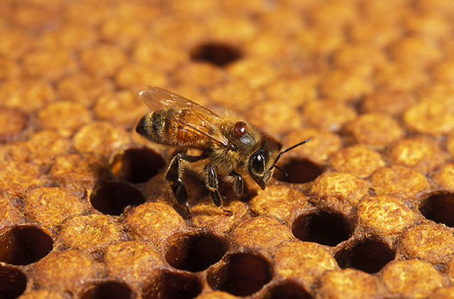
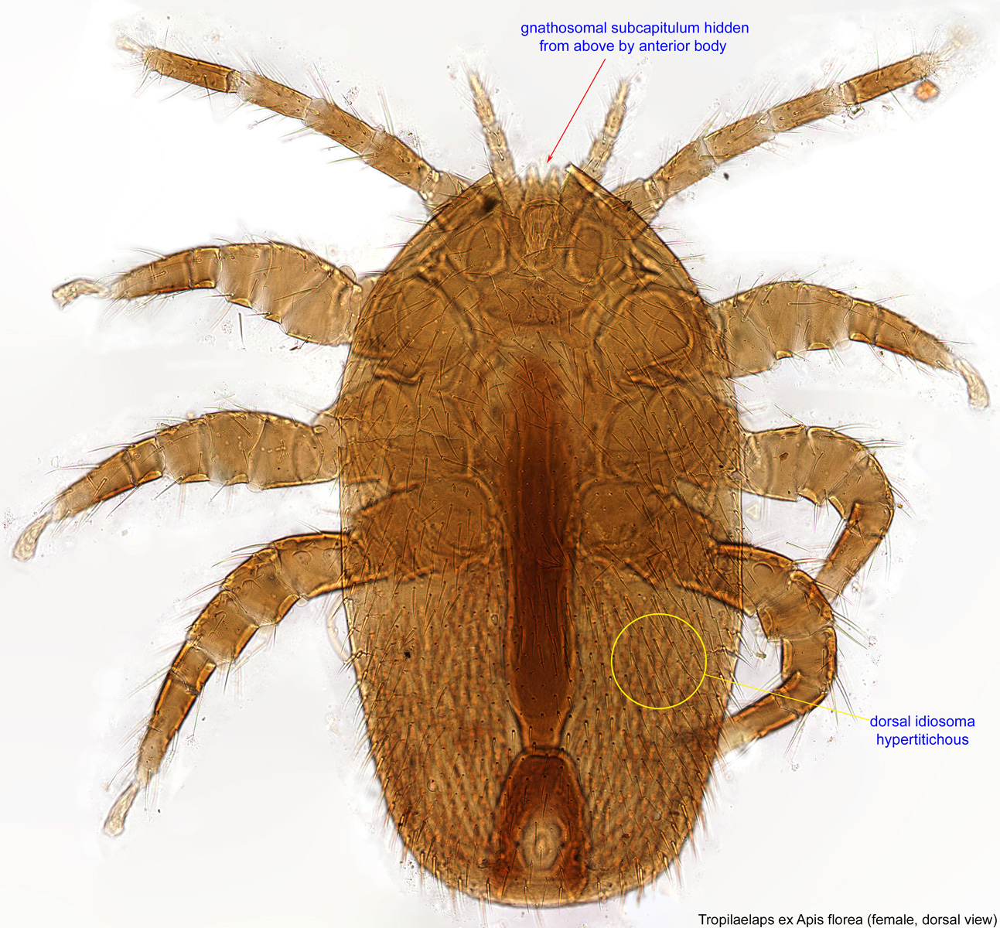

# Chapter 40 — Parasites

## Introduction

Honey bees share their colonies with many other organisms, but only some are true parasites. A parasite lives on or in a host and obtains resources at the host's expense. This relationship distinguishes parasites from predators, scavengers, wax-destroying pests, and infectious microorganisms.

For modern *Apis mellifera* beekeeping, parasitic mites are especially important. *Varroa destructor* is established across most of the beekeeping world and profoundly changes colony health through direct parasitism and its interaction with viruses. *Tropilaelaps* mites, particularly *Tropilaelaps mercedesae*, are an expanding threat whose range has moved westward from Asia into parts of Eurasia. The tracheal mite, *Acarapis woodi*, lives inside the respiratory system of adult bees and remains internationally recognised even though its practical importance differs greatly among regions.

This chapter explains the major parasite groups, how they spread, what they do to colonies, how to recognise suspicious signs, and how surveillance should be organised. It deliberately leaves detailed Varroa thresholds, treatment selection, and integrated pest-management programmes to Chapters 41 and 46.

## Learning Objectives

After completing this chapter, the reader should be able to:

- define parasitism and distinguish parasites from pathogens, predators, and hive pests;
- explain why mites are important honey bee parasites;
- describe the life-cycle principles of *Varroa destructor*;
- recognise the main field consequences of Varroa infestation without relying on visible mites alone;
- describe the biology and emerging geographic importance of *Tropilaelaps* mites;
- distinguish *Tropilaelaps* from Varroa conceptually and morphologically;
- explain acarapisosis caused by *Acarapis woodi*;
- understand how drifting, robbing, swarming, bee movement, and brood movement spread parasites;
- select an appropriate surveillance question before choosing a monitoring method;
- apply biosecurity and regulatory precautions when an exotic parasite is suspected.

## 40.1 What Is a Parasite?

A parasite depends on a host for resources while imposing a biological cost on that host.

In honey bees, parasites may be:

- external, living on the body surface or within the brood cell;
- internal, living inside host structures;
- temporary, contacting the host only during part of the life cycle;
- closely dependent on brood;
- transmitted directly between bees;
- moved indirectly by beekeeping operations.

The harm may include:

- tissue damage;
- reduced body condition;
- shortened lifespan;
- impaired development;
- reduced flight or thermoregulatory capacity;
- altered immune function;
- transmission or amplification of infectious agents;
- colony-level population decline.

## 40.2 Parasite, Pathogen, Pest, or Predator?

| Category | Relationship with bees | Examples |
|---|---|---|
| Parasite | Lives on or in a bee and takes resources from the host | *Varroa destructor*, *Tropilaelaps* spp., *Acarapis woodi* |
| Pathogen | Infectious agent that causes disease | *Paenibacillus larvae*, *Melissococcus plutonius*, honey bee viruses |
| Hive pest/scavenger | Damages comb, stores, debris, or hive environment | wax moths, small hive beetle |
| Predator | Captures and consumes bees | hornets, some wasps, birds |
| Commensal/associate | Lives in or around the colony without necessarily causing important harm | various mites and arthropods |

The categories can interact. A parasite may vector a pathogen, and a collapsing parasitised colony may become vulnerable to scavengers and robbing.

## 40.3 Why Mites Are So Important

Mites are small enough to remain hidden, reproduce rapidly, and move with their hosts. Honey bee colonies also provide a favourable environment: dense populations of related hosts, repeated brood production, stable nest conditions, and contact between thousands of adult bees.

The practical problem is that damage can accumulate before the beekeeper sees an obvious mite.

A colony can therefore look productive while parasite pressure is increasing in the brood nest.

## 40.4 Varroa Destructor: The Dominant Global Parasite

*Varroa destructor* is an ectoparasitic mite of honey bees. Its original host relationship involved the Asian honey bee *Apis cerana*, but host switching to *Apis mellifera* created one of the most important health problems in modern apiculture.

Adult female mites can be seen without magnification. They are flattened, oval, and reddish-brown. Their body shape allows them to move between abdominal segments and remain protected on adult bees.

The mite feeds principally on honey bee fat-body tissue and associated haemolymph. The fat body is central to metabolism, immunity, nutrient storage, detoxification, and overwintering physiology.

## 40.5 Varroa Reproduction

Varroa reproduction occurs mainly inside capped brood cells.

A simplified sequence is:

1. a mature female mite enters a brood cell shortly before capping;
2. the cell is capped;
3. the foundress mite begins feeding and lays eggs;
4. offspring develop within the sealed cell;
5. mating occurs among mite offspring;
6. mature females emerge with the adult bee and can infest other bees or brood cells.

Drone brood remains capped longer than worker brood and can support greater reproductive success for Varroa under many conditions.

This relationship with sealed brood explains why colony brood pattern strongly influences mite population growth.

## 40.6 Varroa on Adult Bees

Older literature often called the period on adult bees the “phoretic” phase. The term remains common, but it can imply that mites are merely travelling. They also feed on adult bees during this period.

Adult bees move mites:

- within the colony;
- between colonies through drifting;
- into robbing colonies;
- with swarms;
- with packages and nucleus colonies;
- during beekeeper movement of adult bees.

Visible mites on adult bees usually indicate substantial exposure, but absence of visible mites does not indicate a mite-free colony.

*Photo 40.1 — Adult female Varroa on a bee. The mite is shown at realistic scale on its host; failure to see mites during a routine inspection does not establish a low infestation level. USDA photo by Scott Bauer; public domain.*

## 40.7 Varroa Damage to Developing Bees

Parasitised pupae may emerge with:

- lower body weight;
- reduced nutrient reserves;
- shortened lifespan;
- altered immune responses;
- viral infection or increased viral load;
- developmental abnormalities.

Some damaged bees die before emergence. Others emerge apparently normal but have reduced longevity or performance.

The colony-level effect is therefore larger than the number of visibly deformed bees suggests.

## 40.8 Varroa and Viruses

Varroa mites are important biological vectors and amplifiers of honey bee viruses, particularly deformed wing virus complexes.

High Varroa pressure can change viral transmission so profoundly that a colony with abundant summer bees can later experience rapid population decline.

This is why waiting for deformed wings or obvious collapse is poor monitoring practice. Parasite measurement must precede visible failure.

Detailed Varroa monitoring and control are covered in Chapter 41.

## 40.9 Signs Associated with High Varroa Pressure

Possible signs include:

- mites visible on adult bees;
- mites in brood cells;
- deformed wings;
- shortened abdomens;
- patchy brood;
- uncapped or removed pupae;
- reduced adult population;
- unexpected late-season decline;
- poor winter survival;
- elevated mite counts using a validated monitoring method.

None of the visible signs alone measures infestation accurately.

## 40.10 Why Visual Inspection Is Not Enough

Most mites may be hidden on bees or under brood cappings. The beekeeper may inspect thousands of bees without seeing enough mites to appreciate the real population.

A colony should therefore be monitored using a method designed to estimate mite pressure, not merely by looking for mites during routine inspections.

Methods such as alcohol or detergent washes, sugar-roll methods, natural mite fall, and brood examination answer different questions and have different strengths and limitations.

Chapter 41 explains these methods in detail and gives current decision guidance.

## 40.11 Reinvasion and Mite Immigration

A colony whose Varroa level has been reduced can acquire mites again.

Important routes include:

- drifting workers;
- drones;
- robbing of collapsing colonies;
- nearby untreated colonies;
- movement of infested colonies;
- introduction of brood or bees.

This process is often described as reinvasion or mite immigration.

The practical lesson is that one successful treatment does not permanently solve Varroa.

## 40.12 Tropilaelaps: An Emerging Threat

*Tropilaelaps* mites are ectoparasitic mites associated naturally with Asian giant honey bees and capable of reproducing in *Apis mellifera* colonies.

Species of particular concern to managed western honey bees include *Tropilaelaps mercedesae* and *Tropilaelaps clareae*.

Historically, practical beekeeping literature often described Tropilaelaps as an Asian problem. That description is now inadequate. By 2026, peer-reviewed and reference-laboratory reporting documented continuing westward expansion of *T. mercedesae*, including confirmed occurrence in Georgia and parts of Russia and other areas of Eurasia. Reports and surveillance close to European borders have increased concern about further spread.

Because distribution changes, beekeepers should use current official surveillance information rather than static maps in older books.

## 40.13 How Tropilaelaps Differs from Varroa

Both mites reproduce with honey bee brood, but their biology differs.

Tropilaelaps mites are:

- narrower and more elongated than Varroa;
- fast-moving on the comb;
- strongly dependent on brood for feeding and reproduction;
- capable of rapid population increase where brood is continuously available.

Varroa mites are broader and more flattened and can survive for longer periods feeding on adult bees.

The stronger brood dependence of Tropilaelaps has major implications for surveillance and control.

*Photo 40.2 — Tropilaelaps specimen. Confirmed specimen image used for morphological context; field identification of an unfamiliar mite should follow current surveillance and laboratory guidance. Image by Pavel Klimov, Bee Mite ID / USDA; public domain.*

## 40.14 Tropilaelaps Reproduction and Damage

Female Tropilaelaps mites enter brood cells before capping and reproduce on developing bees.

Damage can include:

- brood mortality;
- irregular sealed brood;
- deformed or weakened emerging adults;
- reduced adult longevity;
- colony weakening;
- viral transmission or interaction, including concern about deformed wing virus.

Recent 2026 reviews emphasise the combination of a short reproductive cycle, brood dependence, rapid dispersal potential, and range expansion as reasons for increased international concern.

## 40.15 Tropilaelaps Dispersal

Tropilaelaps can spread through:

- movement of infested brood;
- adult bees carrying mites temporarily;
- drifting;
- robbing;
- colony movement;
- swarming.

Recent field work in Georgia demonstrated that natural swarms can carry *T. mercedesae* and that some mites can survive long enough to enter newly produced brood and reproduce.

This finding is important because older assumptions about poor survival away from brood could lead to underestimating dispersal risk.

## 40.16 Suspected Tropilaelaps: What to Do

Where Tropilaelaps is absent, regulated, or under official surveillance, suspicion should be treated as a biosecurity event.

Possible observations include:

- fast-moving elongated mites on comb;
- mites in brood cells;
- irregular brood;
- damaged pupae;
- deformed emerging bees;
- unexplained rapid parasite-like brood damage.

**Warning:** Do not move the suspect colony, brood frames, bees, or equipment until current local reporting requirements have been checked.

Collecting and submitting specimens should follow the competent authority or diagnostic laboratory's instructions.

## 40.17 Tropilaelaps Detection

Detection methods can include:

- brood-cell examination;
- uncapping brood;
- natural mite-fall examination;
- adult-bee sampling;
- trapping or brood-based methods;
- morphological identification;
- molecular confirmation.

Research published in 2026 continues to evaluate early-detection methods for European honey bee colonies. Surveillance programmes may specify particular methods, sample sizes, or laboratory confirmation.

A negative result from one limited sample does not necessarily prove absence.

## 40.18 Acarapis Woodi: The Tracheal Mite

*Acarapis woodi* is a microscopic internal mite that lives principally in the prothoracic tracheae of adult honey bees. The infestation is called acarapisosis or tracheal-mite infestation.

The mites feed within the respiratory system and reproduce there. Heavy infestation can impair gas exchange and reduce the condition and performance of adult bees.

Unlike Varroa and Tropilaelaps, *A. woodi* cannot normally be diagnosed by routine naked-eye inspection.

## 40.19 Tracheal-Mite Transmission

Tracheal mites spread mainly by direct contact between adult bees.

Young adult bees are particularly susceptible to colonisation. Once established, mites reproduce in the tracheae and offspring leave to seek new hosts.

Colony and apiary spread can therefore occur through:

- close bee-to-bee contact;
- drifting;
- robbing;
- introduced adult bees;
- swarming;
- movement of infested colonies.

## 40.20 Signs Associated with Acarapisosis

Heavy infestation has historically been associated with:

- weak colonies;
- poor flight;
- crawling bees;
- disjointed or apparently abnormal wing position;
- reduced honey production;
- poor winter survival;
- spring dwindling.

These signs are non-specific. Similar signs can result from viral disease, cold, starvation, queen failure, pesticide exposure, or other problems.

Diagnosis therefore requires examination of the tracheae or another validated diagnostic method.

## 40.21 Tracheal-Mite Diagnosis

A diagnostic laboratory may dissect the prothoracic tracheae of adult bees and examine them microscopically.

Normal tracheae are pale and translucent. Infested tracheae can show mites, eggs, feeding damage, darkening, or scarring.

Molecular methods may also be used in specialist settings.

Do not attempt to diagnose acarapisosis from “K-wing” appearance alone.

## 40.22 Regional Importance of Tracheal Mites

The practical importance of tracheal mites has changed over time and differs among regions and bee stocks. Some populations show greater resistance, and in some countries the parasite is detected infrequently compared with Varroa.

However, WOAH continues to list acarapisosis in its international bee-health framework, and some national surveillance systems monitor it.

A parasite that is uncommon locally should not be ignored when importing bees or investigating unexplained adult-bee problems.

## 40.23 Genetic Resistance and Grooming

Honey bee stocks differ in susceptibility to parasites.

Relevant traits can include:

- grooming;
- hygienic behaviour;
- brood removal;
- mite reproduction suppression;
- colony brood patterns;
- adult-bee characteristics that reduce tracheal-mite establishment.

USDA research has shown that grooming behaviour contributes to tracheal-mite resistance in some honey bee stocks.

Genetic resistance is a management resource, not a guarantee of parasite freedom.

## 40.24 Other Mites Found in Hives

Not every mite seen in a hive is Varroa, Tropilaelaps, or a dangerous parasite.

Hives contain mites that may be:

- scavengers;
- pollen feeders;
- fungal feeders;
- predators of small arthropods;
- incidental visitors.

Misidentification can lead to unnecessary treatment.

When an unusual mite is found, preserve a specimen and obtain competent identification rather than applying a miticide blindly.

## 40.25 Braula Coeca and Other Bee Associates

*Braula coeca*, commonly called the bee louse, is actually a wingless fly rather than a true louse or mite. Adult Braula may ride on adult bees and obtain food from bees, while larvae develop in wax cappings.

Its importance is generally much lower than Varroa, and control should not be confused with Varroa management.

This example illustrates why correct identification matters before intervention.

## 40.26 Parasites and Brood Pattern

Parasite-related brood damage can produce:

- empty cells;
- uncapped pupae;
- partially removed brood;
- delayed emergence;
- deformed adults;
- irregular cappings.

The same pattern can occur with brood disease or chilling.

A brood frame should therefore be examined for:

- abnormal larvae and pupae;
- mites;
- capping changes;
- queen pattern;
- hygienic removal;
- signs of bacterial or fungal disease.

## 40.27 Parasites and Colony Demography

A colony can tolerate some loss of individual bees while population replacement remains strong. Problems accelerate when parasitism reduces the lifespan of emerging workers faster than new adults can replace them.

This is particularly dangerous before winter in temperate climates. Long-lived winter bees must survive for months, so damage during their development can have colony-level consequences far beyond the immediate brood cycle.

## 40.28 Parasites and Nutrition

Adequate nutrition supports brood rearing and adult physiology, but feeding does not remove parasites.

A well-fed colony with uncontrolled Varroa can still collapse.

Conversely, poor nutrition can increase the harm caused by parasites and associated viruses.

Management must address both resource adequacy and parasite pressure.

## 40.29 Parasites and Queen Performance

A queen may appear to be failing when parasitised brood dies or is removed by workers.

Before replacing a queen because of patchy brood, consider:

- parasite pressure;
- brood disease;
- nutritional interruption;
- chilled brood;
- queen age and mating quality.

Queen replacement may improve genetics or colony organisation, but it does not directly eliminate an established parasite population.

## 40.30 Movement of Brood

Brood transfer is a powerful management tool and a powerful parasite-transfer route.

Moving a capped brood frame can move:

- reproducing Varroa;
- Tropilaelaps where present;
- brood pathogens;
- emerging infested adults.

Before equalising colonies or making splits, consider the health status of the donor colony.

## 40.31 Packages, Nuclei, and Purchased Colonies

Purchased bees should not be assumed parasite-free.

Before acquisition, ask about:

- origin;
- recent monitoring;
- treatment history;
- queen source;
- movement certification where required;
- known regional pests and parasites.

After arrival, establish a monitoring baseline at the biologically appropriate time.

## 40.32 Swarms and Parasite Risk

A swarm may arrive with adult-carried mites even though it contains no capped brood at capture.

The broodless interval can create management opportunities for some parasites, but it should not be interpreted as proof that the swarm is parasite-free.

Captured swarms should be incorporated into the apiary's health-monitoring programme.

## 40.33 Drifting

Drifting occurs when a bee enters a colony other than its own.

Factors that can increase drift include:

- uniform hive appearance;
- long straight rows;
- entrances facing the same direction;
- crowded apiaries;
- wind;
- colony movement.

Drifting can redistribute Varroa and other bee-associated organisms.

## 40.34 Robbing

Robbing is particularly important because strong colonies can acquire mites while robbing weakened, heavily infested colonies.

A collapsing donor colony may therefore expose apparently healthy neighbours.

Robbing prevention is part of parasite management, not only theft-of-honey prevention.

## 40.35 Monitoring: Define the Question First

Before choosing a method, decide what you need to know.

Examples:

- Is Varroa pressure currently low enough for this management stage?
- Has a Varroa control intervention worked?
- Is an unusual mite Tropilaelaps?
- Is acarapisosis present in an unexplained adult-bee syndrome?
- Has an introduced colony brought a regulated parasite?

The method must match the question.

## 40.36 Monitoring Methods Are Not Interchangeable

An adult-bee wash, natural mite fall, brood uncapping, tracheal dissection, and molecular test do not measure the same thing.

Differences include:

- target parasite;
- sensitivity;
- whether the method estimates colony infestation or merely detects presence;
- whether bees are sacrificed;
- seasonal usefulness;
- brood dependence;
- laboratory requirements.

Use validated methods and current regional guidance.

## 40.37 Sampling Bias

A poor sample can produce false reassurance.

Bias can arise from:

- sampling too few bees;
- taking bees from the wrong location;
- sampling at an unrepresentative season;
- examining only one brood frame;
- failing to mix the sample correctly;
- using damaged equipment;
- counting debris that cannot be confidently identified.

Standardised sampling improves comparability across time.

## 40.38 Parasite Monitoring Records

Record:

- colony ID;
- date;
- method;
- sample size where relevant;
- raw count;
- calculated infestation measure where appropriate;
- brood status;
- colony strength;
- intervention;
- product and batch where relevant;
- follow-up result.

Do not record only “mites treated”. Without a pre- and post-intervention measurement, treatment performance is difficult to evaluate.

## 40.39 Exotic-Parasite Surveillance

Surveillance for an exotic parasite has a different objective from routine Varroa management.

The question is often presence/absence and rapid official confirmation rather than a treatment threshold.

An exotic-parasite plan should include:

- recognition training;
- specimen preservation;
- diagnostic contacts;
- movement records;
- rapid notification;
- temporary movement restraint;
- tracing of recently moved bees and equipment.

## 40.40 Legal and Regulatory Context

Parasite reporting and movement rules vary.

WOAH lists acarapisosis, Tropilaelaps infestation, and varroosis among internationally listed bee conditions. National implementation differs.

Some jurisdictions treat Tropilaelaps as an exotic notifiable pest and impose movement or eradication measures following detection. Other regions where the parasite is established use different management systems.

**Warning:** Check current competent-authority guidance before moving a suspect colony or specimen across borders or administrative regions.

## 40.41 Treatment Is Parasite-Specific

A product effective against one mite under one colony condition may not be effective, authorised, or safe against another.

Selection depends on:

- parasite identity;
- colony brood status;
- temperature;
- honey-production status;
- resistance patterns;
- authorised products;
- application method;
- residue risk;
- operator safety.

Do not improvise parasite treatment from agricultural pesticide products.

## 40.42 Resistance to Acaricides

Repeated exposure to the same active ingredient can select for resistant parasite populations.

Resistance management may involve:

- monitoring treatment performance;
- rotating effective authorised modes of action where guidance supports it;
- integrating non-chemical controls;
- avoiding under-dosing and unapproved delivery methods;
- participating in local resistance surveillance.

Exact Varroa treatment planning belongs in Chapter 41.

## 40.43 Brood Interruption

Because Varroa and Tropilaelaps reproduction depends on brood, brood interruption can alter parasite population dynamics.

However, the two mites differ in their ability to persist on adult bees. A strategy developed for Varroa should not automatically be assumed to control Tropilaelaps in the same way.

Brood manipulation also has costs:

- reduced colony growth;
- queen risk;
- management labour;
- timing constraints;
- potential loss of production.

## 40.44 Drone-Brood Manipulation

Varroa often reproduces more successfully in drone brood. Some management systems use drone-brood removal as one component of control.

This method:

- requires correct timing;
- removes brood and colony resources;
- is not sufficient alone in many situations;
- must not be left in the colony after mites have reproduced if the intention is removal;
- should be integrated with monitoring.

Detailed use belongs in Chapter 41 and Chapter 46.

## 40.45 Heat, Acids, Essential Oils, and Other Controls

Various physical and chemical approaches are used against mites. Their efficacy and safety depend on parasite, product, temperature, dose, delivery, colony condition, and local authorisation.

This chapter does not provide treatment recipes because those details can become unsafe or obsolete when products, resistance, and regulations change.

Use current authorised labels and regional recommendations.

## 40.46 Common Diagnostic Mistakes

### Mistake 1 — “I cannot see mites, so the colony has none”

Most relevant parasites can be missed by casual visual inspection.

### Mistake 2 — “Deformed wings prove the current mite count”

Deformed bees show damage but do not quantify current Varroa infestation.

### Mistake 3 — “Every small mite is Varroa”

Several harmless or less important mites can occur in hives.

### Mistake 4 — “One negative sample proves absence”

Detection probability depends on sample size, season, method, and parasite distribution.

### Mistake 5 — “Treatment last month means the colony is protected”

Treatment can fail, resistance can occur, and reinvasion can raise mite pressure again.

## 40.47 Parasite Decision Table

| Finding | Main concern | Appropriate next step |
|---|---|---|
| Elevated validated Varroa sample | Varroa pressure | Follow current Chapter 41/local decision guidance |
| Deformed adults plus declining colony | Varroa-associated viral damage among differentials | Measure Varroa and assess broader disease picture |
| Fast elongated mite on brood comb in region considered free of Tropilaelaps | Exotic parasite | Preserve specimen, stop movement, notify competent authority |
| Crawling bees with possible “K-wing” | Several possible causes including tracheal mites | Seek diagnostic confirmation; do not diagnose visually |
| Unusual mite unlike known Varroa | Misidentification/exotic organism | Preserve and identify before treatment |
| Good result immediately after Varroa control, high count later | Reinvasion or treatment failure | Review records, neighbouring pressure and control performance |

## 40.48 Apiary Parasite-Control Checklist

- [ ] Every colony has a unique ID.
- [ ] Varroa is monitored using an appropriate validated method.
- [ ] Monitoring dates are planned before visible damage occurs.
- [ ] Post-control verification is recorded.
- [ ] Captured swarms and purchased bees enter the monitoring system.
- [ ] Brood is not transferred from unassessed colonies.
- [ ] Robbing triggers are controlled.
- [ ] Unusual mites are preserved for identification.
- [ ] Exotic-parasite reporting contacts are known.
- [ ] Treatment follows current authorisation and label directions.
- [ ] Resistance and treatment failure are considered when results are poor.
- [ ] Colony movement records are maintained.

## 40.49 Scientific Notes

### Parasite-host adaptation

Parasite severity depends partly on evolutionary history. *Apis cerana* and its Varroa parasites have host defences and reproductive interactions that differ from the relatively recent *V. destructor*–*A. mellifera* relationship.

### Fat-body feeding

Modern research changed the older simplified view that Varroa feeds mainly on haemolymph. Evidence demonstrates major feeding on honey bee fat-body tissue, helping explain broad physiological effects.

### Emerging range of Tropilaelaps

The 2025–2026 literature documents continuing expansion of *T. mercedesae* beyond its historically described range, including western Eurasian detections and intensified surveillance near Europe. Distribution statements therefore require dates.

### Parasite-vector interaction

Parasite harm can be multiplied when the parasite changes pathogen transmission. Varroa and deformed wing virus are a central example.

### Detection probability

Surveillance is probabilistic. Failure to find a parasite in a limited sample reduces estimated likelihood of infestation but does not always establish true absence.

## Key Takeaways

- Parasites are biologically distinct from infectious pathogens, hive pests, and predators.
- *Varroa destructor* is the dominant parasitic threat to *Apis mellifera* across much of the world.
- Varroa reproduces in sealed brood and also feeds on adult bees.
- Varroa damage is amplified by its interaction with honey bee viruses.
- Visible mites and deformed wings are late or incomplete indicators; structured monitoring is essential.
- *Tropilaelaps mercedesae* is an emerging, expanding threat and should no longer be described simply as confined to its old Asian range.
- Tropilaelaps is more dependent on brood than Varroa and can multiply rapidly where brood is continuous.
- *Acarapis woodi* lives inside adult-bee tracheae and requires microscopic or equivalent diagnostic confirmation.
- Robbing, drifting, swarming, bee movement, and brood movement can spread parasites.
- Exotic-parasite suspicion requires biosecurity, specimen preservation, movement restraint, and current official guidance.

## Chapter Summary

Parasitic mites damage honey bees directly and can intensify infectious disease. *Varroa destructor* reproduces in sealed brood, feeds on developing and adult bees, and plays a major role in viral epidemiology. Its population cannot be judged reliably by casual visual inspection, so structured monitoring and repeated verification are essential.

*Tropilaelaps* mites share brood-associated parasitism but differ in morphology, speed, brood dependence, and survival biology. The geographic range of *T. mercedesae* has expanded westward, making current surveillance information more important than historical distribution maps. In areas where the mite is exotic, suspicion is a biosecurity event rather than merely a treatment decision.

The tracheal mite *Acarapis woodi* is an internal parasite of adult bees. Clinical signs are non-specific, and confirmation requires examination of the respiratory system or another validated method.

Across all parasite problems, the principles are consistent: identify the organism correctly, use a monitoring method that answers the management question, prevent movement between colonies, record results, verify control performance, and follow current local law and authorised treatment guidance.

## Review Questions

1. What defines a parasite?
2. How does a parasite differ from a pathogen?
3. How does a hive pest differ from a true bee parasite?
4. Name three important parasitic mites of honey bees.
5. Why can mite damage accumulate before mites are seen?
6. What is the principal host tissue consumed by Varroa according to modern research?
7. Why is the honey bee fat body physiologically important?
8. Where does Varroa reproduce?
9. When does a foundress Varroa enter a brood cell?
10. Why can drone brood support greater Varroa reproduction?
11. What happens to mature daughter mites when the adult bee emerges?
12. Why is “phoretic phase” an incomplete description of Varroa on adult bees?
13. How can adult bees move Varroa between colonies?
14. Why does absence of visible mites not prove absence of infestation?
15. How can Varroa affect developing bees?
16. Why may a Varroa-damaged bee look externally normal?
17. What is the connection between Varroa and deformed wing virus?
18. Why is waiting for deformed wings poor management?
19. Name four signs associated with high Varroa pressure.
20. Why do visible signs fail to quantify infestation?
21. Why are structured monitoring methods needed?
22. Do adult-bee washes and natural mite fall answer exactly the same question?
23. What is reinvasion or mite immigration?
24. How can robbing increase reinvasion?
25. Why does a successful treatment not permanently solve Varroa?
26. What is *Tropilaelaps mercedesae*?
27. Which honey bee host did Tropilaelaps historically parasitise?
28. Why is it inaccurate in 2026 to describe Tropilaelaps simply as an Asian-only concern?
29. How does Tropilaelaps body shape differ from Varroa?
30. How does Tropilaelaps movement on comb typically differ from Varroa?
31. Why is brood especially important to Tropilaelaps?
32. Which brood effects can Tropilaelaps cause?
33. What viral interaction is of concern with Tropilaelaps?
34. How can Tropilaelaps spread through brood movement?
35. What recent evidence shows that swarming can move Tropilaelaps?
36. Why does swarm transmission change older assumptions about dispersal?
37. What should a beekeeper do after finding a suspicious elongated fast-moving mite in a region considered free of Tropilaelaps?
38. Why should suspect brood not be moved?
39. Name three methods that can contribute to Tropilaelaps detection.
40. Why may molecular confirmation be needed?
41. Why does one negative sample not always prove absence?
42. What is *Acarapis woodi*?
43. Where does *A. woodi* live in the bee?
44. Why cannot tracheal mites usually be diagnosed by naked-eye hive inspection?
45. How do tracheal mites spread between bees?
46. Which adult bees are particularly susceptible to colonisation by tracheal mites?
47. Name three non-specific signs historically associated with heavy acarapisosis.
48. Why is “K-wing” not a sufficient diagnosis?
49. How can a laboratory diagnose tracheal mites?
50. What may an infested trachea look like under examination?
51. Why does regional importance of tracheal mites vary?
52. Why does WOAH recognition remain relevant even where tracheal mites are uncommon?
53. How can genetics influence parasite susceptibility?
54. What role can grooming play in parasite resistance?
55. Why is genetic resistance not the same as parasite freedom?
56. Are all mites found in a hive harmful parasites?
57. Why should an unusual mite be preserved before treatment?
58. What is *Braula coeca*?
59. Why is the name “bee louse” biologically misleading?
60. What lesson does Braula illustrate about diagnosis?
61. How can parasite damage create a patchy brood pattern?
62. Which other conditions can also cause patchy brood?
63. How can parasites alter colony population replacement?
64. Why is parasite damage to winter bees especially important?
65. Does supplemental feeding eliminate mites?
66. How can nutrition interact with parasite damage?
67. How can parasite-related brood loss be mistaken for queen failure?
68. Why should queen replacement not be the only response to patchy brood?
69. What parasites can move on capped brood frames?
70. Why should donor-colony health be considered before equalising brood?
71. What health questions should be asked before purchasing a nucleus colony?
72. Why are purchased bees not assumed parasite-free?
73. Can a broodless swarm carry mites?
74. Why should captured swarms enter the apiary monitoring programme?
75. What is drifting?
76. Which apiary arrangements can increase drifting?
77. Why can a strong colony acquire mites while robbing a weak colony?
78. What question should be defined before selecting a monitoring method?
79. Why are monitoring methods not interchangeable?
80. What is sampling bias?
81. How can too-small samples produce false reassurance?
82. Why should monitoring be standardised across time?
83. Which facts should be recorded with a parasite sample?
84. Why is “treated for mites” an inadequate record?
85. How does exotic-parasite surveillance differ from routine Varroa threshold monitoring?
86. What should an exotic-parasite response plan include?
87. Who determines parasite-reporting obligations in a particular jurisdiction?
88. Why should a suspect exotic parasite not be moved across borders casually?
89. Why is parasite treatment species-specific?
90. Which colony conditions influence safe treatment selection?
91. What is acaricide resistance?
92. How can treatment-performance monitoring help detect resistance or failure?
93. Why can brood interruption affect mite populations?
94. Why should a Varroa brood-break method not automatically be assumed equally effective for Tropilaelaps?
95. Why can drone-brood removal reduce some Varroa reproduction?
96. Why is drone-brood removal rarely sufficient as the only control?
97. Why does this chapter avoid fixed treatment recipes?
98. Why is “no visible mites” a common and dangerous diagnostic mistake?
99. What does detection probability mean in parasite surveillance?
100. What are the core principles of a reliable honey bee parasite-management programme?

## References

- World Organisation for Animal Health. “Diseases of Bees.” Current WOAH Terrestrial Code and bee-disease resources. Accessed 15 September 2026.
- Honey Bee Health Coalition. *Tools for Varroa Management: A Guide to Effective Varroa Sampling & Control*, 9th ed., released 22 June 2026.
- Honey Bee Health Coalition. “Varroa Management” and current decision-support resources. Accessed 15 September 2026.
- United States Department of Agriculture, Agricultural Research Service. “Tracheal Mite.” Bee Research Laboratory reference resource. Accessed 15 September 2026.
- United States Department of Agriculture, Agricultural Research Service. “Tracheal Mites Resistant Bees.” Honey Bee Breeding, Genetics, and Physiology Research. Accessed 15 September 2026.
- European Union Reference Laboratory for Bee Health, ANSES. “Geographical Spread of the Exotic Mite Tropilaelaps spp.: State of Play of the Worldwide Situation in March 2025,” with subsequent 2025–2026 updates. Accessed 15 September 2026.
- Franco, S., and Duquesne, V. “Geographical Spread of the Exotic Mite Tropilaelaps spp.: Suspected Presence in North-Eastern Turkey.” European Union Reference Laboratory for Bee Health, 24 August 2026. The report explicitly identifies the Turkish observation as suspected and not officially confirmed at publication.
- Williams, G. R., Aurell, D., Gill, M. C., Khongphinitbunjong, K., Tokach, R., and Traynor, K. S. “Tropilaelaps mercedesae: rapid geographic expansion in a novel honey bee host.” *Trends in Parasitology* 42(9), 2026, 912–927. DOI: 10.1016/j.pt.2026.07.002.
- Esmaeily, M., Kwon, S., Babaeian, E., and Jung, C. “Tropilaelaps mercedesae: an emerging global threat to apiculture — a comprehensive review.” *Frontiers in Insect Science* 6, 2026, 1871985. DOI: 10.3389/finsc.2026.1871985.
- “Evaluation of methods for early detection of Tropilaelaps mites in European honey bee (*Apis mellifera*) colonies.” *Scientific Reports*, 2026. DOI: 10.1038/s41598-026-52776-1.
- Caron, D. M., and Connor, L. J. *Honey Bee Biology and Beekeeping*. Wicwas Press.
- Graham, J. M., editor. *The Hive and the Honey Bee*. Dadant & Sons.
- Sammataro, D., and Avitabile, A. *The Beekeeper’s Handbook*. Cornell University Press.
- Current national and regional animal-health authorities. Parasite distribution, notification, movement, treatment, and import requirements must be verified for the reader’s jurisdiction.