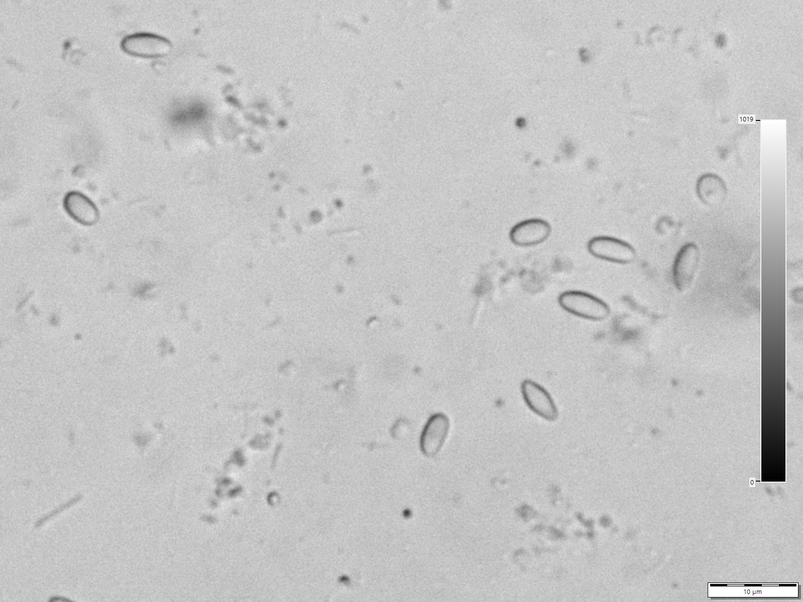

# Chapter 42 — Nosema

## Introduction

Nosemosis is an infection of adult honey bees caused principally by two microsporidian species traditionally known as *Nosema apis* and *Nosema ceranae*. A more recent taxonomic proposal places them in the genus *Vairimorpha*, producing the names *Vairimorpha apis* and *Vairimorpha ceranae*. The reclassification is used increasingly in scientific literature but has not been adopted universally in practical beekeeping. This chapter therefore uses *Nosema* as the familiar field term while acknowledging *Vairimorpha* in scientific context.

Nosema is difficult to manage well because field signs are non-specific. Faecal spotting may occur in some affected colonies, especially with *N. apis*, but dysentery does not prove nosemosis and nosemosis can occur without obvious dysentery. A weak spring colony, reduced honey yield, early worker mortality, or poor brood development can have many other causes.

Reliable management begins by separating three questions:

1. Are microsporidian spores present?
2. Which species is present?
3. Is the infection contributing materially to colony disease?

Microscopy can detect and quantify spores, while PCR or qPCR can distinguish species and increase analytical sensitivity. Neither method should be interpreted without colony history, season, nutrition, Varroa pressure, and other possible stressors.

## Learning Objectives

After completing this chapter, the reader should be able to:

- explain what Nosema microsporidia are and how they infect adult honey bees;
- describe the main differences and overlaps between *N. apis* and *N. ceranae*;
- explain the proposed *Vairimorpha* nomenclature;
- describe faecal–oral transmission and the intracellular life cycle;
- recognise the limitations of field signs;
- select adult bees appropriately for diagnostic sampling;
- explain microscopy, haemocytometer spore counting, PCR, and qPCR at a practical level;
- interpret a positive laboratory result without overdiagnosing disease;
- reduce transmission through hygiene, comb management, nutrition, and colony management;
- understand why treatment options and legal authorisation vary by jurisdiction.

## 42.1 What Is Nosema?

Nosema organisms are microsporidia: microscopic, spore-forming, obligate intracellular parasites that are now considered closely related to fungi.

They cannot complete their life cycle independently of host cells. In honey bees, infection occurs mainly in cells of the midgut, where the parasite multiplies and produces spores that can later leave the bee in faeces.

This combination of intracellular multiplication and environmentally resistant spores supports transmission within and between colonies.

## 42.2 The Naming Problem: Nosema or Vairimorpha?

Phylogenetic research led to a proposal that the principal honey bee Nosema species be transferred to the genus *Vairimorpha*.

Accordingly:

- *Nosema apis* may be written *Vairimorpha apis*;
- *Nosema ceranae* may be written *Vairimorpha ceranae*.

Scientific and veterinary publications currently use both naming systems. Penn State Extension's February 2026 review notes that the change has not been universally accepted and retains *Nosema* for practical communication.

A publication should therefore avoid suggesting that one name proves the other is obsolete in every jurisdiction or diagnostic laboratory.

## 42.3 The Two Principal Species

### Nosema apis

*N. apis* has a long history in *Apis mellifera*. In temperate climates it has often been associated with late-winter or spring problems, confinement, and visible faecal staining.

### Nosema ceranae

*N. ceranae* was first described from the Asian honey bee *Apis cerana* and later became widespread in *A. mellifera*. It can occur without obvious dysentery and may show different seasonal patterns from *N. apis*.

### Mixed infections

A colony can carry both species. Species identity cannot reliably be determined from ordinary light-microscope appearance alone because spores overlap substantially in morphology.

## 42.4 Other Microsporidia

Other Nosema-like microsporidia have been reported from honey bees, including *Nosema neumanni* from Africa, but their distribution and practical importance are much less established than those of *N. apis* and *N. ceranae*.

An unusual molecular result should be interpreted by a competent laboratory rather than forced into the two common species categories.

## 42.5 The Spore

The spore is the durable transmission stage.

After ingestion, environmental conditions in the host trigger germination. A specialised polar tube is rapidly extruded and transfers infective material into a host cell.

This remarkable mechanism allows an organism far smaller than a bee to bypass the cell membrane and establish an intracellular infection.

## 42.6 Life Cycle in the Adult Bee

A simplified sequence is:

1. a bee ingests viable spores;
2. spores germinate in the digestive tract;
3. the polar tube transfers the infective stage into a midgut epithelial cell;
4. the parasite multiplies inside the cell;
5. new spores develop;
6. heavily infected cells become damaged or die;
7. spores enter the gut lumen;
8. spores leave in faeces or remain available for transmission.

Repeated infection can damage digestive function and alter adult physiology.

## 42.7 Transmission

The main transmission route is faecal–oral.

Within the colony, spores can move through:

- contaminated comb surfaces;
- faecal deposits;
- food transfer;
- cleaning behaviour;
- contaminated water or feed equipment;
- drifting bees;
- robbing;
- beekeeper movement of contaminated material.

Outside defecation generally reduces contamination inside the hive. Long confinement can increase the risk that faecal material accumulates where nestmates contact it.

## 42.8 Why Confinement Matters

During prolonged cold or wet weather, bees may be unable to take cleansing flights.

Potential consequences include:

- increased faecal retention;
- defecation in or near the hive;
- greater contact with contaminated surfaces;
- reduced opportunities to replace old foragers;
- nutritional stress.

Confinement is one factor, not a stand-alone diagnosis of nosemosis.

## 42.9 Effects on Individual Bees

Nosema infection can affect:

- nutrient absorption;
- energy balance;
- digestive physiology;
- immune responses;
- gland function;
- age-related division of labour;
- worker lifespan.

The biological effect varies with species, infection intensity, nutrition, temperature, pesticide exposure, coinfection, and bee genotype.

## 42.10 Colony-Level Effects

Possible colony-level consequences include:

- slow spring build-up;
- reduced adult population;
- shortened worker lifespan;
- reduced honey production;
- queen supersedure or queen problems in some circumstances;
- weak brood rearing;
- poor recovery after winter;
- increased vulnerability to other stressors.

These effects are non-specific and must be differentiated from Varroa, queen failure, starvation, poor forage, pesticide exposure, and other disease.

## 42.11 Dysentery Is Not Nosema

Faecal staining on frames or the hive front is often called dysentery.

It can result from:

- prolonged confinement;
- unsuitable or contaminated feed;
- excessive water in diet;
- digestive disturbance;
- nosemosis;
- combinations of these factors.

*N. ceranae* infection can occur with little or no faecal staining.

Do not diagnose Nosema from brown spots alone.

## 42.12 Nosema Can Be Subclinical

Subclinical infection means the parasite is present without obvious external signs.

A colony may contain infected workers while maintaining acceptable brood and production. Whether the infection becomes economically or biologically important depends on context.

This creates a central diagnostic challenge: a positive test does not automatically explain every colony problem.

## 42.13 Seasonality

Historical *N. apis* patterns in temperate climates often show higher spore levels around late winter and spring, followed by a decline as flight conditions improve and short-lived summer workers replace older bees.

*N. ceranae* can show different and less sharply seasonal patterns.

Climate, management, sampling population, and local species prevalence all affect observations. Fixed monthly rules should therefore be avoided.

## 42.14 Which Bees Should Be Sampled?

Sample choice depends on the diagnostic question.

Older foragers can have higher probability of detectable Nosema infection than very young house bees. For colony-level surveillance, many protocols therefore sample returning foragers or older bees.

However, laboratories may specify:

- hive-entrance bees;
- adult workers from particular locations;
- live or recently dead bees;
- a minimum number of bees;
- pooled versus individual testing.

Follow the receiving laboratory's protocol so the result can be interpreted correctly.

## 42.15 Why Sample Size Matters

Nosema infection is not distributed identically among all workers.

If only a few bees are tested, heavily infected individuals can distort the average or infected bees can be missed entirely.

A representative pooled sample reduces some variability, but it also hides individual differences.

The correct sample size depends on whether the objective is detection, prevalence, average spore load, or research-level analysis.

## 42.16 Microscopy

Light microscopy remains a widely used method for detecting Nosema-like spores.

A typical laboratory approach includes:

1. collecting an appropriate adult-bee sample;
2. macerating abdomens or digestive tissues in a measured volume of water;
3. mixing thoroughly;
4. placing a small amount on a microscope slide or counting chamber;
5. examining under suitable magnification;
6. identifying spores by characteristic appearance;
7. counting when quantitative assessment is required.

Method details should follow a validated laboratory protocol.

## 42.17 What Nosema Spores Look Like

Under light microscopy, Nosema spores are small, bright, oval to elongated structures.

However, shape and size overlap among species and can be confused with artefacts by inexperienced observers.

Microscopy is useful for detecting Nosema-like spores but is poor at reliable species identification of *N. apis* versus *N. ceranae*.

*Photo 42.1 — Nosema-like spores under light microscopy. The source identifies these as* Nosema apis *spores at approximately 1000× magnification. Routine light-microscope morphology can demonstrate Nosema-like spores but should not be used by itself to distinguish* N. apis *from* N. ceranae*. Image by Lukáš Vomastek, CC BY-SA 4.0.*

## 42.18 Haemocytometer Spore Counting

A haemocytometer is a calibrated counting chamber used to estimate spore concentration.

The calculation depends on:

- volume of homogenate;
- number of bees;
- chamber dimensions;
- grid areas counted;
- dilution;
- counting rules.

Because protocols differ, readers should not copy a calculation constant from an unrelated procedure.

The result is commonly expressed as spores per bee or spores per unit volume.

## 42.19 Limits of Spore Counts

A spore count provides information, but it is not a universal treatment threshold.

Limitations include:

- uneven infection among bees;
- sample-age effects;
- seasonal variation;
- species differences;
- spores may not correspond perfectly to active intracellular burden;
- laboratory preparation and counting error;
- uncertainty about what level predicts colony damage.

A 2024 systematic review of fumagillin field trials noted weak support for simple treatment decisions based only on spores-per-bee thresholds.

## 42.20 PCR and qPCR

Polymerase chain reaction methods detect species-specific genetic material.

PCR can help answer:

- Is *N. apis* present?
- Is *N. ceranae* present?
- Are both present?

Quantitative PCR (qPCR) can estimate target abundance under a validated assay.

These methods are more specific than ordinary microscopy but require laboratory equipment, controls, and careful interpretation.

## 42.21 Why More Sensitive Is Not Always More Clinically Meaningful

A highly sensitive assay can detect very small amounts of pathogen material.

That improves surveillance but can also identify low-level infections with uncertain colony consequence.

The beekeeper and diagnostician must distinguish:

- analytical detection;
- infection burden;
- clinical disease;
- management significance.

## 42.22 Differential Diagnosis

When a colony is weak or dwindling, consider:

- Varroa-associated viral disease;
- queen failure;
- starvation;
- poor pollen supply;
- chronic pesticide exposure;
- tracheal mites where relevant;
- other gut pathogens;
- adverse weather;
- excessive moisture;
- robbing;
- repeated disturbance;
- Nosema infection.

More than one problem may occur simultaneously.

## 42.23 Nosema and Varroa

Nosema and Varroa affect bees through different mechanisms, but both can shorten worker lifespan and interact with other stressors.

A weak colony with Nosema spores should still receive appropriate Varroa monitoring. Finding one problem does not exclude the other.

## 42.24 Nosema and Nutrition

Infected bees face energetic and digestive stress.

Adequate access to diverse pollen and carbohydrate stores supports general colony physiology but does not directly sterilise infection.

Poor nutrition can increase vulnerability and make recovery slower.

Supplemental feed should be used only when there is a nutritional need and should not be marketed or understood as a proven cure for Nosema unless supported by authorised evidence.

## 42.25 Nosema and Pesticides

Research has investigated interactions between microsporidian infection and pesticide exposure. Effects can depend on chemical, dose, route, species, bee age, nutrition, and experimental design.

Avoid simple claims that one pesticide always “causes Nosema” or that Nosema always makes one pesticide more toxic.

In a field investigation, record both disease and exposure history.

## 42.26 Nosema and Queen Performance

Some research has identified effects of Nosema infection on queen physiology, survival, or supersedure risk, while colony outcomes vary.

A failing queen should not be diagnosed with Nosema solely because workers test positive.

Queen age, mating, brood pattern, nutrition, parasites, and season must also be considered.

## 42.27 Prevention Begins with Strong Basic Management

Useful preventive principles include:

- maintain adequate food stores;
- reduce chronic moisture problems;
- avoid unnecessary winter disturbance;
- provide suitable ventilation without excessive draught;
- reduce robbing;
- manage Varroa;
- replace failing queens;
- avoid exchanging suspect comb casually;
- keep feeders clean;
- maintain colony records.

These actions improve colony resilience even when they do not eliminate every Nosema spore.

## 42.28 Comb Contamination

Faecal deposits and spores can contaminate comb and hive surfaces.

Risk is higher when bees defecate inside the colony or contaminated equipment is moved.

Comb management may include:

- gradual replacement of heavily soiled brood comb;
- avoiding transfer of visibly contaminated material;
- keeping stored comb dry and protected;
- cleaning hive components using methods supported for the material and local guidance.

Do not assume a general household disinfectant is effective or safe on bee equipment.

## 42.29 Equipment Hygiene

Feeders and tools should be cleaned between suspect colonies when feasible.

Important principles are:

- remove organic material before disinfection;
- use an effective method for the target organism and equipment material;
- avoid residues harmful to bees or honey;
- dry equipment appropriately;
- keep cleaned and suspect equipment separate.

A decontamination method should be evidence-based, not improvised.

## 42.30 Colony Replacement and Combining

A severely weak Nosema-positive colony may not recover simply because it is given more bees.

Before combining:

- assess for other infectious disease;
- measure Varroa where appropriate;
- consider whether contaminated comb is being transferred;
- understand queen status;
- evaluate seasonal recovery potential.

Combining can transfer both pathogens and parasites into a healthy colony.

## 42.31 Treatment: A Jurisdiction-Specific Subject

Fumagillin has historically been used against Nosema in some countries. Its legal status, availability, residue rules, and veterinary requirements differ internationally.

It is not authorised for routine beekeeping use in all jurisdictions, including many European contexts.

**Warning:** Do not use fumagillin, antibiotics, or any veterinary medicine unless the product and use are currently authorised for the jurisdiction and the label or veterinary direction permits it.

## 42.32 What Fumagillin Does and Does Not Do

Where legally authorised, fumagillin acts against active microsporidian development rather than reliably eliminating every environmental spore.

Field efficacy can vary between *N. apis* and *N. ceranae*, colony conditions, dose, timing, and study design.

Treatment does not replace hygiene, nutrition, correct diagnosis, and control of other stressors.

## 42.33 Evidence Limitations for Alternative Treatments

Many substances have been investigated, including:

- plant extracts;
- essential oils;
- probiotics;
- organic acids;
- nutritional supplements;
- RNA-based or molecular approaches;
- other experimental compounds.

Laboratory activity does not automatically mean field efficacy, legal authorisation, food safety, or commercial suitability.

Do not convert experimental concentration data into home treatment recipes.

## 42.34 Food-Safety Considerations

Honey and other hive products can be contaminated by unauthorised medicines or residues.

Before any treatment, verify:

- authorisation;
- honey-super restrictions;
- withdrawal period;
- residue limits;
- whether treated colonies can supply food products;
- record requirements.

An attempt to help a colony must not create an unsafe food product.

## 42.35 When Laboratory Testing Is Most Useful

Testing is particularly useful when:

- a colony dwindles without a clear cause;
- several colonies show similar adult-bee problems;
- microscopy reveals spores but species matters;
- a breeding or research programme requires precise identification;
- treatment decisions depend on confirmed diagnosis;
- surveillance is being conducted systematically.

Testing every weak colony for only Nosema can create tunnel vision if other causes are ignored.

## 42.36 Sampling Procedure

A practical diagnostic submission should:

1. define the question;
2. contact the laboratory before sampling if instructions are unclear;
3. collect the requested number and type of bees;
4. use a clean labelled container;
5. identify apiary and colony;
6. record date and symptoms;
7. keep colonies separate unless pooling is specifically requested;
8. store and ship samples according to laboratory instructions;
9. retain the inspection record;
10. interpret the result with the colony history.

## 42.37 A Good Diagnostic Record

Record:

- colony ID;
- date;
- weather and recent confinement;
- adult population;
- brood quantity and pattern;
- stores;
- faecal staining;
- queen status;
- Varroa result;
- recent feed;
- recent treatment;
- sample type and number of bees;
- microscopy result;
- spore count method;
- PCR/qPCR result if performed;
- action and follow-up.

## 42.38 Interpreting a Positive Result

A positive result should prompt four questions:

1. How reliable was the sample and method?
2. Which Nosema species was identified, if known?
3. Does the colony show signs compatible with disease?
4. Are there stronger alternative or interacting explanations?

Avoid the statement “the colony died of Nosema” unless the evidence supports causation rather than simple pathogen detection.

## 42.39 Interpreting a Negative Result

A negative result can mean:

- infection is absent;
- infection is below the method's detection limit;
- the wrong bees were sampled;
- sample size was insufficient;
- infection is unevenly distributed;
- laboratory or handling problems occurred.

The strength of a negative conclusion depends on the test and sampling design.

## 42.40 Apiary-Level Patterns

If multiple colonies are tested, compare:

- spore detection;
- species;
- strength;
- queen line;
- wintering position;
- food source;
- moisture;
- Varroa;
- production.

Patterns across time are often more useful than one isolated count.

## 42.41 Practical Decision Table

| Finding | Interpretation | Next step |
|---|---|---|
| Faecal staining, no laboratory result | Non-specific digestive/confinement sign | Review feed, weather and colony condition; test if warranted |
| Spores on microscopy, colony strong | Infection detected; disease significance uncertain | Record, identify species if needed, monitor colony context |
| High spore count, weak colony | Nosema may contribute but count alone is not proof | Perform differential diagnosis and consider species testing |
| PCR positive for *N. ceranae*, no signs | Subclinical infection possible | Do not assume treatment is automatically required |
| Weak spring colony plus high Varroa | Multiple stressors likely | Address Varroa and evaluate Nosema in the full health picture |
| Repeated apiary-wide positives | Shared exposure/management pattern possible | Review comb, nutrition, moisture, movement and hygiene |

## 42.42 Common Mistakes

### Calling every faecal stain Nosema

Dysentery has multiple causes.

### Using one spore threshold universally

Evidence does not support one simple number for every species, season, and colony.

### Sampling only young nurse bees

This can reduce detection probability for a question aimed at colony-level adult infection.

### Assuming microscopy identifies species

Routine light microscopy generally cannot reliably separate *N. apis* from *N. ceranae*.

### Treating without legal verification

Medicine status differs by country.

### Ignoring Varroa

A Nosema-positive colony can also have damaging Varroa-associated viral disease.

## 42.43 Scientific Notes

### Microsporidia and fungi

Microsporidia were historically classified as protozoa. Molecular evidence now places them within or very near the fungal lineage, explaining modern descriptions of them as fungus-related obligate intracellular parasites.

### Species identification

*N. apis* and *N. ceranae* spores overlap morphologically. PCR-based methods provide more reliable species discrimination than routine light microscopy.

### Spore load versus disease

Spore number is an imperfect proxy for disease severity. Intracellular stages, bee age, tissue damage, species, host condition, and sampling population influence the relationship.

### Taxonomic transition

The *Vairimorpha* reclassification illustrates a broader scientific principle: taxonomy can change as molecular phylogeny improves even while long-established practical names remain in use.

### Multifactorial colony health

Nosema outcome can depend on interactions among nutrition, pesticide exposure, climate, Varroa, viruses, queen condition, and management. Single-cause explanations should be treated cautiously.

## 42.44 Practical Nosema-Management Programme

### Routine prevention

- maintain strong colonies;
- minimise chronic nutritional stress;
- manage Varroa;
- use clean feeders;
- prevent robbing;
- replace badly soiled comb gradually;
- record wintering problems.

### When disease is suspected

- examine the whole colony;
- review food and queen status;
- measure Varroa;
- collect an appropriate adult-bee sample;
- use microscopy and species testing as needed;
- avoid unnecessary frame transfer.

### After a positive result

- interpret the result in context;
- correct management stressors;
- follow authorised veterinary guidance if treatment is justified and legal;
- retest when the diagnostic plan calls for it;
- record recovery or continued decline.

## 42.45 Nosema Checklist

- [ ] Colony weakness has been assessed objectively.
- [ ] Dysentery has not been treated as a diagnosis.
- [ ] Varroa status is known.
- [ ] Queen and food status are known.
- [ ] Sample type matches the diagnostic question.
- [ ] Laboratory instructions were followed.
- [ ] Microscopy result is separated from species identification.
- [ ] Spore count method is recorded.
- [ ] PCR/qPCR is used when species-level information is required.
- [ ] Positive results are interpreted with season and colony signs.
- [ ] Equipment and feeders are hygienic.
- [ ] Suspect comb is not moved casually.
- [ ] Any medicine is currently authorised.
- [ ] Honey and residue rules are checked.
- [ ] Follow-up is recorded.

## Key Takeaways

- Nosemosis is caused principally by *N. apis* and *N. ceranae*, increasingly also called *Vairimorpha apis* and *Vairimorpha ceranae*.
- The parasite infects adult-bee midgut cells and spreads mainly by the faecal–oral route.
- Dysentery is not a reliable stand-alone diagnosis.
- Nosema infection can be subclinical.
- Microscopy detects spores but routine microscopy does not reliably identify species.
- Spore counts are useful measurements but do not provide a universal treatment threshold.
- PCR and qPCR provide more specific species-level information.
- Colony weakness requires differential diagnosis, particularly including Varroa, queen failure, nutrition, and toxic exposure.
- Treatment legality differs among countries, and fumagillin must not be assumed universally available or appropriate.
- Hygiene, strong colony management, nutrition, Varroa control, and good records remain central to practical prevention.

## Chapter Summary

Nosema disease is biologically important but diagnostically subtle. The two principal microsporidia, *N. apis* and *N. ceranae*, infect adult-bee midgut cells and produce spores that are transmitted mainly through faecal contamination. The proposed *Vairimorpha* nomenclature is increasingly used but remains inconsistent across practical and scientific sources.

Field signs are not specific. Faecal staining can occur without Nosema, and *N. ceranae* can occur without obvious dysentery. Microscopy can reveal spores, haemocytometer methods can estimate spore concentration, and PCR/qPCR can distinguish species. Each method answers a different question and has limitations.

A positive result should be interpreted with colony strength, season, queen status, nutrition, Varroa pressure, treatment history, and other stressors. Management focuses first on sound colony husbandry and transmission reduction. Where a medicine is considered, current national authorisation, veterinary requirements, residue rules, and product directions determine what is legally usable.

## Review Questions

1. What is nosemosis?
2. Which two microsporidian species cause most honey bee nosemosis?
3. What alternative genus name is increasingly used for these organisms?
4. Why does this chapter retain the name Nosema in practical discussion?
5. What kind of organisms are microsporidia?
6. Why are they called obligate intracellular parasites?
7. Which part of the adult bee is principally infected?
8. What is the role of the spore?
9. What specialised structure allows a Nosema spore to infect a host cell?
10. How do Nosema organisms multiply after infection?
11. How do spores leave an infected bee?
12. What is the principal transmission route?
13. How can contaminated comb contribute to transmission?
14. Why can long winter confinement increase risk?
15. Does confinement itself prove Nosema infection?
16. Which physiological functions can Nosema affect?
17. How can shortened worker lifespan affect the colony?
18. Name four colony-level effects associated with nosemosis.
19. Why are these colony-level signs non-specific?
20. What is dysentery?
21. Name three causes of faecal staining other than Nosema.
22. Can *N. ceranae* occur without obvious dysentery?
23. What does subclinical infection mean?
24. Why does a positive test not automatically prove that Nosema caused colony weakness?
25. How does classical *N. apis* seasonality often appear in temperate climates?
26. Why may *N. ceranae* show a different seasonal pattern?
27. Why should fixed monthly rules be avoided?
28. Why are older foragers often useful for Nosema surveillance?
29. Why should a laboratory's sampling instructions be followed?
30. How can sample size influence detection?
31. What is the principle of pooled sampling?
32. What is a limitation of pooled samples?
33. How does light microscopy detect Nosema-like spores?
34. Why must the bee homogenate be mixed thoroughly?
35. What is the approximate appearance of Nosema spores under light microscopy?
36. Why can artefacts be confused with spores?
37. Can ordinary light microscopy reliably separate *N. apis* and *N. ceranae*?
38. What is a haemocytometer?
39. Which variables affect a haemocytometer spore calculation?
40. Why should a calculation constant not be copied from an unrelated protocol?
41. What does “spores per bee” represent?
42. Why is a spore count not a universal treatment threshold?
43. How can bee age influence a spore-count result?
44. Why can infection intensity be uneven within one colony?
45. What did recent systematic review evidence question about simple spores-per-bee treatment thresholds?
46. What does PCR detect?
47. How can PCR distinguish *N. apis* from *N. ceranae*?
48. What additional information can qPCR provide?
49. Why can a highly sensitive test identify infections of uncertain clinical significance?
50. What is the difference between analytical detection and clinical disease?
51. Name five alternative causes of a weak or dwindling colony.
52. Why should Varroa be measured in a Nosema investigation?
53. How can poor nutrition interact with Nosema?
54. Does supplemental feeding directly eliminate Nosema?
55. Why should claims about supplements curing Nosema be treated cautiously?
56. What should be recorded about possible pesticide exposure?
57. Why should a failing queen not be attributed automatically to Nosema?
58. What basic management practices support Nosema prevention?
59. Why is chronic moisture relevant to colony health?
60. How can contaminated comb contribute to persistence?
61. Why should heavily soiled comb be managed cautiously?
62. What should happen before hive equipment is disinfected?
63. Why is an ordinary household disinfectant not automatically suitable for bee equipment?
64. What should be assessed before combining a weak Nosema-positive colony?
65. How can combining spread problems?
66. What drug has historically been used against Nosema in some countries?
67. Why must fumagillin not be assumed legally available everywhere?
68. Does fumagillin reliably eliminate every environmental spore?
69. Why can field efficacy vary?
70. Why does medication not replace hygiene and Varroa control?
71. Name three categories of experimental or alternative Nosema interventions.
72. Why does laboratory activity not prove field efficacy?
73. Why should experimental concentrations not be converted into home recipes?
74. How can unauthorised medicine affect honey safety?
75. Which legal checks belong before any treatment?
76. When is laboratory testing especially useful?
77. Why can testing only for Nosema create tunnel vision?
78. What is the first step in a good sampling procedure?
79. Why should colony samples normally remain separately labelled?
80. Which facts should accompany a laboratory sample?
81. What information belongs in a Nosema diagnostic record?
82. Which four questions should follow a positive test?
83. Why should causation not be claimed from detection alone?
84. What can a negative test mean besides true absence?
85. How can poor sample choice cause a false-negative result?
86. Why are repeated apiary-level patterns useful?
87. What does faecal staining without laboratory evidence tell you?
88. What does a positive microscopy result in a strong colony prove?
89. Why can a high spore count in a weak colony still require differential diagnosis?
90. What does PCR-positive *N. ceranae* in an apparently healthy colony represent?
91. Why can several stressors act simultaneously?
92. What is the modern scientific relationship between microsporidia and fungi?
93. Why is species identification more reliable with PCR than ordinary microscopy?
94. Why is spore number an imperfect measure of disease severity?
95. What does the *Vairimorpha* naming change illustrate about scientific taxonomy?
96. What are the main routine preventive measures for Nosema?
97. What should be done when disease is suspected?
98. What should happen after a positive result is received?
99. Why must treatment authorisation and food-residue rules be verified locally?
100. What evidence should be combined before concluding that Nosema materially contributed to colony disease?

## References

- Penn State Extension. “Nosema Disease of Honey Bees.” Updated 26 February 2026.
- Szabó, I., Sučik, M., Morochovičová, J., and Sabová, L. “An Overview of the Most Commonly Used Methods for the Detection of Nosema spp. in Honeybees.” *Microorganisms* 13(11), 2025, 2501. DOI: 10.3390/microorganisms13112501.
- “Diagnostic Techniques and Epidemiological Methods for Parasites in Beekeeping: Considerations and Perspectives.” 2025–2026 review literature, current taxonomic and diagnostic discussion.
- Burnham, A. J. “A Systematic Review of Fumagillin Field Trials for the Treatment of Nosema Disease in Honeybee Colonies.” *Insects* 15(1), 2024, 29. DOI: 10.3390/insects15010029.
- “Pathogen- and host-directed pharmacologic strategies for control of Vairimorpha (Nosema) spp. infection in honey bees.” 2024 review of experimental therapeutic strategies.
- Bartolomé, C. et al. Current taxonomic literature discussing *Nosema*/*Vairimorpha* usage, as referenced in Penn State Extension's 2026 synthesis.
- Fries, I. “Nosema ceranae in European honey bees.” Relevant foundational and review literature on host shift and distribution.
- World Organisation for Animal Health. Current honey bee disease resources and diagnostic standards. Accessed 15 September 2026.
- National veterinary-medicine and food-safety authorities. Current authorisation, veterinary prescription, residue and honey-sale requirements must be checked for the reader’s jurisdiction.