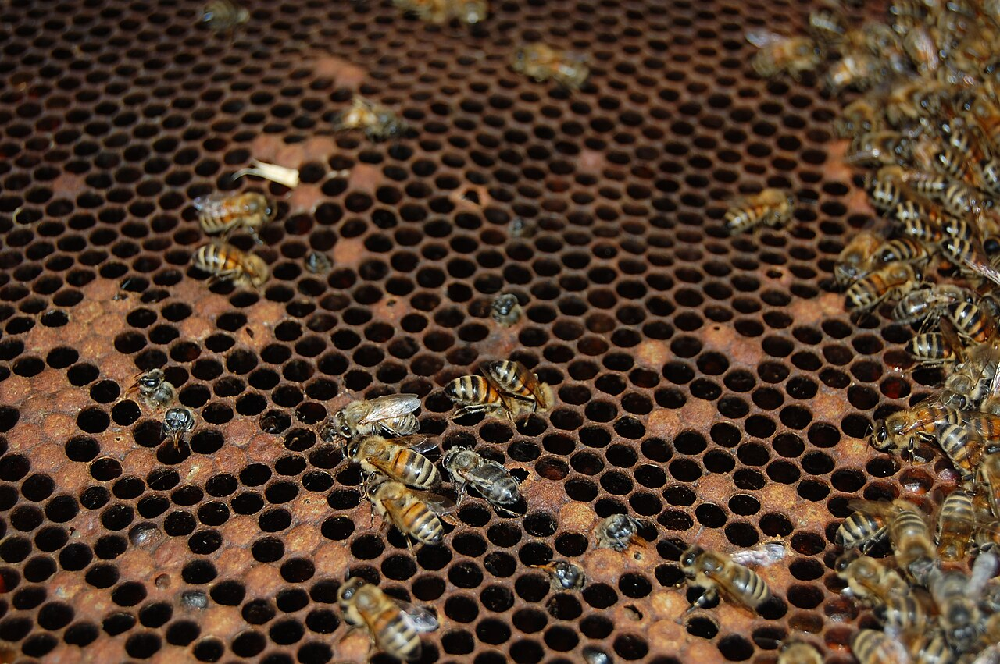
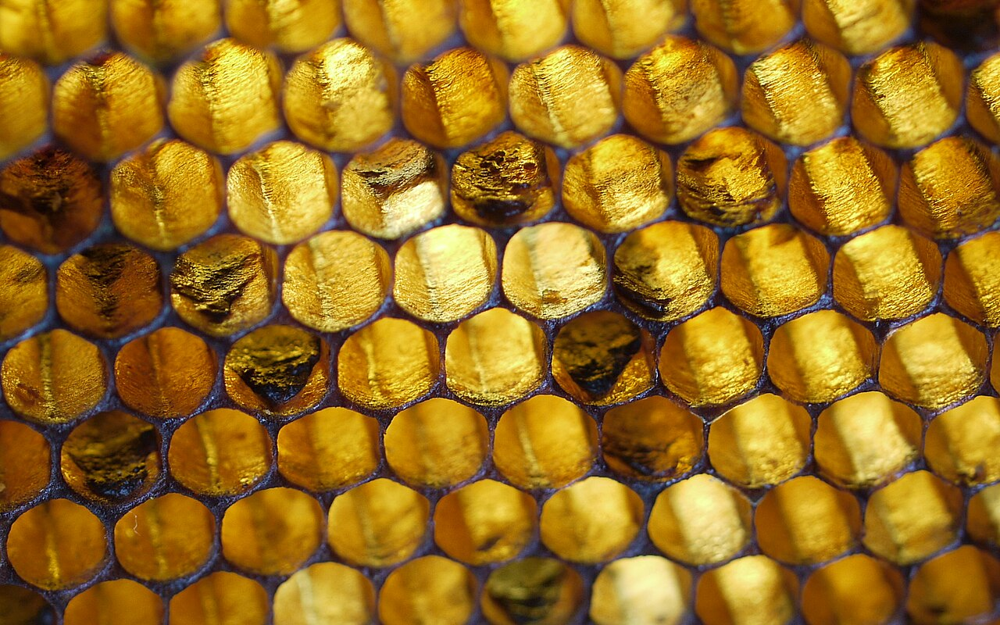

# Chapter 43 — American Foulbrood

## Introduction

American foulbrood (AFB) is a serious bacterial disease of honey bee brood caused by *Paenibacillus larvae*. Its importance comes from a combination of high larval susceptibility, enormous spore production in diseased remains, exceptional environmental persistence, and efficient movement through contaminated honey, comb, equipment, robbing, and beekeeping activity.

AFB must be approached differently from many routine colony problems. In numerous jurisdictions it is notifiable or subject to official control. The beekeeper's first responsibility after a credible suspicion is therefore not to experiment with treatment, move the colony, or redistribute equipment. It is to prevent spread, preserve evidence, identify the colony clearly, and follow current competent-authority instructions.

Control rules differ internationally. Some authorities require destruction of clinically affected colonies or contaminated material. Others permit defined salvage, irradiation, veterinary treatment, or other measures under specific conditions. Antibiotics may suppress vegetative bacterial growth where legally authorised, but they do not eliminate the persistent spores and can mask clinical signs. Experimental approaches such as bacteriophage therapy are scientifically promising but should not be confused with universally authorised field control.

## Learning Objectives

After completing this chapter, the reader should be able to:

- explain the biology of *Paenibacillus larvae* and why spores are central to AFB persistence;
- describe how susceptible larvae become infected;
- recognise field signs that should raise suspicion of AFB;
- distinguish supporting field tests from definitive confirmation;
- understand major differential diagnoses;
- prevent movement of spores within and between apiaries;
- collect and label samples according to competent laboratory or inspector instructions;
- understand why AFB can require statutory control;
- explain the limitations of antibiotics and other suppressive treatments;
- apply a practical prevention, tracing, and biosecurity system.

## 43.1 The Causative Organism

*Paenibacillus larvae* is a Gram-positive, spore-forming bacterium specialised in infecting honey bee larvae.

It exists in two biologically important forms:

- vegetative bacterial cells, which multiply within an infected larva;
- endospores, which are the durable infectious stage.

The vegetative stage drives disease inside the larva. The spores allow the organism to survive in hive material and spread to new larvae and colonies.

## 43.2 Why the Spore Is So Important

AFB spores are highly resistant environmental structures. They can remain viable for many years in dried larval scales, honey, comb, hive debris, and equipment.

A single diseased larval remain can contain an enormous number of spores.

This persistence means:

- an apparently empty hive can remain biologically risky;
- old comb can carry infection long after the original colony is gone;
- honey from infected colonies can spread spores if fed to bees;
- equipment history matters;
- temporary disappearance of clinical signs does not prove that contamination has been eliminated.

## 43.3 Which Bees Are Infected?

AFB is fundamentally a brood disease.

Young larvae are the susceptible host stage. Adult bees can carry and distribute spores but do not develop the same lethal brood disease.

Larvae become infected when they ingest food containing viable spores.

Age at exposure influences susceptibility. Very young larvae are generally most vulnerable.

## 43.4 Infection Process

A simplified sequence is:

1. spores contaminate larval food;
2. a susceptible larva ingests the spores;
3. spores germinate in the larval gut;
4. vegetative bacteria multiply;
5. infection progresses through larval tissues;
6. the larva dies, commonly after the cell has been capped;
7. the remains become brown and decomposed;
8. the material dries into an adherent scale;
9. large numbers of durable spores persist in the scale and cell.

The next generation of larvae can then be exposed when workers clean contaminated cells or redistribute contaminated food.

## 43.5 Colony-Level Development

AFB does not always become obvious immediately.

Early in an outbreak, only scattered brood cells may be affected. Workers may remove some diseased larvae, temporarily reducing visible signs.

As contamination increases:

- more brood cells become infected;
- brood pattern becomes irregular;
- the colony fails to replace adult workers adequately;
- population and productivity decline;
- robbing risk may increase as the colony weakens.

A collapsing diseased colony can then expose neighbouring colonies to contaminated stores.

## 43.6 Typical Field Signs

Possible AFB signs include:

- irregular or “pepper-pot” sealed brood;
- sunken cappings;
- perforated cappings;
- dark or greasy-looking cappings;
- brown decomposing larval or pupal remains;
- ropey or viscous consistency at some disease stages;
- dark scales adhering tightly to the lower cell wall;
- a protruding pupal tongue in some advanced cases;
- progressive colony weakening.

Not every infected colony shows every sign.

## 43.7 The Brood Pattern

A patchy brood pattern is often the first reason a beekeeper looks more closely.

However, patchiness also occurs with:

- European foulbrood;
- Varroa-associated damage;
- chilled brood;
- failing queens;
- hygienic brood removal;
- nutritional stress;
- pesticide exposure;
- sacbrood;
- physical injury.

Patchy brood therefore signals investigation rather than proving AFB.

*Photo 43.1 — AFB brood-frame context. This real whole-frame photograph was described by its creator as a typical appearance of brood affected by American foulbrood. Use it to recognise a pattern that warrants closer investigation, not to diagnose AFB from patchiness alone. Compare suspicious cells with the specific signs in this chapter and follow current competent-authority or laboratory confirmation requirements. Photo by Tanarus, CC BY-SA 3.0.*

## 43.8 Capping Changes

AFB-affected sealed cells may have:

- depressed surfaces;
- small irregular holes;
- darker appearance;
- moist or greasy-looking areas.

These changes occur because the larva dies and shrinks beneath the cap and workers may partially open suspicious cells.

Perforated cappings are important supporting evidence but are not unique to AFB.

## 43.9 Larval Remains

At certain disease stages, infected remains can become:

- light brown;
- darker brown;
- sticky or viscous;
- eventually dry and scale-like.

The exact appearance depends on stage and colony cleaning behaviour.

Fresh white healthy larvae should be used as the visual reference.

## 43.10 The Rope Test

The traditional rope or matchstick test examines the consistency of suspicious brood material.

A clean disposable or disinfectable probe is inserted into the decomposed material and withdrawn slowly. A characteristic ropey thread can support suspicion of AFB.

Limitations include:

- not every AFB case is at the correct stage to rope;
- some non-AFB material can be sticky;
- technique and judgement vary;
- the test can contaminate tools and nearby surfaces;
- it does not replace official or laboratory confirmation where required.

**Caution:** Treat the probe as contaminated after contact with suspect material.

## 43.11 The Scale

As diseased remains dry, they form a scale that can adhere tightly to the lower side of the cell.

AFB scales can be difficult for workers to remove and may contain very large numbers of spores.

Old scales are therefore epidemiologically important even after wet larval remains have disappeared.

*Photo 43.2 — AFB adherent scale. Hard, dark larval remains can persist tightly on the lower wall of brood cells after infected material dries. This specialist-provenance teaching photograph shows the appearance described as AFB scale, but a reader should not classify every dark cell residue from appearance alone; interpret it with the colony's other signs and current official or laboratory confirmation requirements. Photo by Dalibor Titera, Bee Research Institute at Dol, CC BY-SA 4.0.*

## 43.12 The Pupal Tongue

In some AFB cases, the proboscis or “tongue” of a dead pupa projects upward from the scale.

This can be a striking sign when present, but it is not present in every case and should not be required before suspicion is taken seriously.

## 43.13 Odour

Some heavily diseased colonies develop a distinctive unpleasant odour.

Odour is variable and subjective. Its absence does not exclude AFB, and its presence does not prove it.

Do not use smell as the primary diagnostic method.

## 43.14 Differential Diagnosis: European Foulbrood

European foulbrood (EFB), caused by *Melissococcus plutonius*, often kills larvae before or around capping and may produce twisted, yellow-brown larvae.

AFB more characteristically involves diseased remains under sealed brood and highly persistent spores.

However, field presentations overlap. Laboratory or inspector confirmation may be necessary.

Chapter 44 covers EFB in detail.

## 43.15 Differential Diagnosis: Sacbrood

Sacbrood virus can produce dead larvae with:

- raised or darkened heads;
- a fluid-filled sac-like skin;
- scale-like remains later in development.

Sacbrood remains usually do not show the classic ropey consistency of appropriate-stage AFB and have a different disease biology.

## 43.16 Differential Diagnosis: Chilled Brood

Chilled brood often affects a recognisable area exposed after:

- cold weather;
- prolonged inspection;
- sudden adult-bee loss;
- excessive brood area for the worker population.

Dead brood can discolor and decay secondarily, so history and distribution are important.

## 43.17 Differential Diagnosis: Varroa-Associated Brood Damage

High Varroa pressure and associated viruses can produce:

- patchy sealed brood;
- uncapped pupae;
- partially removed brood;
- deformed emerging adults.

Finding mites or deformed adults does not exclude simultaneous AFB, so suspicious bacterial brood signs still require investigation.

## 43.18 Field Diagnostic Kits

Commercial lateral-flow or immunological field tests are available in some regions for foulbrood organisms.

Their value depends on:

- correct sampling;
- disease stage;
- product validation;
- storage conditions;
- expiry;
- local regulatory acceptance.

A field kit can support a decision but must not be used to bypass mandatory reporting or official confirmation.

## 43.19 Laboratory Confirmation

Laboratory methods may include:

- microscopy;
- culture;
- biochemical identification;
- immunological methods;
- PCR or qPCR;
- newer validated immunoassays or point-of-care molecular methods.

The best method depends on whether the aim is clinical confirmation, surveillance, strain characterisation, or regulatory action.

## 43.20 Sampling Suspect Brood

Follow the receiving authority or laboratory's instructions.

A sample may involve:

- a section of comb containing representative suspect brood;
- swabs;
- larval remains;
- honey or debris for surveillance purposes;
- other material specifically requested.

Label the colony and apiary clearly. Do not mix samples from different suspect colonies unless instructed.

## 43.21 Preserve Evidence Before Cleaning

If official investigation may occur, avoid destroying diagnostic evidence before contact with the competent authority.

Photograph:

- entire brood frame;
- distribution of affected cells;
- close-up cappings;
- suspect larval remains;
- hive identification.

Record date, colony history, recent movement, feeding, queen changes, and equipment transfers.

## 43.22 Immediate Response to Suspicion

When AFB is credibly suspected:

1. stop moving brood, bees, honey, and equipment from the colony;
2. close the hive after necessary observations;
3. mark the colony clearly;
4. segregate tools used on it;
5. prevent robbing;
6. avoid feeding its honey to bees;
7. record recent movements and frame transfers;
8. contact the competent authority or bee-health service where reporting applies;
9. follow official sampling and control instructions.

Do not wait for the colony to become severely diseased before seeking confirmation.

## 43.23 Legal Status Varies by Jurisdiction

AFB is internationally important and listed by WOAH, but national control systems differ.

Examples:

- Ireland lists infection with *P. larvae* as a notifiable bee disease and maintains national animal-health surveillance information;
- the United Kingdom operates statutory control through its bee-health services;
- other countries may use state, provincial, federal, veterinary, or inspector-based systems.

Legal status can change. Always verify current local requirements.

## 43.24 Why Movement Restrictions Matter

Moving a clinically affected colony can distribute spores through:

- drifting bees;
- robbing;
- dropped honey;
- transported comb;
- reused boxes;
- vehicle contamination;
- shared tools;
- destination-apiary exposure.

Movement control is therefore an epidemiological intervention, not bureaucracy without purpose.

## 43.25 Robbing and AFB

A weak AFB colony may become a robbing target.

Robbers can carry contaminated honey back to their own colonies. Spores in that honey may later reach larvae through food preparation.

Prevent robbing by:

- keeping the suspect hive closed except when necessary;
- reducing uncontrolled access if instructed and safe;
- containing exposed honey;
- protecting removed comb;
- not leaving wet supers nearby.

## 43.26 Drifting

Adult bees can drift between neighbouring colonies. Although adults do not develop AFB as brood does, they can carry contaminated material.

Apiary layout, colony density, and entrance orientation influence drift.

Disease control must consider the apiary, not only the visibly affected colony.

## 43.27 Beekeeper-Mediated Spread

Common human-mediated routes include:

- moving brood frames;
- equalising colonies;
- transferring honey frames;
- sharing feeders;
- contaminated hive tools;
- contaminated gloves;
- purchasing used comb;
- extracting honey from suspect colonies with shared equipment;
- selling or gifting contaminated material.

Good intentions can spread AFB faster than natural bee movement.

## 43.28 Honey as a Spore Vehicle

Honey can contain *P. larvae* spores without being visibly abnormal.

Human consumption is a different question from bee-disease transmission; the organism is primarily a honey bee brood pathogen. However, contaminated honey can be epidemiologically dangerous if fed to bees.

Never feed honey of unknown or suspect AFB status to colonies.

## 43.29 Second-Hand Equipment

Used brood comb presents particular risk because scales and spores can remain within cells.

Before acquiring second-hand equipment, determine:

- source apiary;
- disease history;
- whether comb is included;
- local legal requirements;
- whether an approved decontamination method exists;
- whether destruction is safer and required.

Cheap unknown brood comb can become an expensive disease introduction.

## 43.30 Colony Destruction

In some jurisdictions, confirmed clinical AFB requires destruction of affected colonies and specified contaminated material.

Methods and legal supervision vary. They can include euthanasia of the colony followed by destruction of bees and combustible equipment under official requirements.

This handbook does not provide a universal destruction procedure because fire, chemical use, transport, environmental protection, and disease-control law differ.

**Warning:** Do not burn hives, use fuels, apply killing agents, or dispose of infected material without current legal and fire-safety authority guidance.

## 43.31 Equipment Salvage

Some non-comb equipment may be eligible for approved decontamination in particular jurisdictions.

Possible professional methods can include:

- controlled scorching of suitable wooden surfaces;
- validated chemical decontamination;
- irradiation;
- other officially approved processes.

Effectiveness depends on material, organic debris, method parameters, and spore resistance.

Wax comb is especially difficult to decontaminate reliably without destruction or specialised processing.

## 43.32 Cleaning Is Not the Same as Disinfection

Cleaning removes wax, propolis, honey, debris, and organic matter.

Disinfection or decontamination aims to reduce or eliminate the biological hazard.

A dirty surface can protect microorganisms from a disinfectant. Cleaning is therefore often necessary before an approved decontamination process, but cleaning alone does not guarantee spore elimination.

## 43.33 Heat and Spore Resistance

AFB spores resist conditions that kill ordinary vegetative bacteria.

Casual washing with warm water, leaving equipment in sunlight, or briefly heating a hive does not provide reliable decontamination.

Use only methods supported by competent guidance for *P. larvae* spores.

## 43.34 Antibiotics: Fundamental Limitation

Antibiotics act against susceptible vegetative bacterial cells, not the durable AFB spores.

Where antibiotics are legally used, they may suppress visible disease while contaminated comb remains.

Risks include:

- recurrence after treatment stops;
- masking clinical signs;
- antibiotic resistance;
- residues in honey or wax;
- delayed elimination of contaminated equipment.

Medication should never be treated as equivalent to spore eradication.

## 43.35 Antibiotic Resistance

Resistance to commonly used antibiotics has been documented in *P. larvae* populations in some regions.

Repeated prophylactic or poorly controlled use creates selection pressure.

Veterinary oversight, surveillance, and compliance with authorised uses are essential where antibiotics are permitted.

## 43.36 Experimental Bacteriophage Therapy

Bacteriophages are viruses that infect bacteria. Research has explored phages that target *P. larvae*.

A 2026 systematic review reported promising results across laboratory, larval, and limited colony studies, including protective effects in some trials.

However:

- formulation remains an active research area;
- delivery within colonies is challenging;
- phage host range matters;
- regulatory authorisation differs;
- field evidence remains much smaller than the evidence base for established statutory control.

Do not substitute experimental phage preparations for official AFB control.

## 43.37 Emerging Diagnostic Research

Recent work includes:

- improved immunoassays for *P. larvae* detection and differentiation;
- point-of-care molecular assays for simultaneous AFB and EFB detection;
- more sensitive environmental surveillance;
- strain and genotype analysis.

New diagnostic tools can improve speed, but they must be validated and accepted within the relevant control programme.

## 43.38 Hygienic Behaviour

Hygienic bees detect and remove abnormal brood more effectively.

This trait can reduce the progression of some brood diseases and is valuable in breeding programmes.

Recent research has associated strong hygienic behaviour with lower proportions of AFB-affected brood in some experimental populations.

However, hygienic behaviour does not make a colony invulnerable to heavy spore exposure and does not cancel reporting obligations.

## 43.39 Resistant Stock Is Not a Licence to Ignore AFB

Genetic resistance can reduce disease expression but cannot guarantee absence of spores or prevent contaminated equipment from spreading infection.

A resistant colony can still be part of an epidemiological chain.

Monitoring, biosecurity, and legal control remain necessary.

## 43.40 Tracing the Source

After confirmation, reconstruct recent contacts.

Review:

- purchased colonies and nuclei;
- swarm captures;
- second-hand equipment;
- brood or honey-frame transfers;
- shared extractors;
- apiary movements;
- feeding of external honey;
- colony sales;
- dead-outs robbed by other colonies.

Tracing can identify colonies that need inspection before clinical signs develop.

## 43.41 Apiary Inspection After a Case

When permitted and directed, examine neighbouring colonies systematically.

Record:

- colony ID;
- brood pattern;
- suspicious cappings;
- larval remains;
- previous frame transfers;
- strength;
- robbing evidence;
- samples taken.

Inspecting every colony with the same contaminated tool can defeat the purpose of surveillance. Follow official tool-hygiene protocols.

## 43.42 Spore Detection Without Clinical Disease

AFB spores may be detected in honey, debris, adult bees, or other material before obvious disease is visible.

This can support surveillance and risk assessment, but interpretation depends on:

- sample type;
- method sensitivity;
- spore concentration;
- colony history;
- legal definitions;
- local control policy.

A positive environmental test and a clinically diseased colony are not always managed identically.

## 43.43 Food and Processing Equipment

Honey-processing equipment that contacts contaminated honey may spread spores back to bees if wet supers, honey, or residues are later exposed to colonies.

Maintain separation between:

- suspect material;
- marketable product;
- clean extraction equipment;
- equipment returning to apiaries.

Follow food-safety and disease-control instructions for affected product.

## 43.44 Wax

Wax recovered from AFB-contaminated comb may contain spores or carry associated contamination depending on processing.

Rendering practices, commercial wax sterilisation standards, and legal reuse rules vary.

Do not assume home melting makes wax suitable for returning to brood colonies.

## 43.45 Prevention: Buying Bees

Reduce introduction risk by:

- buying from traceable sources;
- checking inspection or certification systems where available;
- asking about disease history;
- inspecting brood after arrival;
- recording origin and queen source;
- avoiding unexplained used comb.

A cheap colony with unknown health history can introduce a long-lived apiary problem.

## 43.46 Prevention: Managing Dead-Outs

Dead colonies should be closed against robbing until the cause is assessed.

Do not automatically redistribute their honey and brood comb.

If the colony died from AFB, rapid robbing can expose multiple neighbouring colonies before the beekeeper investigates.

## 43.47 Prevention: Feeding

Feeders should not be filled with honey of unknown disease status.

Commercial sugar or other appropriate feed is generally easier to source safely than unknown honey.

Where honey feeding is used, its origin and legal suitability must be known.

## 43.48 Prevention: Frame Transfers

Before moving brood or food frames between colonies:

- inspect donor brood;
- review donor disease history;
- avoid suspect or unexplained dead-out comb;
- maintain traceability.

Equalising colony strength should never override disease biosecurity.

## 43.49 Prevention: Apiary Records

A useful AFB-prevention record includes:

- colony origin;
- queen source;
- brood-frame movements;
- supers shared between colonies;
- used equipment source;
- disease inspections;
- laboratory results;
- official notices;
- destruction or decontamination records;
- colony sales and movements.

Traceability makes outbreak investigation faster and more accurate.

## 43.50 Decision Table

| Finding | Interpretation | Immediate principle |
|---|---|---|
| Patchy brood only | Non-specific | Inspect cells closely; do not diagnose yet |
| Sunken/perforated cappings plus brown remains | AFB among important differentials | Stop transfers and obtain confirmation |
| Positive rope test | Strong supporting evidence in suitable material | Treat colony as suspect; follow reporting requirements |
| Adherent dark scales | Important AFB suspicion sign | Prevent movement and seek competent diagnosis |
| Positive field kit | Supporting diagnostic evidence | Follow local official confirmation/control process |
| Laboratory-confirmed clinical AFB | Regulated disease in many regions | Implement competent-authority control measures |
| Spores detected without clinical signs | Exposure/contamination evidence | Interpret under local surveillance policy |

## 43.51 Common Mistakes

### Waiting for a foul smell

Odour is unreliable and may appear late or not at all.

### Moving suspect frames to a strong colony

This can spread spores.

### Feeding honey from a dead-out

Unknown honey can carry AFB spores.

### Keeping the same contaminated hive tool in use

The beekeeper can transmit spores mechanically.

### Treating with antibiotics and assuming the hive is clean

Spores remain.

### Saving unknown old brood comb because it is valuable

The biological cost of contaminated comb can exceed its replacement value.

### Hiding a suspect case

Delayed reporting can expose neighbouring apiaries and may breach the law.

## 43.52 Scientific Notes

### Spore persistence

Endospore formation is the central reason AFB is difficult to eradicate from contaminated equipment. Spores tolerate environmental conditions that rapidly kill vegetative bacteria.

### Genotype and virulence

*P. larvae* strains differ genetically and can differ in larval killing dynamics. A strain that kills larvae very quickly may sometimes produce fewer spores per infected larva because workers remove remains earlier, illustrating why pathogen virulence and transmission are not always simple linear traits.

### Hygienic behaviour

Honey bee social immunity can reduce disease expression by removing diseased brood before extensive sporulation. Colony genetics therefore influence clinical progression without eliminating the need for biosecurity.

### Surveillance before symptoms

Sensitive molecular and immunological methods can detect contamination before classical field signs. This creates opportunities for early action but also requires careful interpretation to avoid treating every low-level detection as equivalent to clinical disease.

### Experimental therapy

Phage research shows how pathogen-specific biological control might complement future AFB programmes. It remains an emerging field, not a replacement for current statutory measures.

## 43.53 Practical AFB Response Checklist

When suspicious brood is found:

- [ ] Stop frame and equipment transfers.
- [ ] Mark the colony clearly.
- [ ] Photograph the brood pattern and close-up signs.
- [ ] Keep tools from the suspect colony separate.
- [ ] Prevent robbing and exposed honey.
- [ ] Do not feed honey from the colony to bees.
- [ ] Review recent colony and equipment movements.
- [ ] Check current reporting requirements.
- [ ] Contact the competent authority or laboratory.
- [ ] Collect samples only as instructed.
- [ ] Do not medicate or destroy evidence before official guidance where regulation applies.
- [ ] Inspect contact colonies under the required protocol.
- [ ] Record the final diagnosis.
- [ ] Document destruction, decontamination, or other official action.
- [ ] Continue follow-up surveillance.

## Key Takeaways

- American foulbrood is caused by the spore-forming bacterium *Paenibacillus larvae*.
- Young larvae become infected by ingesting spores in contaminated food.
- Persistent spores, not merely vegetative bacteria, make AFB difficult to eliminate.
- Patchy brood, perforated cappings, ropey remains, adherent scales, and occasional pupal tongues support suspicion but must be interpreted correctly.
- AFB can be confused with EFB, sacbrood, chilled brood, queen problems, and Varroa-associated brood damage.
- A credible suspicion should stop movement of brood, honey, bees, and equipment until current local requirements are known.
- Robbing and beekeeper frame transfer are major routes of spread.
- Antibiotics do not destroy AFB spores and can mask disease where their use is permitted.
- Experimental phage and new diagnostic technologies are promising but do not replace current legal control.
- Traceability, early diagnosis, controlled movement, hygienic stock, and strict biosecurity are the foundation of prevention.

## Chapter Summary

American foulbrood is a brood disease built around an exceptionally persistent infectious stage. *P. larvae* spores enter young larvae in food, germinate, multiply, kill developing brood, and are produced in huge numbers as diseased remains dry into scales. Those scales and contaminated comb can remain dangerous long after the original colony has disappeared.

Field diagnosis begins with brood pattern and cell-level signs. Sunken or perforated cappings, brown decomposed remains, ropey material, adherent scales, and occasional pupal tongues are important observations, but confirmation may require an inspector, validated field assay, culture, PCR, immunological methods, or other laboratory testing.

The immediate goal after suspicion is containment. Do not redistribute frames, feed suspect honey, allow robbing, or use contaminated tools across colonies. Because AFB is regulated in many jurisdictions, control may involve official inspection, destruction, approved equipment decontamination, movement restrictions, or other statutory measures.

Antibiotics cannot eliminate spores and must never be treated as a substitute for decontamination or official disease control. Future technologies, including bacteriophages and advanced point-of-care diagnostics, may improve management, but the current foundation remains early recognition, traceability, strong biosecurity, and compliance with competent-authority requirements.

## Review Questions

1. What organism causes American foulbrood?
2. What two major biological forms does *P. larvae* have?
3. Which form is responsible for long environmental persistence?
4. Why are AFB spores difficult to eliminate?
5. Where can spores persist in an apiary?
6. Which honey bee stage develops AFB disease?
7. How do susceptible larvae acquire infection?
8. Why are very young larvae particularly vulnerable?
9. What happens after spores germinate in the larval gut?
10. At what broad developmental stage do many infected larvae die?
11. What happens to dead larval remains over time?
12. Why are scales epidemiologically important?
13. How can workers contribute to within-colony spore spread?
14. Why can early AFB be difficult to notice?
15. What happens to colony population as brood losses accumulate?
16. How can a weakening AFB colony threaten neighbouring colonies?
17. Name five field signs associated with AFB.
18. What is a pepper-pot brood pattern?
19. Why is a patchy brood pattern not diagnostic?
20. Name four non-AFB causes of patchy brood.
21. Why may AFB cappings become sunken?
22. Why can workers perforate suspicious cappings?
23. How can larval remains change in colour and consistency?
24. What is the purpose of the rope test?
25. Why can the rope test be negative in a true AFB case?
26. Why must a rope-test probe be treated as contaminated?
27. What is an AFB scale?
28. Why can bees have difficulty removing old AFB scales?
29. What is the pupal-tongue sign?
30. Does absence of a pupal tongue exclude AFB?
31. Why is odour unreliable for diagnosis?
32. Which bacterium causes European foulbrood?
33. How does EFB often differ from AFB in brood stage affected?
34. Why may laboratory confirmation be needed to distinguish AFB and EFB?
35. Which viral brood disease can resemble foulbrood?
36. How can chilled brood mimic infectious brood disease?
37. How can Varroa-associated damage create a patchy brood pattern?
38. Does finding Varroa exclude AFB?
39. What can a lateral-flow field test contribute?
40. Why can a field kit not bypass mandatory reporting?
41. Name four laboratory methods that can support AFB diagnosis.
42. Why does the diagnostic method depend on the investigation question?
43. Which material may be submitted for AFB testing?
44. Why should colonies normally be labelled separately?
45. Why should diagnostic evidence be photographed before major intervention?
46. What should be recorded about colony movement?
47. What is the first movement-related action after credible AFB suspicion?
48. Why should the hive be marked clearly?
49. Why should tools used on a suspect colony be segregated?
50. Why should suspect honey not be fed to bees?
51. Why is AFB control legally different among countries?
52. Is AFB notifiable in Ireland according to current national surveillance information?
53. Why must current local requirements be checked even when WOAH lists the disease?
54. How can moving a diseased hive spread spores?
55. Why does movement restriction help control an outbreak?
56. How does robbing spread AFB?
57. Why should wet supers not be left near a suspect colony?
58. How can drifting contribute to spread?
59. Name five beekeeper-mediated routes of AFB transmission.
60. Why can equalising colonies spread disease?
61. Can apparently normal honey contain AFB spores?
62. Why is human food safety a different question from bee-disease transmission?
63. Why is second-hand brood comb high risk?
64. What should be checked before buying used hive equipment?
65. Why can unknown old comb be more costly than new foundation?
66. Why does this chapter not prescribe one destruction method?
67. Which hazards accompany uncontrolled hive burning?
68. What types of equipment may be salvageable under approved programmes?
69. Why is wax comb especially difficult to decontaminate?
70. What is the difference between cleaning and disinfection?
71. Why can organic debris interfere with decontamination?
72. Why is warm-water washing inadequate for AFB spores?
73. What is the fundamental limitation of antibiotics in AFB?
74. How can antibiotics mask clinical disease?
75. What food-safety risk accompanies inappropriate antibiotic use?
76. Why is antibiotic resistance important in AFB management?
77. What is a bacteriophage?
78. Why are bacteriophages being studied for AFB?
79. Why should experimental phage therapy not replace official control today?
80. What kinds of new diagnostic technologies are being studied?
81. What is hygienic behaviour?
82. How can hygienic behaviour reduce disease progression?
83. Does hygienic stock eliminate reporting obligations?
84. Why can resistant stock still spread spores?
85. What should be reconstructed during source tracing?
86. Why should neighbouring colonies be inspected after confirmation?
87. How can using one dirty hive tool undermine an apiary inspection?
88. What is the difference between spore detection and clinical AFB?
89. Why might surveillance detect spores before symptoms?
90. How can shared extraction equipment contribute to epidemiological spread?
91. Why should home-rendered wax not automatically be returned to brood colonies after AFB contamination?
92. How can traceable bee purchases reduce risk?
93. Why should dead-outs be protected from robbing before diagnosis?
94. Why is feeding unknown honey risky?
95. What should be checked before transferring a brood frame?
96. Which records are useful for AFB traceability?
97. What does a positive rope test mean in practical terms?
98. What should happen after laboratory-confirmed clinical AFB?
99. Why does the durable spore stage shape almost every AFB control decision?
100. What are the core components of an effective AFB prevention and response programme?

## References

- World Organisation for Animal Health. “Diseases of Bees” and current standards for American foulbrood of honey bees. Accessed 15 September 2026.
- Department of Agriculture, Food and the Marine, Ireland. Animal Health Surveillance: “Infection of honey bees with *Paenibacillus larvae* (American foulbrood).” Current national surveillance page; AFB listed as notifiable in Ireland. Accessed 15 September 2026.
- Department for Environment, Food & Rural Affairs and Animal and Plant Health Agency. Current UK bee-health guidance on American foulbrood and statutory disease reporting. Accessed 15 September 2026.
- Reinecke, A., Göbel, J., and Genersch, E. “Immunoassays for the detection and differentiation of Paenibacillus larvae, the etiological agent of American foulbrood (AFB) in honey bees.” *Scientific Reports* 16, 2635 (2026).
- Heo, J., Cheon, D.-S., Chung, N.-K., Kim, Y., and Kim, D.-Y. “Evaluation of the performance of a point-of-care molecular assay for simultaneous detection of the agents of American foulbrood and European foulbrood in apiaries.” *Journal of Veterinary Diagnostic Investigation* 37(6), 2025, 919–926. DOI: 10.1177/10406387251369898.
- Walter, N., Bolte, A. T., Mirzaei, M. K., Deng, L., and Rupp, M. “Bacteriophage therapy against American foulbrood in honey bees: a PRISMA-guided systematic review.” *Frontiers in Microbiology* 17, 2026, 1816537. DOI: 10.3389/fmicb.2026.1816537.
- Ducommun-Dit-Verron, O., Zerna, G., and Beddoe, T. “An Enquiry into the Status of American Foulbrood Therapeutics.” *Insects* 17(3), 2026, 312. DOI: 10.3390/insects17030312.
- Boonmee, T. et al. “Non-thermal atmospheric pressure plasma inactivation of Paenibacillus larvae, the causative agent of American foulbrood in honeybees.” *Scientific Reports* 16, 2026, 11139.
- Genersch, E. “American Foulbrood in honeybees and its causative agent, Paenibacillus larvae.” Foundational review literature on pathogen biology and control.
- Current national and regional bee-health authorities. Reporting, movement restrictions, destruction, salvage, decontamination, veterinary medicines, food products and compensation rules must be verified for the reader’s jurisdiction.