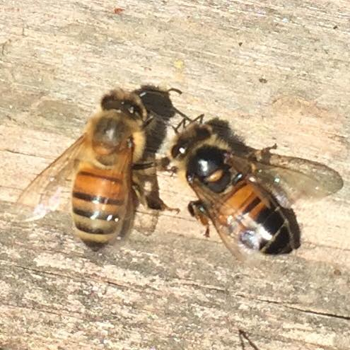

# Chapter 45 — Viruses

## Introduction

Honey bee colonies commonly contain viruses. Detection alone is therefore not the same as disease. A colony can carry viral RNA without visible signs, while another colony with the same named virus can experience deformed brood, paralysis, shortened worker lifespan, or rapid population loss.

The difference often lies in viral load, transmission route, bee age, tissue infected, genetics, nutrition, coinfection, environmental stress, and—most importantly for several major viruses—the presence of *Varroa destructor*.

Varroa has transformed honey bee virology. By feeding on developing and adult bees and transmitting viruses directly into host tissues, the mite can alter viral prevalence, load, variant structure, and clinical outcome. Deformed wing virus (DWV) is the clearest example, but acute paralysis viruses are also associated with mite pressure.

For the beekeeper, the central principles are:

1. recognise syndromes without diagnosing from appearance alone;
2. measure and control Varroa;
3. collect representative samples when laboratory diagnosis is useful;
4. interpret RT-PCR/qPCR results with colony history and sample type;
5. reduce movement and stressors when unexplained disease is occurring;
6. avoid unsupported antiviral remedies.

## Learning Objectives

After completing this chapter, the reader should be able to:

- explain the difference between viral infection and clinical viral disease;
- describe horizontal, vertical, food-borne, contact, and vector-mediated transmission;
- explain why Varroa changes viral epidemiology;
- recognise the main syndromes associated with DWV, chronic bee paralysis virus, acute paralysis viruses, sacbrood virus, and black queen cell virus;
- understand the value and limitations of RT-PCR and quantitative RT-PCR;
- distinguish detection from causation;
- choose representative bees or brood for diagnostic sampling;
- understand coinfection and viral variants;
- reduce viral risk through Varroa control, nutrition, biosecurity, and colony management;
- separate experimental antiviral research from authorised practical treatment.

## 45.1 What Is a Virus?

A virus is an infectious entity containing genetic material enclosed in a protein coat and, in some viruses, additional structures. It cannot reproduce independently. It must enter host cells and use cellular machinery to make new viral particles.

Most well-studied honey bee viruses are RNA viruses.

This matters diagnostically because laboratory tests often detect viral RNA rather than culturing a living virus in the way bacteria may be cultured.

## 45.2 Infection Versus Disease

A bee can be infected without showing visible signs.

Terms commonly used include:

- covert infection: virus is present without obvious disease;
- subclinical infection: biological effects may occur without distinctive external signs;
- overt or clinical disease: clear signs or measurable pathology are present.

A positive PCR result therefore demonstrates detected viral genetic material, not automatically the cause of colony failure.

## 45.3 Viral Load

Viral load refers to the amount of viral material detected in a defined sample under a defined method.

Higher loads can be associated with greater disease risk for some viruses, but interpretation depends on:

- virus;
- tissue;
- sample type;
- bee age;
- season;
- assay;
- normalisation method;
- Varroa level;
- clinical signs.

There is no single universal viral-load threshold for all honey bee viruses.

## 45.4 Transmission Routes

Honey bee viruses can spread through several routes.

### Horizontal transmission

Between individuals of the same generation through:

- food sharing;
- faecal contamination;
- glandular secretions;
- contact;
- cannibalism of infected brood;
- wounds;
- parasitic mites.

### Vertical transmission

From queen or drone reproductive tissues to offspring or through eggs in some virus-host relationships.

### Vector-mediated transmission

A parasite carries virus between hosts. Varroa is the most important viral vector in modern *Apis mellifera* colonies.

## 45.5 Why Transmission Route Changes Disease

Oral exposure and direct injection into tissue are biologically different.

A virus that causes little disease when acquired orally may become more damaging when a mite introduces it through feeding wounds during pupal development.

Vector-mediated transmission can therefore change both infection probability and disease severity.

## 45.6 Varroa as a Viral Driver

Varroa affects viruses through several mechanisms:

- direct transmission;
- repeated feeding wounds;
- physiological stress;
- fat-body damage;
- altered immunity;
- concentrated transmission inside brood cells;
- redistribution between colonies.

The practical consequence is simple: viral management cannot be separated from Varroa management where the mite is established.

## 45.7 Deformed Wing Virus Complex

Deformed wing virus is among the most important honey bee viruses globally.

Major genetic variants include DWV-A and DWV-B, with additional variants and recombinant forms described in the literature. DWV-B was historically known as Varroa destructor virus-1 in earlier naming systems.

Variant distribution changes geographically and over time.

## 45.8 Visible DWV Syndrome

The classic syndrome can include:

- shortened or misshapen wings;
- crumpled wings;
- shortened abdomen;
- poor mobility;
- inability to fly;
- early death after emergence.

However, many high-DWV bees do not show obvious wing deformity.

Visible deformed wings therefore represent a severe phenotype, not the full burden of disease.

## 45.9 Hidden DWV Damage

A bee can emerge with apparently normal wings but have:

- high viral load;
- reduced lifespan;
- impaired physiology;
- reduced foraging performance;
- increased mortality under stress.

At colony level, this can create dwindling without many obvious deformed bees.

## 45.10 DWV and Winter Bees

DWV-associated damage during development of long-lived winter workers is particularly serious.

If winter bees have reduced longevity, the cluster may shrink before spring even when autumn population originally appeared adequate.

This is one reason Varroa must be controlled before winter-bee development is irreversibly compromised.

## 45.11 DWV Variants and Evolution

Varroa-mediated transmission changes selection pressure on DWV populations.

Different variants can compete, recombine, and change in frequency. A laboratory report that distinguishes variants can support epidemiological research but usually does not replace basic colony management decisions such as urgent Varroa control.

## 45.12 Chronic Bee Paralysis Virus

Chronic bee paralysis virus (CBPV) can cause striking adult-bee disease.

Two classic clinical presentations have been described, but mixed signs are common.

Possible observations include:

- trembling or shaking bees;
- inability to fly;
- crawling near the hive;
- bloated abdomen in some affected bees;
- dark, shiny, hairless-looking workers;
- rejection of affected bees by nestmates;
- large numbers of dead or moribund adults.

These signs require differential diagnosis.

## 45.13 Hairless Black Bees

Hairless, dark-looking bees can result when body hairs are lost, revealing the shiny cuticle.

In CBPV outbreaks, affected bees may be attacked or excluded by nestmates.

However, hair loss can also occur from age, robbing, abrasion, or other causes.

Do not diagnose CBPV from colour alone.

*Photo 45.1 — CBPV-type adult appearance. The bee on the right shows darkening and reduced hair that can resemble the shiny, hairless appearance described in chronic bee paralysis. This photograph is a visual teaching example, not a stand-alone diagnosis: age, abrasion, robbing and other causes can also alter hair and colour, so interpret the sign with the colony-level syndrome and appropriate diagnostic evidence. Photo by Abrahami, CC BY-SA 4.0.*

## 45.14 Trembling and Crawling

Trembling bees may suggest CBPV, acute paralysis viruses, pesticide poisoning, chilling, nutritional problems, or other neurological stress.

A diagnostic investigation should ask:

- Are affected bees alive or dead?
- Are several colonies involved?
- Is there a recent pesticide event?
- What is the Varroa level?
- Are deformed-wing bees present?
- Is the syndrome concentrated at one hive?
- What does laboratory testing show?

## 45.15 Acute Bee Paralysis Virus

Acute bee paralysis virus (ABPV) can cause rapid adult mortality under suitable infection conditions.

It is associated with the Dicistroviridae group and has important interactions with Varroa.

Clinical signs can include:

- trembling;
- inability to fly;
- paralysis;
- rapid death.

These signs overlap with other acute viruses and toxic exposure.

## 45.16 Israeli Acute Paralysis Virus

Israeli acute paralysis virus (IAPV) is another dicistrovirus associated with acute adult-bee disease.

Research demonstrates that its within-host infection dynamics can differ substantially from DWV. A 2026 study found that IAPV infection in surviving experimental bees could decline rapidly while DWV remained high for longer, illustrating that viruses should not be assumed to share the same time course.

## 45.17 Kashmir Bee Virus

Kashmir bee virus (KBV) is closely related to ABPV and IAPV.

It can occur without obvious disease but can become important under stress or vector-mediated conditions.

Because these viruses are genetically related, well-designed molecular assays and controls are important for correct discrimination.

## 45.18 The Acute Paralysis Virus Complex

ABPV, IAPV, and KBV are often discussed together because of:

- genetic relationship;
- overlapping clinical signs;
- rapid disease potential;
- association with Varroa or other stressors;
- diagnostic cross-reactivity concerns in poorly designed assays.

Species-specific laboratory testing is needed when precise identification matters.

## 45.19 Sacbrood Virus

Sacbrood virus (SBV) primarily produces a brood disease.

Affected larvae may:

- fail to pupate;
- become yellowish or grey;
- develop a raised or darkened head;
- retain fluid between the body and old larval skin;
- form a characteristic sac-like structure;
- dry into a scale-like remain.

Mild sacbrood can occur transiently and does not always indicate colony collapse.

## 45.20 Sacbrood Differential Diagnosis

Sacbrood can be confused with:

- EFB;
- chilled brood;
- starvation;
- other dead brood.

The sac-like body and raised head can support suspicion, but laboratory confirmation may be useful in atypical cases.

## 45.21 Black Queen Cell Virus

Black queen cell virus (BQCV) is associated particularly with queen larvae and pupae.

Affected queen-cell contents can darken, and the queen larva may die.

BQCV is often detected in colonies without an obvious queen-cell outbreak and has been associated epidemiologically with other stressors, including microsporidian infection in some studies.

## 45.22 Lake Sinai Viruses

Lake Sinai viruses are a diverse group frequently detected in honey bees.

Their clinical significance remains less straightforward than that of classical DWV syndromes or sacbrood. Detection can be common without a unique visible disease pattern.

This group illustrates why metagenomic discovery and routine clinical diagnosis are different tasks.

## 45.23 Other Honey Bee Viruses

Other viruses described in honey bees include:

- slow bee paralysis virus;
- cloudy wing virus;
- bee macula-like virus;
- Apis iridescent-virus-like detections in some contexts;
- numerous newly described RNA viruses.

Not every detected virus has a well-defined disease syndrome or proven management significance.

## 45.24 Coinfection

One bee can carry multiple viruses simultaneously.

Coinfection can produce:

- additive effects;
- no obvious interaction;
- competition;
- altered replication;
- different mortality timing.

The outcome depends on specific viruses, order and route of infection, host condition, and environment.

Do not assume that two detected viruses automatically act synergistically.

## 45.25 Virus–Nosema Interactions

Viral and microsporidian infections may coexist.

The presence of both does not prove that one caused the other. Shared risk factors such as poor nutrition, ageing, confinement, or general colony stress can influence both.

A complete health investigation considers all major stressors rather than selecting one positive laboratory result as the sole cause.

## 45.26 Virus–Pesticide Interactions

Research has explored interactions between pesticide exposure and viral infection.

Some combinations alter immunity or survival under experimental conditions, but effects depend strongly on chemical, dose, virus, bee age, and route.

Field conclusions require exposure evidence as well as virological evidence.

## 45.27 Virus–Nutrition Interactions

Protein and energy availability influence immune and metabolic capacity.

Poor nutrition can reduce resilience to viral disease, especially when combined with Varroa.

Feeding does not eliminate viruses. Nutritional support is part of colony management, not an antiviral drug.

## 45.28 Virus–Genetics Interactions

Honey bee stocks differ in:

- Varroa resistance;
- hygienic behaviour;
- immune response;
- virus tolerance;
- brood dynamics.

Breeding can reduce disease risk indirectly by reducing mite reproduction or improving removal of compromised brood.

Genetic resistance should complement, not replace, monitoring.

## 45.29 Clinical Examination

When viral disease is suspected, record:

- adult-bee behaviour;
- wing condition;
- hair loss;
- crawling or trembling;
- mortality distribution;
- brood pattern;
- sacbrood-like larvae;
- queen-cell abnormalities;
- colony population;
- Varroa level;
- recent treatments;
- nutrition;
- pesticide events.

The pattern across the whole colony is more informative than one abnormal bee.

## 45.30 Selecting Adult Bees for Virus Testing

Sample choice depends on the question.

Possible samples include:

- visibly moribund bees;
- apparently healthy adults;
- newly emerged bees;
- foragers;
- pooled colony samples;
- individual bees.

These are not interchangeable.

A recent 2026 investigation of severe commercial colony losses demonstrated that pooled samples could show similar high virus levels in both healthy and collapsing apiaries, while individually selected moribund bees provided clearer evidence for high DWV loads associated with observed pathology.

## 45.31 Why Moribund Bees Can Be Informative

If a specific syndrome is occurring, collecting affected individuals can increase the diagnostic signal related to that syndrome.

However, moribund-bee sampling can overrepresent severe infections and should not be used to estimate population-wide prevalence without an appropriate design.

Use both clinical and representative sampling when the investigation requires both causation and prevalence information.

## 45.32 Brood Sampling

For sacbrood or queen-cell disease, appropriate brood material may be more informative than adult workers.

Follow laboratory instructions concerning:

- developmental stage;
- number of individuals;
- preservation;
- freezing or transport;
- sterile tools;
- separate colony labels.

## 45.33 RT-PCR

Most important honey bee viruses contain RNA, so reverse-transcription PCR (RT-PCR) is commonly used.

The process broadly involves:

1. extracting RNA;
2. converting viral RNA into complementary DNA;
3. amplifying a virus-specific genetic target;
4. detecting the amplified product.

A positive test indicates target RNA was detected under the assay conditions.

## 45.34 Quantitative RT-PCR

Quantitative reverse-transcription PCR (RT-qPCR or qRT-PCR) estimates the amount of target viral RNA.

Reliable interpretation requires:

- validated primers/probes;
- standards or normalisation;
- appropriate controls;
- RNA quality assessment;
- consistent sample processing;
- awareness of assay detection limits.

Results from different laboratories or protocols may not be directly comparable.

## 45.35 PCR Does Not Prove Infectious Virus

Detection of viral RNA does not always prove that intact infectious virus particles are actively replicating.

Additional evidence can include:

- very high load associated with signs;
- negative-strand or replication markers in research contexts;
- tissue localisation;
- experimental infection;
- isolation or other specialised methods.

Routine beekeeper diagnostics usually combine PCR results with field evidence rather than attempting complete mechanistic proof.

## 45.36 Pooling Samples

Pooling several bees reduces testing cost and can support surveillance.

However, pooling can:

- dilute one highly infected bee;
- hide individual variation;
- make causal association with a moribund phenotype harder;
- prevent individual-level prevalence estimates.

The sample design must match the question.

## 45.37 Hive Debris as a Surveillance Matrix

Recent research has evaluated hive debris for non-invasive detection of viruses such as ABPV, CBPV, and DWV using molecular methods.

This approach can support surveillance without sacrificing live bees, but the relationship between debris viral RNA and active clinical disease requires validated interpretation.

Emerging methods should not be treated as direct substitutes for established diagnostic sampling until performance is understood.

## 45.38 Laboratory Contamination

PCR methods are highly sensitive.

Contamination can create false-positive results through:

- reused tools;
- aerosols;
- positive-control material;
- mixed samples;
- contaminated work surfaces.

Good laboratories physically separate extraction, reagent preparation, amplification, and positive-control handling where appropriate.

## 45.39 Negative Results

A negative virus result can mean:

- virus is absent;
- viral load is below detection limit;
- wrong tissue or life stage was sampled;
- RNA degraded;
- sampling missed infected individuals;
- assay target did not match a divergent variant;
- technical failure occurred.

Interpret negatives with sample quality and clinical context.

## 45.40 Differential Diagnosis: Deformed Wings

Deformed wings strongly suggest developmental damage associated with DWV/Varroa in many contexts, but alternatives include:

- physical injury;
- pupal developmental disruption;
- other viral or toxic effects.

The immediate practical response should include quantitative Varroa assessment regardless of whether virus testing is available.

## 45.41 Differential Diagnosis: Crawling Bees

Crawling adults can result from:

- CBPV;
- ABPV/IAPV/KBV;
- pesticide poisoning;
- chilled bees;
- starvation;
- tracheal mites;
- severe Varroa-associated damage;
- injury.

Look for timing, distribution, simultaneous effects across apiaries, and laboratory evidence.

## 45.42 Differential Diagnosis: Trembling

Trembling is a neurological sign, not a virus name.

In a suspected CBPV outbreak, combine:

- adult behaviour;
- hair-loss pattern;
- mortality;
- colony crowding;
- Varroa status;
- molecular testing.

## 45.43 Differential Diagnosis: Dead Brood

Dead larvae require separation among:

- sacbrood;
- EFB;
- AFB;
- chilled brood;
- starvation;
- heat injury;
- toxic exposure.

Brood position, colour, capping, consistency, scale, smell, and laboratory testing all contribute.

## 45.44 Viral Disease and Colony Crowding

CBPV outbreaks are sometimes associated with crowding and prolonged close contact among adult bees.

Management that reduces excessive congestion may help in some outbreak contexts, but it is not a substitute for diagnosis or a guaranteed cure.

Avoid drastic manipulations that create robbing or chill brood.

## 45.45 The Central Role of Varroa Control

For DWV and several acute viruses, the most powerful practical intervention is often effective Varroa management.

This means:

- monitoring mites before visible viral disease;
- treating according to authorised regional guidance when required;
- verifying control;
- preventing reinvasion;
- protecting winter-bee development.

Antiviral claims that ignore Varroa are biologically incomplete.

## 45.46 No Universal Antiviral Medicine Programme

Unlike some bacterial diseases, routine honey bee virus control is not based on broadly accepted direct antiviral pharmaceuticals.

Various drugs, plant compounds, RNA interference systems, probiotics, immune stimulants, and other approaches have been studied experimentally.

Research evidence does not equal authorised field treatment.

**Warning:** Do not place human or veterinary antiviral drugs into bee colonies unless a competent authority has explicitly authorised that use.

## 45.47 RNA Interference Research

RNA interference (RNAi) can target specific viral RNA sequences and has been investigated as an antiviral strategy in insects, including honey bees.

Challenges include:

- delivery;
- stability;
- sequence variation;
- colony-scale dosing;
- cost;
- environmental and regulatory evaluation.

It remains a research and technology-development field rather than a universal beekeeper remedy.

## 45.48 Nutrition and Supportive Management

Supportive management can include:

- adequate carbohydrate stores;
- access to diverse pollen;
- avoiding chronic moisture;
- correcting queen failure;
- preventing robbing;
- avoiding unnecessary colony stress;
- managing Varroa.

Supportive management improves host resilience but should not be marketed as virus eradication.

## 45.49 Biosecurity

Viruses can move with:

- adult bees;
- brood;
- queens;
- drones;
- Varroa mites;
- food exchange;
- drifting;
- robbing.

Practical biosecurity includes:

- traceable bee purchases;
- parasite monitoring;
- avoiding frame transfer from collapsing colonies;
- quarantining or monitoring introductions where appropriate;
- controlling robbing;
- recording movements.

## 45.50 Colony Movement

Moving colonies can expose them to:

- new Varroa populations;
- new virus variants;
- nutritional stress;
- temperature stress;
- high-density contact with other operations.

Pollination and migratory beekeeping therefore require strong pre-movement and post-movement health surveillance.

## 45.51 Decision Table

| Finding | Main concern | Next step |
|---|---|---|
| Deformed-wing bees | DWV/Varroa-associated damage | Quantify Varroa; assess colony decline; test virus if needed |
| Dark shiny trembling adults | CBPV among differentials | Sample affected bees; assess crowding and other causes |
| Sudden crawling/dead adults | Acute viruses or poisoning among differentials | Preserve moribund/dead bees; record exposure history; test appropriately |
| Sac-like larvae | Sacbrood | Examine brood pattern and differential diagnoses; lab test if unclear |
| Blackened queen-cell contents | BQCV among possibilities | Examine queen-rearing context and submit suitable sample |
| High virus RNA in pooled healthy bees | Infection detected | Do not infer disease without phenotype/context |
| Low pooled signal but severe moribund bees | Sampling dilution possible | Test representative affected individuals |

## 45.52 Common Mistakes

### Treating a positive PCR as proof of cause

Viruses can be common in apparently healthy colonies.

### Ignoring Varroa

This misses the primary management lever for several important viruses.

### Sampling only dead bees from the floor

Old degraded material may give poor RNA quality and uncertain timing.

### Pooling without understanding the consequence

Pooling can dilute individual high loads.

### Diagnosing CBPV from one dark bee

Hair loss has multiple causes.

### Using unapproved “antiviral” chemicals

This can harm bees, contaminate food, and delay real management.

## 45.53 Scientific Notes

### Quasispecies and variants

RNA viruses mutate rapidly and exist as genetically diverse populations. Selection imposed by host, vector, and transmission route can alter variant frequencies over time.

### Varroa-driven viral evolution

The global spread of Varroa changed DWV ecology by creating a highly efficient transmission route. This altered which viral variants dominate in many populations.

### Sampling matrix changes interpretation

The 2026 analysis of severe US commercial colony losses showed that pooled colony samples and individually selected moribund bees answered different questions. High pooled viral prevalence did not by itself distinguish collapsing from healthy colonies, whereas specific moribund individuals revealed stronger phenotype-associated DWV signals.

### Coinfection is not automatically synergy

A 2026 experimental study of DWV and IAPV found different infection timelines and did not find simple universal synergistic increases in viral load. Interactions must be demonstrated, not assumed.

### Molecular detection expands the known virome

Sequencing discovers many viral sequences. Discovery should be followed by epidemiology and pathology before a new virus is blamed for disease.

## 45.54 Practical Virus Investigation Programme

### When adult disease is observed

- record behaviour and mortality distribution;
- quantify Varroa;
- record recent pesticide exposure;
- collect fresh affected and representative comparison bees;
- submit samples under laboratory instructions;
- reduce robbing and unnecessary movement.

### When brood disease is observed

- compare affected larvae with healthy brood;
- consider bacterial and environmental differentials;
- collect the correct brood stage;
- preserve chain of identity by colony.

### After results

- interpret viral load with phenotype and sample type;
- address Varroa and management stressors;
- do not use unauthorised antivirals;
- repeat testing only when it answers a defined management question.

## 45.55 Virus Checklist

- [ ] Colony ID and date are recorded.
- [ ] Clinical signs are described objectively.
- [ ] Varroa level is known.
- [ ] Pesticide/exposure history is recorded.
- [ ] Adult and brood problems are separated.
- [ ] Sample type matches the question.
- [ ] Moribund bees are sampled when syndrome causation is being investigated.
- [ ] Representative bees are sampled when prevalence is the question.
- [ ] Samples are kept separate by colony.
- [ ] RNA preservation follows laboratory instructions.
- [ ] PCR detection is not equated automatically with causation.
- [ ] Viral load is interpreted with assay method.
- [ ] Coinfections are not assumed to be synergistic.
- [ ] Varroa control is verified.
- [ ] No unauthorised antiviral medicine is used.

## Key Takeaways

- Viral infection is common; clinical viral disease is a separate question.
- Most important honey bee viruses are RNA viruses detected with reverse-transcription molecular methods.
- Varroa fundamentally changes transmission and disease expression for DWV and several acute viruses.
- Deformed wings are a severe DWV/Varroa-associated phenotype but many damaged bees have normal-looking wings.
- CBPV can cause trembling, crawling, hairless dark bees, and adult mortality, but these signs have differentials.
- ABPV, IAPV, and KBV are related acute paralysis viruses requiring appropriate molecular discrimination.
- Sacbrood is principally a viral brood disease; BQCV is especially associated with queen-cell disease.
- RT-PCR detection does not automatically prove that the detected virus caused colony failure.
- Sample type matters: pooled surveillance samples and moribund-bee diagnostic samples answer different questions.
- Practical viral management focuses on Varroa control, nutrition, biosecurity, and reducing stress rather than unsupported antiviral drugs.

## Chapter Summary

Honey bee viruses are widespread and biologically diverse. The central diagnostic challenge is not merely finding viral RNA but determining whether infection is contributing to observed disease. Clinical examination, Varroa measurement, sample selection, laboratory method, viral load, and colony history must be considered together.

Deformed wing virus is the dominant example of vector-amplified disease. Varroa transmits the virus efficiently during development and can create high viral loads, shortened worker lifespan, visible deformed wings, or hidden physiological damage. Chronic bee paralysis virus produces important adult-bee syndromes, while ABPV, IAPV, and KBV form an acute-paralysis group with overlapping signs. Sacbrood affects larvae, and black queen cell virus can affect developing queens.

Molecular diagnostics are powerful but easy to overinterpret. Pooling may obscure highly infected individuals, while targeted moribund-bee sampling may better associate virus with a specific syndrome. Negative tests also depend on sampling and RNA quality.

Because broadly accepted direct antiviral medicines are not the foundation of practical apiculture, disease reduction focuses on controlling Varroa, maintaining nutrition, preventing robbing and movement of unhealthy material, using appropriate genetics, and investigating exposure events carefully.

## Review Questions

1. What is a virus?
2. Why can a virus not reproduce independently?
3. What type of genetic material is common among major honey bee viruses?
4. What is covert infection?
5. What is clinical viral disease?
6. Why does a positive PCR not automatically prove disease causation?
7. What is viral load?
8. Which factors influence interpretation of viral load?
9. Is there one universal viral-load threshold for all bee viruses?
10. What is horizontal transmission?
11. Give three examples of horizontal virus transmission.
12. What is vertical transmission?
13. What is vector-mediated transmission?
14. Why is Varroa the most important viral vector in *Apis mellifera*?
15. How can transmission route change disease severity?
16. Name four mechanisms by which Varroa can intensify viral disease.
17. What is the deformed wing virus complex?
18. Name two major DWV variants.
19. What was DWV-B historically called?
20. Why can DWV variant frequencies change geographically?
21. What are classic visible DWV signs?
22. Why do visible deformed wings underestimate total DWV damage?
23. How can a normal-winged bee still be affected by DWV?
24. Why are winter bees especially vulnerable to Varroa-DWV damage?
25. What does recombination mean in viral evolution?
26. What practical decision is usually more urgent than variant typing in a high-Varroa colony?
27. What virus is associated with chronic bee paralysis?
28. Name three signs associated with CBPV.
29. Why can affected bees look black and shiny?
30. Why is one hairless bee not sufficient for diagnosis?
31. Name four alternative causes of crawling or trembling bees.
32. What questions help investigate a paralysis syndrome?
33. What is ABPV?
34. Which signs can occur with ABPV?
35. Why can ABPV be confused with poisoning?
36. What is IAPV?
37. How did recent research show IAPV dynamics can differ from DWV?
38. What is Kashmir bee virus?
39. Why are ABPV, IAPV, and KBV often discussed together?
40. Why do related viruses require well-designed molecular assays?
41. What is sacbrood virus?
42. What happens to a sacbrood-infected larva?
43. Why does sacbrood not always mean colony collapse?
44. Which diseases can sacbrood resemble?
45. What is black queen cell virus associated with?
46. Why can BQCV detection occur without a queen-cell outbreak?
47. What are Lake Sinai viruses?
48. Why is their clinical interpretation often difficult?
49. Does discovery of a new virus sequence automatically prove disease?
50. What is coinfection?
51. Can coinfection be additive, neutral, competitive, or synergistic?
52. Why should synergy not be assumed?
53. Can Nosema and viruses occur in the same colony?
54. Why does coexistence not prove causation between them?
55. What is required before attributing a field event to pesticide-virus interaction?
56. How can nutrition influence viral resilience?
57. Does feeding eliminate viruses?
58. How can bee genetics influence virus risk?
59. Why can Varroa-resistant stock reduce viral pressure indirectly?
60. What observations belong in a clinical virus investigation?
61. Why does sample selection matter?
62. When can moribund bees be especially informative?
63. What is a limitation of sampling only moribund bees?
64. Why can pooled samples hide individual high viral loads?
65. What did the 2026 commercial-colony-loss investigation illustrate about pooled versus individual sampling?
66. When should brood rather than adults be sampled?
67. What does RT in RT-PCR mean?
68. Why is reverse transcription required for RNA viruses?
69. What does RT-PCR detect?
70. What additional information can quantitative RT-PCR provide?
71. Which controls are needed for reliable qRT-PCR?
72. Why are results from different laboratories not always directly comparable?
73. Does viral RNA detection prove intact infectious virus?
74. What additional research evidence can strengthen proof of active infection?
75. Why is pooling useful in surveillance?
76. Why can pooling weaken causal diagnosis?
77. How might hive debris be used in virus surveillance?
78. Why must debris-based detection be validated before broad clinical interpretation?
79. How can PCR laboratory contamination create false positives?
80. What can a negative virus test mean besides true absence?
81. Why does RNA degradation matter?
82. Why should deformed-wing bees trigger Varroa measurement?
83. Why is trembling a sign rather than a diagnosis?
84. Which main diseases belong in the differential diagnosis of dead brood?
85. How can colony crowding relate to CBPV outbreaks?
86. What is the most important practical management lever for DWV risk?
87. Why is there no standard universal direct-antiviral programme for honey bees?
88. Why should human antiviral medicines not be put into hives?
89. What is RNA interference?
90. Why is RNAi not yet a universal beekeeper remedy?
91. What supportive management improves host resilience?
92. How can bee movement introduce new viral pressure?
93. What should be done after finding high virus RNA in apparently healthy pooled bees?
94. What should be done when severe moribund bees are underrepresented in a pooled sample?
95. What is a viral quasispecies?
96. How did Varroa alter DWV evolution and ecology?
97. Why is phenotype-linked sampling scientifically useful?
98. Why must coinfection effects be demonstrated experimentally rather than assumed?
99. What should a beekeeper do after receiving a positive virus laboratory report?
100. What are the core components of practical honey bee viral-disease management?

## References

- de Miranda, J. R. et al. Standard and foundational methods for honey bee virus research and diagnosis, *Journal of Apicultural Research* and related COLOSS BEEBOOK literature.
- Prayugo, V., Payne, A. N., Bonning, B. C., and Dolezal, A. G. “Infection timelines and co-infection effects of Israeli acute paralysis virus and deformed wing virus in the honey bee (Apis mellifera).” *Journal of Invertebrate Pathology* 214, 2026, 108484. DOI: 10.1016/j.jip.2025.108484.
- Becchimanzi, A. et al. “Deformed Wing Virus infection induces immunosuppression and gut dysbiosis in honey bees.” *Animal Microbiome* 8, article 13 (2026).
- Ruan, X. et al. “Experimental infection of acute bee paralysis virus induces differential responses of selected honey bee immune genes, independent of varroa resistance.” *Scientific Reports* 16, 2026, 24199.
- “Viruses and vectors tied to honey bee colony losses.” *PLOS Pathogens*, 2026. DOI: 10.1371/journal.ppat.1013939.
- Olivieri, S. et al. “Use of Hive Debris to Detect Acute Bee Paralysis Virus, Chronic Bee Paralysis Virus and Deformed Wing Virus in Honey Bees: An Innovative and Non-Invasive Approach.” *Veterinary Medicine and Science* 11(3), 2025, e70343. DOI: 10.1002/vms3.70343.
- Hesketh-Best, P. J., Luis, A. R., Schroeder, D. C., and Martin, S. J. “Viruses Infecting Cuban Honey Bees and Evolution of Deformed-Wing-Virus Variants.” *Viruses* 18(1), 2026, 148.
- Maggi, L. A. et al. “Correlated effects of selection in honey bees on viral load of deformed wing and chronic bee paralysis viruses.” *Italian Journal of Animal Science* 25(1), 2026, 525–533. DOI: 10.1080/1828051X.2026.2655994.
- Honey Bee Health Coalition. *Tools for Varroa Management*, 9th ed., 2026, for current Varroa-vector control principles.
- Current veterinary diagnostic laboratories and national bee-health authorities. Sampling, disease reporting, movement, treatment and medicine requirements must be checked for the reader’s jurisdiction.