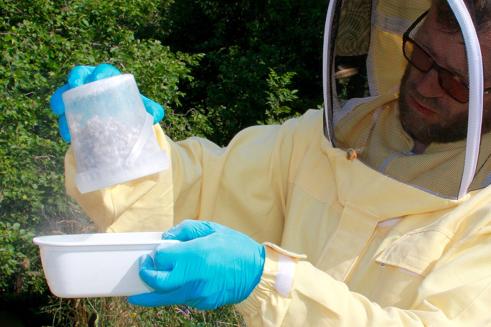

# Chapter 46 — Integrated Pest Management

## Introduction

Integrated pest management (IPM) is a decision system, not a single treatment. It combines prevention, surveillance, correct identification, biological understanding, action criteria, non-chemical controls, authorised chemical controls when needed, resistance management, verification, and records.

In beekeeping, IPM is especially valuable because the managed organism is itself an insect living in a wax-and-honey food-production system. A control that kills a target mite can also injure brood, contaminate wax, select for resistance, interfere with queens, expose the operator, or leave residues if used incorrectly.

A practical honey bee IPM cycle is:

1. prevent introduction and reduce favourable conditions;
2. monitor before visible damage;
3. identify the problem correctly;
4. interpret risk using current local guidance;
5. choose the least disruptive effective combination of controls;
6. apply authorised products exactly as directed when chemical control is required;
7. verify the result;
8. record performance and improve the next decision.

Varroa provides the clearest IPM example, but the same decision discipline applies to other parasites, pests, robbing, equipment-associated disease risk, and exotic-pest surveillance. Regulated diseases such as foulbrood are an important exception: statutory action may be required immediately and is not replaced by an ordinary economic-threshold decision.

## Learning Objectives

After completing this chapter, the reader should be able to:

- define integrated pest management in a honey bee context;
- distinguish prevention, monitoring, thresholds, intervention, and verification;
- explain why regulated disease controls can override ordinary IPM thresholds;
- build an annual surveillance plan;
- integrate genetic, cultural, mechanical, biological, and chemical tools;
- use brood interruption and colony manipulation strategically without assuming they are harmless;
- explain resistance selection and mode-of-action rotation;
- protect honey, wax, queens, brood, operators, and the environment during pest control;
- interpret treatment failure and reinvasion;
- use records to improve apiary-level decisions over time.

## 46.1 What IPM Is

IPM aims to keep harmful organisms below unacceptable levels while reducing unnecessary intervention and preserving effective control tools.

It does not mean:

- never using treatments;
- always using “natural” products;
- waiting until damage is visible;
- applying every available control at once;
- following the same calendar every year.

It means choosing interventions from evidence.

## 46.2 The IPM Hierarchy

A useful hierarchy is:

1. prevention;
2. surveillance and monitoring;
3. correct identification;
4. risk/action interpretation;
5. cultural and management controls;
6. genetic resistance;
7. mechanical/physical or biotechnical controls;
8. biological controls where validated and authorised;
9. selective chemical controls;
10. verification and resistance management.

The hierarchy is flexible. An urgent regulated pest or severe infestation may require rapid action at a higher level.

## 46.3 Prevention Comes First

Preventive measures can reduce future control pressure.

Examples include:

- buying traceable bees;
- avoiding unknown brood comb;
- quarantining or separately monitoring introductions where appropriate;
- maintaining colony IDs;
- preventing robbing;
- reducing drift;
- cleaning shared equipment;
- storing comb securely;
- maintaining adequate nutrition;
- using resistant bee stocks;
- keeping movement records.

Prevention is rarely perfect, but it reduces the frequency and severity of outbreaks.

## 46.4 Surveillance Versus Monitoring

The terms overlap but can be separated practically.

### Surveillance

Broadly asks whether a pest or disease is present and how it is distributed.

Example: checking for an exotic *Tropilaelaps* mite in a region where it is not established.

### Monitoring

Repeatedly measures a known problem to guide management.

Example: measuring Varroa infestation through the active season.

Both require standard methods and records.

## 46.5 Correct Identification

An IPM programme fails if the target is wrong.

Before intervention, determine whether the problem is:

- parasite;
- infectious disease;
- hive pest;
- predator;
- poison exposure;
- nutrition;
- queen failure;
- environmental stress.

A patchy brood pattern, for example, is not itself a pest identity.

## 46.6 Detection Before Damage

Waiting for obvious signs often increases both colony harm and treatment intensity.

Examples:

- visible deformed-wing bees can indicate advanced Varroa-virus pressure;
- an exotic mite is easier to contain before widespread distribution;
- a foulbrood case is easier to trace before contaminated frames are moved through an apiary.

Early monitoring expands management options.

## 46.7 Action Thresholds

An action threshold is a point at which intervention is justified because expected harm from continued pest pressure exceeds the cost or risk of control.

In honey bees, thresholds may depend on:

- pest identity;
- season;
- colony strength;
- brood level;
- climate;
- virus pressure;
- management goal;
- future monitoring interval;
- treatment availability.

Thresholds should be current and region-specific rather than memorised as permanent universal numbers.

## 46.8 Not Every Problem Uses a Threshold

Threshold logic is inappropriate when law requires action after detection or suspicion.

Examples can include:

- American foulbrood;
- European foulbrood in regulated jurisdictions;
- exotic small hive beetle in regions under eradication or exclusion;
- *Tropilaelaps* in regions where it is not established.

In these situations, regulatory definitions and competent-authority instructions govern the response.

## 46.9 Economic Threshold Versus Biological Threshold

Classical agricultural IPM often uses economic injury levels and economic thresholds.

Honey bee management adds complications:

- the colony is both livestock and pollination unit;
- treatment can contaminate food products;
- parasite-vector interactions can create delayed losses;
- a colony can spread mites or pathogens to neighbours;
- the value of pollination may exceed honey value;
- winter survival can depend on damage occurring months earlier.

A beekeeper therefore considers biological, legal, and operational risk, not only immediate honey revenue.

## 46.10 The Monitoring Calendar Is Biological

A calendar can remind the beekeeper to monitor, but biology determines risk.

Important triggers include:

- brood expansion;
- start of major nectar flow;
- end of major nectar flow;
- colony splitting;
- queen replacement;
- migration;
- neighbouring colony collapse;
- preparation of winter bees;
- post-treatment verification.

Use dates as reminders, not substitutes for observation.

## 46.11 Establishing Baselines

Before applying a control, record the starting condition.

A baseline can include:

- pest count;
- colony strength;
- brood area;
- queen status;
- stores;
- previous treatment;
- weather;
- clinical signs.

Without a baseline, treatment efficacy becomes difficult to distinguish from normal fluctuation.

## 46.12 Standardised Monitoring

Repeated measurements are most useful when the method is consistent.

Standardise:

- sample location;
- sample size;
- equipment;
- counting procedure;
- time interval;
- calculation;
- record format.

Changing methods without noting the change can create false trends.

*Photo 46.1 — Monitoring in practice. This field example shows a beekeeper using a powdered-sugar method to sample for Varroa while wearing protective clothing. The photograph illustrates one real monitoring workflow, not a universal preference for one sampling method. Record the colony ID, sample method, date, sample size and result separately so repeated measurements remain comparable. Photo by Jürg Vollmer, CC BY-SA 4.0.*

## 46.13 Sampling Error

Monitoring is an estimate.

Sources of error include:

- small samples;
- uneven pest distribution;
- wrong brood frame;
- seasonal movement of parasites;
- operator inconsistency;
- poor equipment;
- misidentification.

IPM responds to uncertainty by monitoring repeatedly rather than pretending one sample is perfect.

## 46.14 Cultural Controls

Cultural controls change management practices to make pest growth or transmission less favourable.

Examples include:

- colony splits;
- brood interruption;
- timing of queen replacement;
- management of drone brood;
- preventing robbing;
- reducing drift;
- cleaning dead-outs promptly;
- controlling comb exchange;
- managing colony density.

These controls can be powerful because they change pest biology without relying solely on pesticides.

## 46.15 Brood Interruption

Varroa reproduction requires capped brood. Temporarily interrupting brood production can therefore:

- reduce reproductive opportunities;
- expose a larger proportion of mites on adult bees;
- improve performance of controls that do not penetrate capped brood effectively.

Brood interruption can result from:

- splits;
- controlled queen caging;
- queen replacement;
- natural broodless periods.

It also reduces brood production and can affect colony strength, so timing matters.

## 46.16 Splits as an IPM Opportunity

Creating a split often produces a period with reduced or absent capped brood.

Recent research has shown that this biological window can be combined strategically with authorised mite controls to increase effectiveness in some systems.

The principle is important: coordinate treatment with pest vulnerability rather than applying controls without considering the life cycle.

## 46.17 Drone-Brood Management

Varroa often reproduces efficiently in drone brood.

Managed drone-brood removal can remove reproducing mites if:

- drone comb is deliberately provided or identified;
- it becomes capped;
- it is removed before adult drones and mites emerge;
- removed brood is handled hygienically;
- quantitative monitoring continues.

Failure to remove the brood on time can increase mite production.

## 46.18 Robbing Prevention as IPM

Robbing spreads:

- Varroa;
- AFB spores;
- EFB-associated contamination;
- viruses;
- other colony material.

Reduce robbing by:

- avoiding exposed honey;
- feeding without spills;
- reducing vulnerable entrances;
- closing weak/dead colonies;
- processing wet supers appropriately;
- avoiding long open-hive inspections during dearth.

## 46.19 Reducing Drift

Drifting moves bees and their associated parasites/pathogens between colonies.

Measures can include:

- varied entrance orientation;
- visual landmarks;
- non-uniform hive placement;
- appropriate spacing;
- avoiding unnecessarily dense straight rows where practical.

No layout eliminates drift completely.

## 46.20 Genetic Controls

Bee breeding can support IPM through traits such as:

- Varroa-sensitive hygiene;
- suppressed mite reproduction;
- grooming;
- hygienic removal of diseased brood;
- disease resistance;
- survival under local environmental conditions.

Genetic resistance reduces dependence on chemical control but should be verified under local conditions.

## 46.21 Selecting Resistant Stock

Ask suppliers:

- What trait is selected?
- How is it measured?
- Is performance documented?
- Under what climate and management system?
- Are colonies still monitored for Varroa?

Marketing terms such as “mite resistant” should not replace measurable evidence.

## 46.22 Mechanical and Physical Controls

These controls physically remove or disrupt pests.

Examples include:

- drone-brood removal;
- screened-floor mite collection as a supporting tool;
- trapping comb;
- controlled heat systems where validated and authorised;
- physical exclusion of some predators or pests.

Each method has labour, timing, and efficacy limitations.

## 46.23 Biological Controls

Biological control uses living organisms or biologically derived systems against a pest.

Research areas include:

- entomopathogenic fungi against mites;
- bacteriophages against bacterial pathogens;
- microbial antagonists;
- RNA-based biological technologies.

The term “biological” does not mean automatically safe, effective, or legally authorised.

## 46.24 Chemical Controls

Chemical controls remain important when monitoring shows that other measures are insufficient.

Good IPM chemical use requires:

- correct target identification;
- authorised product;
- appropriate timing;
- correct dose and placement;
- suitable temperature;
- attention to brood;
- honey-food restrictions;
- operator PPE;
- post-treatment verification.

Chemicals are tools inside the system, not the system itself.

## 46.25 Product Selection by Active Ingredient

Brand names change, but active ingredients and modes of action determine biological selection pressure.

Record both:

- commercial product;
- active ingredient.

This allows the beekeeper to recognise when two different brands actually apply the same selection pressure.

## 46.26 Mode of Action

Mode of action describes how a control affects the target organism.

Rotating brand names without changing mode of action may provide little resistance benefit.

Resistance management should use current guidance on cross-resistance and active-ingredient classes rather than a simple “different packet” rule.

## 46.27 Resistance Selection

Resistance evolves when treatment kills susceptible individuals more effectively than resistant ones and the survivors reproduce.

Selection pressure increases with:

- repeated use of one active ingredient;
- under-dosing;
- prolonged low-level exposure;
- illegal homemade delivery systems;
- treatment residues remaining beyond instructions;
- area-wide dependence on one chemistry.

## 46.28 Resistance Is an Apiary and Regional Problem

A resistant mite does not respect hive ownership.

Drifting and robbing can spread resistant mites between colonies and apiaries.

Resistance management therefore benefits from coordination among neighbouring beekeepers, inspectors, researchers, and industry.

## 46.29 Treatment Rotation

Rotation can delay resistance when:

- products are effective;
- active ingredients have genuinely different relevant modes of action;
- cross-resistance is considered;
- each product is used according to label;
- non-chemical controls reduce overall chemical exposure.

Rotation cannot restore a product that has already failed badly in a resistant local population without evidence.

## 46.30 Combination Treatments

Combining products can create:

- additive efficacy;
- toxicity;
- residue problems;
- unknown interactions;
- conflicting label requirements.

Do not combine treatments unless the combination is explicitly authorised or directed by competent veterinary/regulatory guidance.

## 46.31 Timing Is Part of Efficacy

A good product at the wrong time can fail.

Timing depends on:

- pest life cycle;
- brood status;
- temperature;
- nectar flow;
- honey supers;
- colony strength;
- reinvasion risk;
- weather forecast.

IPM seeks the window when the target is vulnerable and collateral risk is acceptable.

## 46.32 Treatment Windows and Brood

Controls that mainly affect mites on adult bees perform differently when most mites are under brood cappings.

A broodless or brood-reduced period can create a higher-exposure window.

The beekeeper should therefore record brood status with every treatment.

## 46.33 Temperature and Weather

Some registered products depend strongly on ambient temperature.

Too cold may reduce release or activity. Too hot may increase queen, brood, or adult-bee stress.

Use the expected temperature across the full treatment interval.

## 46.34 Honey and Food Safety

Before treatment, verify:

- honey-super restrictions;
- withdrawal period;
- residue limits;
- wax implications;
- product storage;
- disposal rules.

IPM includes food safety as a core outcome.

## 46.35 Operator Safety

Controls can involve acids, pesticide residues, heat, vapours, sharp equipment, and heavy hive manipulation.

Use:

- label-specified PPE;
- safe mixing/handling procedures;
- adequate ventilation;
- original containers;
- secure storage;
- emergency first-aid information.

Never trade beekeeper safety for faster treatment.

## 46.36 Non-Target Effects

A control can affect:

- queen;
- brood;
- adult workers;
- drones;
- beneficial hive-associated organisms;
- wax microbiota;
- surrounding arthropods;
- human consumers.

“Low toxicity to the target host” and “no non-target effect” are different claims.

## 46.37 Treatment Failure

After poor control, investigate:

- wrong diagnosis;
- inadequate application;
- temperature;
- expired or degraded product;
- resistance;
- heavy protected brood;
- insufficient duration;
- missed colonies;
- rapid reinvasion;
- calculation error.

Do not automatically increase dose.

## 46.38 Verification

Every significant control action should have a defined success measure.

Examples:

- post-treatment Varroa wash;
- repeat pest inspection;
- laboratory confirmation after disease-control programme;
- reduction in hive-beetle trapping index;
- no new exotic-pest detections after official surveillance.

Verification turns treatment into evidence.

## 46.39 Before-and-After Comparison

A strong record includes:

- pre-control measurement;
- intervention;
- application conditions;
- post-control measurement;
- adverse effects;
- later recurrence or reinvasion.

This allows methods to be compared across years.

## 46.40 Area-Wide Effects

Honey bee colonies interact over kilometres through foraging, drifting, robbing, swarm movement, and beekeeper transport.

One unmanaged collapsing Varroa colony can become a mite source for several managed colonies.

Area-wide programmes aim to coordinate:

- monitoring periods;
- control timing;
- resistance surveillance;
- education;
- movement information.

## 46.41 Quarantine and Introduction Management

New bees can introduce:

- Varroa;
- Tropilaelaps where present;
- tracheal mites;
- viruses;
- bacterial disease;
- small hive beetle or other pests.

An introduction protocol can include:

- traceable source;
- movement documents;
- initial examination;
- Varroa baseline;
- temporary segregation where feasible;
- follow-up monitoring before sharing frames.

## 46.42 Exotic Pest Detection

When an exotic regulated organism is suspected, ordinary IPM thresholds stop being the main decision tool.

The response becomes:

1. preserve specimen/evidence;
2. stop unnecessary movement;
3. identify colony and apiary;
4. notify competent authority;
5. follow official containment and tracing.

Examples can include exotic *Tropilaelaps* or small hive beetle depending on jurisdiction.

## 46.43 Disease Within an IPM Framework

Some infectious diseases can be reduced through IPM-like prevention:

- hygienic stock;
- biosecurity;
- comb management;
- nutrition;
- surveillance;
- movement control.

However, notifiable disease law can require specific actions regardless of an economic threshold.

IPM does not override statutory disease control.

## 46.44 Small Hive Beetle Example

Where small hive beetle is established, management can combine:

- strong colonies;
- reduced unused comb space;
- rapid honey extraction;
- clean apiary practices;
- mechanical trapping;
- authorised soil or hive treatments where legal;
- monitoring.

Where the beetle is exotic, detection may instead trigger official reporting and containment.

The same organism can therefore require a different IPM decision in a different jurisdiction.

## 46.45 Wax Moth Example

Wax moths often exploit weak or unoccupied comb rather than causing primary collapse of a strong colony.

Prevention can include:

- maintaining strong colonies;
- removing abandoned comb;
- protecting stored supers;
- freezing or other physical treatment where appropriate;
- maintaining dry ventilated storage where compatible with the local system.

Correctly identifying the underlying colony weakness prevents treating a secondary scavenger as the primary cause.

## 46.46 Predator Example

Hornets or wasps may require:

- entrance management;
- apiary-site changes;
- trapping only where effective and lawful;
- nest management by competent authorities;
- species identification, especially where invasive species are regulated.

Broad indiscriminate trapping can kill non-target insects and should not be assumed to be good IPM.

## 46.47 Pesticide Exposure Is Not a Hive Pest

Agricultural pesticide poisoning is an environmental exposure, not a pest infestation.

Its management centres on:

- communication with growers;
- incident documentation;
- sample preservation;
- exposure reduction;
- formal reporting;
- regulatory investigation.

Do not apply a hive pesticide to solve an external pesticide exposure.

## 46.48 Monitoring Technology

Emerging tools include:

- electronic scales;
- acoustic sensors;
- temperature sensors;
- computer vision;
- automated mite counters;
- molecular environmental sampling;
- machine-learning risk models.

Technology can increase observation frequency but must be validated against biological ground truth.

## 46.49 Precision Apiculture

Precision apiculture uses colony-specific data to target interventions more accurately.

Potential benefits include:

- reducing unnecessary treatments;
- identifying high-risk colonies early;
- comparing queen lines;
- improving labour efficiency;
- tracking treatment performance.

Data quality and calibration remain essential.

## 46.50 Avoiding Calendar Dependence

A fixed annual treatment date can be convenient but may fail when:

- spring begins early;
- brood continues through winter;
- migration changes exposure;
- nectar flow shifts;
- reinvasion occurs;
- resistance changes product performance.

Use calendar reminders to trigger monitoring, not automatic treatment.

## 46.51 Treatment-Free Claims

Some bee populations and selected stocks survive Varroa with reduced or no acaricide use. Other untreated, non-resistant colonies experience high loss.

“Treatment-free” is therefore not a single biological condition.

A responsible programme must distinguish:

- documented resistant stock;
- active selection with monitoring and mitigation;
- unmanaged cessation of control.

Do not stop monitoring because a philosophy replaces data.

## 46.52 IPM and Commercial Beekeeping

Commercial operations face additional constraints:

- thousands of colonies;
- pollination schedules;
- labour;
- transport;
- treatment synchronisation;
- marketable honey;
- resistance across large mite populations.

IPM must be operationally practical as well as biologically sound.

Sampling plans, treatment windows, and area-wide coordination become especially important.

## 46.53 IPM and Small Apiaries

Small-scale beekeepers have advantages:

- individual-colony monitoring is feasible;
- queen lines can be tracked precisely;
- brood manipulation can be customised;
- detailed records are manageable.

The main risk is neglecting monitoring because there are only a few colonies.

## 46.54 Cost of Control

IPM considers more than product price.

Costs include:

- labour;
- equipment;
- queen loss;
- brood interruption;
- lost honey production;
- residue risk;
- treatment failure;
- resistance development;
- colony replacement.

A cheap ineffective control can be the most expensive option.

## 46.55 Choosing Between Controls

Compare options by:

- efficacy;
- evidence quality;
- legal status;
- target specificity;
- brood compatibility;
- temperature range;
- food-safety compatibility;
- resistance risk;
- operator safety;
- labour;
- cost;
- verification method.

## 46.56 IPM Decision Table

| Situation | IPM interpretation | Response principle |
|---|---|---|
| Low measured Varroa under current local guidance | Below present action level | Continue scheduled monitoring |
| Rising Varroa approaching risk period | Preventive window closing | Prepare timely combined control |
| High Varroa with much capped brood | Many mites protected in brood | Select strategy that accounts for brood biology |
| Treatment completed, high post-count | Failure/reinvasion possible | Diagnose cause before repeating chemistry |
| Suspected AFB | Regulated disease possibility | Stop movement and follow official requirements |
| Unusual fast elongated mite in non-endemic area | Possible exotic *Tropilaelaps* | Preserve specimen and notify authority |
| Wax moth in abandoned dead-out | Secondary scavenger | Diagnose why colony failed and protect stored comb |
| Sudden mass adult mortality after nearby spray | Environmental exposure | Preserve evidence; use incident-reporting pathway |

## 46.57 Building an Annual IPM Plan

### Step 1 — List local hazards

Include established and exotic threats.

### Step 2 — Define monitoring method

Specify how and when each important threat will be assessed.

### Step 3 — Define action rules

Use current official or scientifically supported guidance.

### Step 4 — List control options

Separate cultural, genetic, mechanical, biological, and authorised chemical tools.

### Step 5 — Identify constraints

Honey flow, temperature, labour, queen availability, movement, and law.

### Step 6 — Define verification

Every intervention needs a success measure.

### Step 7 — Review annually

Use records to update the plan.

## 46.58 Record Structure

For each colony or management group, record:

- ID;
- date;
- pest/disease target;
- monitoring method;
- raw result;
- calculated measure;
- action threshold source;
- intervention;
- active ingredient/method;
- weather;
- brood status;
- honey-super status;
- post-control result;
- adverse effects;
- next monitoring date.

## 46.59 Auditing the Programme

At the end of the season, ask:

- Which colonies repeatedly exceeded thresholds?
- Which queen lines required fewer interventions?
- Which treatments failed?
- Did resistance appear possible?
- Were there residue or safety problems?
- Which monitoring periods were missed?
- Which manipulations reduced production excessively?
- Did any untreated neighbouring source drive reinvasion?

An IPM programme should improve with every season.

## 46.60 Common Mistakes

### Treating before identifying

Wrong target, wrong control.

### Treating by calendar only

Biology changes.

### Using “natural” as a safety test

Natural acids and oils can injure bees and people.

### Rotating brands instead of modes of action

Resistance pressure may remain unchanged.

### Skipping verification

Treatment application is not evidence of success.

### Ignoring legal disease obligations

Thresholds do not override reporting law.

### Ignoring neighbours

Drift and robbing make Varroa an area-wide problem.

## 46.61 Scientific Notes

### IPM is adaptive

The core of IPM is feedback. Monitoring informs control, and verification informs the next round of monitoring and control.

### Selection pressure

Every effective pesticide changes the genetic composition of the surviving pest population. Combining non-chemical methods with careful chemical use can reduce dependence on one selection pressure.

### Life-cycle synchronisation

The 2025 study of newly split colonies illustrates an IPM principle: a cultural control that creates a brood break can make mites biologically more exposed to a subsequent authorised control.

### Thresholds can change

The 2026 Honey Bee Health Coalition guide updated Varroa threshold guidance. Current resistance reviews also argue for flexible thresholds as mite-virus risk and control performance evolve. A good handbook therefore teaches interpretation rather than fossilising one number.

### Area-wide ecology

Honey bee pest management cannot be understood strictly at the individual-hive scale. Bees fly, drift, rob, swarm, and are transported, creating a connected landscape of parasite and pathogen movement.

## 46.62 Practical IPM Checklist

- [ ] Local established and exotic hazards are listed.
- [ ] Every colony or management group is identifiable.
- [ ] Monitoring methods are defined before the season.
- [ ] Results are recorded quantitatively where possible.
- [ ] Target organism is correctly identified.
- [ ] Current action guidance is checked.
- [ ] Statutory disease rules are separated from ordinary thresholds.
- [ ] Non-chemical controls are considered first where effective.
- [ ] Resistant stock is evaluated using evidence.
- [ ] Brood biology is considered before mite control.
- [ ] Product is authorised.
- [ ] Active ingredient and mode of action are recorded.
- [ ] Cross-resistance is considered.
- [ ] Honey and temperature restrictions are checked.
- [ ] PPE is prepared.
- [ ] Post-control verification is scheduled.
- [ ] Reinvasion is considered.
- [ ] Treatment failures are investigated rather than simply repeated.
- [ ] Records are reviewed at season end.
- [ ] Next year's plan is updated from evidence.

## Key Takeaways

- IPM is a continuous decision cycle rather than a treatment list.
- Prevention, monitoring, correct identification, and verification are as important as intervention.
- Thresholds are pest-, season-, region-, and management-specific.
- Notifiable disease and exotic-pest law can override ordinary threshold logic.
- Cultural controls such as brood interruption can exploit pest biology.
- Resistant stock can reduce treatment dependence but does not eliminate monitoring.
- Chemical controls remain useful when they are authorised, correctly timed, and verified.
- Resistance management depends on active ingredient, mode of action, cross-resistance, and reduced unnecessary exposure.
- Honey safety, operator safety, and non-target effects are core IPM outcomes.
- Good records transform individual treatments into a learning system.

## Chapter Summary

Integrated pest management combines biological knowledge with measurement. The beekeeper first prevents avoidable introductions, monitors important threats, identifies the organism correctly, and interprets risk using current guidance. Intervention then combines the least disruptive effective cultural, genetic, mechanical, biological, and authorised chemical controls.

Varroa demonstrates the power of this approach. Brood interruption, resistant stock, drone-brood removal, robbing reduction, quantitative monitoring, and well-timed registered acaricides can be integrated so that no single control bears the entire burden. This reduces treatment frequency, slows resistance selection, and provides alternative options when one product fails.

IPM is not universal threshold management. Regulated AFB, EFB, exotic *Tropilaelaps*, or small hive beetle can require official action immediately. Nor does IPM mean avoiding chemicals at all costs. It means using every tool according to evidence, law, food safety, target biology, and measured need.

The final step is verification. A post-treatment sample, follow-up inspection, or laboratory result closes the feedback loop. Records then allow the beekeeper to identify recurring high-risk colonies, resistant queen lines, failing products, reinvasion patterns, and better management windows. An IPM programme should become more precise with every season.

## Review Questions

1. What is integrated pest management?
2. Why is IPM not a single treatment?
3. What are the main steps in an IPM cycle?
4. Why is beekeeping IPM different from treating pests on a non-food structure?
5. What does prevention include?
6. Why are traceable bee purchases important?
7. What is the difference between surveillance and monitoring?
8. Give an example of exotic-pest surveillance.
9. Give an example of repeated monitoring for an established parasite.
10. Why is correct identification essential?
11. Why is patchy brood not a pest identity?
12. What is the advantage of detecting a problem before visible damage?
13. What is an action threshold?
14. Which factors can change a Varroa action threshold?
15. Why should thresholds not be memorised as universal numbers?
16. Which disease situations can override threshold logic?
17. Why is AFB not simply an economic-threshold problem?
18. What is an economic injury level in classical IPM?
19. Why is immediate honey revenue an incomplete measure of bee-health risk?
20. How can pollination value affect management decisions?
21. Why should a monitoring calendar follow biology?
22. Name four biological events that should trigger monitoring.
23. What is a baseline?
24. Why is a pre-treatment baseline valuable?
25. Which parts of monitoring should be standardised?
26. How can changing sampling method create a false trend?
27. What is sampling error?
28. Why does IPM use repeated monitoring?
29. What are cultural controls?
30. Name four cultural controls used in beekeeping.
31. Why does brood interruption affect Varroa?
32. What are the possible costs of brood interruption?
33. How can splitting a colony create an IPM opportunity?
34. What principle is illustrated by combining a brood break with a suitable authorised control?
35. Why can drone-brood removal reduce Varroa?
36. What happens if infested drone brood is allowed to emerge?
37. Why is robbing prevention part of IPM?
38. Which pathogens or parasites can move during robbing?
39. How can apiary layout reduce drifting?
40. Can drift be eliminated completely?
41. What are genetic controls?
42. Name three resistance traits relevant to Varroa.
43. What should a buyer ask about “mite-resistant” stock?
44. Why does resistant stock not eliminate monitoring?
45. What are mechanical or physical controls?
46. Give two examples of physical or mechanical controls.
47. What is biological control?
48. Why does “biological” not automatically mean safe?
49. When do chemical controls fit within IPM?
50. What checks belong before chemical treatment?
51. Why should active ingredient be recorded as well as product name?
52. What is mode of action?
53. Why can rotating brand names fail to manage resistance?
54. What is resistance selection?
55. Which practices can increase selection pressure?
56. Why can under-dosing promote resistance?
57. How can resistant mites spread between apiaries?
58. What makes resistance an area-wide problem?
59. When can treatment rotation help?
60. What is cross-resistance?
61. Why should unauthorised product combinations be avoided?
62. Why is timing part of treatment efficacy?
63. How does capped brood change exposure of mites to some controls?
64. Why should brood status be recorded?
65. How can temperature affect a registered product?
66. Why should the forecast cover the whole treatment interval?
67. Which food-safety checks precede treatment?
68. Why are honey-super restrictions part of IPM?
69. What operator hazards may occur during mite treatment?
70. What are non-target effects?
71. Why is low bee toxicity not the same as zero environmental effect?
72. What should be investigated after treatment failure?
73. Why should dose not automatically be increased after failure?
74. What is verification?
75. Give three examples of post-control verification.
76. Why is a before-and-after comparison useful?
77. What is an area-wide effect?
78. How can one collapsing colony affect neighbouring Varroa levels?
79. What can area-wide programmes coordinate?
80. What should an introduction protocol include?
81. Why can new bees introduce more than Varroa?
82. What should happen after suspected exotic-pest detection?
83. Why does IPM not override statutory disease control?
84. How can small hive beetle management differ between endemic and exotic regions?
85. Why are wax moths often secondary pests?
86. What should be investigated when wax moths overwhelm a dead-out?
87. Why can indiscriminate predator trapping harm IPM goals?
88. Why is pesticide poisoning not a hive-pest infestation?
89. What can monitoring technology add?
90. Why must electronic sensors be validated biologically?
91. What is precision apiculture?
92. Why is a fixed calendar treatment programme fragile?
93. What distinctions are required when discussing “treatment-free” beekeeping?
94. Why can small apiaries perform detailed individual-colony monitoring?
95. What costs besides product price belong in an IPM decision?
96. What criteria should be used to compare controls?
97. What are the steps for building an annual IPM plan?
98. Which data belong in an IPM record?
99. What questions should be asked during a season-end audit?
100. What makes an IPM programme improve over time?

## References

- Honey Bee Health Coalition. *Tools for Varroa Management: A Guide to Effective Varroa Sampling & Control*, 9th ed., 2026.
- COLOSS. “Varroa Control” Task Force resources and current sustainable-management programme. Accessed 15 September 2026.
- Bahreini, R., and Morfin, N. “The growing challenge of Varroa destructor resistance to acaricides: seeking sustainable solutions.” *Current Opinion in Insect Science* 78, 2026, 101568. DOI: 10.1016/j.cois.2026.101568.
- Aurell, D., Bruckner, S., Steury, T. D., and Williams, G. R. “Treating newly split Apis mellifera honey bee colonies with organic miticides—an opportunity for Integrated Pest Management of Varroa destructor mites.” *Journal of Economic Entomology* 118(4), 2025, 1495–1503. DOI: 10.1093/jee/toaf126.
- O'Connell, D. P. et al. “A systematic meta-analysis of the efficacy of treatments for a global honey bee pathogen — the Varroa mite.” *Science of the Total Environment* 963, 2025, 178228. DOI: 10.1016/j.scitotenv.2024.178228.
- “Integrated Pest Management Control of Varroa destructor, the Most Damaging Pest of Apis mellifera Colonies.” *Journal of Insect Science* 21(5), 2021, 6.
- USDA Agricultural Research Service. Current Varroa IPM and resistant-honey-bee research programmes, including area-wide management initiatives. Accessed 15 September 2026.
- World Organisation for Animal Health. Current honey bee disease and infestation standards. Accessed 15 September 2026.
- Current national veterinary-medicine, pesticide, food-safety and bee-health authorities. Product registration, thresholds, regulated-disease controls, residue requirements and operator-safety rules must be verified for the reader’s jurisdiction.