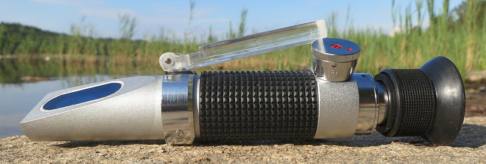

# Chapter 48 — Honey Harvesting

## Introduction

Harvesting honey is the point where apiary management becomes food handling. Until a super is removed, the colony controls most of the product environment. From the moment a frame leaves the hive, the beekeeper becomes responsible for protecting the honey from excess moisture, dirt, chemicals, smoke, pests, foreign materials, overheating, fermentation, and loss of traceability.

A good harvest answers four questions before the first super is lifted:

1. **Is the honey mature enough for the intended market and storage period?**
2. **Is the crop free from treatment, contamination, and brood-related restrictions?**
3. **Can the bees be removed without creating robbing, excessive stress, or food-safety problems?**
4. **Can the supers be transported into a clean extraction system while preserving lot identity?**

Capped comb is useful evidence of ripening, but capping is not a laboratory measurement. Uncapped honey can sometimes be sufficiently low in moisture, while recently capped honey can occasionally remain wetter than expected. The practical tool that resolves uncertainty is representative moisture measurement with a properly used refractometer.

Legal composition limits must also be separated from conservative harvest targets. For example, the consolidated EU honey rules applicable from 14 June 2026 set a general maximum moisture content of 20% for honey placed on the market, with specific exceptions such as heather and certain baker's honey categories. Codex likewise uses a general maximum of 20% for most honey. A legal maximum is not an instruction to harvest every lot at that value. Fermentation risk, storage temperature, yeast load, market specification, floral type, and shelf-life objective all matter.

## Learning Objectives

After completing this chapter, the reader should be able to:

- determine whether honey supers are ready for harvest using multiple indicators;
- explain why capping percentage alone is an imperfect maturity test;
- use a honey refractometer correctly and understand calibration limitations;
- take representative moisture samples from frames and lots;
- distinguish legal moisture limits from conservative operational targets;
- recognise fermentation risk and high-moisture warning signs;
- choose suitable bee-removal methods and understand their limitations;
- prevent robbing during harvest;
- protect honey from veterinary medicines, smoke, fuel, dust, rain, brood contamination, and foreign materials;
- maintain lot traceability from apiary to extraction room.

## 48.1 What Makes Honey Ready to Harvest?

Harvest readiness combines:

- sufficient ripening;
- acceptable moisture;
- absence of brood in the harvest comb;
- compliance with treatment restrictions;
- suitable crop identity where varietal separation is intended;
- practical weather and transport conditions;
- sufficient colony stores remaining for the bees.

A super can be physically full but still unsuitable for immediate harvest.

## 48.2 Capping as a Ripeness Indicator

Bees often cap honey after reducing moisture to a level suitable for storage under colony conditions.

A frame with most cells capped is therefore a strong practical indicator of maturity.

However, capping is influenced by:

- nectar source;
- colony behaviour;
- humidity;
- comb position;
- local climate;
- speed of a heavy flow.

Use capping as evidence, not as the only test.

## 48.3 Uncapped Honey

Uncapped cells may contain:

- very dilute fresh nectar;
- partly ripened nectar;
- fully ripened honey not yet capped.

The appearance alone does not distinguish these reliably.

If a frame contains substantial uncapped honey and the crop is intended for storage or sale, measure moisture rather than guessing.

## 48.4 The Traditional Shake Test

Some beekeepers tip a frame and shake it sharply. If liquid nectar sprays out, the frame is clearly not ready.

The test can identify very watery nectar but has serious limitations:

- failure to shake out does not prove safe moisture;
- vigorous shaking can spill product;
- it can trigger robbing;
- it is subjective;
- it cannot quantify a borderline lot.

Use a refractometer for decisions that matter.

## 48.5 Why Moisture Matters

Honey's low water availability helps inhibit many microorganisms. As water content rises, osmotolerant yeasts have a better opportunity to grow and ferment sugars.

Fermentation can produce:

- gas;
- frothing;
- sour or alcoholic odour;
- flavour change;
- container pressure;
- product downgrade or loss.

Moisture is therefore a food-quality and economic parameter, not merely a legal number.

## 48.6 Legal Maximum Versus Operational Target

The legal maximum for a market describes what may be sold under that legal standard. It is not necessarily the best storage target.

Many beekeepers and packers choose lower internal moisture specifications to increase shelf stability. The appropriate target depends on:

- floral source;
- intended storage period;
- storage temperature;
- yeast count;
- customer or processor specification;
- local legal standard.

Do not confuse “complies with the maximum” with “optimised for long-term stability”.

## 48.7 Current EU Example

Under the consolidated EU honey rules applicable from 14 June 2026:

- honey in general: not more than 20% moisture;
- heather (*Calluna*) honey and baker's honey in general: not more than 23%;
- baker's honey from heather: not more than 25%.

These are market composition criteria, not universal recommendations for when every beekeeper should harvest.

Other countries may use Codex values directly or have national standards.

## 48.8 Refractometer Principle

A refractometer measures how light bends as it passes through a sample. The refractive index changes with dissolved solids and water content.

Honey refractometers are usually calibrated to display moisture percentage directly or through a honey-specific scale.

A refractometer is only as good as:

- calibration;
- sample quality;
- temperature compensation;
- clean optical surfaces;
- correct reading technique.

## 48.9 Optical Versus Digital Refractometers

### Optical refractometers

Advantages:

- no battery required;
- durable;
- relatively inexpensive.

Limitations:

- subjective boundary reading;
- dependence on good light;
- small scale markings.

### Digital refractometers

Advantages:

- easy numerical reading;
- reduced operator interpretation;
- some models include automatic temperature compensation.

Limitations:

- battery dependence;
- electronic calibration requirements;
- model-specific range and accuracy.

Both can work well when maintained correctly.

*Photo 48.2 — Portable honey refractometer. This optical instrument is designed for honey moisture measurement. The photograph identifies the equipment only: accurate results still depend on correct calibration, a clean dry prism, a representative sample, suitable temperature conditions and correct reading technique. Photo by R. Henrik Nilsson, CC BY 4.0.*

## 48.10 Calibration

Follow the instrument manufacturer's calibration procedure.

Depending on the model, calibration may use:

- a supplied reference fluid;
- a certified refractive-index standard;
- another specified calibration medium.

Do not assume distilled water is an appropriate honey-refractometer calibration standard unless the manufacturer specifically says so.

## 48.11 Automatic Temperature Compensation

ATC compensates for the instrument's temperature response within its specified range. It does not magically correct every sample problem.

For reliable readings:

- allow instrument and sample to equilibrate where recommended;
- avoid reading a hot sample on a cold prism;
- stay within the device's operating range;
- follow manufacturer instructions.

## 48.12 Cleaning the Prism

Between samples:

1. remove honey with a soft clean material;
2. use the manufacturer's permitted cleaning method;
3. avoid scratching the prism;
4. dry before the next sample;
5. prevent water droplets from diluting the next honey sample.

A wet prism can create an artificially high moisture reading.

## 48.13 Representative Sampling

The largest error may come not from the refractometer but from the sample.

A super can contain:

- wetter outer frames;
- drier central frames;
- capped and uncapped areas;
- nectar from different days;
- different floral sources.

One drop from one convenient cell may not represent the lot.

## 48.14 Frame-Level Sampling

For a questionable frame:

- select more than one area;
- include uncapped areas if they will be extracted;
- avoid cells contaminated by rain, syrup, or brood;
- compare readings.

Large variation indicates that the frame is not homogeneous.

## 48.15 Lot-Level Sampling

For a batch of supers, a better approach is to sample multiple representative frames from different boxes and positions.

The sampling plan should become more rigorous when:

- the lot is large;
- moisture is close to a legal or commercial limit;
- honey will be stored for a long period;
- multiple apiaries are blended;
- a buyer specifies a maximum.

## 48.16 Mixing and Composite Samples

A composite sample can estimate the average moisture of a blended lot, but an average can hide very wet pockets.

Before extraction, high-moisture frames may need to be segregated rather than relying on dilution by drier honey.

Do not intentionally blend non-compliant honey with compliant honey merely to meet a legal maximum.

## 48.17 Fermentation Risk Is Continuous

There is no single moisture value at which every honey suddenly changes from safe to fermenting.

Risk increases with:

- water availability;
- osmotolerant yeast numbers;
- warm storage;
- long storage;
- contamination;
- previous fermentation.

Lower moisture generally provides a larger safety margin.

## 48.18 Honey Hygroscopicity

Honey absorbs moisture from humid air.

Exposed honey can therefore become wetter after it leaves the hive.

Risk is increased by:

- uncapped supers left overnight in a damp room;
- open tanks;
- wet floors;
- washing equipment while honey is exposed;
- high relative humidity;
- condensation.

The extraction room should be dry as well as clean.

## 48.19 Harvesting in Rain

Harvesting during rain increases risk because:

- open supers can be wetted;
- humidity is high;
- transport covers drip;
- floors and equipment become wet;
- robbing behaviour may change when weather clears.

If harvest must occur, protect supers from direct water immediately.

## 48.20 Morning Versus Afternoon Harvest

Moisture distribution can change during the day as colonies receive fresh nectar.

During a strong flow, afternoon frames may contain newly collected dilute nectar even when older honey is ripe.

The best timing depends on:

- current flow;
- crop type;
- weather;
- intended lot.

Measure rather than assuming one time of day is always superior.

## 48.21 End of Flow

Waiting briefly after a nectar flow can allow bees to finish ripening remaining nectar, but waiting too long can introduce other problems:

- colonies consume surplus;
- robbing increases;
- a new floral source begins;
- weather deteriorates;
- wax moth or other storage risks arise after removal.

Harvest timing is a balance.

## 48.22 Leaving Enough Honey for the Colony

Not every stored frame is surplus.

Before harvest, estimate colony needs based on:

- season;
- climate;
- colony strength;
- brood;
- expected next forage;
- overwintering plan;
- hive type.

Taking food that must immediately be replaced with syrup can be poor management unless it serves a deliberate objective.

## 48.23 Harvest Only Broodless Honey Comb

Comb containing brood should not be extracted as ordinary food honey.

Reasons include:

- brood contamination;
- cocoons and larval material;
- higher debris load;
- possible medicine residues from brood-nest treatments;
- food-hygiene concerns.

EU definitions of comb, drained, and extracted honey specifically refer to broodless comb in relevant product categories.

## 48.24 Queen Excluders and Harvest Boundaries

Queen excluders can help keep brood out of honey supers, but they are not a substitute for inspection.

A queen may enter supers if:

- an excluder is absent;
- equipment is damaged;
- colony manipulation bypasses it;
- brood was present before placement.

Check frames before extraction.

## 48.25 Veterinary Medicine Restrictions

Before harvesting any super, verify treatment records.

Check:

- active ingredient;
- product label;
- whether supers were present;
- withdrawal period;
- treated-box restrictions;
- local legal requirements.

A honey crop must not be used to hide a treatment-record failure.

## 48.26 Pesticide or Chemical Contamination

Do not harvest honey suspected of contamination by:

- agricultural pesticides;
- fuel;
- solvents;
- cleaning chemicals;
- smoke taint;
- firefighting chemicals;
- floodwater;
- unapproved hive treatments.

Segregate the lot and seek competent food-safety or laboratory advice.

## 48.27 Smoke Use During Harvest

Smoke is useful for controlling bees but excessive smoke can contaminate honey aroma.

Use:

- clean, suitable smoker fuel;
- the minimum smoke needed;
- no painted, treated, plastic, oily, or chemically contaminated fuel;
- controlled application away from exposed honey surfaces.

## 48.28 Bee-Removal Methods

Common methods include:

- bee escapes;
- brushing;
- shaking;
- blowers;
- carefully managed repellents where legally permitted and food-safe.

No method is best for every operation.

## 48.29 Bee Escapes

A bee escape allows bees to leave a super while limiting return.

Advantages:

- quiet;
- minimal mechanical stress;
- little direct honey exposure.

Limitations:

- requires an additional apiary visit;
- performance depends on correct placement and bee-tight equipment;
- can fail if brood is present above the escape;
- supers can cool or become vulnerable if left too long.

## 48.30 Brushing Bees

Brushing works well for small numbers of frames.

Use a clean food-compatible bee brush or suitable soft tool.

Limitations include:

- labour;
- bee agitation;
- contamination if the brush contacts soil or dirty surfaces;
- risk of damaging bees.

Keep one brush dedicated to clean honey work.

## 48.31 Shaking Bees

A sharp controlled shake can remove many bees from a frame.

It is most practical when:

- comb is structurally strong;
- the frame is not excessively heavy or soft;
- weather is suitable;
- bees can return safely to the colony.

Avoid violent handling of new natural comb.

## 48.32 Bee Blowers

Commercial operators may use blowers to remove bees rapidly.

Advantages:

- speed;
- large-scale efficiency.

Risks and limitations:

- noise;
- bee injury if airflow is excessive;
- dust or exhaust contamination;
- dependence on equipment hygiene and design.

Combustion-engine exhaust must never be directed onto food-contact surfaces or honey.

## 48.33 Chemical Bee Repellents

Some jurisdictions permit particular bee-repellent products for harvest, while others restrict or discourage them.

Only use a product that is:

- authorised for the intended use;
- compatible with food production;
- applied exactly as directed.

Do not improvise household chemicals, solvents, or fragrances as bee repellents.

## 48.34 Harvesting Without Starting Robbing

Robbing can begin within minutes when honey is exposed during a dearth.

Prevent it by:

- keeping removed supers covered;
- closing vehicles and storage rooms;
- avoiding dripping frames;
- keeping cappings and broken comb sealed;
- shortening open-hive time;
- cleaning spills immediately.

## 48.35 Covering Supers

Use clean, food-compatible covers above and below harvested supers.

Covers protect from:

- bees;
- dust;
- road debris;
- rain;
- fuel vapour;
- animals.

Do not place food supers directly on soil, grass, vehicle floors, or dirty pallets.

## 48.36 Transport Vehicles

A honey transport vehicle should be:

- clean;
- dry;
- free from chemicals and fuel leakage;
- protected from rain;
- secured against load shift;
- separated from livestock or dirty materials.

The same van that carried pesticides, waste, or fuel may require thorough cleaning or may be unsuitable for food transport.

## 48.37 Manual Handling

A full honey super can be very heavy.

Reduce injury risk by:

- using smaller boxes where appropriate;
- lifting with stable footing;
- keeping the load close to the body;
- avoiding twisting while carrying;
- using trolleys or mechanical aids;
- working in pairs for awkward loads.

Back injuries can end a beekeeping season faster than a weak nectar flow.

## 48.38 Hive-Stand and Ground Hazards

Harvest often involves carrying heavy boxes while wearing a veil and moving among bees.

Before lifting, check:

- holes;
- loose straps;
- wet grass;
- uneven stands;
- tools on the ground;
- vehicle access;
- livestock hazards.

Clear the route first.

## 48.39 Heat Exposure During Transport

Honey supers left in a closed hot vehicle can experience high temperatures.

Excess heat can:

- soften comb;
- cause collapse;
- leak honey;
- increase quality degradation;
- intensify aroma loss.

Unload promptly into a controlled environment.

## 48.40 Cold Honey

Cold honey is highly viscous and difficult to extract.

Harvested supers can be held in a clean, dry, moderately warm environment before extraction where necessary.

Avoid excessive heat. The objective is to reduce viscosity without damaging quality.

## 48.41 Traceability Begins at the Apiary

A lot should be identifiable before supers are mixed.

Useful harvest records include:

- apiary ID;
- colony or group ID where needed;
- harvest date;
- super numbers or count;
- floral source claim if intended;
- treatment status;
- moisture sample results;
- unusual events;
- destination extraction batch.

## 48.42 Lot Definition

A lot can be defined by the operator according to a consistent traceability system, subject to legal requirements.

Possible lot boundaries include:

- one apiary and harvest date;
- one floral crop;
- one extraction run;
- one storage tank.

The larger the lot, the greater the impact if a quality problem is later found.

## 48.43 Mixing Apiaries

Combining honey from several apiaries can simplify processing but reduces traceability resolution.

Before blending, verify compatibility of:

- moisture;
- treatment history;
- floral identity claims;
- contamination status;
- legal origin labelling.

From 14 June 2026, EU rules require detailed country-of-origin information for blends placed on the market, reinforcing the importance of origin records.

## 48.44 New EU Origin-Labelling Context

Directive (EU) 2024/1438 revised EU honey-origin labelling. For blends from more than one country, countries of origin are generally required in the principal field of vision in descending order by weight, with their percentage shares, subject to defined tolerances and limited national options.

In Ireland, S.I. No. 591/2025 transposed the changes, and the new rules applied from 14 June 2026.

Apiary and supplier traceability must therefore support later label claims.

## 48.45 Food Hygiene

Once honey is removed for human consumption, food hygiene becomes central.

Key principles include:

- clean food-contact surfaces;
- potable water where water contacts food equipment;
- pest exclusion;
- personal hygiene;
- separation from chemicals;
- protection from foreign bodies;
- appropriate premises and storage.

Legal obligations vary with country and scale of operation.

## 48.46 Primary Production and Processing

Food law may distinguish primary production from later processing and packing activities.

In the EU, Regulation (EC) No 852/2004 sets general food-hygiene duties, with different provisions for primary production and later stages.

Beekeepers selling honey should determine how local authorities classify their harvesting, extraction, packing, and direct-sale activities.

## 48.47 Harvest Containers

Use containers that are:

- food-grade;
- clean;
- dry;
- odour-free;
- closable;
- suitable for honey acidity and storage.

Do not reuse unknown chemical containers even if they appear clean.

## 48.48 Broken Comb

Broken honeycomb should be collected in a clean covered food-grade container.

Separate:

- edible honey/wax intended for processing;
- brood comb;
- dirty floor debris;
- chemically contaminated material.

Do not allow broken comb to accumulate in the open apiary.

## 48.49 Wax Moth and Storage Pests

Harvested supers waiting for extraction can attract wax moths, ants, beetles, rodents, and other pests.

Rapid extraction, clean storage, secure doors, and appropriate temperature management reduce risk.

Avoid pesticide use around exposed honey unless specifically authorised for that food environment.

## 48.50 Honey Beetle Considerations

In regions with small hive beetle, harvested supers containing residual pollen or brood contamination can support beetle activity.

Extraction should not be unnecessarily delayed.

The beetle's legal status varies by region; exotic detections may require reporting.

## 48.51 Emergency: Rain-Wetted Supers

If harvested supers are directly wetted:

1. segregate them;
2. prevent water from entering more cells;
3. measure moisture after conditions stabilise;
4. do not blend blindly into a dry lot;
5. assess food contamination if water was dirty.

## 48.52 Emergency: Honey Leak in Vehicle

Stop safely and contain the spill.

Then:

- protect remaining supers;
- remove broken comb;
- prevent bee access;
- clean the vehicle before further food transport;
- investigate heat or load-shift causes.

## 48.53 Emergency: Suspected Chemical Taint

Segregate the affected lot immediately.

Do not attempt to mask odour by blending.

Record:

- source;
- chemical involved if known;
- time;
- affected supers;
- contact surfaces.

Seek competent food-safety guidance before sale or disposal.

## 48.54 Emergency: Brood Found in Harvest Supers

Segregate the frame.

Do not uncap and extract through brood.

Return appropriate brood to a colony if safe and biologically suitable, or manage according to the health situation. If disease is suspected, isolate it instead of moving it casually.

## 48.55 Harvest Decision Table

| Observation | Interpretation | Action |
|---|---|---|
| Nearly all capped, representative moisture comfortably within target | Mature crop likely | Harvest if treatment and colony-store checks pass |
| Many uncapped cells, low measured moisture across representative samples | Possibly mature but uncapped | Harvest can be considered under local quality system |
| Many uncapped cells, variable/high moisture | Uneven ripening | Delay or segregate wet frames |
| Legal maximum barely met | Legally possible in some markets but narrow stability margin | Consider further ripening/drying strategy permitted by quality system |
| Rain forecast and crop already mature | Quality/logistics risk from delay | Harvest under dry protection if feasible |
| Treatment withdrawal incomplete | Food-safety/legal restriction | Do not harvest affected honey for sale |
| Brood present in super | Not suitable for ordinary extraction | Segregate brood frame |
| Strong dearth/robbing | High harvest-risk environment | Work rapidly, cover supers, control spills |

## 48.56 Practical Harvest Procedure

### Before leaving for the apiary

- verify treatment records;
- calibrate/check refractometer;
- prepare clean covers and food-grade containers;
- label transport lots;
- prepare bee-removal equipment;
- check weather;
- prepare lifting aids.

### At the apiary

1. confirm colony identity;
2. assess crop ripeness;
3. sample moisture when required;
4. check for brood;
5. remove bees using the chosen method;
6. cover each super immediately;
7. record lot identity;
8. leave adequate colony stores;
9. clean drips and close the hive.

### At the honey room

- receive supers into a clean zone;
- protect from humidity and pests;
- record arrival;
- segregate any questionable material;
- extract promptly or store under controlled conditions.

## 48.57 Scientific Notes

### Water activity and moisture are related but not identical

Microbial stability is governed by water activity, which reflects water available to microorganisms. Moisture percentage is easier to measure routinely and correlates strongly with risk, but honey composition influences the relationship.

### Osmotolerant yeasts

Some yeasts can grow at sugar concentrations that inhibit many other microorganisms. This is why honey can ferment despite being a high-sugar food.

### Capping behaviour is biological, not regulatory

Bees cap honey according to colony conditions, not human market standards. Capping and legal moisture limits therefore overlap imperfectly.

### Hygroscopicity continues after harvest

Honey can exchange moisture with air. Open tanks, wet rooms, and humid supers can change a lot after removal from the hive.

### Traceability is a quality-control tool

Traceability is not only for recalls. It allows the beekeeper to compare apiaries, moisture, crop origin, treatments, and processing outcomes.

## 48.58 Harvest Checklist

- [ ] Colony and apiary ID confirmed.
- [ ] Treatment/withdrawal status checked.
- [ ] Brood absent from harvest frames.
- [ ] Representative moisture assessed where needed.
- [ ] Refractometer calibration/check current.
- [ ] Legal and buyer specifications known.
- [ ] Enough stores remain for the colony.
- [ ] Weather and robbing conditions acceptable.
- [ ] Clean covers ready.
- [ ] Bee-removal method food-safe and appropriate.
- [ ] Supers never placed directly on dirty ground or floors.
- [ ] Transport vehicle clean, dry, and chemical-free.
- [ ] Loads secured.
- [ ] Lot identity recorded.
- [ ] Questionable supers segregated.
- [ ] Honey room ready before supers arrive.

## Key Takeaways

- Harvesting is both an apiary operation and a food-handling operation.
- Capping is useful evidence of ripeness but not a substitute for representative moisture measurement when uncertainty matters.
- Legal moisture maxima are not universal harvest targets.
- A calibrated refractometer and representative sample are more reliable than folklore tests.
- Honey can absorb moisture from humid air after leaving the hive.
- Brood comb and treatment-restricted honey must be excluded from ordinary food extraction.
- Bee removal should be efficient, food-safe, and chosen for the scale of operation.
- Robbing prevention begins the moment honey is exposed.
- Clean, dry, covered transport protects both product and traceability.
- Lot identity should begin at the apiary, not after extraction.

## Chapter Summary

Harvest readiness is determined by ripeness, moisture, food-safety status, colony needs, and traceability—not by one visual sign. Capped honey is usually mature, but uncapped honey may be either ripe or watery. Representative refractometer measurements provide the evidence needed for borderline or commercially important decisions.

Moisture limits must be understood correctly. Current Codex and EU standards use a general maximum of 20% for most honey, with specified exceptions. A producer may choose a lower operational specification to increase storage stability. Fermentation risk is continuous and depends on moisture, yeast population, time, and temperature.

The harvest operation must also protect honey from brood material, veterinary medicines, smoke taint, pesticides, rain, fuel, dust, pests, and robbing. Supers should be covered immediately, carried on clean surfaces, transported in a suitable vehicle, and received into a dry extraction environment.

Traceability starts before extraction. Apiary, harvest date, moisture results, treatment status, and intended crop identity should follow the lot. This is increasingly important where origin claims are regulated, including the revised EU blend-origin rules applicable from 14 June 2026.

## Review Questions

1. When does honey handling become a food-safety responsibility?
2. What four questions should be answered before removing supers?
3. Why is capping useful evidence of ripeness?
4. Why is capping not a perfect moisture measurement?
5. Can uncapped honey be mature?
6. Can recently capped honey ever be wetter than expected?
7. What can the traditional shake test demonstrate?
8. What can the shake test not prove?
9. Why is honey moisture important?
10. What organisms are especially relevant to honey fermentation?
11. What signs can fermentation produce?
12. What is the difference between a legal maximum and an operational target?
13. Why might a packer choose a lower moisture specification than the legal maximum?
14. What is the general EU moisture maximum for ordinary honey under the rules applicable from 14 June 2026?
15. Which examples have higher EU moisture limits?
16. Why should the EU number not be treated as a global harvest rule?
17. What does a refractometer measure physically?
18. What must be correct for a reliable refractometer reading?
19. What is an advantage of an optical refractometer?
20. What is an advantage of a digital refractometer?
21. Why should calibration follow the manufacturer's procedure?
22. Is distilled water always the correct calibration standard?
23. What does automatic temperature compensation do?
24. What does ATC not correct?
25. Why should hot and cold sample/prism extremes be avoided?
26. How should the prism be cleaned?
27. How can residual rinse water distort the next reading?
28. Why may one drop from one cell be unrepresentative?
29. How can moisture vary within a super?
30. What should a frame-level sampling plan include?
31. When should lot-level sampling become more rigorous?
32. What is a composite sample?
33. How can an average hide wet honey?
34. Why should very wet frames be segregated?
35. Why should non-compliant honey not be intentionally diluted to meet a legal limit?
36. Is fermentation risk controlled by one sharp moisture threshold?
37. Which factors increase fermentation risk?
38. What does hygroscopic mean?
39. How can a damp honey room increase product moisture?
40. Why is rain harvest risky?
41. How can time of day influence fresh nectar in supers?
42. Why is the end of a nectar flow not automatically the exact harvest moment?
43. What can happen if harvest is delayed too long?
44. Why must colony food needs be assessed before harvest?
45. Why should brood comb not be extracted as ordinary food honey?
46. What EU honey-product definitions refer to broodless comb?
47. Can a queen excluder replace visual inspection of harvest frames?
48. What treatment information must be checked before harvesting?
49. Why can medicine restrictions apply to supers?
50. Which chemical exposures should trigger lot segregation?
51. Why can excessive smoke affect honey quality?
52. What types of smoker fuel should never be used?
53. Name four common bee-removal methods.
54. What is an advantage of a bee escape?
55. Why can a bee escape fail if brood is above it?
56. What hygiene issue applies to a bee brush?
57. Why should natural new comb be shaken cautiously?
58. What is an advantage of bee blowers?
59. What contamination risk applies to combustion-engine blowers?
60. Why should household chemicals never be improvised as bee repellents?
61. How quickly can robbing begin during dearth?
62. How can harvested supers be protected from robbers?
63. Why should supers be covered above and below?
64. Why should food supers not be placed directly on the ground?
65. What characteristics should a honey transport vehicle have?
66. Why can previous chemical cargo matter?
67. What manual-handling practices reduce back injury?
68. Why should the carrying route be cleared before lifting?
69. How can a hot vehicle damage comb and honey?
70. Why is cold honey difficult to extract?
71. What is the objective of moderate pre-extraction warming?
72. When should traceability begin?
73. Which records should follow harvested supers?
74. What is a lot?
75. Why can a very large lot increase recall impact?
76. What should be verified before mixing honey from several apiaries?
77. What changed in EU blend-origin labelling from 14 June 2026?
78. How was the 2024 EU amendment transposed in Ireland?
79. Why do origin-labelling rules make traceability more important?
80. What are the basic food-hygiene principles after harvest?
81. Why may primary production and processing have different legal requirements?
82. What qualities should a harvest container have?
83. Why must unknown chemical containers never be reused for honey?
84. How should broken comb be managed?
85. Why should harvested supers not wait unnecessarily for extraction?
86. How can small hive beetle influence post-harvest urgency?
87. What should happen to rain-wetted supers?
88. Why should wet honey not be blindly blended into a dry lot?
89. What should happen after a honey leak in a vehicle?
90. How should suspected chemical taint be handled?
91. What should happen if brood is found in a harvest super?
92. What does a legal maximum barely met tell you about storage margin?
93. Why must a harvest be delayed when a treatment withdrawal is incomplete?
94. What preparations should be made before leaving for the apiary?
95. What is the correct sequence at the apiary?
96. What should happen when supers reach the honey room?
97. What is water activity?
98. Why are osmotolerant yeasts important?
99. Why does traceability improve routine quality control as well as recalls?
100. What are the essential elements of a safe, high-quality honey harvest?

## References

- Codex Alimentarius Commission. *Standard for Honey*, CXS 12-1981, revised 1987 and 2001, amended 2019 and 2022. Current Codex text accessed 15 September 2026.
- Council Directive 2001/110/EC relating to honey, consolidated version applicable from 14 June 2026.
- Directive (EU) 2024/1438 of the European Parliament and of the Council, amending the EU “Breakfast Directives”, including honey-origin and traceability provisions.
- Food Safety Authority of Ireland. “Honey” and “Origin Labelling of Honey.” Current guidance reflecting S.I. No. 591/2025 and rules applying from 14 June 2026. Accessed 15 September 2026.
- Food Safety Authority of Ireland. “Hygiene of Foodstuffs,” current summary of Regulation (EC) No 852/2004 responsibilities. Accessed 15 September 2026.
- White, J. W. and related foundational literature on honey composition, moisture, fermentation, and quality.
- Bogdanov, S., Ruoff, K., and Persano Oddo, L. Reviews and harmonised methods for honey quality analysis.
- Graham, J. M., editor. *The Hive and the Honey Bee*. Dadant & Sons.
- National food-safety, veterinary-medicine, labelling and direct-sale authorities. Current registration, hygiene, residue, packaging and market requirements must be verified for the reader’s jurisdiction.