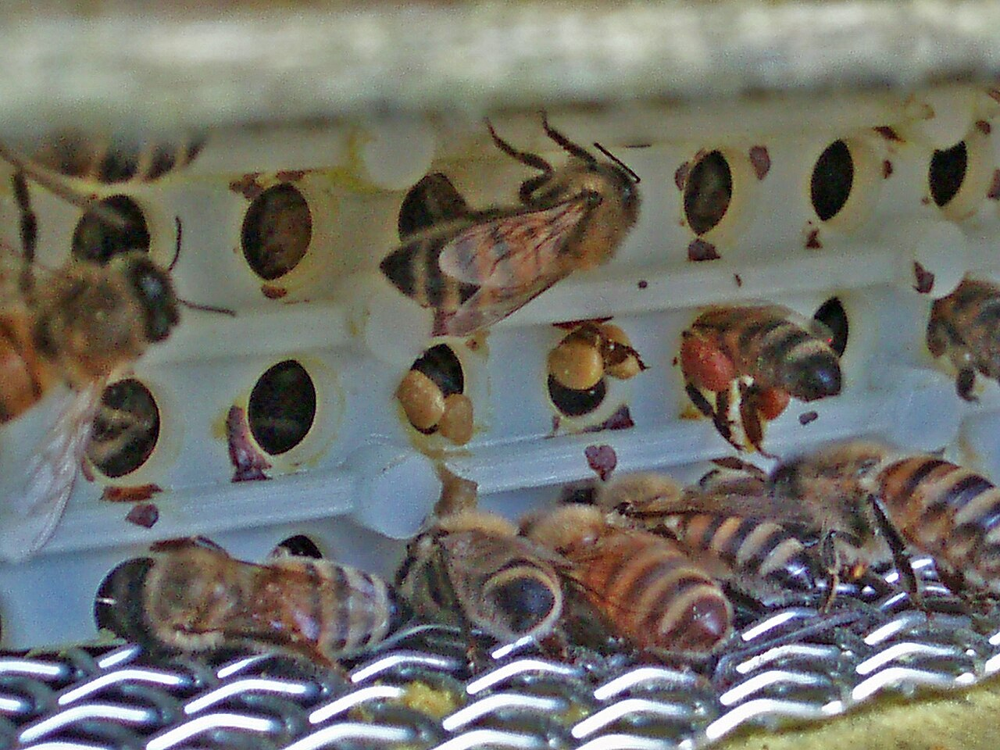
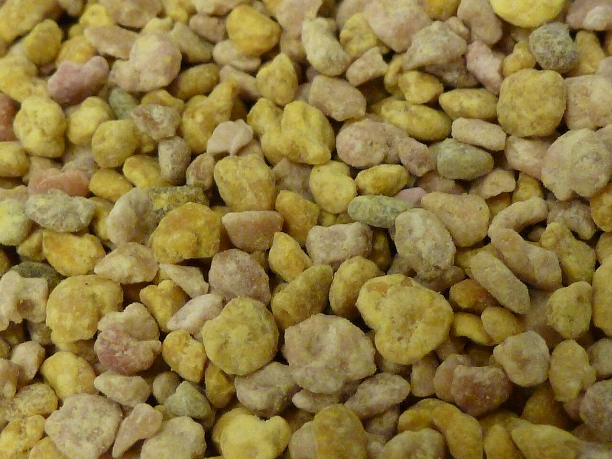

# Chapter 56 — Pollen

## Introduction

Pollen is the principal protein-rich food collected by honey bees. For the colony, it is not a luxury product: it supplies amino acids, lipids, vitamins, minerals, sterols, and other compounds needed for brood rearing, gland development, immune function, and the production of brood food by nurse bees.

For the beekeeper, pollen can also become a marketable hive product when pellets are removed from returning foragers with a pollen trap. This creates an immediate biological trade-off. Every gram harvested for sale is a gram that does not enter the colony. A well-managed pollen operation therefore balances commercial collection against the colony's own nutritional requirements.

Bee pollen is also much more perishable than ripe honey. Fresh pollen can contain enough water to support microbial growth. It can be contaminated by soil, insects, pesticides, mycotoxin-producing fungi, heavy metals, pyrrolizidine alkaloids from certain plants, or cleaning failures. It can also cause serious allergic reactions in susceptible consumers, including people with pollen allergy or sensitivity to bee products.

ISO 24382:2023 provides an international specification framework for bee pollen, including quality requirements, analytical methods, packaging, labelling, storage, and transport. It applies to bee pollen collected at hive entrances as well as dried, frozen, and freeze-dried bee pollen. A further ISO project on bee-pollen production was in final-draft development in 2026, reflecting increasing emphasis on hygiene, traceability, and controlled processing.

This chapter covers colony biology, trap management, food safety, preservation, quality control, storage, and truthful marketing. It does not treat bee pollen as a medicine, and it does not replace local food-law or allergen requirements.

## Learning Objectives

After completing this chapter, the reader should be able to:

- explain the role of pollen in honey bee nutrition;
- distinguish floral pollen, bee-collected pollen pellets, and bee bread;
- understand why pollen composition varies strongly by botanical and geographical origin;
- choose colonies suitable for pollen collection;
- install and manage pollen traps without chronically depriving the colony;
- recognise signs that trapping should be reduced or stopped;
- collect pellets hygienically and prevent soil, insect, water, and hive-debris contamination;
- preserve fresh pollen rapidly by freezing, drying, or validated freeze-drying systems;
- understand the importance of moisture and water activity;
- control mould, yeast, bacterial, mycotoxin, pesticide, heavy-metal, and plant-toxin risks;
- recognise allergy and anaphylaxis risk;
- grade, sample, test, package, store, and trace pollen lots;
- distinguish nutritional composition research from authorised human-health claims.

## 56.1 What Is Pollen?

Pollen grains are the male reproductive structures produced by seed plants.

They contain plant genetic material and a nutrient-rich cellular package that can include:

- proteins;
- amino acids;
- carbohydrates;
- lipids;
- sterols;
- minerals;
- vitamins;
- carotenoids;
- phenolic compounds.

Composition differs dramatically between plant species.

## 56.2 Why Bees Need Pollen

Adult worker bees require pollen particularly during nursing and gland development.

Pollen supports:

- hypopharyngeal gland development;
- brood-food production;
- fat-body condition;
- immune function;
- tissue growth;
- longevity under some conditions;
- colony brood-rearing capacity.

A colony with abundant honey but inadequate pollen can still suffer nutritional stress.

## 56.3 Nectar and Pollen Are Different Resources

Nectar and honey mainly provide carbohydrate energy.

Pollen provides much of the protein, amino acids, lipids, sterols, minerals, and micronutrients needed for growth and brood care.

Strong colonies need both.

## 56.4 Pollen Collectors

Foragers collect pollen by:

1. contacting anthers;
2. grooming pollen from body hairs;
3. moistening and compacting grains;
4. packing them into the corbiculae, or pollen baskets, on the hind legs;
5. returning to the colony.

The visible coloured pellets are therefore bee-formed loads, not untouched loose flower pollen.

## 56.5 Why Pollen Pellets Have Different Colours

Pellet colour reflects botanical source and can range through:

- cream;
- yellow;
- orange;
- red;
- green;
- brown;
- grey;
- purple or nearly black tones.

Colour is useful for sorting and observation but does not prove botanical identity on its own.

## 56.6 Botanical Diversity

A pollen lot may be:

- dominated by one plant source;
- mixed from several major sources;
- highly diverse.

The nutritional composition of bee pollen can vary widely with botanical origin, region, season, weather, and bee species.

Avoid publishing one average nutrient table as though every pollen lot has the same composition.

## 56.7 Pollen and Bee Bread

Bee pollen is the pellet collected from returning foragers before it is stored in comb.

Bee bread is pollen deposited in cells and modified through:

- packing;
- addition of nectar/honey;
- glandular secretions;
- time in the colony;
- microbial and biochemical changes.

The two products are related but not identical.

## 56.8 Colony Pollen Stores

Workers store pollen mainly around brood areas where nurse bees can access it.

A colony with expanding brood can consume pollen quickly.

Before harvesting pollen commercially, inspect whether the colony has adequate natural intake and stored reserves.

## 56.9 Pollen Dearth

A pollen dearth can occur even when nectar is available.

Possible signs include:

- reduced pollen traffic;
- shrinking pollen stores;
- reduced brood rearing;
- larvae receiving less food;
- increased collection of poor or unusual pollen sources.

Pollen traps should be reduced or removed during shortage.

## 56.10 What a Pollen Trap Does

A pollen trap forces returning foragers through openings that remove part of the pollen loads from their hind legs.

The pellets fall into a collection drawer or tray.

A good trap should remove only a proportion of incoming pollen and allow:

- normal bee passage;
- drone movement or an alternative drone exit where required by design;
- ventilation;
- hygienic collection;
- rapid drawer removal.

## 56.11 Trap Types

Common designs include:

- bottom-mounted traps;
- entrance traps;
- top traps;
- built-in hive-floor systems.

Each differs in:

- efficiency;
- weather protection;
- ease of cleaning;
- disruption to traffic;
- risk of debris contamination.

## 56.12 Trap Efficiency

A trap should not aim to remove every pollen pellet.

Excessive removal can deprive the colony of protein.

Efficiency depends on:

- hole geometry;
- bee size;
- pollen-pellet size;
- traffic level;
- trap cleanliness;
- colony behaviour.

## 56.13 Over-Harvesting

Continuous heavy trapping can reduce pollen available for:

- nurse bees;
- brood food;
- young-worker development;
- colony growth.

Possible consequences include smaller brood area and reduced colony resilience.

Commercial harvest must never be managed as though the colony's biological needs are irrelevant.

## 56.14 Which Colonies Are Suitable?

Choose colonies that are:

- strong;
- healthy;
- queenright;
- actively receiving pollen;
- not severely stressed by Varroa or disease;
- not short of stored food;
- not recovering from a split or queen failure unless adequately strong.

## 56.15 When Not to Trap

Reduce or stop trapping when:

- pollen intake falls sharply;
- brood is expanding faster than reserves;
- weather prevents foraging;
- a colony is weakened;
- queen problems occur;
- disease requires attention;
- major pesticide exposure is suspected;
- the product cannot be collected and preserved hygienically.

## 56.16 Intermittent Trapping

Many operators use intermittent rather than constant trapping.

Potential advantages include:

- allowing colony stores to recover;
- reducing nutritional stress;
- adjusting to pollen-flow peaks;
- reducing labour during poor weather.

The best schedule depends on local flora, colony condition, and trap efficiency.

## 56.17 Pollen Flow Is Not a Fixed Calendar

Use:

- direct entrance observation;
- trap yield;
- floral phenology;
- colony pollen stores;
- brood area;
- weather.

A calendar date alone is not enough.

## 56.18 Installing a Trap

A new trap can temporarily disrupt returning bees.

Introduce it when weather and colony condition are favourable.

Check:

- entrance access;
- ventilation;
- trapped drones;
- abnormal crowding;
- whether bees learn the new route.

## 56.19 Drone Access

Some trap designs can obstruct drones because drones are larger than workers.

Use the manufacturer's design correctly and provide intended exits where necessary.

Do not create a traffic blockage that overheats or destabilises the colony.

## 56.20 Collection Drawers

Drawers should be:

- food-compatible;
- clean;
- dry;
- protected from rain;
- protected from ants and rodents;
- easy to remove without spilling.

Wood or mesh parts should not shed contaminants into the food product.

*Photo 56.1 — Pollen trap in use. Returning workers pass through the trap openings while detached corbicular pollen pellets are visible on the collection surface. A trap should remove only part of the incoming pollen and must be kept clean, dry and free of traffic blockage. Photo by Matteo Giusti (Matteogiusti), CC BY-SA 3.0.*

## 56.21 Collect Frequently

Fresh pollen is moist and biologically active.

Leaving it in a warm humid trap drawer can allow:

- mould growth;
- yeast growth;
- insect contamination;
- fermentation;
- quality loss.

Collection frequency should increase in warm or humid weather.

## 56.22 Rain and Wet Pollen

Water entering a trap can rapidly damage product quality.

Wet pollen should not simply be mixed with a dry lot.

Segregate it and evaluate whether it can be safely processed under the quality system.

## 56.23 Soil and Dust Contamination

Entrance-mounted traps can be exposed to:

- soil;
- mud;
- grass debris;
- road dust;
- vehicle emissions.

Apiary siting and trap design influence food safety.

## 56.24 Dead Bees and Hive Debris

Raw pollen may contain:

- bee legs or wings;
- wax fragments;
- propolis;
- brood debris;
- wood fragments;
- other insects.

Physical cleaning is required before sale.

## 56.25 Ants and Other Insects

Pollen is highly attractive to other insects.

Use:

- clean stands;
- physical barriers;
- frequent collection;
- covered transport.

Avoid pesticide contamination of the food product.

## 56.26 Initial Reception

At collection:

1. identify apiary and colony/group;
2. record date/time;
3. weigh or estimate yield;
4. inspect for water, mould, foreign matter, and odour;
5. transfer promptly to a clean closed container;
6. begin preservation quickly.

## 56.27 Fresh Pollen Is Perishable

Unlike honey, fresh pollen can contain sufficient moisture for active microbial growth.

It should not be held for long periods at room temperature unless a validated process demonstrates safety and quality.

Rapid chilling, freezing, drying, or freeze-drying is central to pollen preservation.

## 56.28 Freezing

Freezing is one of the simplest ways to preserve fresh pollen.

Advantages include:

- rapid slowing of microbial activity;
- good retention of colour and aroma;
- minimal heat exposure.

Requirements include:

- rapid freezing after collection;
- clean packaging;
- stable freezer temperature;
- controlled thawing.

*Photo 56.2 — Frozen bee-collected pollen pellets. Freezing can preserve fresh pollen with little heat exposure when the product is collected hygienically and frozen promptly. These are bee-collected pollen pellets, not bee bread stored and modified inside comb cells. Photo by Matteo Giusti (Matteogiusti), CC BY-SA 3.0.*

## 56.29 Cold Chain

Frozen pollen remains a frozen food ingredient/product.

The cold chain should be maintained through:

- storage;
- transport;
- wholesale handling;
- retail if sold frozen.

Repeated thaw/refreeze cycles can damage quality and increase condensation.

## 56.30 Thawing

Condensation can wet pollen when cold containers are opened in humid air.

Where appropriate, allow sealed packages to equilibrate before opening.

Once thawed, manage pollen according to its validated storage life rather than assuming it is shelf-stable.

## 56.31 Drying

Drying reduces moisture and water activity so microbial growth becomes less likely and ambient storage becomes more practical.

Quality depends on:

- air temperature;
- relative humidity;
- airflow;
- bed depth;
- initial moisture;
- drying time.

## 56.32 Avoid Excessive Drying Heat

High temperature can damage:

- aroma;
- colour;
- vitamins;
- enzymes;
- heat-sensitive bioactive compounds.

Use the lowest validated temperature/time combination that achieves the intended stability.

## 56.33 Air Quality During Drying

Drying air contacts a food product directly.

It should be protected from:

- dust;
- combustion exhaust;
- chemical odours;
- insects;
- excessive humidity.

Do not use unfiltered smoky workshop air for premium food pollen.

## 56.34 Drying Uniformity

Deep layers can dry unevenly.

Wet pockets can remain beneath apparently dry surface pellets.

Controls can include:

- shallow bed depth;
- gentle turning;
- uniform airflow;
- representative moisture testing.

## 56.35 Freeze-Drying

Freeze-drying removes water under vacuum from frozen material.

Potential advantages:

- strong preservation of colour and structure;
- low thermal exposure;
- high-value product format.

Disadvantages include:

- expensive equipment;
- long cycles;
- need for packaging with good moisture barrier;
- process validation.

## 56.36 ISO 24382:2023

ISO 24382:2023 establishes an international specification framework for bee pollen.

Its scope includes:

- hive-collected pollen pellets;
- dried bee pollen;
- frozen bee pollen;
- freeze-dried bee pollen.

It also addresses analytical methods, packaging, marking, labelling, storage, and transportation.

## 56.37 ISO Bee-Pollen Production Work in 2026

In 2026, ISO/FDIS 25097 on bee pollen production was under development at the final-draft stage.

Its scope addresses production-chain controls such as:

- harvesting;
- processing;
- packaging;
- labelling;
- storage;
- transportation;
- traceability.

A draft standard is not yet the same as a published mandatory legal rule, but it is useful evidence of emerging good-practice direction.

## 56.38 Moisture

Moisture content is a core quality parameter for dried pollen.

High moisture increases risk of:

- mould;
- yeast growth;
- quality loss;
- clumping;
- mycotoxin development if toxigenic fungi grow.

Use a validated method and applicable specification.

## 56.39 Water Activity

Water activity indicates how much water is available to microorganisms.

It can be more directly related to microbial stability than total moisture percentage.

Two pollen samples with similar moisture can have somewhat different water activity depending on composition.

## 56.40 Why Moisture Alone Is Not Enough

A sample can pass a moisture target yet still have problems from:

- heavy initial contamination;
- previous mould growth;
- mycotoxins already produced;
- poor packaging;
- uneven wet pockets.

Quality control must consider the whole process history.

## 56.41 Cleaning and Sorting

Dry or frozen pollen can be cleaned by combinations of:

- sieving;
- aspiration/air separation;
- manual inspection;
- magnets or metal control where appropriate;
- optical sorting in larger systems.

The method should remove foreign material without contaminating or excessively damaging pellets.

## 56.42 Colour Sorting

Colour separation can create visually uniform lots or support botanical studies.

However, pellet colour does not always correspond to one plant species.

Use microscopic or molecular botanical identification for defensible origin claims.

## 56.43 Palynology

Microscopic pollen analysis can identify plant taxa based on grain morphology.

It is useful for:

- botanical profiling;
- geographical clues;
- quality characterisation.

Expertise and reference collections are required.

## 56.44 DNA Methods

DNA metabarcoding can complement microscopy by detecting plant DNA signatures.

Limitations include:

- DNA extraction bias;
- incomplete reference databases;
- sequence abundance not equalling nutrient contribution;
- processing effects.

Use as one tool, not universal truth.

## 56.45 Nutritional Composition

Bee pollen can contain substantial amounts of:

- protein;
- carbohydrates;
- lipids;
- fibre;
- minerals;
- phenolics.

Published reviews show very wide concentration ranges because botanical origin strongly changes composition.

Do not promise one fixed nutrient value unless the lot is actually analysed.

## 56.46 Protein

Protein content can differ markedly between pollen sources.

Protein percentage also does not describe amino-acid balance completely.

For bee nutrition and human food composition, both quantity and composition matter.

## 56.47 Lipids and Sterols

Pollen supplies essential fatty acids and sterols important to bees.

Sterols are particularly relevant because honey bees cannot synthesise all sterol structures they require from simple carbohydrate feed.

This is one reason sugar syrup cannot replace pollen nutritionally.

## 56.48 Minerals and Micronutrients

Mineral content reflects:

- plant species;
- soil;
- geography;
- environmental contamination.

High mineral content is not automatically beneficial if toxic metals are present.

## 56.49 Phenolic Compounds

Pollen contains plant phenolics with measurable antioxidant activity in laboratory assays.

Laboratory antioxidant activity is not equivalent to a clinically proven human-health effect.

Marketing claims must follow applicable law.

## 56.50 Microbial Hazards

Potential microbial hazards include:

- moulds;
- yeasts;
- environmental bacteria;
- contamination introduced during handling.

Fresh pollen's moisture makes rapid preservation essential.

## 56.51 Mould

Mould growth can occur when pollen remains warm and moist.

Visible mould is a rejection sign for ordinary food product.

Do not attempt to rescue visibly mouldy pollen merely by drying it later.

## 56.52 Mycotoxins

Some moulds can produce mycotoxins.

Mycotoxins can remain even if the fungus is later killed or the product is dried.

This is why prevention is more reliable than trying to “sterilise” poor pollen after spoilage.

## 56.53 Current Research on Pesticides and Mycotoxins

A 2024 analytical review reported that numerous pesticide compounds and several mycotoxins have been detected in bee-pollen studies worldwide and highlighted continuing regulatory gaps for pollen as a specific commodity.

The practical lesson is not that every pollen lot is dangerous. It is that risk-based monitoring and clean sourcing are necessary for serious commercial production.

## 56.54 Pesticide Residues

Pollen can concentrate pesticide exposure because foragers collect directly from plant reproductive structures.

Residues may include:

- insecticides;
- fungicides;
- herbicides;
- acaricides from hive treatments.

Risk depends on compound, concentration, market, and applicable limits.

## 56.55 Apiary Siting and Pesticide Risk

Before commercial pollen collection, consider:

- nearby intensive crops;
- known spray programmes;
- industrial sites;
- road traffic;
- contaminated land.

Communication with growers can reduce avoidable exposure but cannot guarantee residue-free pollen.

## 56.56 Heavy Metals

Pollen can contain metals from environmental sources.

Commercial testing may include:

- lead;
- cadmium;
- arsenic;
- mercury or other market-specific elements.

Sampling and legal interpretation should use accredited methods where required.

## 56.57 Pyrrolizidine Alkaloids

Certain plants naturally produce pyrrolizidine alkaloids, some of which are hepatotoxic.

Bee pollen can collect these plant compounds when bees forage on relevant species.

Botanical knowledge and contaminant testing can therefore be important even when no pesticide contamination exists.

## 56.58 Natural Toxins Are Still Toxins

A contaminant does not become harmless because it originated from a plant.

Risk assessment should treat:

- plant alkaloids;
- mycotoxins;
- allergens;
- pesticides

according to evidence and dose, not “natural versus synthetic” labels.

## 56.59 Allergy Risk

Bee pollen can trigger allergic reactions in susceptible people.

Potentially affected consumers include some people with:

- seasonal pollen allergy;
- asthma;
- sensitivity to bee products;
- previous unexplained reactions to supplements.

## 56.60 Anaphylaxis

Severe allergic reactions can include:

- breathing difficulty;
- throat/tongue swelling;
- widespread hives;
- dizziness;
- collapse.

These are medical emergencies.

A bee-pollen product should never be marketed as harmless to allergic consumers simply because it is a natural food.

## 56.61 Allergen Labelling

Specific legal labelling requirements vary.

Even where bee pollen is not one of the standard mandatory allergen list items, producers should use truthful safety information and comply with supplement/food rules applicable to the market.

Do not invent medically reassuring statements such as “safe for pollen allergy”.

## 56.62 Children and Vulnerable Consumers

Supplement products may require special caution for:

- children;
- pregnant people;
- people taking medicines;
- people with allergies.

Health advice belongs to competent healthcare guidance, not unqualified product marketing.

## 56.63 Bee Pollen Is Not a Medicine

Research investigates potential biological effects of pollen extracts and nutrients.

That does not automatically authorise claims that bee pollen:

- cures allergy;
- treats cancer;
- prevents infection;
- detoxifies the body;
- replaces prescribed medicine.

Claims must match evidence and law.

## 56.64 Food Versus Food Supplement

Depending on jurisdiction and presentation, bee pollen may be sold as:

- food;
- food supplement;
- ingredient in another food.

The legal category affects:

- labelling;
- claims;
- serving information;
- food-business obligations.

## 56.65 Bee Bread

Bee bread differs from trap-collected pollen.

Harvesting it generally requires removal from comb and can interfere with colony stores.

It also has a different composition, moisture profile, and microbiological history.

Do not label bee bread simply as ordinary pollen pellets.

## 56.66 Bee Bread Collection

Commercial bee-bread collection should consider:

- colony nutritional needs;
- brood-comb hygiene;
- treatment history;
- cell contamination;
- extraction method;
- preservation.

Old brood comb introduces quality issues not present in clean trap pollen.

## 56.67 Sensory Quality

Assess:

- colour diversity;
- floral aroma;
- sweetness/bitterness;
- texture;
- rancidity;
- musty odour;
- mould odour.

Strong musty, fermented, chemical, or rancid notes are defects.

## 56.68 Rancidity

Pollen lipids can oxidise.

Warm storage, oxygen, light, and time can produce rancid flavours.

Low-moisture stability does not prevent oxidative quality loss indefinitely.

## 56.69 Packaging

Packaging should protect pollen from:

- moisture;
- oxygen where relevant;
- light;
- insects;
- odours;
- physical damage.

Barrier requirements differ for dried, frozen, and freeze-dried products.

## 56.70 Packaging Dried Pollen

Dried pollen should enter packaging only after:

- cooling to appropriate temperature;
- representative moisture/water-activity verification;
- cleaning;
- lot identification.

Warm product sealed too early can create condensation.

## 56.71 Packaging Frozen Pollen

Frozen packs should tolerate freezer temperature without cracking or losing seal integrity.

The pack should also support cold-chain traceability.

## 56.72 Freeze-Dried Pollen Packaging

Freeze-dried pollen is highly sensitive to moisture uptake.

Use a strong moisture barrier and close containers promptly after processing.

Poor packaging can undo an expensive freeze-drying process.

## 56.73 Storage of Dried Pollen

Store dried pollen:

- cool;
- dry;
- dark;
- protected from pests;
- away from strong odours.

Do not place it beside fuels, cleaning chemicals, or aromatic foods.

## 56.74 Storage of Frozen Pollen

Maintain the defined frozen storage condition.

Use temperature monitoring appropriate to the operation.

Document excursions and evaluate them rather than ignoring them.

## 56.75 Shelf Life

Shelf life depends on:

- processing method;
- moisture/water activity;
- oxygen exposure;
- temperature;
- packaging;
- microbial load;
- lipid oxidation;
- market specification.

Do not copy a universal date from another producer.

## 56.76 Lot Definition

A lot can be based on:

- apiary;
- harvest date;
- harvest period;
- botanical source;
- processing batch.

The definition should be consistent and support recall or investigation.

## 56.77 Traceability Records

Record:

- apiary;
- hive group;
- collection date;
- trap type;
- raw mass;
- weather/rain event if relevant;
- preservation start time;
- drying/freezing batch;
- processing conditions;
- final mass;
- packaging lot;
- laboratory results.

## 56.78 Supplier Approval

If purchasing pollen, request information on:

- country and region;
- collection method;
- drying/freezing method;
- pesticide controls;
- contaminant testing;
- microbiology;
- botanical claims;
- storage history.

Untraceable pollen should not enter a premium supply chain automatically.

## 56.79 Quality Testing

A commercial testing plan can include:

- moisture;
- water activity;
- microbiological counts;
- pesticides;
- mycotoxins;
- toxic elements;
- pyrrolizidine alkaloids where risk justifies;
- botanical analysis;
- nutrient composition for label claims.

## 56.80 Certificate of Analysis

A CoA should be linked to the actual lot.

Review:

- sample identity;
- method;
- units;
- result;
- specification;
- detection/quantification limits where relevant;
- laboratory competence.

A certificate from another lot proves nothing about the current lot.

## 56.81 Sampling

Pollen is heterogeneous.

Pellets of different colours and plant sources can segregate in a container.

Representative sampling may require:

- mixing;
- multiple increments;
- sampling from different depths;
- composite sample preparation.

## 56.82 Retained Samples

Retained samples support:

- complaint investigation;
- residue disputes;
- shelf-life review;
- botanical verification;
- microbial comparison.

Store them under defined conditions that reflect the product or quality system.

## 56.83 Foreign-Body Control

Potential physical contaminants include:

- bee parts;
- wood;
- metal;
- plastic;
- stones;
- plant debris;
- insect fragments.

Cleaning equipment should remove them without creating new contamination.

## 56.84 Metal Detection and Magnets

Large commercial operations may use magnets or metal detection where risk assessment supports it.

These systems do not replace good equipment maintenance and visual cleaning.

## 56.85 Decision Table

| Observation | Main concern | Response |
|---|---|---|
| Strong pollen flow, colony stores adequate | Good collection opportunity | Trap under monitored schedule |
| Brood expanding, pollen stores falling | Colony nutritional risk | Reduce/stop trapping |
| Wet pollen in drawer | Microbial risk | Segregate; preserve/process under validated plan |
| Musty or mouldy odour | Spoilage | Reject ordinary food use; investigate cause |
| High pesticide-residue risk area | Chemical hazard | Increase testing/avoid commercial collection |
| Dried pollen reabsorbs moisture | Shelf-life risk | Review packaging and storage humidity |
| Consumer with pollen allergy asks if product is safe | Allergy uncertainty | Do not reassure; advise appropriate medical caution |
| CoA not linked to lot | Traceability failure | Do not use as evidence for release |

## 56.86 Practical Collection Procedure

### Before trapping

- select strong healthy colony;
- inspect pollen stores and brood demand;
- review nearby pesticide risk;
- clean trap and drawer;
- prepare food-grade collection containers.

### During trapping

1. install trap correctly;
2. verify traffic and drone access;
3. collect frequently;
4. protect product from rain and insects;
5. inspect colony stores regularly;
6. pause trapping when nutrition or weather deteriorates.

### At collection

7. identify lot;
8. inspect raw pollen;
9. remove obvious foreign bodies;
10. transfer promptly to preservation step;
11. document time from collection to freezing/drying.

## 56.87 Practical Drying Framework

- clean/sort raw pollen;
- load shallow uniform layers;
- use clean controlled air;
- monitor product temperature and humidity;
- turn or redistribute if required by validated process;
- verify final moisture/water activity representatively;
- cool before packaging;
- pack in a strong moisture barrier;
- retain sample and records.

## 56.88 Practical Frozen-Pollen Framework

- collect hygienically;
- clean/sort promptly;
- divide into manageable food-grade packs;
- freeze rapidly;
- maintain cold chain;
- label lot and harvest date;
- manage condensation during thawing;
- avoid repeated thaw/refreeze cycles.

## 56.89 Scientific Notes

### Botanical origin drives composition

Published composition ranges are broad because pollen from different plants contains different proportions of protein, lipids, minerals, and phytochemicals. “Bee pollen” is not one nutritionally uniform substance.

### Colony nutrition depends on quality as well as quantity

A large mass of low-diversity or nutritionally incomplete pollen may not be equivalent to a diverse supply with balanced amino acids and sterols.

### Drying is a preservation trade-off

Removing water improves microbial stability, but excessive heat can degrade sensory and nutritional qualities. A good process balances both objectives.

### Mycotoxin prevention is upstream

Once a toxigenic mould has grown and produced a stable toxin, killing the mould later does not necessarily remove the toxin. Rapid clean preservation is therefore more effective than late salvage.

### Allergy risk is biological, not marketing-dependent

Pollen is designed by plants to carry proteins and other biologically active molecules. Consumer hypersensitivity must therefore be taken seriously even when the product is minimally processed.

## 56.90 Bee-Pollen Checklist

- [ ] Colony strong and healthy.
- [ ] Pollen stores adequate.
- [ ] Brood demand considered.
- [ ] Trap clean, dry, and correctly fitted.
- [ ] Drone/traffic route checked.
- [ ] Pesticide-risk environment reviewed.
- [ ] Collection frequency appropriate to weather.
- [ ] Wet or mouldy product segregated.
- [ ] Raw pollen protected from soil and insects.
- [ ] Lot identified at collection.
- [ ] Preservation begins promptly.
- [ ] Drying air clean and controlled, if drying.
- [ ] Final moisture/water activity verified where required.
- [ ] Frozen product cold chain controlled, if freezing.
- [ ] Packaging appropriate to product form.
- [ ] Storage cool/dry/dark or frozen as specified.
- [ ] Residue/contaminant testing matched to risk.
- [ ] Allergy warnings/claims reviewed for legal market.
- [ ] CoA linked to exact lot.
- [ ] Retained sample and traceability record complete.

## Key Takeaways

- Pollen is essential colony nutrition, so commercial trapping must never be managed independently of brood demand and colony stores.
- Bee pollen pellets differ from bee bread.
- Botanical origin drives large differences in nutrient composition and colour.
- Fresh pollen is perishable and should be preserved quickly.
- Freezing, drying, and freeze-drying are different preservation systems with different costs and quality effects.
- Moisture and water activity are central to microbial stability.
- Mould, mycotoxins, pesticides, heavy metals, pyrrolizidine alkaloids, and foreign bodies are legitimate food-safety hazards.
- ISO 24382:2023 provides a current international specification framework for bee pollen.
- Bee pollen can cause serious allergic reactions, including anaphylaxis, in susceptible consumers.
- Nutritional and laboratory bioactivity data do not authorise unsupported therapeutic claims.

## Chapter Summary

Bee pollen production begins with a biological constraint: pollen is the colony's primary protein-rich food. A trap that increases human harvest decreases pollen reaching the hive. Responsible production therefore starts with strong colonies, adequate pollen stores, active forage, and a trapping schedule that can be reduced immediately when colony need increases.

Once pollen reaches the collection drawer, the challenge becomes food preservation. Fresh pellets are moist and can deteriorate rapidly. Hygienic collection, rapid freezing or controlled drying, representative moisture or water-activity testing, clean packaging, and appropriate storage are essential.

Quality cannot be judged only by colourful appearance. Bee pollen can carry environmental pesticides, toxic elements, moulds, mycotoxins, natural plant alkaloids, and physical debris. Botanical origin also changes nutrient composition so strongly that one generic nutrient claim should not be applied to every lot without evidence.

Finally, pollen is an allergenic biological material. A professional producer treats allergy information, traceability, contaminant testing, and truthful health claims as part of product quality. ISO 24382:2023 provides a useful international framework, while local food and supplement laws determine the actual commercial obligations.

## Review Questions

1. What is pollen biologically?
2. Why do honey bee colonies need pollen?
3. How does pollen differ nutritionally from nectar?
4. How do foragers form pollen pellets?
5. What are corbiculae?
6. Why do pollen pellets vary in colour?
7. Does pellet colour prove botanical identity?
8. Why is bee pollen composition highly variable?
9. What is bee bread?
10. How does bee bread differ from trap-collected pollen?
11. Where do bees store pollen in the hive?
12. What is a pollen dearth?
13. Which colony signs can indicate declining pollen availability?
14. What does a pollen trap do?
15. Why should a trap remove only part of incoming pollen?
16. Name three pollen-trap designs.
17. Which factors influence trapping efficiency?
18. Why is over-harvesting harmful?
19. Which colonies are suitable for pollen production?
20. When should trapping be reduced or stopped?
21. What is one advantage of intermittent trapping?
22. Why should trapping not follow only a calendar?
23. What should be checked after installing a trap?
24. Why can drones be a problem with some trap designs?
25. What qualities should a collection drawer have?
26. Why must pollen be collected frequently?
27. What should happen to rain-wetted pollen?
28. How can entrance traps collect soil or road contamination?
29. Which foreign materials can occur in raw pollen?
30. How can ants contaminate the crop?
31. What should be recorded at raw-pollen reception?
32. Why is fresh pollen more perishable than honey?
33. What are the main preservation options?
34. What are the main advantages of freezing?
35. What is meant by cold chain?
36. Why are repeated thaw/refreeze cycles undesirable?
37. What is the main condensation risk during thawing?
38. How does drying preserve pollen?
39. Which process variables control drying?
40. Why can excessive heat reduce quality?
41. Why must drying air be clean?
42. How can a deep pollen bed dry unevenly?
43. What is freeze-drying?
44. What are the main advantages and disadvantages of freeze-drying?
45. What does ISO 24382:2023 cover?
46. Which pollen product forms are within its scope?
47. What was the status of ISO/FDIS 25097 in 2026?
48. Why is a draft standard not the same as binding law?
49. Why is moisture important in dried pollen?
50. What is water activity?
51. Why can water activity be more directly related to microbial stability than total moisture?
52. Why can a lot pass a moisture target and still be unsafe?
53. Which cleaning methods can remove physical debris?
54. Why is colour sorting not enough for botanical claims?
55. What is palynology?
56. What can DNA metabarcoding contribute?
57. Why does sequence abundance not equal nutrient contribution?
58. Why should one fixed nutrient table not be used for every pollen lot?
59. Why is protein percentage alone incomplete information?
60. Why are pollen sterols important to bees?
61. Can sugar syrup replace pollen nutritionally?
62. Why can high mineral content also indicate contamination?
63. What do antioxidant assays measure?
64. Why do antioxidant assays not prove clinical benefit?
65. What microbial hazards can occur in pollen?
66. What should happen to visibly mouldy pollen?
67. What are mycotoxins?
68. Why does killing mould not necessarily remove mycotoxins?
69. What did the 2024 review highlight about pesticide and mycotoxin findings in bee pollen?
70. Why can pollen concentrate pesticide exposure?
71. How can apiary siting affect residue risk?
72. Which heavy metals can be relevant?
73. What are pyrrolizidine alkaloids?
74. Why can natural plant toxins be a food-safety concern?
75. Who may be at higher risk of bee-pollen allergy?
76. What are signs of anaphylaxis?
77. How should severe allergy symptoms be treated?
78. Why should a seller not promise that bee pollen is safe for pollen-allergic consumers?
79. Why is bee pollen not automatically a medicine?
80. How can legal status vary between food and supplement markets?
81. Why is bee bread a separate product category?
82. What quality issues arise from collecting bee bread from brood comb?
83. What sensory defects can indicate poor pollen quality?
84. What is rancidity?
85. Which storage conditions accelerate lipid oxidation?
86. What should packaging protect dried pollen from?
87. Why can warm product sealed too soon condense?
88. Why does freeze-dried pollen need a strong moisture barrier?
89. Why is shelf life product-specific?
90. How can a pollen lot be defined?
91. Which records support traceability?
92. What should be checked when buying pollen from another supplier?
93. What can a commercial quality-testing plan include?
94. What should be reviewed on a certificate of analysis?
95. Why is representative sampling difficult in multi-coloured pollen?
96. What are retained samples useful for?
97. Why should foreign-body control not rely on one machine alone?
98. What are the main steps in a practical collection procedure?
99. What is the central biological trade-off in commercial pollen harvesting?
100. What combination of colony management, rapid preservation, contaminant control, and truthful marketing defines professional bee-pollen production?

## References

- ISO 24382:2023. *Bee pollen — Specifications*. International Organization for Standardization. Published October 2023.
- ISO/FDIS 25097. *Bee pollen production*. Final Draft International Standard under development in 2026; verify publication status before final book release.
- Thakur, M., and Nanda, V. “Composition and functionality of bee pollen: A review.” *Trends in Food Science & Technology* 98, 2020, 82–106.
- Végh and related food-safety literature on bee-pollen contaminants, including pesticides, toxic elements, moulds, mycotoxins, and pyrrolizidine alkaloids.
- “Food safety hazards of bee pollen – A review.” *Trends in Food Science & Technology*, current review literature on chemical and microbiological hazards.
- “Unveiling bee pollen's contamination with pesticides and mycotoxins: Current analytical procedures, results and regulation.” *Trends in Analytical Chemistry* 180, 2024, 117935.
- Scientific literature on bee pollen and bee bread composition, palynology, DNA metabarcoding, drying, freeze-drying, storage, and allergy.
- Current national food, supplement, contaminant, pesticide-residue, allergen, labelling, food-hygiene, and occupational-safety requirements must be verified for the target market.