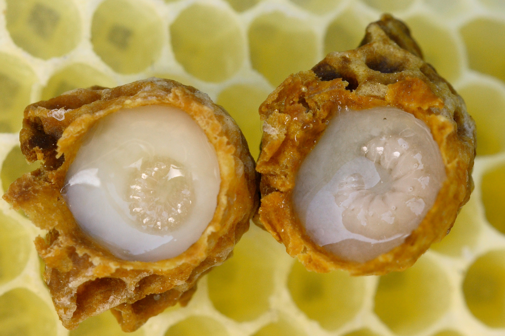

# Chapter 58 — Royal Jelly

## Introduction

Royal jelly is a nutrient-rich glandular secretion produced by young worker honey bees. Nurse bees secrete it principally from the hypopharyngeal and mandibular glands and use it as brood food. All very young larvae receive glandular food, but queen-destined larvae are provisioned continuously with abundant royal jelly throughout their development.

Commercial royal-jelly production uses the colony's queen-rearing biology. Beekeepers present strong nurse-rich colonies with many artificial queen cups containing very young larvae. Workers respond by provisioning those cells heavily. The beekeeper harvests the royal jelly before the developing queen larvae consume too much of it, removes the larvae, and collects the product under hygienic conditions.

This is a specialised production system. It requires exceptionally strong colonies, large populations of young nurse bees, adequate pollen and carbohydrate nutrition, precise grafting or larval-transfer timing, hygienic tools, rapid chilling, strong traceability, and disciplined cold-chain control. It can also impose significant biological cost on the colony if production is pushed without regard to nutrition, brood balance, queen status, or workforce replacement.

Royal jelly is highly perishable compared with honey. Storage and processing can alter proteins, volatile compounds, enzyme activity, colour, viscosity, and other quality markers. ISO 12824:2016 remains the current international royal-jelly specification and includes sanitary, organoleptic, chemical, packaging, storage, and transport requirements. ISO 24364:2023 separately addresses royal-jelly production conditions, process management, storage, and transport.

The characteristic fatty acid 10-hydroxy-2-decenoic acid (10-HDA) is useful for identity and quality control, but current evidence shows it is too stable to function as a complete freshness indicator. Major royal-jelly proteins, volatile profiles, Maillard-reaction markers, enzyme activity, and other molecular changes can reveal deterioration that 10-HDA alone misses.

This chapter therefore treats royal jelly as a perishable biological food product rather than as a mystical hive medicine. Scientific research on biological activity is discussed separately from authorised human-health claims.

## Learning Objectives

After completing this chapter, the reader should be able to:

- explain how nurse bees produce and use royal jelly;
- describe why continuous royal-jelly feeding contributes to queen development;
- prepare strong colonies for commercial royal-jelly production;
- understand starter, cell-builder, and finisher principles without relying on one rigid production recipe;
- select and transfer appropriately young larvae;
- recognise how nurse-bee population, pollen, carbohydrate supply, temperature, and colony state affect yield;
- harvest royal jelly at the appropriate developmental stage;
- remove larvae and collect product hygienically;
- establish an immediate cold chain;
- explain the roles and limitations of 10-HDA, proteins, sugars, moisture, acidity, and other quality markers;
- recognise adulteration and contamination risks;
- distinguish fresh, frozen, freeze-dried, and formulated products;
- understand allergy and anaphylaxis risk;
- separate research evidence from food, supplement, cosmetic, and medicinal claims;
- apply ISO 12824:2016 and ISO 24364:2023 as current international reference frameworks.

## 58.1 What Is Royal Jelly?

Royal jelly is an acidic, creamy, whitish to pale-yellow secretion produced by worker bees.

It contains varying proportions of:

- water;
- proteins;
- sugars;
- lipids;
- characteristic fatty acids;
- minerals;
- vitamins and micronutrients;
- minor bioactive compounds.

Its exact composition varies with bee genetics, colony nutrition, geography, season, harvest timing, and storage history.

## 58.2 The Nurse Bee

Young adult workers develop highly active hypopharyngeal glands used to produce brood food.

Their nutritional condition strongly influences gland development.

A colony short of pollen can have:

- fewer well-developed nurse glands;
- reduced brood-food output;
- weaker larval provisioning;
- lower royal-jelly yield.

## 58.3 Hypopharyngeal and Mandibular Glands

Royal jelly is not produced by one single gland.

Important contributions come from:

- hypopharyngeal glands;
- mandibular glands;
- associated worker secretions.

These secretions combine with nutrients processed by nurse bees to form larval food.

## 58.4 Queen and Worker Nutrition

Caste development depends on genetics shared by female larvae plus major differences in feeding and developmental environment.

Queen-destined larvae receive abundant royal jelly continuously.

Worker-destined larvae transition to a different brood-food composition during development.

Royal jelly is therefore part of a complex developmental system rather than a simple “queen hormone”.

## 58.5 Why Queen Larvae Receive So Much Jelly

Queen cells contain far more food than a larva can consume immediately.

This surplus allows commercial collection.

The beekeeper harvests the excess before the larva becomes too advanced and consumes more of the provision.

## 58.6 Royal Jelly Production Uses Queen-Rearing Biology

Commercial production normally uses:

- queen cups;
- very young larvae;
- nurse-rich cell-building colonies;
- controlled queenright or queenless arrangements depending on system;
- repeated cell cycles.

The biological principle is consistent even though exact hive configurations differ.

## 58.7 Starter and Finisher Concepts

Some systems use a queenless starter to stimulate rapid queen-cell acceptance and later move accepted cells to a queenright finisher.

Other systems use specialised queenright cell-building colonies throughout.

The important requirements are:

- abundant nurse bees;
- strong queen-rearing stimulus;
- adequate food;
- temperature stability;
- sufficient cell space.

## 58.8 No One Universal Production Hive

Commercial systems vary with:

- climate;
- bee stock;
- hive type;
- labour;
- target yield;
- queen-production practices.

This handbook teaches production principles rather than prescribing one fixed arrangement as globally optimal.

## 58.9 Colony Strength

Royal-jelly colonies should be exceptionally strong.

Useful characteristics include:

- dense adult population;
- abundant young nurse bees;
- strong brood-rearing capacity;
- good queen history or controlled queenless condition as required by the system;
- low damaging Varroa pressure;
- no serious brood disease;
- abundant pollen and carbohydrate resources.

## 58.10 Nurse-Bee Density

A high ratio of nurse bees to grafted cells supports heavy provisioning.

Too many grafted cells relative to nurse capacity can reduce:

- cell acceptance;
- jelly volume per cell;
- consistency among cells.

More cups do not automatically mean more marketable yield.

## 58.11 Pollen Nutrition

Pollen supplies the protein, amino acids, lipids, and sterols needed for nurse-gland function.

Before and during production, assess:

- natural pollen flow;
- stored bee bread;
- colony brood demand;
- supplemental feed quality where lawful and necessary.

Sugar syrup cannot replace pollen nutritionally.

## 58.12 Carbohydrate Supply

Royal-jelly production also requires substantial energy.

Colonies need adequate carbohydrate from:

- natural nectar;
- stored honey;
- appropriate supplemental feed when necessary.

Feeding practices must avoid contaminating other marketable hive products and must comply with local rules.

## 58.13 Water

Nurse bees require water for brood rearing and glandular secretion.

Provide access to a safe water source, especially during hot or dry conditions.

Contaminated water can expose colonies to pesticides, pathogens, or industrial pollutants.

## 58.14 Varroa and Production Colonies

High Varroa pressure damages developing workers and reduces adult longevity.

Royal-jelly production depends on a dense population of physiologically capable young workers.

Monitor and manage Varroa before intensive production according to current authorised guidance.

## 58.15 Brood Disease

Do not use colonies showing suspicious foulbrood, severe viral disease, or other serious health problems as royal-jelly production units.

Disease can:

- reduce nurse population;
- contaminate equipment;
- spread through brood transfer;
- compromise product hygiene.

## 58.16 Genetics

Bee stocks differ in:

- queen-cell acceptance;
- nurse behaviour;
- royal-jelly provisioning;
- propolisation;
- temperament;
- disease resistance.

Selection can improve production, but high yield should not replace health or manageable behaviour as breeding goals.

*Photo 58.1 — Royal jelly in queen cells. The opened cells show queen larvae surrounded by royal jelly, illustrating the biological system used in commercial royal-jelly production. Photo by Waugsberg, CC BY-SA 3.0.*

## 58.17 Production Cycles

Commercial royal-jelly production repeats a short queen-cell provisioning cycle.

A cycle broadly includes:

1. prepare the cell-building colony;
2. provide cups with very young larvae;
3. allow nurse bees to provision accepted cells;
4. harvest before queen larvae become too advanced;
5. reset the system for the next cycle.

Exact timing should follow validated local production protocols and larval development rather than arbitrary clock time alone.

## 58.18 Queen Cups

Queen cups can be made from:

- beeswax;
- suitable reusable plastic;
- other food-/apiary-compatible materials designed for queen rearing.

They must be:

- clean;
- free of chemical odour;
- correctly sized;
- securely mounted;
- traceable within the production system where needed.

## 58.19 Reusable Cups

Reusable plastic cups should be cleaned between cycles according to validated hygiene practice.

Discard cups that are:

- cracked;
- scratched excessively;
- chemically tainted;
- difficult to clean.

## 58.20 Grafting

Grafting transfers a very young worker larva into a queen cup.

Success depends on:

- selecting the correct larval age;
- gentle handling;
- avoiding desiccation;
- controlling exposure time;
- protecting larvae from direct sun and wind;
- maintaining hygienic tools.

## 58.21 Larval Age

Very young larvae are generally preferred because they are at an early developmental stage suitable for queen-cell acceptance and heavy provisioning.

Older larvae reduce the biological quality of queen rearing and can change royal-jelly yield and cell development.

## 58.22 Do Not Let Larvae Dry

Larvae are tiny and vulnerable to desiccation.

During grafting:

- work in shade;
- minimise time outside the colony;
- avoid hot dry wind;
- prepare equipment before opening brood frames.

## 58.23 Grafting Tools

Grafting tools should be:

- clean;
- smooth;
- suitable for delicate larvae;
- free from rust, grease, and cleaning residues.

A tool that falls onto a dirty floor should be cleaned before reuse.

## 58.24 Priming Cups

Some production systems use a small quantity of suitable royal jelly or diluted material in cups before grafting; others graft dry.

Practices vary.

Any priming material must be hygienic, traceable, and compatible with the production protocol.

## 58.25 Acceptance Rate

Acceptance is the proportion of grafted cups that workers begin treating as queen cells.

Low acceptance can result from:

- larvae too old or damaged;
- poor colony preparation;
- insufficient nurse bees;
- queen influence in the wrong area;
- poor nutrition;
- temperature stress;
- excessive disturbance.

## 58.26 Yield Per Cell

Jelly quantity varies among accepted cells.

Factors include:

- nurse density;
- larval age;
- bee stock;
- pollen flow;
- carbohydrate supply;
- cycle timing;
- cell position.

Evaluate both total yield and consistency.

## 58.27 Harvest Timing

Royal jelly should be harvested at a stage when:

- nurse bees have deposited abundant food;
- the larva is still small enough that much of the food remains;
- product quality is maintained.

If harvest is too late, the larva consumes more jelly and developmental changes progress.

## 58.28 Why Exact Timing Is Process-Specific

Published systems often cite particular hour ranges after grafting.

Actual optimal harvest depends on:

- larval age at grafting;
- colony temperature;
- bee stock;
- production protocol;
- acceptance timing.

Use developmental stage and validated operation procedures rather than assuming one universal number.

## 58.29 Removing the Larva

Before collecting royal jelly, the queen larva is removed from the cell.

Use clean dedicated tools and avoid:

- crushing the larva into the product;
- damaging cup material;
- introducing brood debris.

Larvae should be managed according to the operation's ethical, biological, and waste procedures.

## 58.30 Collection Tools

Small-scale collection may use:

- clean spatulas;
- suction devices;
- purpose-built collection pumps.

All food-contact components should be:

- cleanable;
- compatible with acidic royal jelly;
- free from lubricants and residues;
- protected from environmental dust.

## 58.31 Manual Collection

Manual spatula collection provides close visual control but is labour-intensive.

Risks include:

- prolonged warm exposure;
- inconsistent recovery;
- repeated hand/tool contact;
- foreign-body contamination.

Organise the work before cells leave the colony.

## 58.32 Suction Collection

Purpose-built suction systems increase throughput.

They must avoid:

- lubricant contamination;
- dirty tubing;
- inaccessible dead spaces;
- excessive air exposure;
- mixing unidentified batches.

Use food-compatible tubing and cleaning procedures.

## 58.33 Royal Jelly Is Acidic

Its natural acidity affects material compatibility.

Avoid reactive metals or unknown containers.

Food-grade stainless steel, suitable glass, and approved food-grade polymers are commonly used depending on the process.

## 58.34 Immediate Cooling

Royal jelly begins changing after harvest.

Minimise time at warm ambient temperature.

A professional workflow should move the product rapidly from:

**cell → clean container → chilled environment → controlled storage**

## 58.35 Cold Chain

The cold chain includes:

- apiary harvest;
- temporary storage;
- transport;
- processing;
- bulk storage;
- distribution.

One long uncontrolled warm period can outweigh careful cooling elsewhere.

## 58.36 Refrigerated Storage

Refrigeration slows deterioration but does not stop it completely.

Temperature limits and shelf-life claims should be supported by:

- applicable standard;
- product specification;
- stability data;
- packaging system.

## 58.37 Frozen Storage

Freezing greatly slows many chemical and enzymatic changes and is widely used for longer preservation.

Controls include:

- rapid freezing;
- stable temperature;
- closed moisture-resistant packaging;
- avoidance of repeated thaw/refreeze cycles.

## 58.38 Thawing

Thaw only what is needed where possible.

Repeated thawing can create:

- condensation;
- temperature abuse;
- microbial opportunities;
- cumulative quality deterioration.

## 58.39 Light Exposure

Royal jelly should be protected from unnecessary light.

Recent research indicates that light exposure can alter volatile profiles and freshness characteristics even when some conventional chemical markers remain relatively stable.

Use opaque or light-protective packaging when justified by the product system.

## 58.40 Freeze-Drying

Freeze-drying can create a stable lightweight powder by removing water under vacuum from frozen royal jelly.

Advantages include:

- low thermal exposure;
- reduced transport weight;
- improved dry-product stability.

Challenges include:

- expensive equipment;
- moisture-sensitive powder;
- oxidation;
- need for accurate reconstitution or dosage claims.

## 58.41 Spray Drying and Other Drying Methods

Other drying systems can be used industrially, often with carriers.

They can introduce:

- thermal stress;
- carrier ingredients;
- altered flavour;
- changed product identity.

Any added carrier must be declared and legally appropriate.

## 58.42 ISO 12824:2016

ISO 12824:2016 remains current as of 2026.

It specifies:

- production and sanitary requirements;
- organoleptic tests;
- chemical quality tests;
- transport;
- storage;
- packaging;
- marking.

It applies to royal-jelly production and trade links and does not cover mixed foods containing royal jelly in the same way as pure royal jelly.

## 58.43 ISO 24364:2023

ISO 24364:2023 addresses royal-jelly production itself, including:

- production conditions;
- process management;
- storage;
- transportation.

Together with ISO 12824, it provides a stronger production-and-quality framework than relying on traditional recipes alone.

## 58.44 Sensory Characteristics

Fresh royal jelly is typically:

- creamy or gelatinous;
- whitish to pale yellow;
- acidic/tart;
- pungent or characteristic in aroma.

Strong fermentation, putrid odour, chemical taint, or unusual separation requires investigation.

## 58.45 Moisture

Royal jelly contains a high proportion of water compared with honey.

This is one reason it is perishable.

Moisture is also important for detecting dilution or concentration changes.

## 58.46 Protein

Major royal-jelly proteins (MRJPs) make up a substantial fraction of royal-jelly protein.

Proteins can deteriorate during storage through:

- denaturation;
- hydrolysis;
- oxidation;
- deamidation;
- aggregation.

Current research increasingly evaluates these changes as freshness markers.

## 58.47 Major Royal Jelly Proteins

MRJP1 and other MRJPs are important both biologically and analytically.

Recent storage research has reported changes in MRJP-derived peptide patterns during deterioration.

These emerging markers may complement conventional quality testing.

## 58.48 10-HDA

10-hydroxy-2-decenoic acid is a characteristic royal-jelly fatty acid.

It is useful for:

- identity;
- composition control;
- batch comparison;
- some adulteration investigations.

It should not be treated as the sole freshness indicator.

## 58.49 Why 10-HDA Alone Is Not Enough

10-HDA is relatively stable under many storage conditions.

A product can undergo:

- protein deterioration;
- volatile loss;
- Maillard reactions;
- enzyme changes

while 10-HDA changes only modestly.

Quality control should use multiple indicators.

## 58.50 Sugars

Royal jelly contains sugars such as:

- glucose;
- fructose;
- smaller quantities of other carbohydrates.

Unusual sugar profiles can indicate:

- feeding effects;
- adulteration;
- formulation;
- analytical variation.

## 58.51 Lactose as an Adulteration Clue

Recent compositional research has highlighted lactose as a possible indicator of certain forms of adulteration because lactose is not expected as a normal major royal-jelly sugar.

One marker alone should still be interpreted within a complete laboratory investigation.

## 58.52 pH and Free Acidity

Royal jelly is naturally acidic.

pH and acidity can support:

- identity;
- quality assessment;
- fermentation investigation;
- batch comparison.

They do not establish freshness alone.

## 58.53 Mineral Profile

Minerals can support composition and authenticity assessment.

Recent research has explored mineral patterns as complementary indicators where conventional markers alone are insufficient.

Environmental contamination must also be considered.

## 58.54 Volatile Compounds

Volatile compounds influence royal jelly's characteristic aroma.

Light, oxygen, temperature, and storage duration can change these profiles.

Emerging volatile markers can provide information about early deterioration.

## 58.55 Freshness Is Multidimensional

No single test should define freshness.

Useful evidence may include:

- sensory quality;
- storage history;
- 10-HDA;
- MRJPs or peptide markers;
- enzyme activity;
- colour;
- volatiles;
- Maillard products;
- microbiology.

## 58.56 Microbiology

Royal jelly has acidic and antimicrobial characteristics but is not automatically sterile.

Contamination can enter through:

- tools;
- cups;
- hands;
- collection tubing;
- containers;
- air/dust;
- water.

Hygiene and cold storage remain essential.

## 58.57 Water Used in Production

Any water contacting food-contact surfaces should meet applicable food-hygiene requirements.

Residual rinse water must not dilute royal jelly.

Equipment should be clean and dry before use unless a validated wet process requires otherwise.

## 58.58 Pesticide Residues

Royal jelly can contain environmental or in-hive residues, though secretion and colony processing differ from direct pollen or wax exposure.

Risk-based testing may be appropriate for:

- intensive agricultural regions;
- export markets;
- premium specifications.

## 58.59 Veterinary Medicine Residues

Hive-treatment history should be recorded.

Do not assume that a treatment safe for one hive product automatically creates no residue concern in royal jelly.

Follow current product labels and market residue rules.

## 58.60 Heavy Metals and Environmental Contamination

Royal jelly can be tested for elements such as:

- lead;
- cadmium;
- arsenic;
- mercury

where regulation or buyer specification requires it.

Apiary siting reduces but does not eliminate environmental risk.

## 58.61 Adulteration

Royal jelly can be adulterated by addition of:

- water;
- honey or sugar syrups;
- milk-derived components;
- starches or fillers;
- synthetic or isolated compounds intended to manipulate a marker.

Authenticity requires more than one measurement.

## 58.62 Why One Marker Can Be Manipulated

If buyers judge quality only by one compound such as 10-HDA, an adulterator may try to manipulate that marker while the bulk composition remains abnormal.

A stronger system combines:

- full composition;
- protein profile;
- sugar profile;
- mineral profile;
- marker compounds;
- traceability.

## 58.63 Laboratory Methods

Methods can include:

- HPLC/LC methods for 10-HDA and sugars;
- protein analysis;
- LC-MS/MS peptidomics;
- spectroscopy;
- mineral analysis;
- microbiological tests;
- residue analysis;
- volatile profiling.

## 58.64 Certificate of Analysis

A royal-jelly CoA can include:

- lot identity;
- moisture;
- protein;
- sugars;
- 10-HDA;
- pH/acidity;
- microbiology;
- contaminants/residues;
- method references.

The certificate must correspond to the actual lot.

## 58.65 Sampling

Royal jelly can separate or vary within a large batch.

Representative sampling may require:

- controlled mixing;
- multiple sample increments;
- clean chilled utensils;
- rapid return to cold storage.

Sampling itself should not create a warm-exposure event.

## 58.66 Packaging

Packaging should be:

- food-compatible;
- acid-resistant;
- well sealed;
- moisture protective;
- light protective where required;
- suitable for refrigeration or freezing.

## 58.67 Small Retail Packs

Small packs reduce repeated opening of a larger container.

Advantages include:

- less oxygen exposure;
- fewer contamination events;
- easier portion control.

Disadvantages include higher packaging cost and more filling operations.

## 58.68 Headspace

Large headspace increases oxygen available for oxidation.

Fill levels should be controlled without creating leakage or freezing-expansion problems.

## 58.69 Traceability

Record:

- apiary;
- production colony/group;
- graft date;
- harvest date/time;
- cycle/batch;
- raw mass;
- first cooling time;
- storage temperature;
- processing/packing lot;
- laboratory results.

## 58.70 Why First Cooling Time Matters

A lot harvested at 10:00 but not chilled until 17:00 has a different quality history from a lot chilled at 10:20, even if both later spend months frozen.

Time to cooling should be a controlled production variable.

## 58.71 Cold-Chain Monitoring

Use temperature monitoring appropriate to the business scale.

Possible tools include:

- calibrated thermometers;
- min/max devices;
- data loggers;
- shipment temperature indicators.

## 58.72 Temperature Excursions

If cold storage fails, record:

- duration;
- maximum temperature;
- package condition;
- whether product thawed;
- lot identity.

Evaluate the lot rather than automatically assuming it is unchanged.

## 58.73 Shelf Life

Shelf life depends on:

- product form;
- temperature;
- packaging;
- initial quality;
- microbial control;
- light exposure;
- target specification.

Do not copy another producer's date without stability evidence.

## 58.74 Retained Samples

Retain representative samples where appropriate.

They can support:

- freshness comparison;
- complaint investigation;
- adulteration disputes;
- stability studies;
- laboratory retesting.

## 58.75 Allergy Risk

Royal jelly can cause allergic reactions, including serious reactions in susceptible people.

Risk may be higher in some individuals with:

- asthma;
- atopy;
- bee-product allergy;
- previous unexplained supplement reactions.

## 58.76 Anaphylaxis

Potential signs include:

- breathing difficulty;
- throat or tongue swelling;
- widespread hives;
- dizziness;
- collapse.

Anaphylaxis is a medical emergency.

Do not market royal jelly as universally safe because it is natural.

## 58.77 Food and Supplement Regulation

Royal jelly may be marketed as:

- food;
- food supplement;
- ingredient in another food;
- freeze-dried ingredient.

Legal category affects:

- claims;
- labelling;
- dosage presentation;
- business registration;
- contaminant rules.

## 58.78 Cosmetics

Royal jelly appears in some cosmetic formulations.

Cosmetic use requires:

- ingredient safety;
- microbiological stability;
- compatible preservatives;
- cosmetic claims rather than unapproved medical claims;
- allergen risk assessment.

## 58.79 Medicinal Claims

Claims that a royal-jelly product treats or prevents disease can bring it within medicinal-product law.

Scientific studies do not automatically create marketing authorisation.

## 58.80 Health Claims

Nutritional or health claims must be authorised in the target market.

Do not claim, without lawful support, that royal jelly:

- prevents cancer;
- treats infertility;
- cures infection;
- reverses ageing;
- replaces prescribed medicine.

## 58.81 Colony Welfare

Repeated royal-jelly cycles demand significant nurse-bee labour and nutrition.

Monitor:

- colony weight;
- brood area;
- adult population;
- queen condition;
- pollen stores;
- Varroa;
- temperament.

A production colony should not be driven into chronic nutritional stress.

## 58.82 Rotation and Recovery

Large operations may rotate or rest cell-building colonies so that workforce and brood balance recover.

Exact schedules vary.

The principle is to manage the colony as livestock, not as an unlimited secretion machine.

## 58.83 Product Yield Metrics

Track:

- grafts placed;
- acceptance percentage;
- accepted cells harvested;
- total royal-jelly mass;
- average mass per accepted cell;
- labour time;
- rejected product;
- colony health changes.

## 58.84 Economics

Royal jelly is labour-intensive.

Costs include:

- grafting labour;
- specialised colonies;
- cups/frames;
- collection labour;
- refrigeration/freezing;
- testing;
- packaging;
- cold-chain distribution.

High selling price does not guarantee high net profit.

## 58.85 Decision Table

| Observation | Main concern | Response |
|---|---|---|
| Strong nurse population and abundant pollen | Good production capacity | Proceed with controlled cell load |
| Low cell acceptance | Larval age/handling or colony-preparation problem | Review grafting and nurse conditions |
| Small jelly volume in many cells | Nurse capacity/nutrition/cell load problem | Reduce load or strengthen nutrition/colony |
| Product left warm after harvest | Freshness loss | Chill immediately; document excursion and assess lot |
| Normal 10-HDA but poor storage history | Freshness uncertainty | Use broader quality markers; do not rely on 10-HDA alone |
| Unusual sugar/lactose profile | Possible adulteration | Hold lot and investigate with laboratory/traceability |
| Consumer reports breathing difficulty | Possible anaphylaxis | Emergency medical response; do not offer product advice as treatment |
| Product marketed with disease-treatment claim | Regulatory risk | Remove/review claim under applicable law |

## 58.86 Practical Production Procedure

### Colony preparation

- select strong healthy nurse-rich colony;
- confirm adequate pollen/honey/feed;
- manage Varroa;
- prepare queen-cell production arrangement;
- clean cups, grafting tools, and collection equipment.

### Grafting and provisioning

1. select appropriately young larvae;
2. transfer gently and rapidly;
3. return graft frame promptly to cell builder;
4. verify acceptance;
5. monitor colony nutrition and condition;
6. allow cells to receive heavy royal-jelly provisioning.

### Harvest

7. remove cells at the validated developmental stage;
8. remove larvae cleanly;
9. collect royal jelly with food-compatible tools;
10. place immediately in labelled clean containers;
11. chill rapidly;
12. record harvest and first-cooling time.

### Storage/packing

13. maintain validated refrigeration/freezing;
14. sample/test as required;
15. fill compatible light-protective packaging;
16. maintain cold chain through distribution;
17. retain batch and temperature records.

## 58.87 Practical Hygiene Checklist

- [ ] Food-contact cups/tools clean.
- [ ] Grafting tools free from rust/grease.
- [ ] Collection tubing clean and drainable.
- [ ] Hands/gloves hygienic.
- [ ] Product protected from dust and sun.
- [ ] No brood debris mixed into product.
- [ ] Containers food-grade and acid-compatible.
- [ ] Cooling available before harvesting begins.
- [ ] Water/cleaning chemicals excluded from product.
- [ ] Lot labels applied immediately.

## 58.88 Scientific Notes

### Caste development is nutritional and epigenetic

Queen and worker females share the same basic genome. Differences in larval diet and developmental regulation contribute to very different adult phenotypes.

### Royal-jelly proteins are dynamic quality markers

MRJPs can degrade, aggregate, oxidise, or hydrolyse during storage. Modern peptidomic work is identifying changes that may reveal freshness more sensitively than 10-HDA alone.

### 10-HDA is characteristic but stable

Its relative chemical stability makes it useful for identity and composition, but weak as a sole early-warning freshness marker.

### Light can matter

Volatile-profile studies indicate that light exposure can contribute to flavour/aroma deterioration even before conventional markers show dramatic change.

### Cold slows, but does not reverse, history

Freezing cannot undo degradation that occurred during hours or days of poor handling before the product was frozen.

## 58.89 Royal-Jelly Checklist

- [ ] Production colony strong, healthy, nurse-rich.
- [ ] Adequate pollen and carbohydrate resources.
- [ ] Varroa managed.
- [ ] Correct queen-cell production configuration.
- [ ] Very young larvae selected.
- [ ] Larvae protected from desiccation.
- [ ] Cups and tools hygienic.
- [ ] Cell load matches nurse capacity.
- [ ] Harvest stage validated.
- [ ] Larvae removed cleanly.
- [ ] Product collected with food-compatible equipment.
- [ ] First cooling occurs promptly and is recorded.
- [ ] Cold chain maintained.
- [ ] Product protected from light.
- [ ] 10-HDA not used as the sole freshness marker.
- [ ] Quality testing matches market/specification.
- [ ] Adulteration/contaminant risk assessed.
- [ ] Allergy risk communicated appropriately.
- [ ] Health/medical claims legally reviewed.
- [ ] Traceability and retained sample complete.

## Key Takeaways

- Royal jelly is a glandular brood food produced by nurse bees, not a form of honey.
- Commercial production uses queen-rearing biology and demands strong nurse-rich colonies.
- Cell load must match the colony's biological capacity.
- Larval age, nutrition, temperature, and timing strongly influence yield.
- Royal jelly is highly perishable and should be cooled rapidly after collection.
- ISO 12824:2016 remains the current international specification, while ISO 24364:2023 addresses production.
- 10-HDA is valuable for identity and composition but is not a complete freshness marker.
- MRJP/peptide, volatile, enzyme, sensory, and other markers can reveal deterioration missed by 10-HDA alone.
- Royal jelly can cause serious allergic reactions, including anaphylaxis.
- Research on biological activity does not authorise unsupported disease-treatment claims.

## Chapter Summary

Royal-jelly production transforms queen-rearing biology into a highly controlled food-production system. Young larvae are transferred into queen cups, strong nurse-rich colonies provision the cells heavily, and the beekeeper harvests the excess jelly before the larvae consume it. Success depends on colony health, pollen nutrition, nurse density, correct larval age, and precise workflow.

The product is much less stable than honey. Its high water content and complex proteins make it vulnerable to temperature, light, oxidation, enzymatic change, and microbial contamination. The cold chain therefore begins at the apiary, not at the warehouse.

Modern quality control also requires a more sophisticated view of freshness. 10-HDA remains a valuable characteristic compound, but recent evidence shows that royal-jelly proteins and volatile profiles can deteriorate while 10-HDA remains relatively stable. ISO 12824:2016 and ISO 24364:2023 provide current specification and production frameworks, while advanced laboratory methods add information about proteins, sugars, residues, contaminants, and adulteration.

Finally, royal jelly is biologically active and allergenic. Scientific studies should be described accurately without being converted into unauthorised health or medicinal claims. Professional production therefore combines colony welfare, hygiene, rapid cooling, laboratory evidence, traceability, and regulatory discipline.

## Review Questions

1. What is royal jelly?
2. Which worker glands contribute to royal-jelly production?
3. Which bees primarily produce royal jelly?
4. What role does pollen nutrition play in nurse-gland development?
5. Why can a honey-rich colony still be nutritionally unsuitable for royal-jelly production?
6. How does queen-larva feeding differ from worker-larva feeding?
7. Is royal jelly simply a “queen hormone”?
8. Why is excess royal jelly available for commercial harvest?
9. What biological system does commercial production imitate?
10. What is the purpose of queen cups?
11. What is a starter colony?
12. What is a finisher colony?
13. Why is there no one universal production-hive design?
14. What colony characteristics are required for high yield?
15. Why is nurse-bee density important?
16. Why can too many grafted cells reduce yield per cell?
17. What does pollen provide to production colonies?
18. Can sugar syrup replace pollen?
19. Why is carbohydrate supply still necessary?
20. Why do nurse bees need safe water?
21. How can Varroa reduce royal-jelly productivity?
22. Why should diseased colonies not be used?
23. How can genetics influence production?
24. What are the broad steps of a production cycle?
25. What qualities should queen cups have?
26. Why should damaged reusable cups be discarded?
27. What is grafting?
28. Why is larval age important?
29. Why must grafted larvae not dry out?
30. Which environmental factors can desiccate larvae?
31. What should a grafting tool be like?
32. What is cup priming?
33. Why must priming material be traceable and hygienic?
34. What is acceptance rate?
35. Name four causes of low acceptance.
36. Which factors influence royal-jelly yield per cell?
37. Why does harvest timing matter?
38. Why is one fixed hour count not universal?
39. Why must larvae be removed before collection?
40. What contamination can occur if larvae are crushed into the product?
41. Which tools can collect royal jelly?
42. What are the main limitations of manual collection?
43. What controls apply to suction systems?
44. Why does royal-jelly acidity matter for equipment materials?
45. Why should cooling begin immediately?
46. What is the royal-jelly cold chain?
47. Does refrigeration stop all deterioration?
48. What are the main advantages of freezing?
49. Why should repeated thaw/refreeze cycles be avoided?
50. Why is light exposure relevant?
51. What is freeze-drying?
52. What are its benefits and costs?
53. What can spray drying change?
54. What does ISO 12824:2016 cover?
55. Is ISO 12824:2016 still current in 2026?
56. What does ISO 24364:2023 cover?
57. What are typical sensory characteristics of fresh royal jelly?
58. Why is royal jelly more perishable than honey?
59. What are MRJPs?
60. How can proteins change during storage?
61. What is 10-HDA?
62. Why is 10-HDA useful?
63. Why is it not a sufficient freshness marker alone?
64. What other freshness evidence can be used?
65. Which sugars commonly occur in royal jelly?
66. Why can lactose be an adulteration clue?
67. What can pH and acidity contribute to quality control?
68. How can mineral profiles support authenticity work?
69. Why are volatile compounds important?
70. Why is freshness multidimensional?
71. Is royal jelly sterile?
72. Which handling routes can introduce microbes?
73. Why must cleaning water be controlled?
74. Why can pesticide testing be relevant?
75. Why should hive-treatment records be retained?
76. Which heavy metals may be tested?
77. How can royal jelly be adulterated?
78. Why is one-marker quality control vulnerable to fraud?
79. Name four laboratory methods relevant to royal jelly.
80. What can a certificate of analysis include?
81. Why must sampling be performed quickly and hygienically?
82. What qualities should packaging have?
83. What is one advantage of small retail packs?
84. Why is headspace relevant?
85. Which records support traceability?
86. Why should first-cooling time be recorded?
87. How can cold-chain temperatures be monitored?
88. What should happen after a temperature excursion?
89. Why is shelf life product-specific?
90. What are retained samples useful for?
91. Who can be at increased risk of royal-jelly allergy?
92. What are signs of anaphylaxis?
93. How should anaphylaxis be treated?
94. How can legal category vary between food, supplement, and cosmetic uses?
95. Why can a medicinal claim change regulatory requirements?
96. Why are unsupported health claims inappropriate?
97. How can repeated production cycles affect colony welfare?
98. Which production metrics should a beekeeper record?
99. Why can high selling price still produce poor profitability?
100. What combination of colony biology, hygiene, cold chain, analytical control, and truthful claims defines professional royal-jelly production?

## References

- ISO 12824:2016. *Royal jelly — Specifications*. International Organization for Standardization. Confirmed current after 2021 review; status current in 2026.
- ISO 24364:2023. *Royal jelly production*. International Organization for Standardization, 2023.
- Zhang, Y. et al. “Monitoring and Maintaining the Freshness of Royal Jelly: A Review of Analytical Approaches and Preservation Technologies.” *Foods* 14(24), 2025, 4300. DOI: 10.3390/foods14244300.
- “Exploration of quality deterioration mechanisms of royal jelly proteins during storage by LC-MS/MS-based peptidomics.” *Journal of Food Composition and Analysis* 140, 2025, 107202.
- “Variation in chemical composition of fresh and commercial Royal Jelly associated with international standards.” *Journal of Food Composition and Analysis* 138, 2025, 107017.
- Foundational and current literature on 10-HDA, major royal-jelly proteins, royal-jelly chemistry, caste development, and storage stability.
- “Underexplored food safety hazards of beekeeping products: Key knowledge gaps and suggestions for future research.” *Comprehensive Reviews in Food Science and Food Safety* 23(5), 2024, e13404.
- Current medical literature on royal-jelly allergy and anaphylaxis.
- Current national food, food-supplement, cosmetic, medicinal-product, contaminant, pesticide-residue, allergen, food-hygiene, labelling, and cold-chain requirements must be verified for the target market.