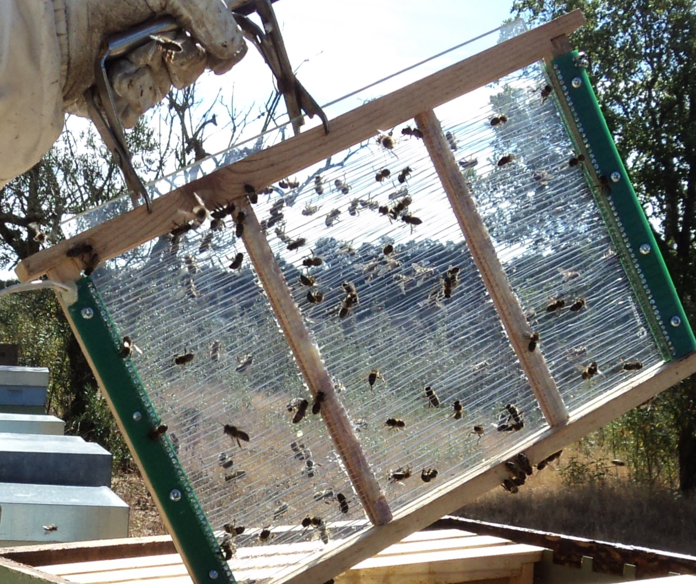

# Chapter 59 — Bee Venom

## Introduction

Honey bee venom, often called apitoxin, is a complex defensive secretion delivered through the sting apparatus of worker bees and queens. It contains peptides, enzymes, amines, and other small molecules. Major components include melittin, phospholipase A2, apamin, and several additional peptides and proteins whose proportions can vary with bee genetics, season, geography, colony condition, collection method, and storage.

Bee venom is unlike most other hive products because its defining biological function is to injure a perceived threat. That makes safety inseparable from production. Collection can increase defensive behaviour, expose workers and bystanders to stings, and generate a dry concentrated allergenic material that can contact skin, eyes, or airways. Severe Hymenoptera-venom allergy can cause life-threatening anaphylaxis.

Professional venom collection commonly uses purpose-built electrical collection equipment that stimulates workers to sting a collection membrane or glass surface. In many systems the sting does not remain embedded, allowing the worker to survive. The venom dries on the collection surface and is later recovered under controlled conditions. This handbook explains the principle, operational safeguards, quality control, and product handling; it does not provide instructions for constructing improvised high-voltage equipment.

Bee venom is also a medically important allergen. This must be distinguished from commercial apitoxin as a raw hive product. Venom immunotherapy for people with clinically significant Hymenoptera venom allergy uses standardised medicinal preparations under specialist medical supervision. It is not equivalent to deliberate bee stinging, raw venom injection, home “bee venom therapy”, or unregulated pharmacopuncture.

At the time of this 2026 edition, the quality references used here rely on peer-reviewed analytical standardisation work, good-manufacturing-practice principles, and national analytical methods rather than a single dedicated published ISO bee-venom product specification. Recent 2026 research is particularly important because it shows that melittin concentration alone can conceal substantial variation in phospholipase A2, moisture, and the wider biochemical profile. A serious quality system must therefore be multicomponent and traceable.

## Learning Objectives

After completing this chapter, the reader should be able to:

- explain the biological role of the honey bee venom apparatus;
- identify the principal biochemical classes in bee venom;
- understand the importance of melittin, phospholipase A2, apamin, and other components without reducing quality to one marker;
- distinguish raw bee venom from pharmaceutical allergen preparations and venom immunotherapy;
- describe the principle of professional electrical venom collection without constructing unsafe equipment;
- select a safe apiary and colony for collection;
- protect workers, bystanders, livestock, and neighbouring property from increased defensive activity;
- manage sting and anaphylaxis risks;
- collect, recover, dry, package, and store venom while controlling glass, dust, moisture, and biological contamination;
- understand occupational sensitisation and inhalation hazards;
- sample and characterise venom with chromatographic, enzymatic, protein, moisture, and contaminant methods;
- explain why melittin alone is not a complete quality specification;
- manage colony welfare and recovery between collection sessions;
- distinguish research on bee venom from authorised medicinal claims.

## 59.1 The Venom Apparatus

Worker honey bees possess a sting apparatus at the end of the abdomen.

It includes:

- the sting shaft and associated lancets;
- venom gland;
- venom reservoir;
- muscular and supporting structures.

When a worker stings, venom is delivered through the sting system into the target.

## 59.2 Worker and Queen Stings

Worker stings are strongly barbed and can remain embedded in elastic vertebrate skin, often causing the worker's death after the sting apparatus tears away.

Queen stings are less strongly barbed and are used mainly in queen-to-queen conflict rather than routine colony defence.

Commercial venom collection is based on workers.

## 59.3 Why Bees Produce Venom

Venom is a defensive adaptation.

It helps protect the colony against:

- vertebrate predators;
- competing insects;
- direct physical disturbance.

Alarm pheromones and social recruitment can amplify defence far beyond one individual sting.

## 59.4 Venom Is a Complex Mixture

Honey bee venom contains:

- peptides;
- enzymes;
- proteins;
- biogenic amines;
- small molecules.

The relative abundance of components varies naturally.

This variation matters for both biological activity and allergenicity.

## 59.5 Melittin

Melittin is a major peptide component of honey bee venom.

It is strongly membrane-active and contributes substantially to:

- pain;
- cell-membrane disruption;
- local inflammatory effects.

Because it is abundant and analytically accessible, melittin is often used as a quality marker.

## 59.6 Melittin Is Not the Whole Product

A batch with an apparently normal melittin value can still differ substantially in:

- phospholipase A2;
- apamin;
- moisture;
- minor peptides;
- enzymatic activity;
- degradation state.

A 2026 multibatch study demonstrated this “melittin-equivalence” problem and argued for multivariate quality assessment rather than one-marker standardisation.

## 59.7 Phospholipase A2

Phospholipase A2 (PLA2) is an enzymatic venom component and a major honey bee venom allergen, commonly designated Api m 1 in allergy diagnostics.

Its biological significance means a quality system concerned with allergenic or pharmaceutical material should not ignore it simply because melittin is easier to measure.

## 59.8 Apamin

Apamin is a small neuroactive peptide found in honey bee venom.

It blocks certain calcium-activated potassium channels and is important in research.

Its concentration is lower than melittin but remains relevant to chemical characterisation.

## 59.9 Other Components

Other constituents can include:

- mast-cell-degranulating peptide;
- adolapin;
- hyaluronidase;
- acid phosphatase;
- phosphatases and minor enzymes;
- histamine and other amines;
- additional allergenic proteins.

Venom quality cannot be represented fully by one percentage number.

## 59.10 Venom Allergens

Several venom proteins are recognised allergens.

Important diagnostic allergens include:

- phospholipase A2;
- hyaluronidase;
- acid phosphatase;
- other identified Api m components.

Allergen composition is central to medical venom products and occupational risk.

## 59.11 Sting Reactions

A sting can cause:

- immediate pain;
- redness;
- swelling;
- itching;
- a large local reaction;
- systemic allergy;
- anaphylaxis.

Reaction severity cannot be predicted simply from the number of previous uneventful stings.

## 59.12 Anaphylaxis

Anaphylaxis can include:

- breathing difficulty;
- throat or tongue swelling;
- wheeze;
- widespread hives;
- vomiting;
- dizziness;
- low blood pressure;
- collapse.

It is a medical emergency.

Call emergency medical services and follow the affected person's prescribed emergency plan.

## 59.13 Venom Immunotherapy Is Medical Treatment

Venom immunotherapy is an evidence-based allergy treatment using standardised venom preparations in a controlled medical programme.

It is used to reduce the risk of future systemic sting reactions in appropriately diagnosed patients.

It is not the same as raw apitoxin collection or deliberate unregulated bee stinging.

## 59.14 Do Not Self-Treat Venom Allergy

A beekeeper with systemic sting reactions should seek specialist medical assessment.

Do not attempt to “desensitise” yourself by intentionally receiving more stings or handling raw venom.

Such exposure can cause a severe reaction.

## 59.15 Occupational Sensitisation

Repeated exposure can sensitise some workers over time.

Risk is relevant to:

- beekeepers;
- venom collectors;
- processing staff;
- laboratory workers.

A person who previously tolerated stings can later develop allergy.

## 59.16 Pre-Collection Risk Assessment

Before collecting venom, assess:

- worker sting-allergy history;
- public access;
- neighbours;
- livestock/pets;
- colony temperament;
- weather;
- electrical equipment condition;
- emergency communications;
- vehicle access.

## 59.17 Site Selection

Venom collection should not be performed where increased defensive activity can expose:

- public footpaths;
- schools;
- neighbouring gardens;
- livestock pens;
- busy roads;
- unprotected workers.

Select a controlled site with sufficient separation.

## 59.18 Weather and Defensive Behaviour

Colony response can become more defensive during:

- cool weather;
- stormy conditions;
- dearth;
- queenlessness;
- predator pressure;
- repeated disturbance.

Do not assume a collection protocol safe on one calm day will be equally safe under all conditions.

## 59.19 Colony Temperament

Avoid using unusually defensive colonies simply because they sting collection equipment aggressively.

Commercial production must balance yield with:

- worker safety;
- neighbourhood safety;
- colony welfare;
- manageable genetics.

## 59.20 Colony Health

Production colonies should be:

- strong;
- queenright;
- healthy;
- nutritionally adequate;
- monitored for Varroa;
- free from serious brood disease.

Do not intensively stimulate collapsing colonies.

## 59.21 Principle of Electrical Venom Collection

Professional collection devices use controlled electrical stimulation across a grid or collection surface.

Workers contacting the system are stimulated to sting a membrane or glass collection area.

Venom is deposited on the surface and dries.

The device should be purpose-built, guarded, and operated according to the manufacturer's instructions.

*Photo 59.1 — Purpose-built venom collection equipment in real field use. The photograph shows one intensive collector-frame design being removed from a hive. It demonstrates the physical scale and field context of professional collection equipment without endorsing one model or providing electrical-construction instructions. Use purpose-built, guarded equipment according to its validated operating instructions and local safety requirements. Source: Serrinha, Correia & Marques, Journal of Open Innovation 5 (2019), Figure 6, CC BY 4.0.*

## 59.22 Why This Book Does Not Provide a DIY Circuit

Improvised electrical collectors can create:

- shock hazards;
- fire hazards;
- battery short circuits;
- excessive bee stimulation;
- unpredictable output;
- poor electrical insulation.

Use compliant commercial equipment or professionally engineered systems rather than copying an unverified circuit.

## 59.23 Collection Surface

Common collection systems use glass or another compatible non-reactive surface beneath/within the stimulation grid.

Requirements include:

- chemical cleanliness;
- smooth surface;
- easy recovery;
- resistance to corrosion;
- control of breakage and fragments.

## 59.24 Glass Safety

Glass collection plates create a physical hazard.

Inspect for:

- chips;
- cracks;
- edge damage.

If breakage occurs, treat surrounding venom as potentially contaminated with glass and do not release it without a validated foreign-body-control process.

## 59.25 Membrane Systems

Some collectors use thin membranes so bees sting through the material and venom reaches the plate below.

The membrane can reduce direct contamination but must be:

- suitable for the system;
- clean;
- free from additives that contaminate venom;
- replaced when damaged.

## 59.26 Collection Does Not Remove Every Sting

Many electrical collectors are designed so the worker stings a surface without leaving the sting apparatus behind.

This allows survival of many participating workers.

However, collection still imposes behavioural and energetic stress and can injure some bees.

## 59.27 Bee Welfare

Monitor colonies for:

- excessive agitation;
- prolonged defensive behaviour;
- abnormal mortality;
- queen disturbance;
- reduced foraging;
- weakened colony condition.

Collection frequency should be adjusted to avoid chronic stress.

## 59.28 Recovery Periods

Repeated continuous stimulation can maintain a colony in a defensive state.

Professional operations should use validated collection intervals and rest periods appropriate to:

- colony strength;
- season;
- weather;
- equipment;
- observed recovery.

Do not maximise session frequency solely by short-term venom yield.

## 59.29 Bystander Exclusion

During collection:

- restrict access;
- post warning signs where appropriate;
- keep unprotected people away;
- control pets/livestock;
- avoid unnecessary vehicle movement near colonies.

## 59.30 Protective Clothing

Collectors should use normal appropriate bee PPE and process-specific protection.

Depending on the operation, this can include:

- veil;
- suit/jacket;
- gloves;
- closed footwear;
- eye protection during dry-venom recovery;
- respiratory/dust controls if risk assessment requires them.

## 59.31 Dry Venom Is a Concentrated Allergen

Once dried, venom can become fine flakes or powder.

This can contact:

- skin;
- eyes;
- mucous membranes;
- respiratory tract.

Avoid creating airborne dust.

## 59.32 Venom Recovery

After the collection surface is removed and bees are no longer present, dried venom can be recovered under controlled clean conditions using purpose-built scraping/recovery tools.

The goal is to minimise:

- dust;
- glass fragments;
- environmental debris;
- hand contact;
- cross-lot mixing.

## 59.33 Scraping Tools

Use tools that are:

- clean;
- non-rusting;
- dedicated to venom;
- easy to inspect;
- compatible with the collection surface.

Damaged blades can create metal or glass contamination.

## 59.34 Eye Protection

Dry venom particles can irritate or sensitise eyes.

Eye protection is advisable during scraping or any step likely to release particles.

Do not blow venom dust from surfaces with compressed air.

## 59.35 Respiratory Exposure

Avoid inhaling dried venom powder.

Controls can include:

- low-dust scraping methods;
- local containment;
- suitable ventilation that does not spread powder;
- task-appropriate respiratory protection after formal risk assessment.

## 59.36 Skin Contact

Raw venom on broken or sensitised skin can cause reactions.

Use appropriate gloves and avoid touching the face or eyes during processing.

Wash exposed skin according to workplace procedures.

## 59.37 No Food or Drink in Processing Area

Venom processing should be separated from:

- eating;
- drinking;
- smoking/vaping;
- food preparation.

This reduces accidental ingestion and surface contamination.

## 59.38 Batch Identity

A venom batch should record:

- apiary;
- colony/group;
- date;
- collection device;
- session duration per validated SOP;
- weather;
- raw dry mass;
- operator;
- storage container;
- processing/analysis lot.

## 59.39 Collection Yield

Yield depends on:

- colony population;
- genetics;
- season;
- equipment;
- stimulation protocol;
- collection duration;
- prior collection frequency;
- temperature and weather.

Compare yield together with colony condition.

## 59.40 Colour and Appearance

Dried bee venom is often described as a pale or off-white to light-yellow material, but colour varies with:

- collection surface;
- contamination;
- oxidation;
- storage;
- bee/source differences.

Colour alone is not a purity test.

## 59.41 Moisture

Dry venom quality is influenced by residual moisture.

Excess moisture can contribute to:

- protein degradation;
- clumping;
- microbial growth in contaminated material;
- analytical instability.

Use a validated moisture method and specification where relevant.

## 59.42 Hygroscopic Handling

Dry biological powders can absorb moisture from humid air.

Keep containers open only as long as necessary during recovery and weighing.

## 59.43 Light and Oxidation

Protect venom from unnecessary light and oxygen exposure.

Sensitive peptides and enzymes can change during poor storage.

Use compatible tightly sealed containers.

## 59.44 Temperature

Low-temperature storage is commonly used to preserve biological activity and protein/peptide integrity.

Exact conditions should be based on:

- intended product;
- buyer specification;
- analytical stability data;
- pharmaceutical requirements where applicable.

## 59.45 Avoid Repeated Temperature Cycling

Repeated warming and cooling can introduce:

- condensation;
- moisture uptake;
- protein degradation;
- handling contamination.

Remove only the amount required for work when possible.

## 59.46 Packaging

Primary containers should be:

- chemically compatible;
- tightly sealed;
- low moisture-permeability;
- clean;
- clearly labelled;
- suitable for intended storage temperature.

## 59.47 Small Containers

Dividing a bulk lot into smaller validated containers can reduce repeated opening of the main lot.

It also increases filling and labelling work.

## 59.48 Melittin as a Quality Marker

Melittin is useful because it is abundant and can be measured by chromatographic methods.

It can support:

- identity;
- batch comparison;
- degradation studies;
- buyer specifications.

It should not be treated as a complete quality certificate.

## 59.49 The Melittin-Equivalence Problem

A 2026 study of multiple venom batches found that samples with similar melittin could differ substantially in:

- phospholipase A2;
- moisture;
- multicomponent chemical profile.

This means a single-marker specification can miss differences important to safety, allergenicity, and function.

## 59.50 Phospholipase A2 Measurement

PLA2 can be assessed through:

- chromatographic concentration;
- enzymatic activity;
- immunological methods in specialised contexts.

Chemical quantity and enzyme activity are related but not identical measurements.

## 59.51 Apamin Measurement

Apamin can be quantified chromatographically.

Because concentrations are lower than melittin, analytical sensitivity and reference standards matter.

## 59.52 HPLC

High-performance liquid chromatography is widely used for venom component analysis.

A validated method should define:

- standards;
- column/system;
- detection;
- calibration;
- precision;
- accuracy;
- recovery;
- detection/quantification limits.

## 59.53 LC-MS and Proteomics

Mass spectrometry can characterise a wider range of peptides and proteins.

Uses include:

- identity;
- contamination detection;
- proteomic fingerprinting;
- research on geographic/genetic variation.

## 59.54 Capillary Electrophoresis

Capillary-electrophoresis methods have also been developed for venom peptides and enzymes.

They provide an alternative or complementary separation technology to HPLC.

## 59.55 Multivariate Quality Assessment

A stronger specification can combine:

- melittin;
- PLA2;
- apamin;
- moisture;
- other peptides/proteins;
- enzymatic activity;
- contamination data;
- batch traceability.

Chemometrics can help compare complex profiles without reducing the product to one marker.

## 59.56 National Analytical Standards

Some countries publish specific methods for venom analysis. For example, China's GB/T 40486-2021 provides an HPLC method for determining melittin in dried bee-venom powder.

Such standards are useful analytical references but should not be misrepresented as global product specifications.

## 59.57 No Universal Composition Number

Published venom composition percentages vary because of:

- bee subspecies/population;
- season;
- analytical method;
- collection method;
- storage;
- sample preparation.

Use validated lot-specific analysis for commercial specifications.

## 59.58 Microbiological Quality

Dry venom is not automatically sterile.

Microbial contamination can enter through:

- dirty collection surfaces;
- dust;
- tools;
- containers;
- hands;
- moisture exposure.

Pharmaceutical or research products can require much stricter microbiological limits.

## 59.59 Foreign Bodies

Potential foreign material includes:

- glass;
- metal;
- bee parts;
- dust;
- fibres;
- membrane fragments.

Foreign-body control should be designed into collection and recovery.

## 59.60 Pesticide and Environmental Contamination

Venom itself is glandularly produced, but processing and colony exposure can still create contamination concerns.

Risk-based testing can include:

- pesticides;
- heavy metals;
- environmental pollutants;
- cleaning residues.

## 59.61 Cleaning the Collection Device

Clean according to manufacturer or validated SOP.

Requirements include:

- complete removal of old venom;
- no detergent residue;
- no corroded electrical contacts contaminating product;
- complete drying before use;
- inspection of glass/membranes.

## 59.62 Do Not Wash Product Off the Plate for Raw-Powder Production

Raw dried-venom production relies on controlled recovery from the collection surface.

Adding unvalidated water or solvent changes the product form, stability, and analytical basis.

## 59.63 Cross-Lot Carryover

Residual venom from one collection can enter the next batch.

When lot identity matters, cleaning and line clearance should be documented.

## 59.64 Supplier Approval

If buying venom, request:

- bee species/source;
- country/region;
- collection method;
- melittin and multicomponent analysis;
- moisture;
- microbiology where relevant;
- storage history;
- contaminant testing;
- lot identity.

## 59.65 Certificate of Analysis

A CoA can include:

- melittin;
- PLA2 content/activity;
- apamin;
- moisture;
- protein profile;
- microbiology;
- heavy metals;
- residues;
- appearance;
- lot identity;
- analytical methods.

## 59.66 Sampling

Dry venom powder may not be perfectly homogeneous if material from multiple plates or colonies is blended.

A sampling plan should define:

- lot size;
- number of increments;
- mixing procedure;
- sample container;
- temperature/moisture protection.

## 59.67 Retained Samples

Retained samples can support:

- identity confirmation;
- stability review;
- complaint investigation;
- analytical disputes;
- research comparison.

## 59.68 Adulteration

Possible fraud includes:

- dilution with foreign powders;
- addition of isolated melittin to manipulate one marker;
- substitution with non-honey-bee material;
- false country/source claims;
- blending undeclared low-grade batches.

Multicomponent fingerprints and traceability reduce this risk.

## 59.69 Why High Melittin Does Not Prove Authenticity

A product can be manipulated to contain a target amount of melittin while lacking the broader authentic venom profile.

Identity should include multiple natural constituents and provenance.

## 59.70 Bee Venom as Pharmaceutical Starting Material

Venom can be a starting material for regulated pharmaceutical, diagnostic, research, or immunotherapy products.

Such uses require much stricter controls than ordinary hive-product trade, including:

- GMP where applicable;
- standardised raw material;
- validated purification;
- sterility/endotoxin controls for injectable products;
- regulatory authorisation.

## 59.71 Raw Venom Is Not an Injectable Medicine

A dry venom powder harvested from hive collectors should never be assumed safe for injection.

Injectable medicines require specialised manufacture, dose control, sterility, formulation, and clinical oversight.

## 59.72 Bee Venom Therapy Claims

Research investigates venom components in areas including:

- inflammation;
- pain;
- neuroscience;
- cancer biology;
- antimicrobial effects.

Laboratory or animal findings do not authorise self-treatment or unregulated injection/stinging protocols.

## 59.73 Venom Acupuncture and Pharmacopuncture

These practices exist in some medical traditions and research settings.

Their regulation and evidence base differ by country.

They should not be performed by beekeepers using raw collected venom as a home medical product.

## 59.74 Venom Immunotherapy

Venom immunotherapy is a distinct, evidence-based allergy treatment administered by trained healthcare professionals using standardised allergen products.

EAACI guidance identifies it as the only treatment that prevents future systemic sting reactions in appropriately selected venom-allergic patients.

## 59.75 Adrenaline/Epinephrine Auto-Injectors

People prescribed an adrenaline auto-injector should follow their medical emergency plan and training.

A beekeeper should not prescribe, share, or improvise medication for another person.

Call emergency medical services for suspected anaphylaxis.

## 59.76 Emergency Plan at the Apiary

Before venom collection begins, establish:

- exact site/access information;
- mobile phone coverage;
- emergency contact procedure;
- first-aid supplies;
- worker medical disclosures managed appropriately;
- route for emergency vehicles.

## 59.77 Multiple Stings

Large numbers of stings can cause toxic systemic effects even in people without IgE-mediated allergy.

Seek urgent medical care for:

- numerous stings;
- stings in mouth/throat;
- systemic symptoms;
- vulnerable individuals.

## 59.78 Stingers in Skin

For ordinary bee stings, remove a retained sting promptly using a practical method that does not delay removal.

The priority is speed of removal rather than a prolonged debate about scraping versus pinching.

Then monitor for systemic symptoms.

## 59.79 Collection Near Other Apiary Work

Venom collection can make colonies more defensive temporarily.

Avoid scheduling it immediately before:

- public demonstrations;
- beginner training;
- queen-handling sessions;
- other tasks requiring unusually calm colonies.

## 59.80 Apiary Signage and Neighbours

Where collection changes local sting risk, use appropriate warning and communication under local land-use and safety requirements.

Good neighbour relations are part of risk management.

## 59.81 Electrical Inspection

Before each collection session, inspect commercial equipment for:

- damaged insulation;
- exposed conductors;
- cracked housings;
- wet electrical connections;
- damaged batteries/chargers;
- broken collection plates.

Do not operate damaged equipment.

## 59.82 Wet Conditions

Electric collection equipment should not be operated outside its rated environmental conditions.

Rain and wet surfaces can increase electrical risk and alter colony behaviour.

Follow manufacturer guidance.

## 59.83 Battery Safety

Use the battery type and charger specified for the equipment.

Incorrect charging or damaged batteries can cause:

- fire;
- overheating;
- leakage;
- electric faults.

## 59.84 Maintenance

Keep maintenance records for:

- collector unit;
- leads;
- plates;
- protective grids;
- batteries;
- cleaning.

Retire damaged components rather than improvising repairs in the field.

## 59.85 Colony Recovery Monitoring

After collection, observe:

- entrance behaviour;
- defensive response;
- mortality;
- foraging recovery;
- queen status if concern arises.

Collection should not be treated as finished merely because the plate was removed.

## 59.86 Production Metrics

Useful records include:

- venom mass per session;
- venom mass per colony/group;
- collection time;
- component profile;
- colony mortality/stress observations;
- labour time;
- rejected batches.

## 59.87 Economics

Bee venom is a low-volume, high-value product but requires substantial costs for:

- safe collection equipment;
- PPE;
- controlled processing;
- laboratory testing;
- cold/dry storage;
- legal compliance;
- specialised buyers.

High advertised retail prices do not represent what every beekeeper can realistically obtain for raw venom.

## 59.88 Market Verification

Before investing heavily, verify:

- legitimate buyer;
- required specification;
- minimum lot size;
- analytical requirements;
- country/import rules;
- product liability;
- contract price.

Do not produce a hazardous specialised material first and search for a buyer afterwards.

## 59.89 Decision Table

| Observation | Main concern | Response |
|---|---|---|
| Calm strong healthy colony, controlled site | Suitable candidate | Collect under validated SOP and monitor recovery |
| Public/livestock activity nearby | Bystander sting risk | Do not collect until exclusion/siting is controlled |
| Damaged electrical insulation | Shock/fire risk | Remove equipment from service |
| Collector causes prolonged extreme aggression | Colony/welfare/safety problem | Stop session and review protocol/equipment |
| Powder becomes airborne during scraping | Allergen exposure | Stop and improve containment/PPE/process |
| Similar melittin but very different PLA2/moisture | Quality inconsistency | Use multicomponent specification |
| Consumer asks to inject raw venom | Severe medical risk | Do not provide medical-use instructions; refer to qualified care |
| Worker shows systemic allergic symptoms | Possible anaphylaxis | Emergency medical response immediately |

## 59.90 Practical Professional Collection Framework

### Before collection

- select strong healthy manageable colonies;
- choose controlled site;
- exclude bystanders/livestock;
- confirm emergency plan;
- inspect commercial collector, wiring, battery, and plate;
- prepare clean labelled product containers and PPE.

### Collection

1. install collector according to manufacturer/SOP;
2. operate only within rated conditions;
3. observe colony behaviour continuously;
4. stop if aggression, weather, equipment, or bystander risk becomes unacceptable;
5. remove collector safely after the validated session;
6. allow colonies to recover.

### Venom recovery

7. move collection plate to controlled clean area;
8. wear suitable eye/skin/dust protection;
9. recover dried venom with low-dust dedicated tools;
10. prevent glass/metal contamination;
11. weigh and label batch;
12. seal promptly against moisture;
13. transfer to validated cold/dry storage;
14. clean and inspect equipment before next lot.

## 59.91 Quality-Control Framework

For each commercial batch, define:

- bee/source identity;
- collection method;
- appearance;
- moisture;
- melittin;
- PLA2 content/activity;
- apamin or wider peptide profile where required;
- microbiology/foreign matter;
- contaminants;
- storage conditions;
- analytical method;
- retained sample.

## 59.92 Scientific Notes

### Venom is multicomponent by design

Natural defensive function depends on interacting peptides and enzymes. Quality systems based only on abundance of the largest peptide can miss meaningful biological variation.

### Allergenicity and “potency” are not the same thing

PLA2 is both biologically active and a major allergen. A batch cannot be judged simply as stronger or weaker from melittin alone.

### Geography and season matter

Bee populations, forage environment, age structure, and collection season can influence venom profiles. Standardisation therefore requires batch analysis and provenance.

### Medical venom products are manufactured products

Allergen extracts, antivenom antigens, and investigational purified components require controlled purification and GMP-type systems beyond apiary collection.

### Sensitisation can develop over time

Allergic status is not fixed. Repeated occupational exposure can change risk, reinforcing the need for medical assessment after systemic reactions.

## 59.93 Bee-Venom Checklist

- [ ] Buyer/specification confirmed before production.
- [ ] Strong healthy manageable colonies selected.
- [ ] Public/livestock exclusion controlled.
- [ ] Worker allergy history/emergency plan addressed appropriately.
- [ ] Commercial/professionally engineered collector used.
- [ ] Electrical insulation and battery checked.
- [ ] Weather within equipment rating.
- [ ] PPE appropriate for stings and dry venom.
- [ ] Colony behaviour monitored during session.
- [ ] Recovery period provided.
- [ ] Collection plates intact and clean.
- [ ] Glass/metal foreign-body control active.
- [ ] Dry venom handled with low-dust method.
- [ ] Skin/eye/inhalation exposure minimised.
- [ ] Batch labelled immediately.
- [ ] Moisture exposure controlled.
- [ ] Storage condition validated.
- [ ] Quality specification uses more than melittin alone where intended use requires it.
- [ ] Raw venom never represented as an injectable medicine.
- [ ] Medical/therapeutic claims reviewed by competent regulatory framework.

## Key Takeaways

- Honey bee venom is a complex defensive secretion containing peptides, enzymes, proteins, and small molecules.
- Melittin is important but does not represent the whole venom quality profile.
- Phospholipase A2 is a major venom enzyme and a major allergen.
- Recent 2026 evidence shows batches with similar melittin can differ substantially in PLA2, moisture, and broader chemistry.
- Professional venom collection requires purpose-built electrical equipment and controlled apiary access; this book does not recommend DIY high-voltage construction.
- Dry venom is a concentrated occupational allergen and should be handled with skin, eye, and dust controls.
- Collection can increase colony defensiveness, so bee welfare, recovery, and bystander safety are central production variables.
- Venom immunotherapy is a regulated specialist medical treatment and is not equivalent to raw venom or deliberate bee stinging.
- Raw apiary venom is not an injectable medicine.
- A professional product requires multicomponent analysis, traceability, controlled storage, safe collection, and legitimate market specifications.

## Chapter Summary

Bee-venom production is a specialised field in which biological, occupational, electrical, and medical hazards overlap. The product is generated by the colony's defensive system, and collection deliberately stimulates that system. Safe production therefore begins with controlled siting, manageable colonies, exclusion of bystanders, appropriate PPE, an emergency plan, and professionally engineered collection equipment.

The recovered product is a concentrated allergenic biological material. Dry flakes or powder must be protected from moisture, foreign bodies, light, and uncontrolled contact with skin, eyes, and airways. Batch identity and storage history are essential.

Analytically, modern evidence argues against reducing quality to melittin alone. Melittin is useful, but phospholipase A2, apamin, moisture, enzymatic activity, minor components, contaminants, and multivariate chemical profiles can all matter. The 2026 “melittin-equivalence” research demonstrates why two nominally similar lots can be substantially different products.

Finally, commercial venom must remain separate from medical practice. Venom immunotherapy uses standardised medicinal allergens under specialist supervision and is an evidence-based treatment for appropriate venom-allergic patients. Raw collected apitoxin, home injections, or intentional stinging are not substitutes. Professional bee-venom production therefore depends on safety, multicomponent quality control, colony welfare, traceability, and strict boundaries around medical claims.

## Review Questions

1. What is bee venom?
2. What are the main anatomical parts of the worker sting apparatus?
3. Why do worker bees often die after stinging vertebrate skin?
4. How does a queen sting differ functionally?
5. What is the biological purpose of venom?
6. Name four major bee-venom components.
7. What is melittin?
8. Why is melittin commonly measured?
9. Why is melittin not a complete quality specification?
10. What is phospholipase A2?
11. Why is PLA2 important in allergy?
12. What is apamin?
13. Name three other venom components.
14. What can a normal local sting reaction look like?
15. What is anaphylaxis?
16. Name four anaphylaxis warning signs.
17. What should happen when anaphylaxis is suspected?
18. What is venom immunotherapy?
19. Who should administer venom immunotherapy?
20. Why is raw bee venom not equivalent to immunotherapy?
21. Why should a beekeeper not self-desensitise by intentional stings?
22. What is occupational sensitisation?
23. Can allergy develop after years of tolerated stings?
24. What belongs in a pre-collection risk assessment?
25. Which sites are unsuitable for venom collection?
26. How can weather influence defensive behaviour?
27. Why should exceptionally defensive colonies not be selected only for yield?
28. Which colony-health criteria matter?
29. What is the general principle of electrical venom collection?
30. Why does this handbook avoid DIY collector circuitry?
31. What qualities should the collection surface have?
32. What risk is created by cracked glass?
33. What is a collection membrane?
34. Why can many workers survive electrical collection?
35. Does survival mean collection is stress-free?
36. Which colony-welfare signs should be monitored?
37. Why are recovery periods important?
38. How should bystanders be excluded?
39. Which PPE can be relevant?
40. Why is dried venom an occupational hazard?
41. How can dry venom expose the respiratory tract?
42. What is the goal during venom recovery from the plate?
43. What qualities should scraping tools have?
44. Why is eye protection important?
45. Why should compressed air not be used to blow venom dust?
46. Why should skin contact be minimised?
47. Why should food and drink be excluded from processing areas?
48. Which fields belong in a venom batch record?
49. Which variables influence collection yield?
50. Is venom colour a purity test?
51. Why is residual moisture important?
52. How can dry venom absorb atmospheric moisture?
53. Why protect venom from light and oxygen?
54. Why can low-temperature storage be useful?
55. Why should repeated temperature cycling be avoided?
56. What qualities should primary packaging have?
57. What is one advantage of smaller containers?
58. What can melittin analysis establish?
59. What is the melittin-equivalence problem?
60. Why should PLA2 be measured in some specifications?
61. What is the difference between PLA2 content and enzymatic activity?
62. How can apamin be measured?
63. What does HPLC contribute?
64. What is required for a validated HPLC method?
65. What can LC-MS/proteomics contribute?
66. What can capillary electrophoresis contribute?
67. What is multivariate quality assessment?
68. Which variables can belong in a multicomponent specification?
69. What is GB/T 40486-2021 an example of?
70. Why should a national analytical method not be called a global product standard?
71. Why is there no one universal natural venom composition percentage?
72. Is dry venom sterile?
73. Which foreign bodies can contaminate venom?
74. How can environmental contamination enter a batch?
75. What should cleaning of a collector accomplish?
76. Why should detergent residue be avoided?
77. Why should raw powder not be casually washed off the plate with water?
78. What is cross-lot carryover?
79. What should be checked when buying venom from a supplier?
80. What can a venom CoA contain?
81. Why can a blended powder require multiple sample increments?
82. What are retained samples useful for?
83. How can bee venom be adulterated?
84. Why does high melittin not prove authenticity?
85. What additional requirements apply to pharmaceutical starting material?
86. Why is raw apiary venom not injectable medicine?
87. Why do laboratory cancer or anti-inflammatory studies not authorise self-treatment?
88. What is the difference between pharmacopuncture research and beekeeper practice?
89. What does EAACI identify as the preventive treatment for future systemic sting reactions in appropriate patients?
90. What should a person with a prescribed adrenaline auto-injector follow?
91. Why can many stings be medically dangerous even without allergy?
92. What is the priority when a bee sting remains in the skin?
93. Why should venom collection not precede a public apiary demonstration?
94. What should be inspected electrically before a session?
95. Why should equipment not be used in unapproved wet conditions?
96. Why must battery type and charger match the equipment?
97. What should be monitored after collection ends?
98. Which economic costs make bee-venom production specialised?
99. Why should a buyer and specification be confirmed before investing in production?
100. What combination of safety, colony welfare, multicomponent analysis, and medical-boundary discipline defines professional bee-venom production?

## References

- European Academy of Allergy and Clinical Immunology (EAACI). *Guidelines on allergen immunotherapy: Hymenoptera venom allergy*. *Allergy* 73(4), 2018, 744–764; current EAACI reference resource accessed September 2026.
- “Chemometric-based analytical standardization of bee venom: Resolving the melittin-equivalence paradox through multivariate quality assurance.” *Journal of Chromatography B*, 2026, 125207. DOI: 10.1016/j.jchromb.2026.125207.
- “Standardized guidelines for Africanized honeybee venom production needed for development of new apilic antivenom.” 2024 peer-reviewed production/standardisation guidance indexed in PubMed.
- “New CZE-DAD method for honeybee venom analysis and standardization of the product.” *Analytical and Bioanalytical Chemistry*, 2011, with HPLC/capillary-electrophoresis analytical framework for major venom components.
- GB/T 40486-2021. *Determination of melittin content in bee venom powder — High performance liquid chromatography*. Current Chinese national analytical method, implemented 2022.
- Current proteomic, chromatographic, allergen, melittin, phospholipase A2, apamin, and bee-venom composition literature.
- Current national occupational-safety, electrical-equipment, product-liability, medicinal-product, allergen-immunotherapy, pharmaceutical-GMP, laboratory, and transport requirements must be verified for the intended market and use.