# Wave 01 Visual Gallery

**Actual SVG assets in repository:** 94  
**A_CORE figure IDs with actual assets:** 68 / 68  
**High-fidelity A_CORE assets still unproduced:** 0

Tap any image or Open SVG to inspect it at full vector resolution.

## Chapter 21

### Figure 21.1 — Protective Clothing System

<a href="../../assets/diagrams/wave-01/fig-21-1-protective-clothing-system.svg">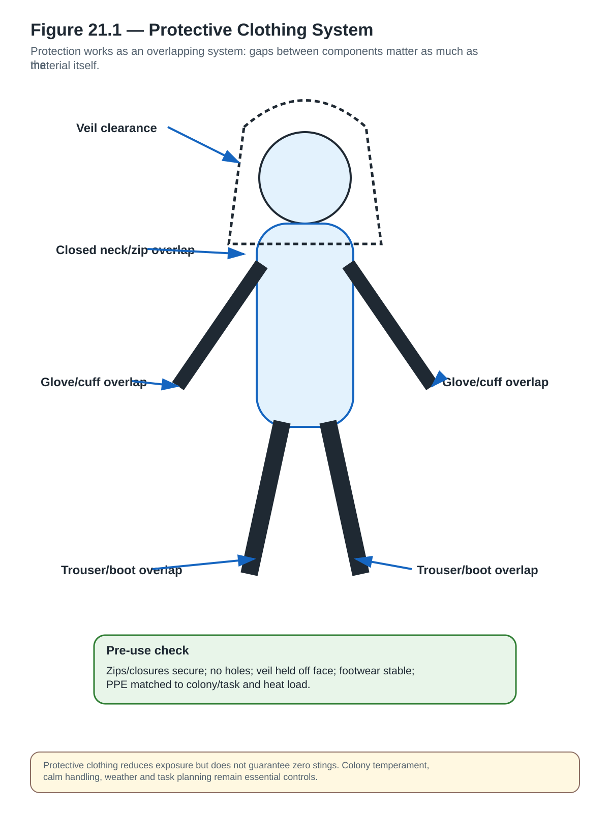</a>

**Figure 21.1** · SEMANTIC_COLOR_V1 · PENDING_FINAL_LAYOUT_PROOF · [Open SVG](../../assets/diagrams/wave-01/fig-21-1-protective-clothing-system.svg)

Body-map diagram showing veil, suit or jacket, wrist and ankle closures, gloves and footwear as overlapping layers rather than a guarantee of no stings.

### Figure 21.2 — Veil Clearance

<a href="../../assets/diagrams/wave-01/fig-21-2-veil-clearance.svg">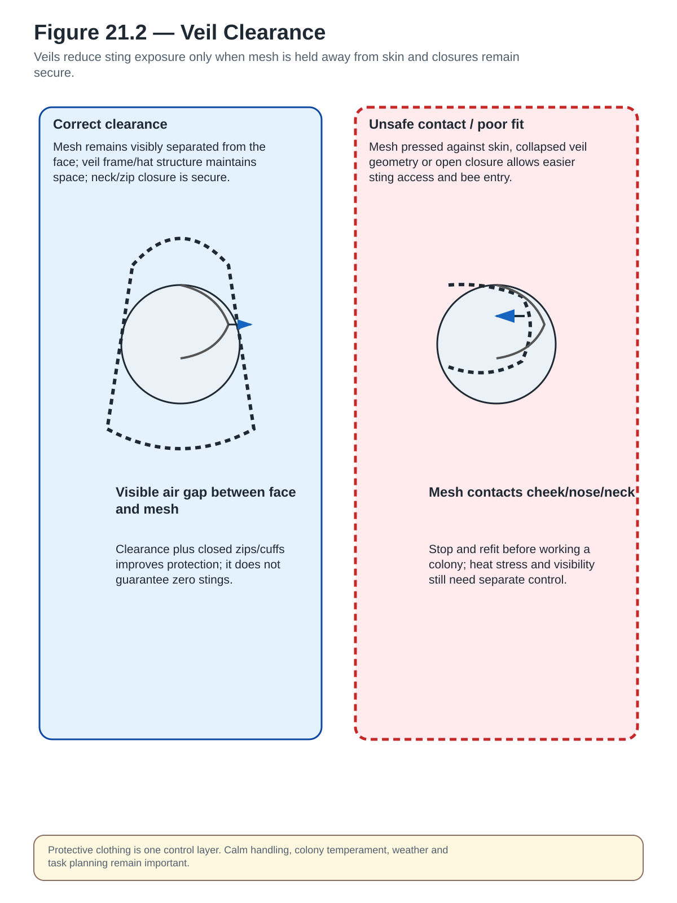</a>

**Figure 21.2** · SEMANTIC_COLOR_V1 · PENDING_FINAL_LAYOUT_PROOF · [Open SVG](../../assets/diagrams/wave-01/fig-21-2-veil-clearance.svg)

Comparison of safe veil clearance from the face versus mesh pressed against skin where stings can penetrate more readily.

### Figure 21.3 — Clothing Selection by Task

<a href="../../assets/diagrams/wave-01/fig-21-3-clothing-selection-by-task.svg">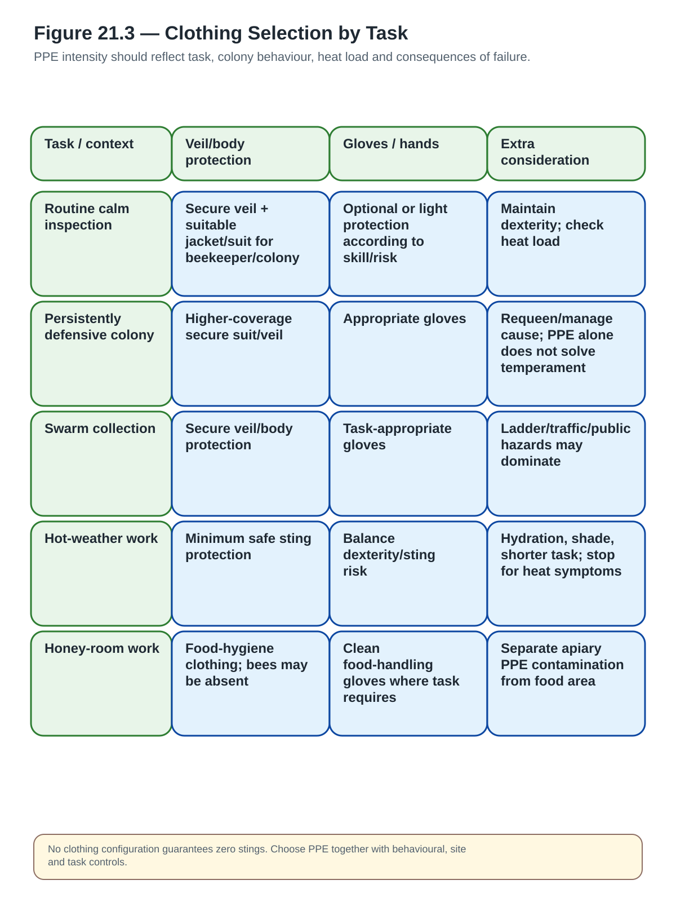</a>

**Figure 21.3** · SEMANTIC_COLOR_V1 · PENDING_FINAL_LAYOUT_PROOF · [Open SVG](../../assets/diagrams/wave-01/fig-21-3-clothing-selection-by-task.svg)

Matrix matching protective clothing considerations to routine inspections, defensive colonies, swarm collection, hot weather and honey-room work.

### Figure 21.4 — Pre-Inspection PPE Check

<a href="../../assets/diagrams/wave-01/fig-21-4-pre-inspection-ppe-check.svg">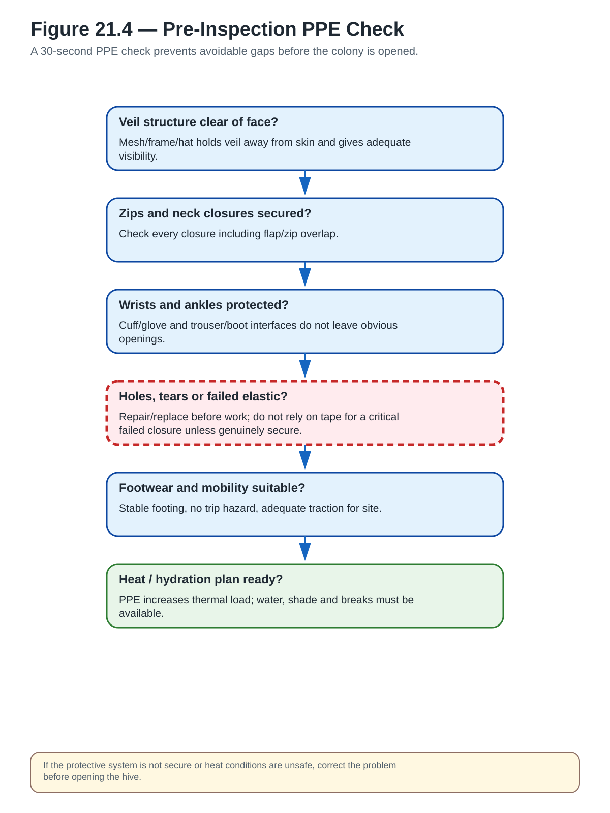</a>

**Figure 21.4** · SEMANTIC_COLOR_V1 · PENDING_FINAL_LAYOUT_PROOF · [Open SVG](../../assets/diagrams/wave-01/fig-21-4-pre-inspection-ppe-check.svg)

Six-point pre-inspection protective-clothing check.

## Chapter 22

### Figure 22.1 — Smoker Anatomy

<a href="../../assets/diagrams/wave-01/fig-22-1-smoker-anatomy.svg">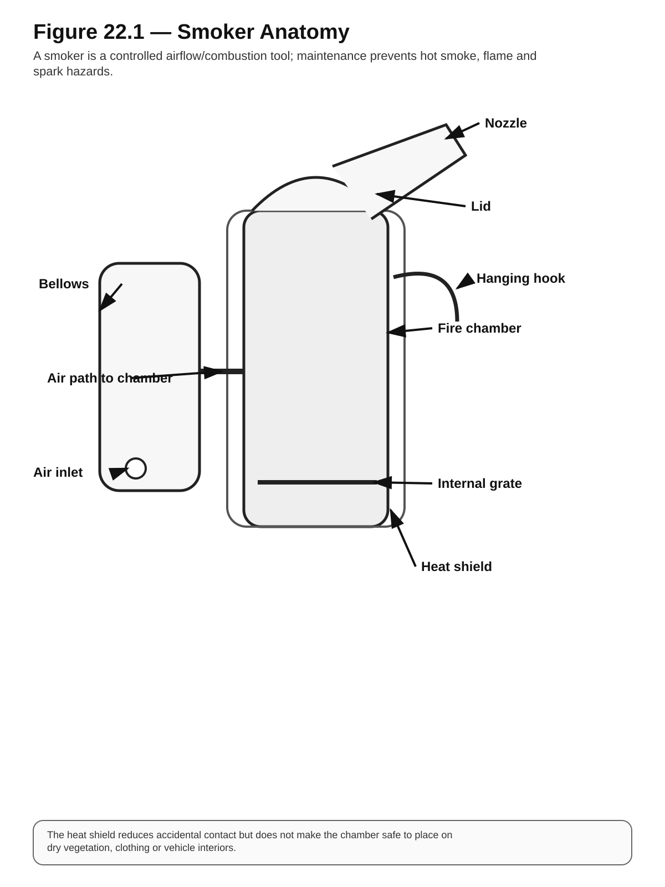</a>

**Figure 22.1** · SEMANTIC_COLOR_V1 · PENDING_FINAL_LAYOUT_PROOF · [Open SVG](../../assets/diagrams/wave-01/fig-22-1-smoker-anatomy.svg)

Labelled technical schematic of a bee smoker showing lid and nozzle, fire chamber, internal grate, heat shield, bellows, air inlet and hanging hook.

### Figure 22.3 — Suitable Versus Unsuitable Smoker Fuels

<a href="../../assets/diagrams/wave-01/fig-22-3-smoker-fuels.svg">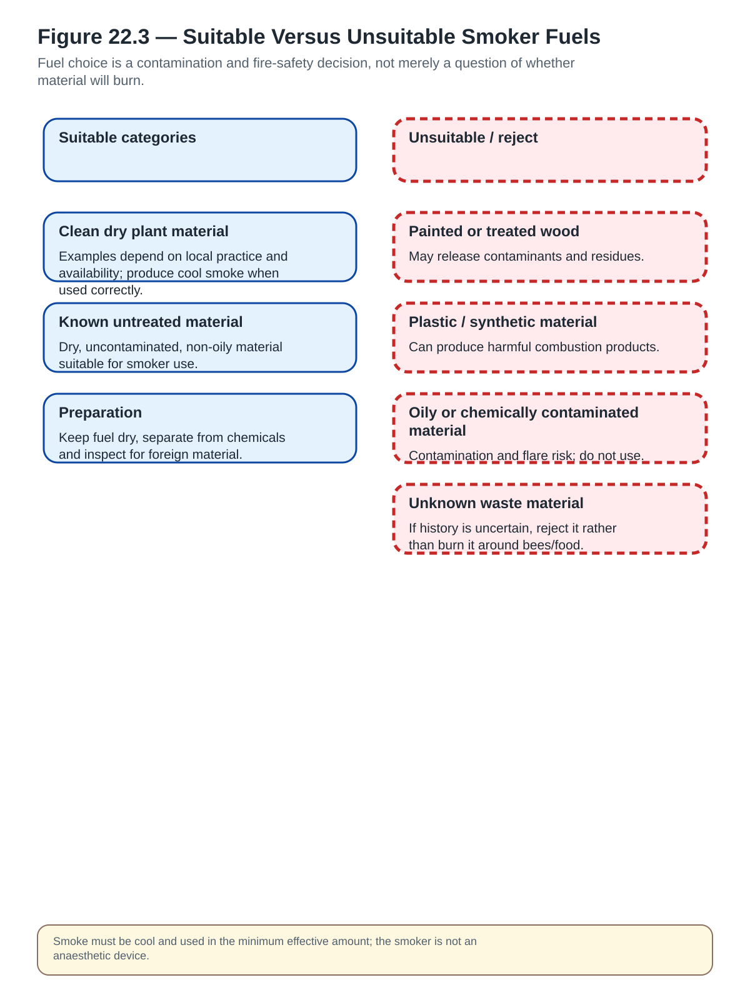</a>

**Figure 22.3** · SEMANTIC_COLOR_V1 · PENDING_FINAL_LAYOUT_PROOF · [Open SVG](../../assets/diagrams/wave-01/fig-22-3-smoker-fuels.svg)

Two-column comparison of clean dry plant-based smoker fuels with painted, treated, plastic, oily, chemically contaminated or unknown waste material.

### Figure 22.4 — Smoker-Lighting Sequence

<a href="../../assets/diagrams/wave-01/fig-22-4-smoker-lighting-sequence.svg">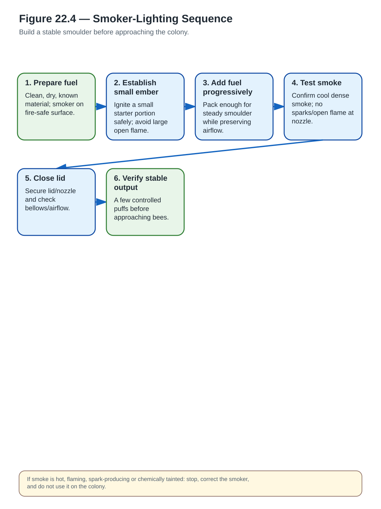</a>

**Figure 22.4** · SEMANTIC_COLOR_V1 · PENDING_FINAL_LAYOUT_PROOF · [Open SVG](../../assets/diagrams/wave-01/fig-22-4-smoker-lighting-sequence.svg)

Six-step smoker lighting sequence from fuel preparation to stable cool-smoke verification.

### Figure 22.6 — Hot-Smoker and Fire-Safety Zone

<a href="../../assets/diagrams/wave-01/fig-22-6-hot-smoker-fire-safety-zone.svg">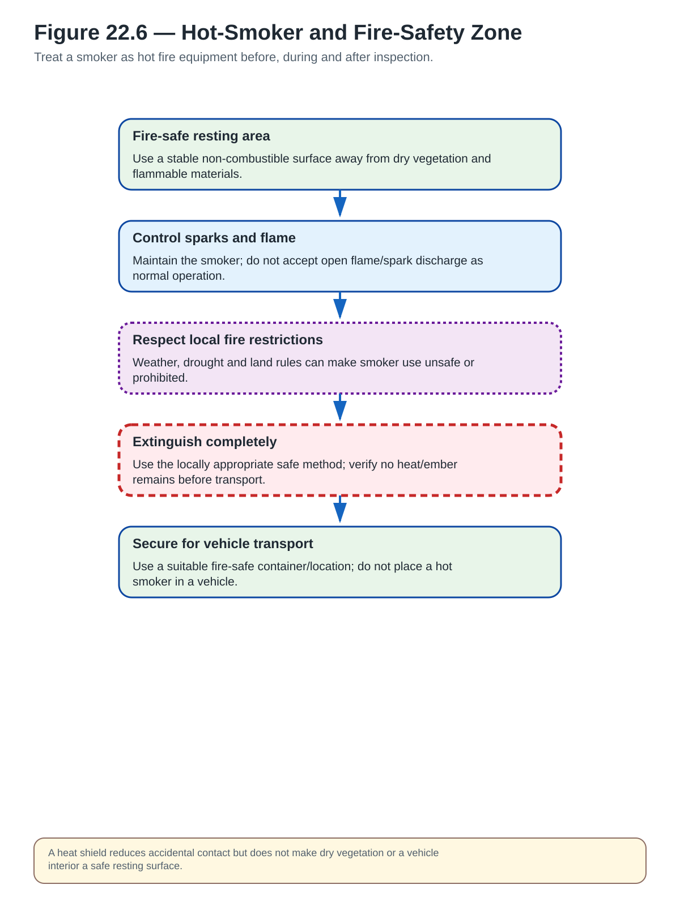</a>

**Figure 22.6** · SEMANTIC_COLOR_V1 · PENDING_FINAL_LAYOUT_PROOF · [Open SVG](../../assets/diagrams/wave-01/fig-22-6-hot-smoker-fire-safety-zone.svg)

Fire-safety flow for hot smoker resting, spark control, fire restrictions, extinguishing and vehicle transport.

## Chapter 23

### Figure 23.1 — Apiary Hazard Map

<a href="../../assets/diagrams/wave-01/fig-23-1-apiary-hazard-map.svg">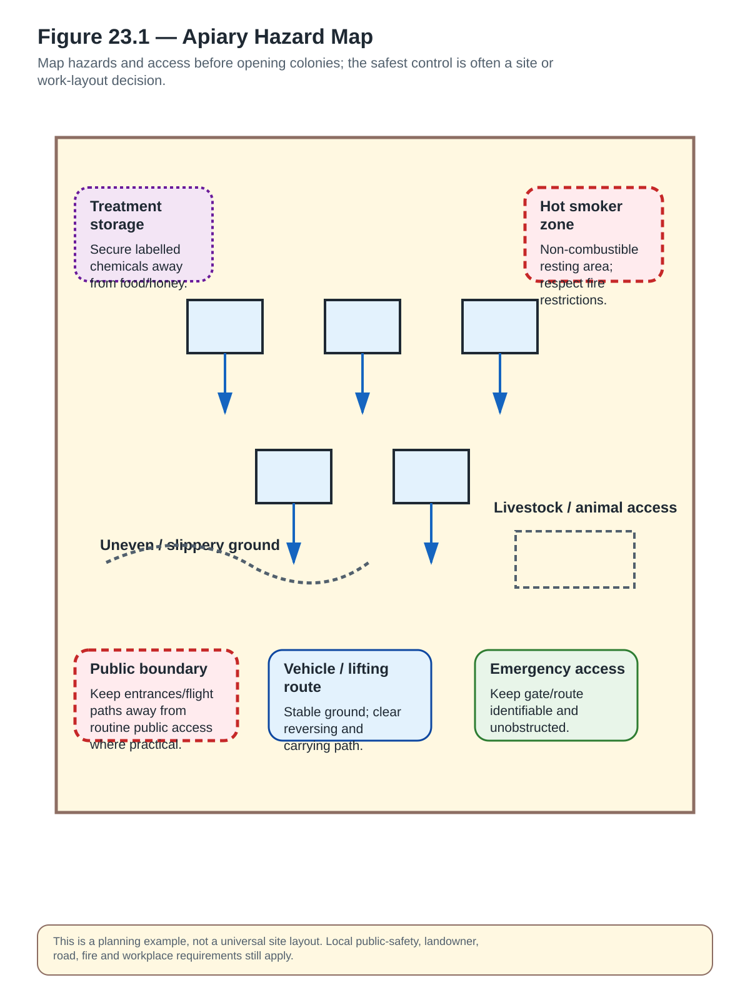</a>

**Figure 23.1** · SEMANTIC_COLOR_V1 · PENDING_FINAL_LAYOUT_PROOF · [Open SVG](../../assets/diagrams/wave-01/fig-23-1-apiary-hazard-map.svg)

Plan-view apiary hazard map showing flight paths, public access, vehicle route, livestock, uneven ground, smoker/fire zone, treatment chemical zone, lifting points and emergency access.

### Figure 23.2 — Simple Risk-Assessment Sequence

<a href="../../assets/diagrams/wave-01/fig-23-2-risk-assessment-sequence.svg">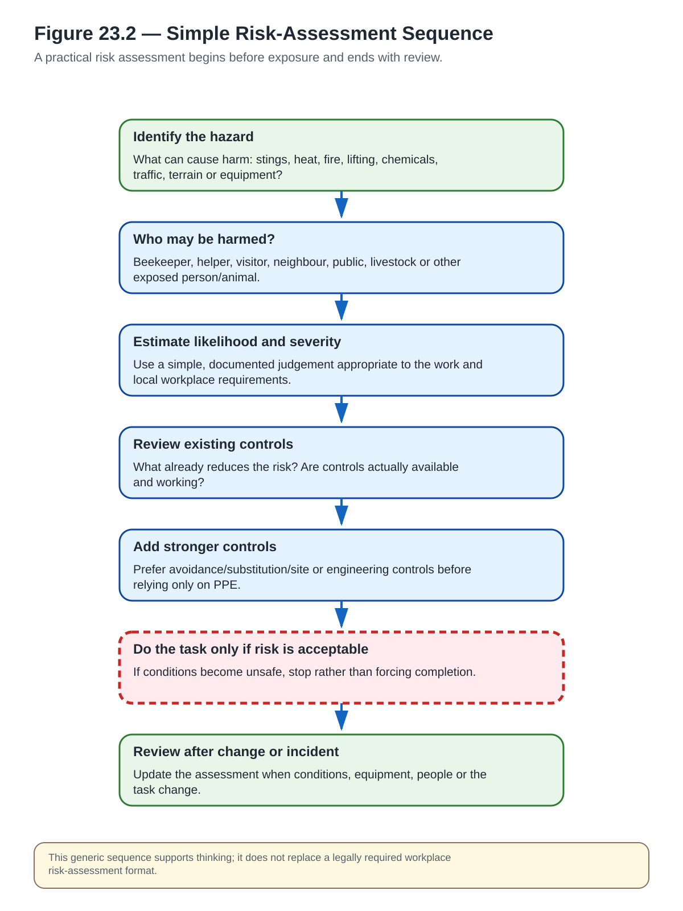</a>

**Figure 23.2** · SEMANTIC_COLOR_V1 · PENDING_FINAL_LAYOUT_PROOF · [Open SVG](../../assets/diagrams/wave-01/fig-23-2-risk-assessment-sequence.svg)

Seven-step risk-assessment flow from hazard identification to review, including a stop-work gate if risk is not acceptable.

### Figure 23.3 — Hierarchy of Controls for Beekeeping

<a href="../../assets/diagrams/wave-01/fig-23-3-hierarchy-of-controls.svg">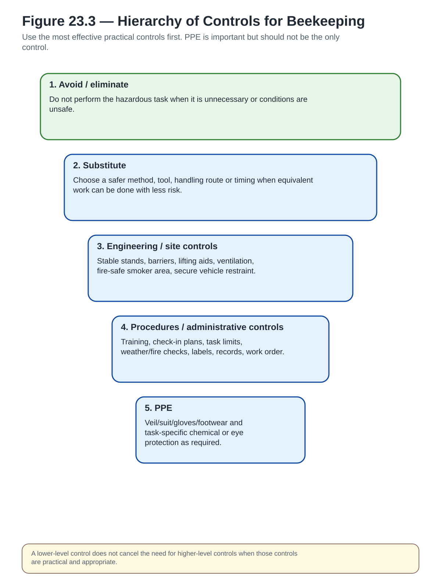</a>

**Figure 23.3** · SEMANTIC_COLOR_V1 · PENDING_FINAL_LAYOUT_PROOF · [Open SVG](../../assets/diagrams/wave-01/fig-23-3-hierarchy-of-controls.svg)

Hierarchy from avoiding a hazard through substitution, engineering or site controls, procedures and PPE, with beekeeping examples.

### Figure 23.6 — Local Reaction Versus Emergency Warning Signs

<a href="../../assets/diagrams/wave-01/fig-23-6-local-vs-emergency-sting-signs.svg">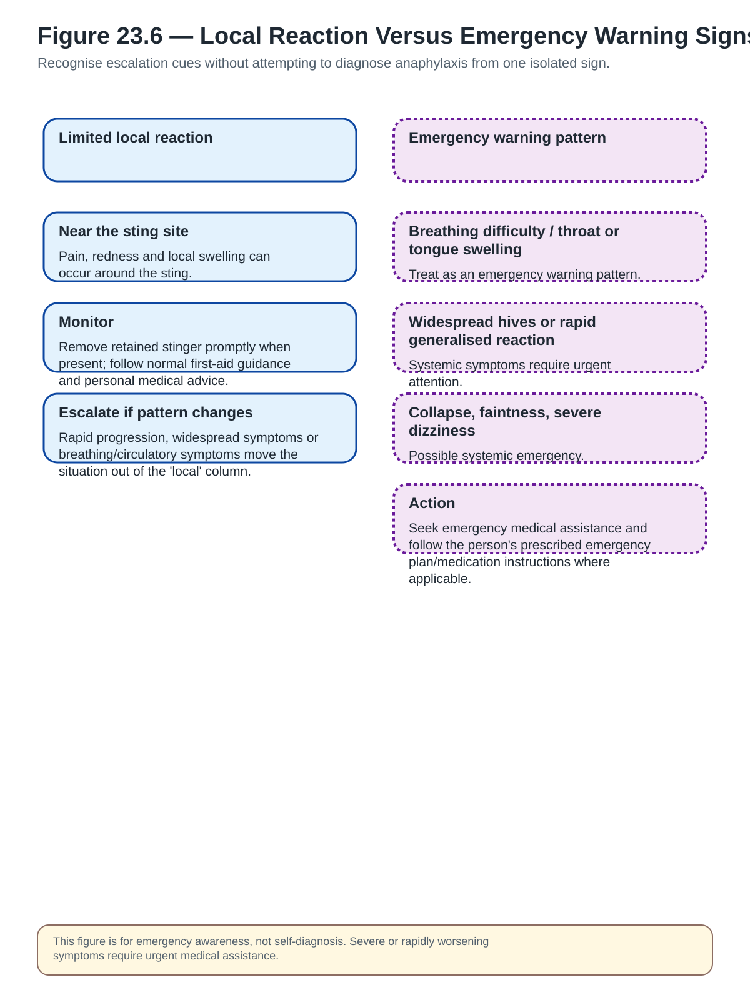</a>

**Figure 23.6** · SEMANTIC_COLOR_V1 · PENDING_FINAL_LAYOUT_PROOF · [Open SVG](../../assets/diagrams/wave-01/fig-23-6-local-vs-emergency-sting-signs.svg)

Clinical-awareness comparison between local sting effects and systemic emergency warning patterns with an explicit emergency-assistance action.

### Figure 23.9 — Heat, Cold and Dehydration Prevention

<a href="../../assets/diagrams/wave-01/fig-23-9-heat-cold-dehydration-prevention.svg">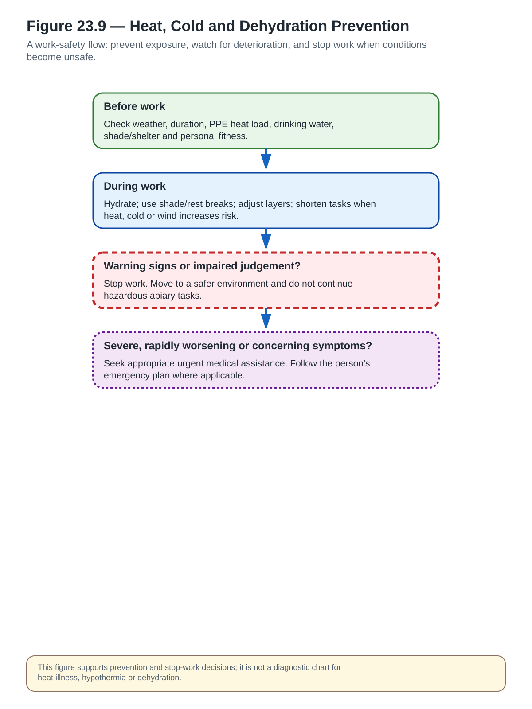</a>

**Figure 23.9** · SEMANTIC_COLOR_V1 · PENDING_FINAL_LAYOUT_PROOF · [Open SVG](../../assets/diagrams/wave-01/fig-23-9-heat-cold-dehydration-prevention.svg)

Flow diagram showing pre-work preparation, prevention during work, stop-work cues and escalation to urgent medical help for severe symptoms.

### Figure 23.10 — Smoker and Vegetation-Fire Safety

<a href="../../assets/diagrams/wave-01/fig-23-10-smoker-vegetation-fire-safety.svg">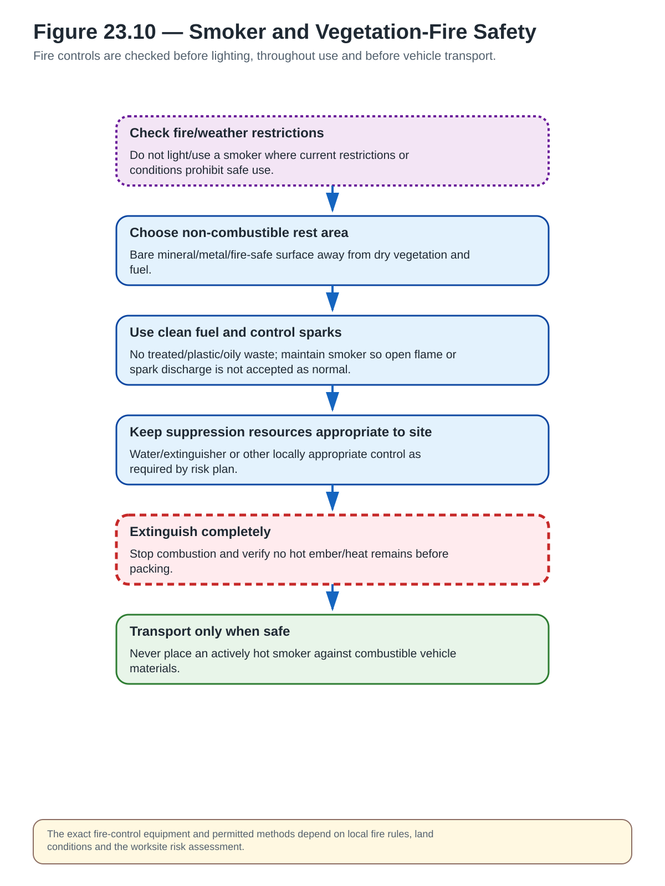</a>

**Figure 23.10** · SEMANTIC_COLOR_V1 · PENDING_FINAL_LAYOUT_PROOF · [Open SVG](../../assets/diagrams/wave-01/fig-23-10-smoker-vegetation-fire-safety.svg)

Fire-safety sequence for smoker use near vegetation from restrictions and resting area through extinguishing and transport.

### Figure 23.11 — Chemical-Treatment PPE and Label Discipline

<a href="../../assets/diagrams/wave-01/fig-23-11-treatment-ppe-label-discipline.svg">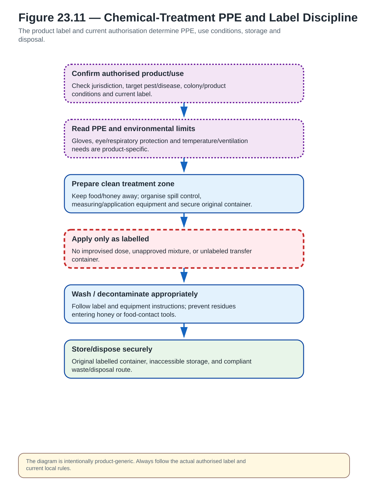</a>

**Figure 23.11** · SEMANTIC_COLOR_V1 · PENDING_FINAL_LAYOUT_PROOF · [Open SVG](../../assets/diagrams/wave-01/fig-23-11-treatment-ppe-label-discipline.svg)

Treatment safety flow from authorisation and PPE through labelled application, wash-up, storage and disposal.

## Chapter 24

### Figure 24.1 — Starting Units Compared

<a href="../../assets/diagrams/wave-01/fig-24-1-starting-units-compared.svg">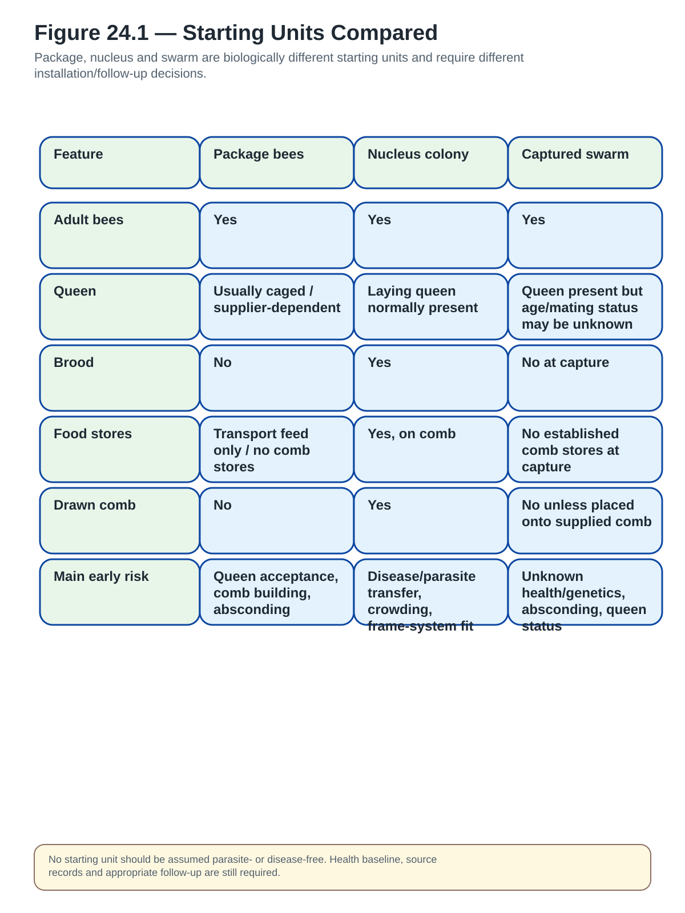</a>

**Figure 24.1** · SEMANTIC_COLOR_V1 · PENDING_FINAL_LAYOUT_PROOF · [Open SVG](../../assets/diagrams/wave-01/fig-24-1-starting-units-compared.svg)

Comparison matrix for package bees, nucleus colony and captured swarm, showing which biological components are typically present at installation.

### Figure 24.2 — Prepared Receiving Hive

<a href="../../assets/diagrams/wave-01/fig-24-2-prepared-receiving-hive.svg">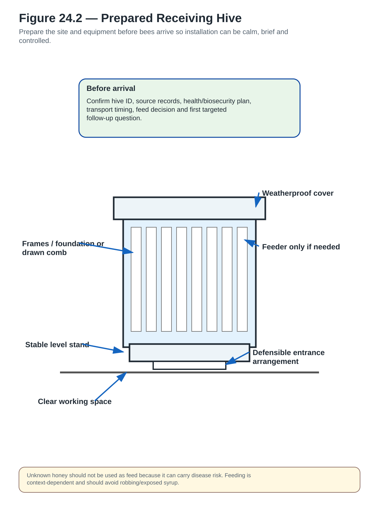</a>

**Figure 24.2** · SEMANTIC_COLOR_V1 · PENDING_FINAL_LAYOUT_PROOF · [Open SVG](../../assets/diagrams/wave-01/fig-24-2-prepared-receiving-hive.svg)

Prepared hive setup showing stable level stand, frames, cover, entrance, optional appropriate feeder and clear working space before bees arrive.

### Figure 24.7 — Swarm Installation

<a href="../../assets/diagrams/wave-01/fig-24-7-swarm-installation.svg">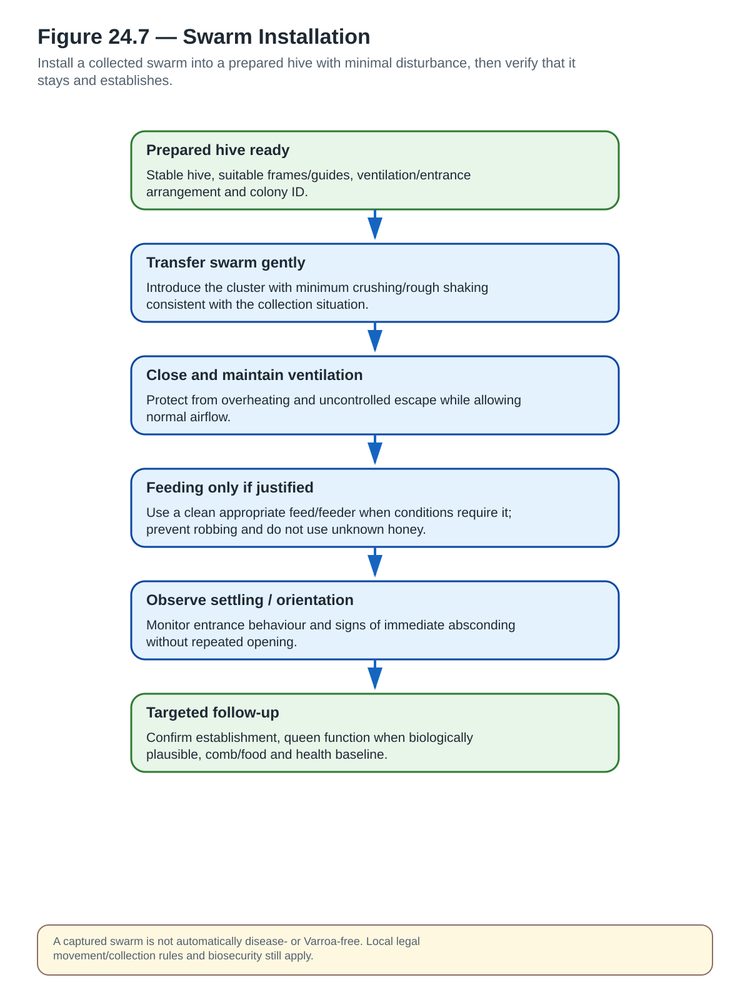</a>

**Figure 24.7** · SEMANTIC_COLOR_V1 · PENDING_FINAL_LAYOUT_PROOF · [Open SVG](../../assets/diagrams/wave-01/fig-24-7-swarm-installation.svg)

High-level swarm installation process from prepared hive through transfer, ventilation, optional feeding and targeted follow-up.

### Figure 24.9 — First-Inspection Decision Timeline

<a href="../../assets/diagrams/wave-01/fig-24-9-first-inspection-decision-timeline.svg">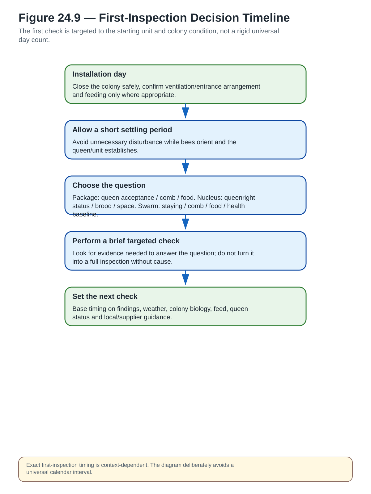</a>

**Figure 24.9** · SEMANTIC_COLOR_V1 · PENDING_FINAL_LAYOUT_PROOF · [Open SVG](../../assets/diagrams/wave-01/fig-24-9-first-inspection-decision-timeline.svg)

Timeline from installation through settling, targeted first inspection and setting the next check according to starting unit and conditions.

### Figure 24.10 — Early Success and Warning Signs

<a href="../../assets/diagrams/wave-01/fig-24-10-early-success-warning-signs.svg">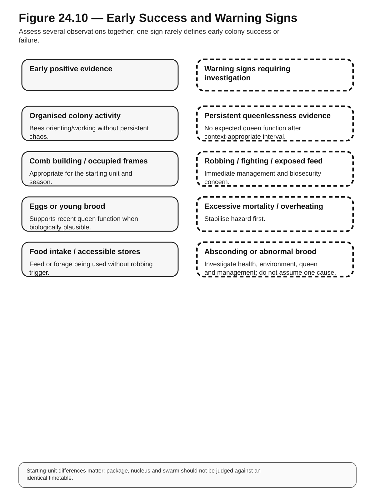</a>

**Figure 24.10** · SEMANTIC_COLOR_V1 · PENDING_FINAL_LAYOUT_PROOF · [Open SVG](../../assets/diagrams/wave-01/fig-24-10-early-success-warning-signs.svg)

Comparison of early positive colony establishment signs with warning signs such as queenlessness, robbing, mortality, overheating, absconding or abnormal brood.

### Figure 24.11 — New-Colony Biosecurity

<a href="../../assets/diagrams/wave-01/fig-24-11-new-colony-biosecurity.svg">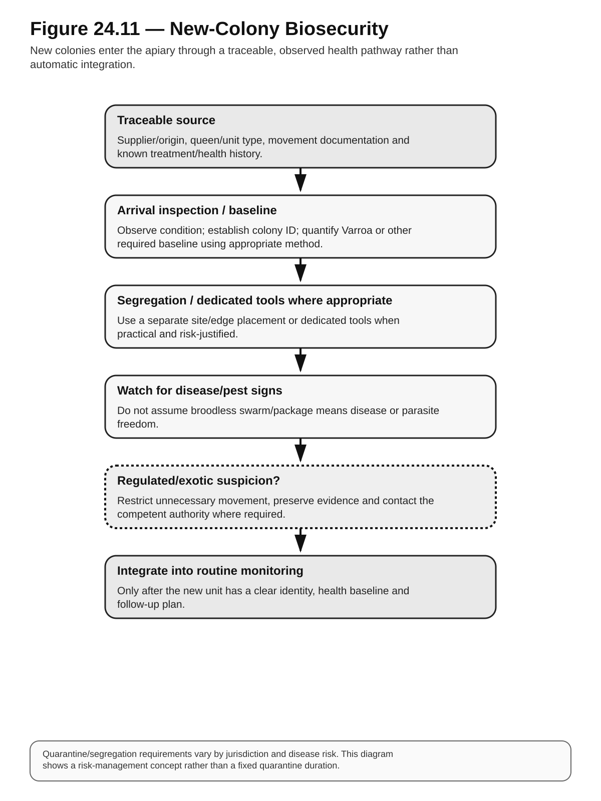</a>

**Figure 24.11** · SEMANTIC_COLOR_V1 · PENDING_FINAL_LAYOUT_PROOF · [Open SVG](../../assets/diagrams/wave-01/fig-24-11-new-colony-biosecurity.svg)

New-colony biosecurity flow from traceable source and baseline assessment to risk-based segregation and routine integration.

## Chapter 25

### Figure 25.1 — Inspection Depth Ladder

<a href="../../assets/diagrams/wave-01/fig-25-1-inspection-depth-ladder.svg">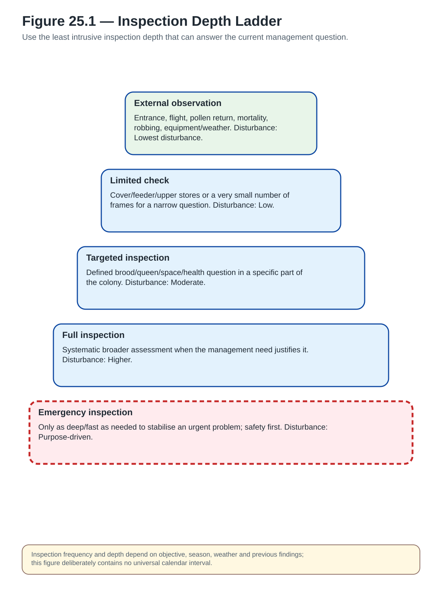</a>

**Figure 25.1** · SEMANTIC_COLOR_V1 · PENDING_FINAL_LAYOUT_PROOF · [Open SVG](../../assets/diagrams/wave-01/fig-25-1-inspection-depth-ladder.svg)

Five-level ladder from external observation to emergency inspection, with information need and colony disturbance increasing together.

### Figure 25.3 — Inspection Questions Before Opening

<a href="../../assets/diagrams/wave-01/fig-25-3-inspection-questions-before-opening.svg">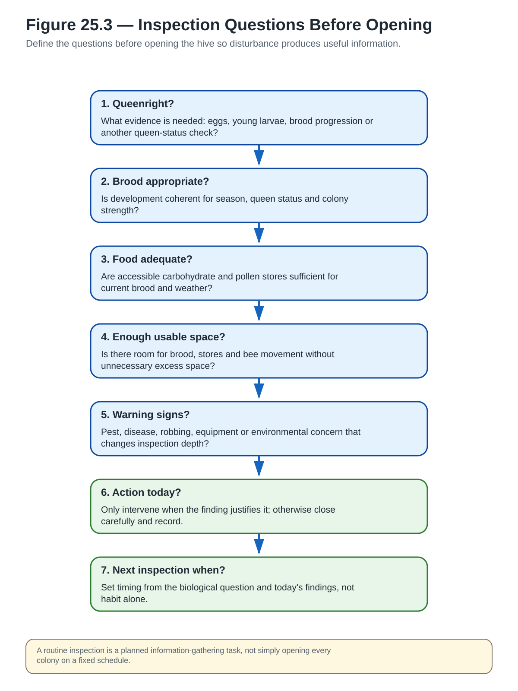</a>

**Figure 25.3** · SEMANTIC_COLOR_V1 · PENDING_FINAL_LAYOUT_PROOF · [Open SVG](../../assets/diagrams/wave-01/fig-25-3-inspection-questions-before-opening.svg)

Seven-question pre-inspection decision card covering queen status, brood, food, space, warning signs, action and follow-up.

### Figure 25.5 — Queenright Evidence Without Finding the Queen

<a href="../../assets/diagrams/wave-01/fig-25-5-queenright-evidence.svg">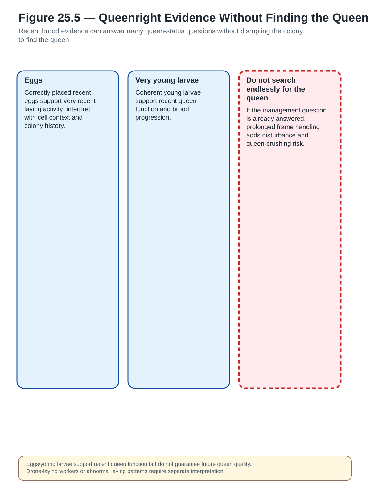</a>

**Figure 25.5** · SEMANTIC_COLOR_V1 · PENDING_FINAL_LAYOUT_PROOF · [Open SVG](../../assets/diagrams/wave-01/fig-25-5-queenright-evidence.svg)

Three-panel decision aid showing eggs and young larvae as evidence of recent queen function and discouraging unnecessary queen searching.

### Figure 25.7 — Brood Pattern Interpretation

<a href="../../assets/diagrams/wave-01/fig-25-7-brood-pattern-interpretation.svg">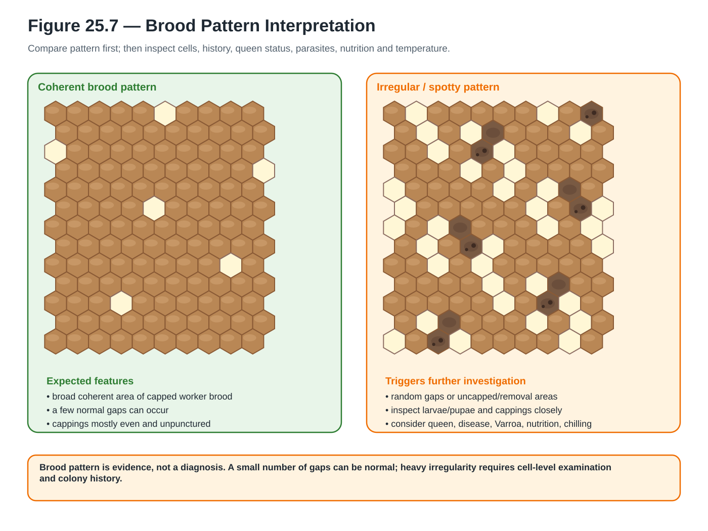</a>

**Figure 25.7** · NATIVE_HIGH_FIDELITY_COLOR · PENDING_FINAL_LAYOUT_PROOF · [Open SVG](../../assets/diagrams/wave-01/fig-25-7-brood-pattern-interpretation.svg)

Comparison of coherent healthy brood and irregular brood requiring investigation; appearance alone is not diagnostic.

### Figure 25.11 — Swarm-Preparation Evidence

<a href="../../assets/diagrams/wave-01/fig-25-11-swarm-preparation-evidence.svg">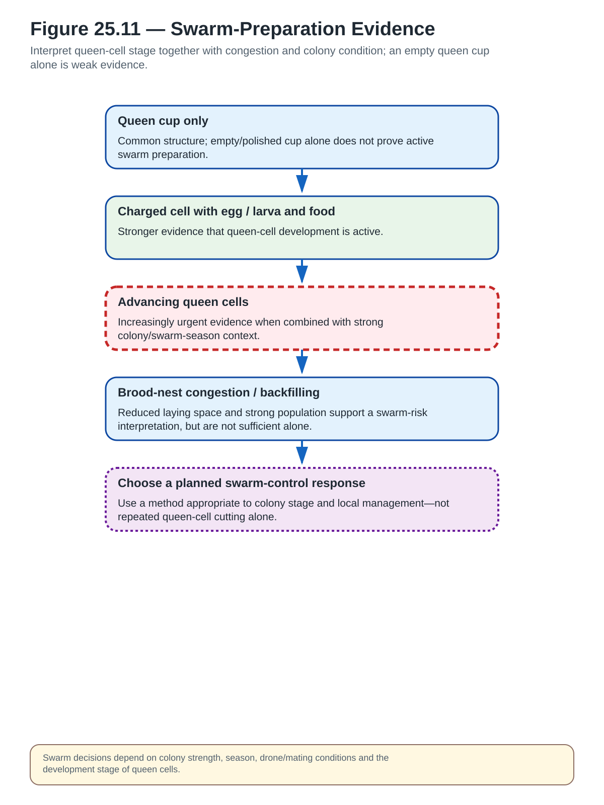</a>

**Figure 25.11** · SEMANTIC_COLOR_V1 · PENDING_FINAL_LAYOUT_PROOF · [Open SVG](../../assets/diagrams/wave-01/fig-25-11-swarm-preparation-evidence.svg)

Evidence ladder from empty queen cup through charged and advanced queen cells plus congestion to planned swarm control.

### Figure 25.13 — Inspection Record and Follow-Up Loop

<a href="../../assets/diagrams/wave-01/fig-25-13-inspection-record-follow-up-loop.svg">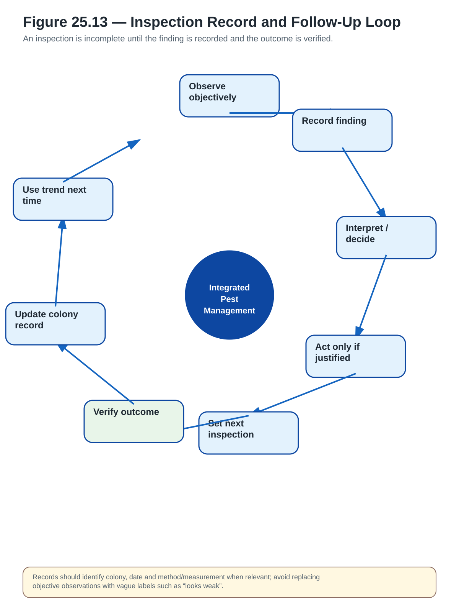</a>

**Figure 25.13** · SEMANTIC_COLOR_V1 · PENDING_FINAL_LAYOUT_PROOF · [Open SVG](../../assets/diagrams/wave-01/fig-25-13-inspection-record-follow-up-loop.svg)

Circular record and follow-up loop from objective observation through action and verification back to trend-informed inspection.

## Chapter 33

### Figure 33.4 — Correct and Incorrect Entrance Closure

<a href="../../assets/diagrams/wave-01/fig-33-4-entrance-closure.svg">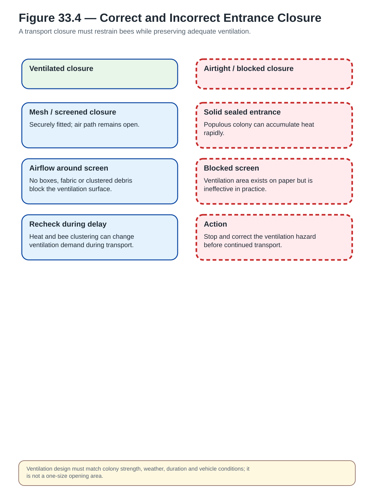</a>

**Figure 33.4** · SEMANTIC_COLOR_V1 · PENDING_FINAL_LAYOUT_PROOF · [Open SVG](../../assets/diagrams/wave-01/fig-33-4-entrance-closure.svg)

Comparison of a secure ventilated entrance closure with airtight or blocked transport closure.

### Figure 33.6 — Vehicle Loading

<a href="../../assets/diagrams/wave-01/fig-33-6-vehicle-loading.svg">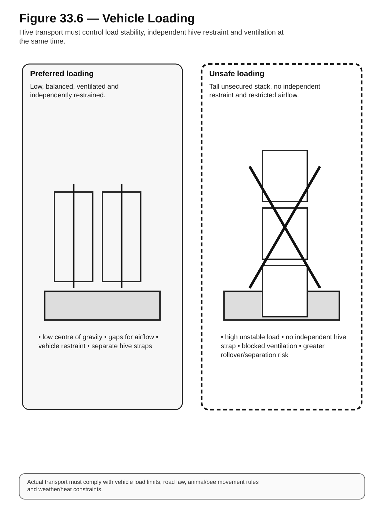</a>

**Figure 33.6** · SEMANTIC_COLOR_V1 · PENDING_FINAL_LAYOUT_PROOF · [Open SVG](../../assets/diagrams/wave-01/fig-33-6-vehicle-loading.svg)

Transport schematic comparing a low balanced restrained hive load with an unsecured tall stack that compromises stability and ventilation.

### Figure 33.7 — Manual Handling During Colony Moves

<a href="../../assets/diagrams/wave-01/fig-33-7-manual-handling.svg">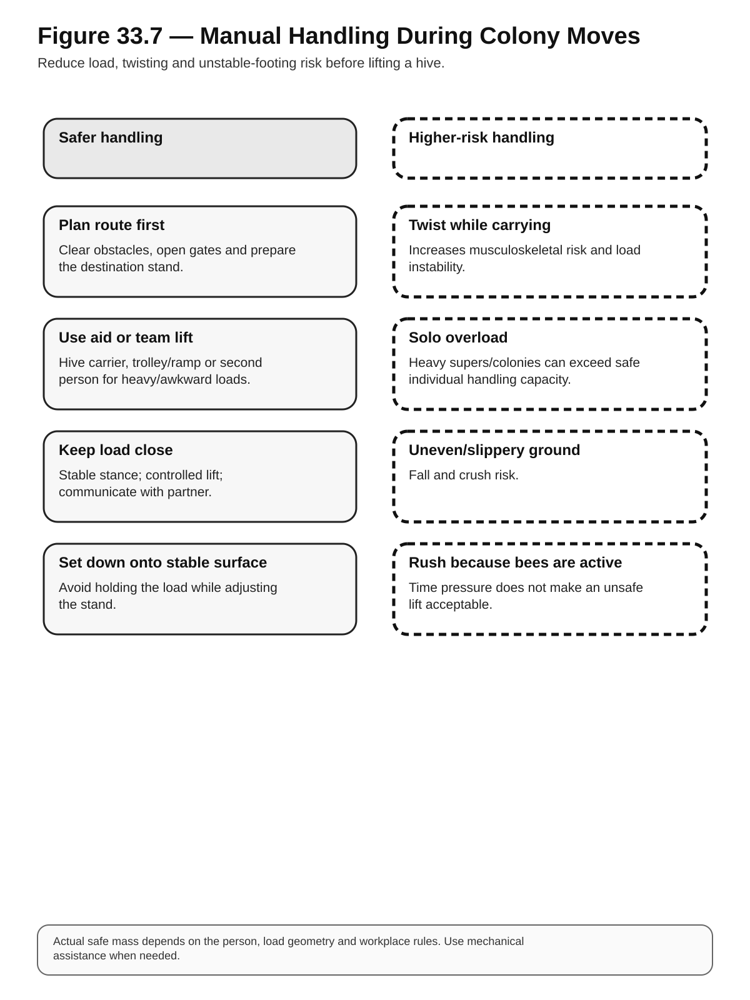</a>

**Figure 33.7** · SEMANTIC_COLOR_V1 · PENDING_FINAL_LAYOUT_PROOF · [Open SVG](../../assets/diagrams/wave-01/fig-33-7-manual-handling.svg)

Manual-handling comparison of route planning, aid/team lift and stable stance versus twisting, solo overload and unstable footing.

### Figure 33.12 — Emergency Box Separation

<a href="../../assets/diagrams/wave-01/fig-33-12-emergency-box-separation.svg">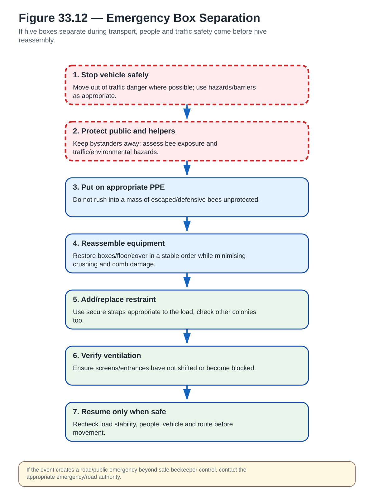</a>

**Figure 33.12** · SEMANTIC_COLOR_V1 · PENDING_FINAL_LAYOUT_PROOF · [Open SVG](../../assets/diagrams/wave-01/fig-33-12-emergency-box-separation.svg)

Seven-step emergency sequence for separated hive boxes during transport.

### Figure 33.14 — Post-Move Inspection

<a href="../../assets/diagrams/wave-01/fig-33-14-post-move-inspection.svg">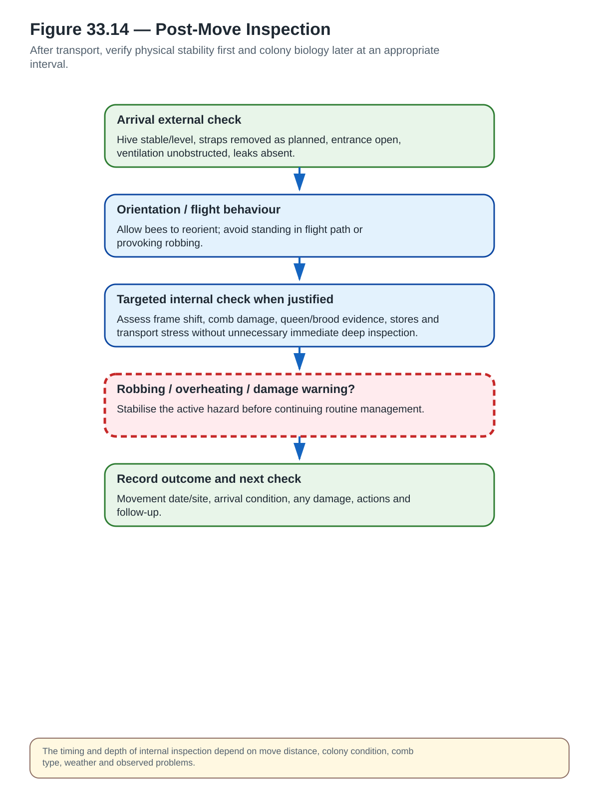</a>

**Figure 33.14** · SEMANTIC_COLOR_V1 · PENDING_FINAL_LAYOUT_PROOF · [Open SVG](../../assets/diagrams/wave-01/fig-33-14-post-move-inspection.svg)

Post-move inspection flow from arrival stability and orientation through targeted check and follow-up record.

## Chapter 38

### Figure 38.1 — Emergency Triage Sequence

<a href="../../assets/diagrams/wave-01/fig-38-1-emergency-triage-sequence.svg">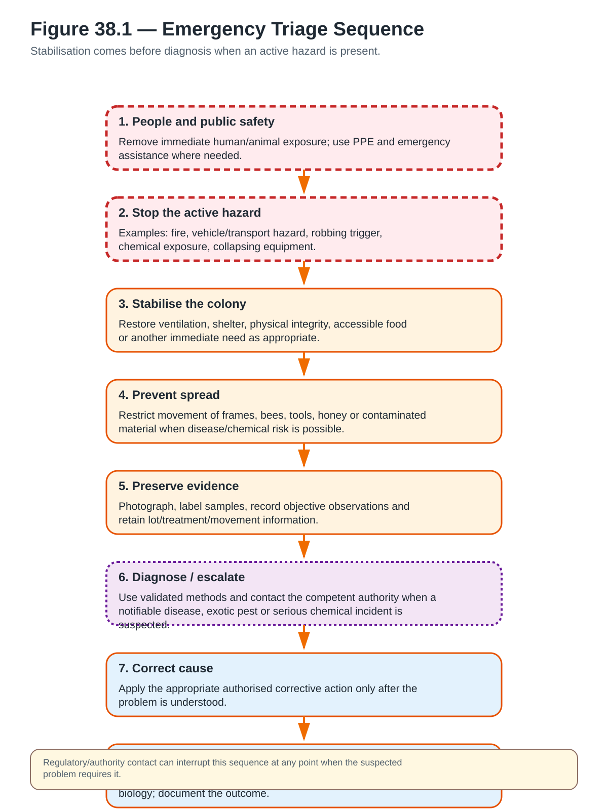</a>

**Figure 38.1** · SEMANTIC_COLOR_V1 · PENDING_FINAL_LAYOUT_PROOF · [Open SVG](../../assets/diagrams/wave-01/fig-38-1-emergency-triage-sequence.svg)

Emergency decision flow from people safety through hazard control, colony stabilisation, containment, evidence preservation, diagnosis, correction and recovery verification.

### Figure 38.2 — Starvation Versus Accessible Stores

<a href="../../assets/diagrams/wave-01/fig-38-2-starvation-versus-accessible-stores.svg">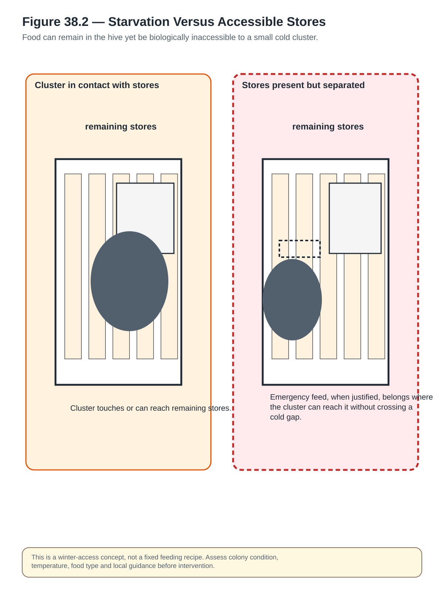</a>

**Figure 38.2** · SEMANTIC_COLOR_V1 · PENDING_FINAL_LAYOUT_PROOF · [Open SVG](../../assets/diagrams/wave-01/fig-38-2-starvation-versus-accessible-stores.svg)

Hive cutaway comparison of a winter cluster touching stores versus a small cold cluster separated from remaining stores, with an emergency-feed placement zone adjacent to the cluster.

### Figure 38.4 — Transport Overheating

<a href="../../assets/diagrams/wave-01/fig-38-4-transport-overheating.svg">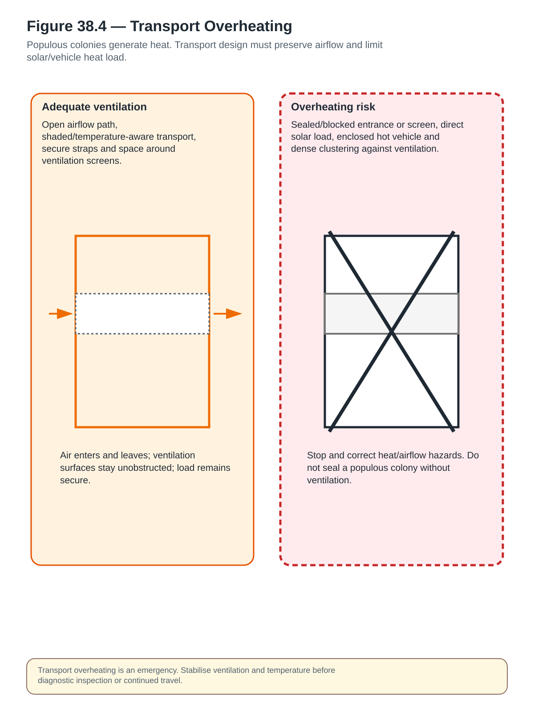</a>

**Figure 38.4** · SEMANTIC_COLOR_V1 · PENDING_FINAL_LAYOUT_PROOF · [Open SVG](../../assets/diagrams/wave-01/fig-38-4-transport-overheating.svg)

Comparison showing ventilated shaded transport versus sealed or blocked ventilation with solar heat loading and bee clustering.

### Figure 38.6 — Storm-Damaged Hive Recovery

<a href="../../assets/diagrams/wave-01/fig-38-6-storm-damaged-hive-recovery.svg">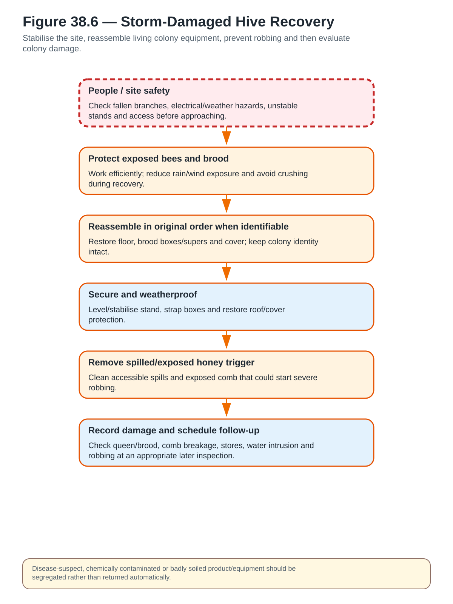</a>

**Figure 38.6** · SEMANTIC_COLOR_V1 · PENDING_FINAL_LAYOUT_PROOF · [Open SVG](../../assets/diagrams/wave-01/fig-38-6-storm-damaged-hive-recovery.svg)

Storm-damage recovery flow from site safety through reassembly, securing, spill control and follow-up.

### Figure 38.7 — Sudden Mortality Evidence Map

<a href="../../assets/diagrams/wave-01/fig-38-7-sudden-mortality-evidence-map.svg">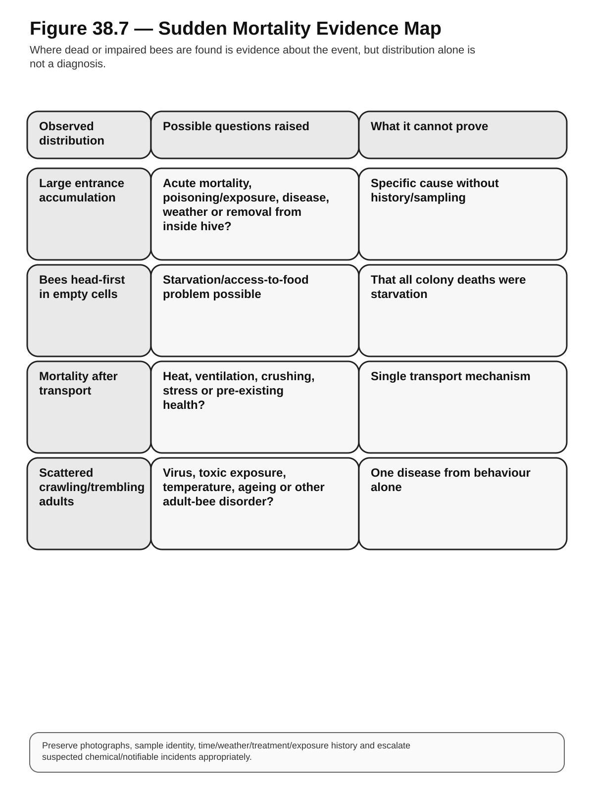</a>

**Figure 38.7** · SEMANTIC_COLOR_V1 · PENDING_FINAL_LAYOUT_PROOF · [Open SVG](../../assets/diagrams/wave-01/fig-38-7-sudden-mortality-evidence-map.svg)

Matrix relating four mortality distributions to investigation questions while stating that distribution is not diagnosis.

### Figure 38.8 — Suspected-Disease Biosecurity Zone

<a href="../../assets/diagrams/wave-01/fig-38-8-suspected-disease-biosecurity-zone.svg">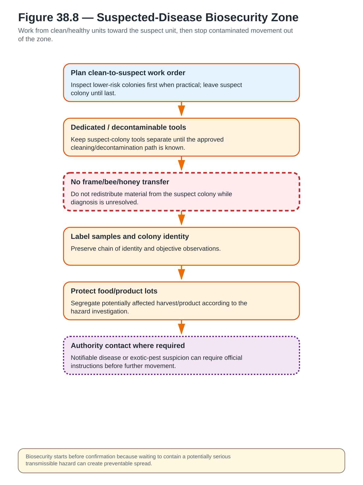</a>

**Figure 38.8** · SEMANTIC_COLOR_V1 · PENDING_FINAL_LAYOUT_PROOF · [Open SVG](../../assets/diagrams/wave-01/fig-38-8-suspected-disease-biosecurity-zone.svg)

Suspected disease biosecurity workflow showing clean-to-suspect work order, separate tools, movement restriction, sample labelling and authority escalation.

### Figure 38.10 — Recovery Monitoring Timeline

<a href="../../assets/diagrams/wave-01/fig-38-10-recovery-monitoring-timeline.svg">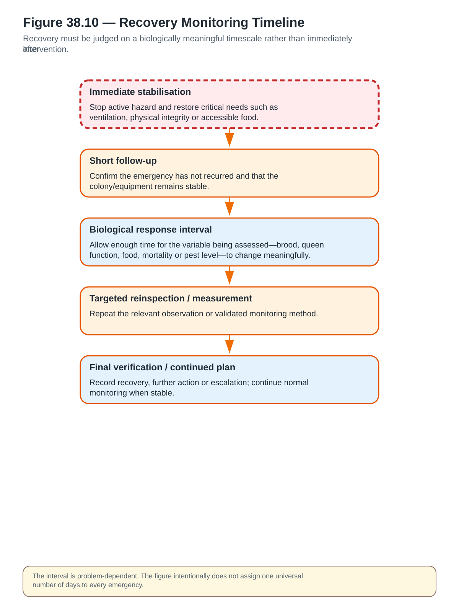</a>

**Figure 38.10** · SEMANTIC_COLOR_V1 · PENDING_FINAL_LAYOUT_PROOF · [Open SVG](../../assets/diagrams/wave-01/fig-38-10-recovery-monitoring-timeline.svg)

Recovery timeline from immediate stabilisation through short follow-up, biological response interval and final verification.

## Chapter 39

### Figure 39.1 — Disease Investigation Framework

<a href="../../assets/diagrams/wave-01/fig-39-1-disease-investigation-framework.svg">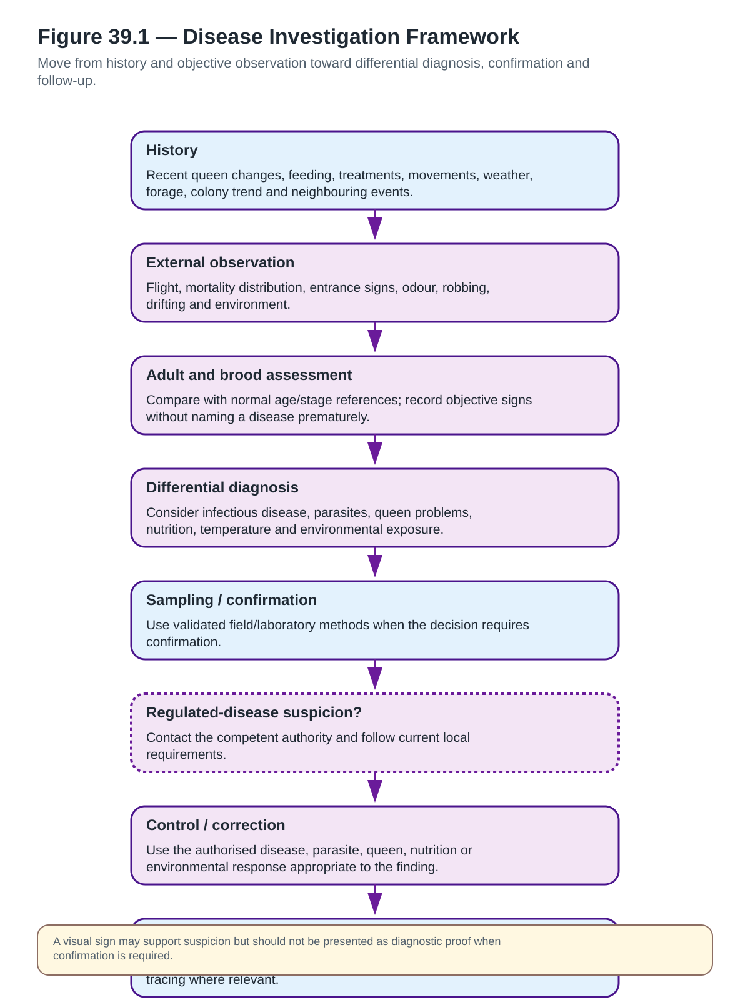</a>

**Figure 39.1** · SEMANTIC_COLOR_V1 · PENDING_FINAL_LAYOUT_PROOF · [Open SVG](../../assets/diagrams/wave-01/fig-39-1-disease-investigation-framework.svg)

Disease investigation flow from history through observation, examination, differential diagnosis, sampling, regulated-disease escalation, control and follow-up.

### Figure 39.2 — Healthy Brood Reference

<a href="../../assets/diagrams/wave-01/fig-39-2-healthy-brood-reference.svg">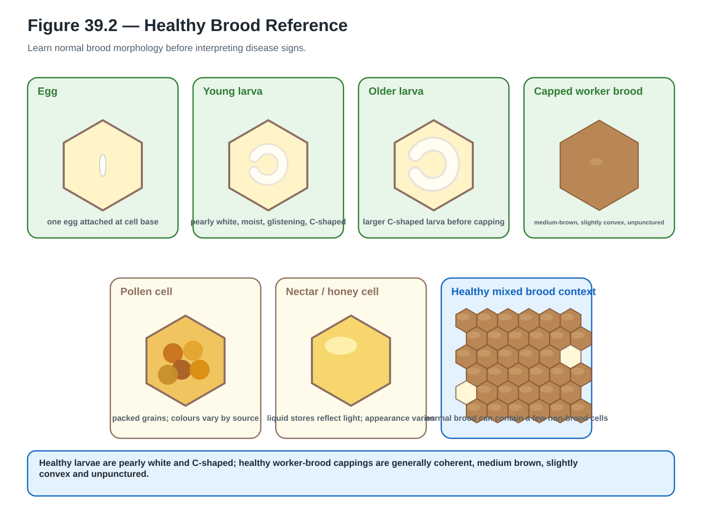</a>

**Figure 39.2** · NATIVE_HIGH_FIDELITY_COLOR · PENDING_FINAL_LAYOUT_PROOF · [Open SVG](../../assets/diagrams/wave-01/fig-39-2-healthy-brood-reference.svg)

Reference plate showing eggs, pearly C-shaped larvae, healthy capped worker brood, pollen and honey cells.

### Figure 39.3 — Patchy Brood Has Multiple Causes

<a href="../../assets/diagrams/wave-01/fig-39-3-patchy-brood-multiple-causes.svg">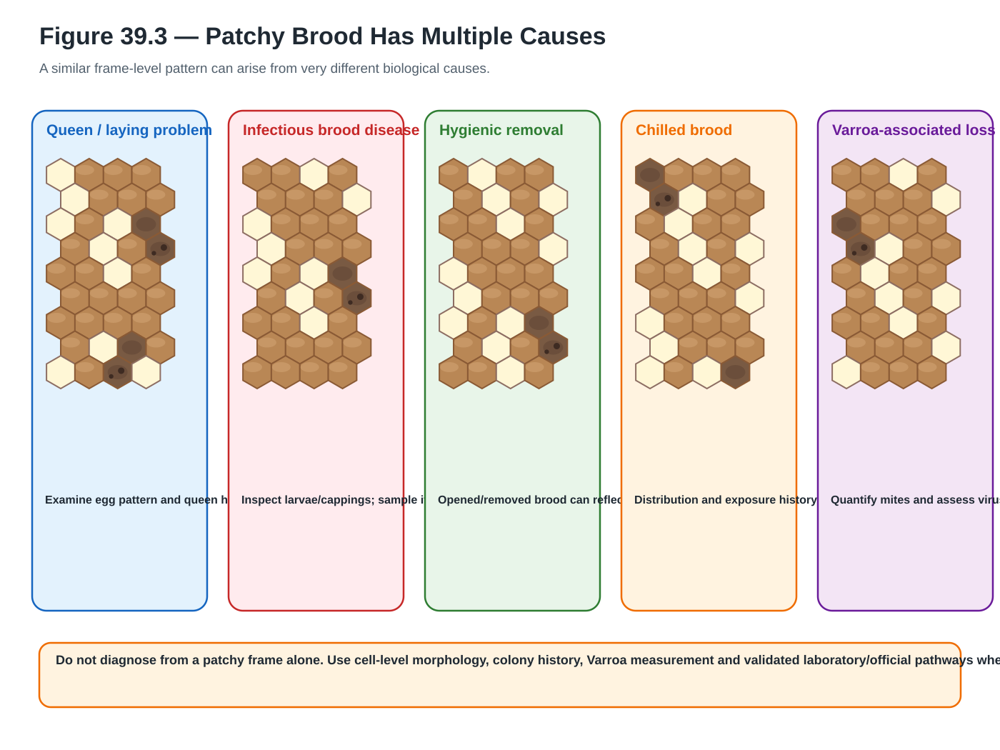</a>

**Figure 39.3** · NATIVE_HIGH_FIDELITY_COLOR · PENDING_FINAL_LAYOUT_PROOF · [Open SVG](../../assets/diagrams/wave-01/fig-39-3-patchy-brood-multiple-causes.svg)

Five panels demonstrate that similar patchiness can arise from different causes and is not diagnostic by appearance alone.

### Figure 39.4 — American Foulbrood Suspicion Features

<a href="../../assets/diagrams/wave-01/fig-39-4-afb-suspicion-features.svg">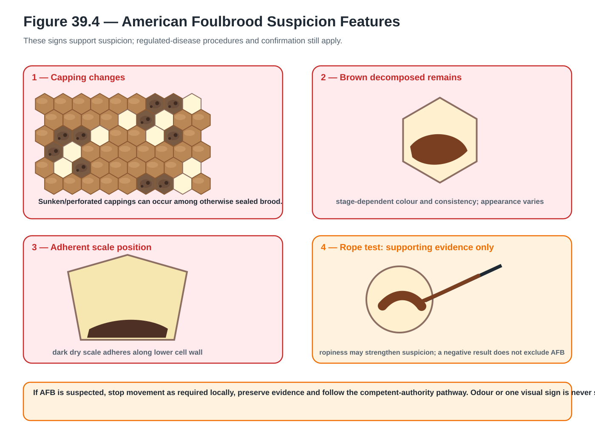</a>

**Figure 39.4** · NATIVE_HIGH_FIDELITY_COLOR · PENDING_FINAL_LAYOUT_PROOF · [Open SVG](../../assets/diagrams/wave-01/fig-39-4-afb-suspicion-features.svg)

AFB suspicion plate showing irregular sealed brood, sunken or perforated cappings, brown remains, adherent scale and rope test as supporting evidence only.

### Figure 39.13 — Differential Diagnosis Matrix

<a href="../../assets/diagrams/wave-01/fig-39-13-differential-diagnosis-matrix.svg">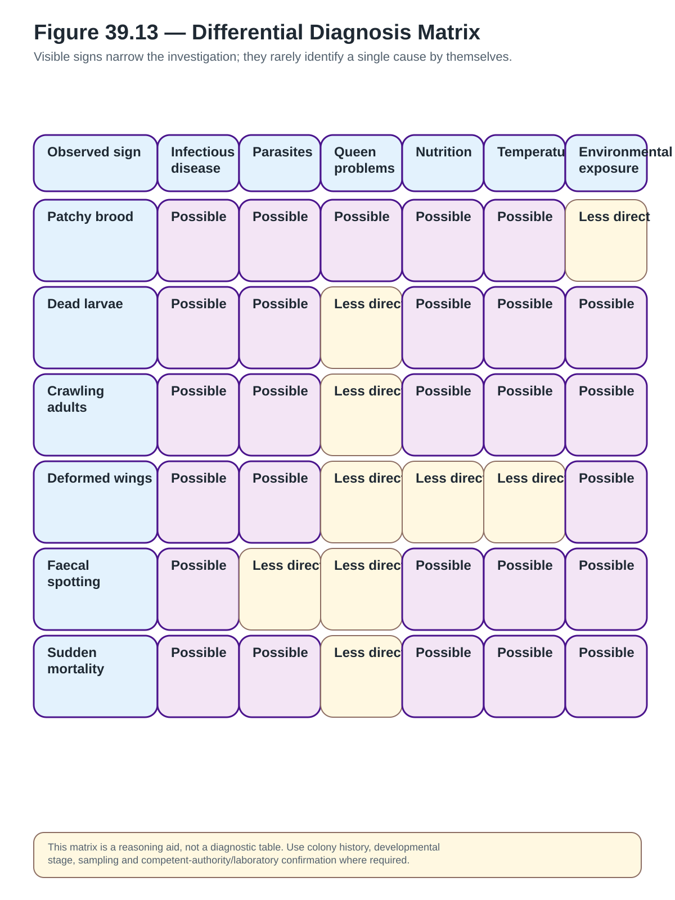</a>

**Figure 39.13** · SEMANTIC_COLOR_V1 · PENDING_FINAL_LAYOUT_PROOF · [Open SVG](../../assets/diagrams/wave-01/fig-39-13-differential-diagnosis-matrix.svg)

Matrix showing that common colony signs can have several possible cause categories and therefore require history, examination and confirmation rather than image-only diagnosis.

## Chapter 40

### Figure 40.3 — Varroa Reproductive Cycle

<a href="../../assets/diagrams/wave-01/fig-40-3-varroa-reproductive-cycle.svg">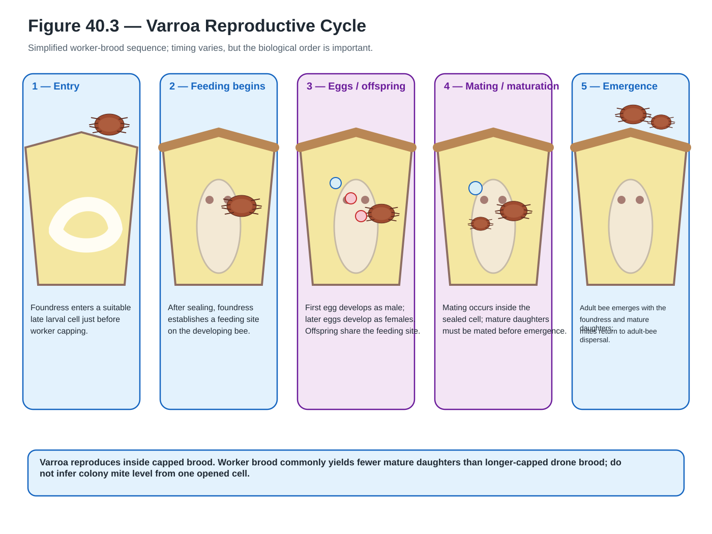</a>

**Figure 40.3** · NATIVE_HIGH_FIDELITY_COLOR · PENDING_FINAL_LAYOUT_PROOF · [Open SVG](../../assets/diagrams/wave-01/fig-40-3-varroa-reproductive-cycle.svg)

Worker-brood sequence showing foundress entry before capping, feeding site, male-first egg sequence, daughter development, mating and emergence.

### Figure 40.4 — Varroa on Adult Bees

<a href="../../assets/diagrams/wave-01/fig-40-4-varroa-on-adult-bees.svg">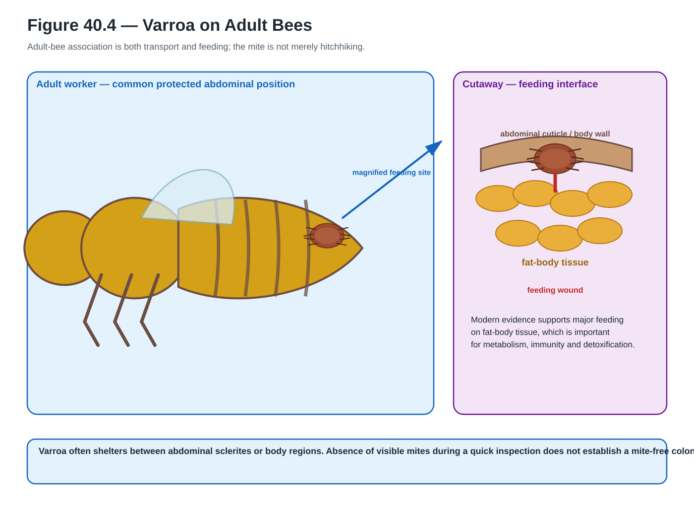</a>

**Figure 40.4** · NATIVE_HIGH_FIDELITY_COLOR · PENDING_FINAL_LAYOUT_PROOF · [Open SVG](../../assets/diagrams/wave-01/fig-40-4-varroa-on-adult-bees.svg)

Adult worker anatomy showing Varroa protected between abdominal segments and an inset of feeding associated with fat-body tissue beneath the abdominal cuticle.

### Figure 40.7 — Varroa and Tropilaelaps Comparison

<a href="../../assets/diagrams/wave-01/fig-40-7-varroa-tropilaelaps-comparison.svg">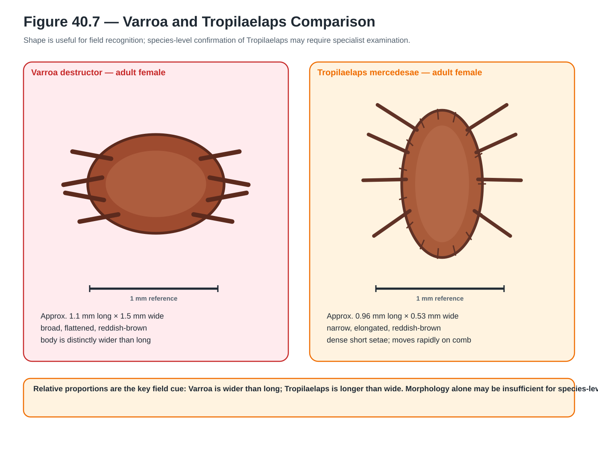</a>

**Figure 40.7** · NATIVE_HIGH_FIDELITY_COLOR · PENDING_FINAL_LAYOUT_PROOF · [Open SVG](../../assets/diagrams/wave-01/fig-40-7-varroa-tropilaelaps-comparison.svg)

Scaled morphology comparison: adult female Varroa is broad and wider than long; adult female Tropilaelaps mercedesae is narrower, elongated and densely setose.

### Figure 40.8 — Tropilaelaps Life Cycle and Brood Dependence

<a href="../../assets/diagrams/wave-01/fig-40-8-tropilaelaps-life-cycle.svg">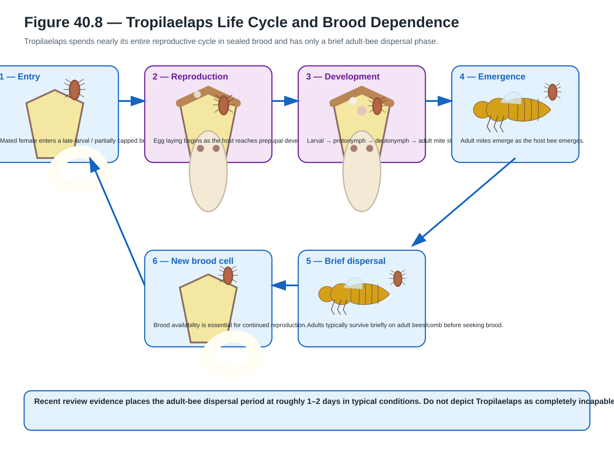</a>

**Figure 40.8** · NATIVE_HIGH_FIDELITY_COLOR · PENDING_FINAL_LAYOUT_PROOF · [Open SVG](../../assets/diagrams/wave-01/fig-40-8-tropilaelaps-life-cycle.svg)

Life cycle of Tropilaelaps mercedesae showing entry into a partially capped brood cell, reproduction during prepupal/pupal stages, adult emergence and brief dispersal before re-entering brood.

### Figure 40.13 — Monitoring Method Matches the Question

<a href="../../assets/diagrams/wave-01/fig-40-13-monitoring-method-matches-question.svg">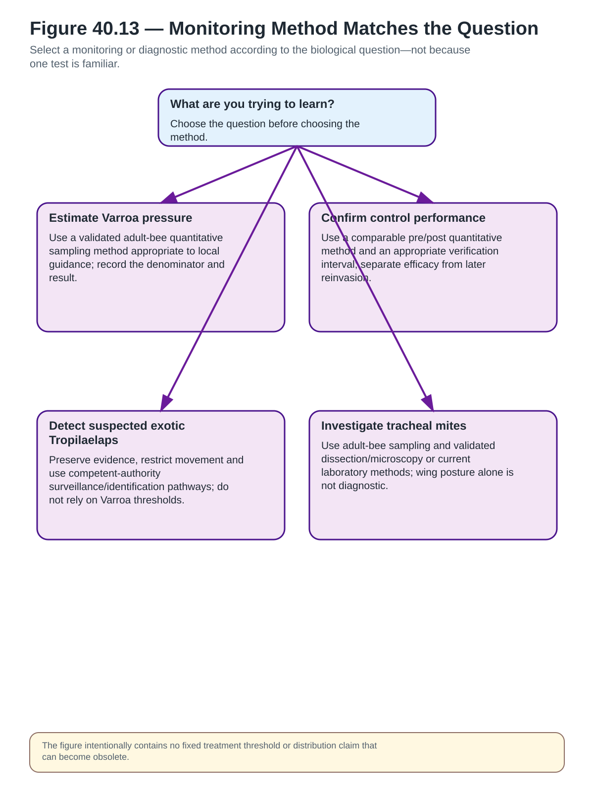</a>

**Figure 40.13** · SEMANTIC_COLOR_V1 · PENDING_FINAL_LAYOUT_PROOF · [Open SVG](../../assets/diagrams/wave-01/fig-40-13-monitoring-method-matches-question.svg)

Four-way decision diagram linking Varroa pressure estimation, control verification, exotic Tropilaelaps detection and tracheal-mite investigation to appropriate method classes.

## Chapter 41

### Figure 41.1 — Varroa Life Cycle in Worker Brood

<a href="../../assets/diagrams/wave-01/fig-41-1-varroa-life-cycle-worker-brood.svg">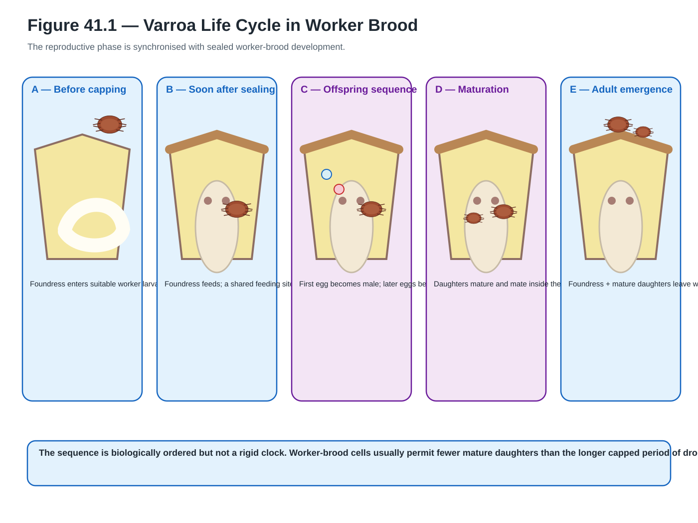</a>

**Figure 41.1** · NATIVE_HIGH_FIDELITY_COLOR · PENDING_FINAL_LAYOUT_PROOF · [Open SVG](../../assets/diagrams/wave-01/fig-41-1-varroa-life-cycle-worker-brood.svg)

Detailed worker-brood Varroa cycle showing pre-capping invasion, feeding site, male-first egg sequence, daughter development and emergence.

### Figure 41.3 — Adult-Bee Feeding Site

<a href="../../assets/diagrams/wave-01/fig-41-3-adult-bee-feeding-site.svg">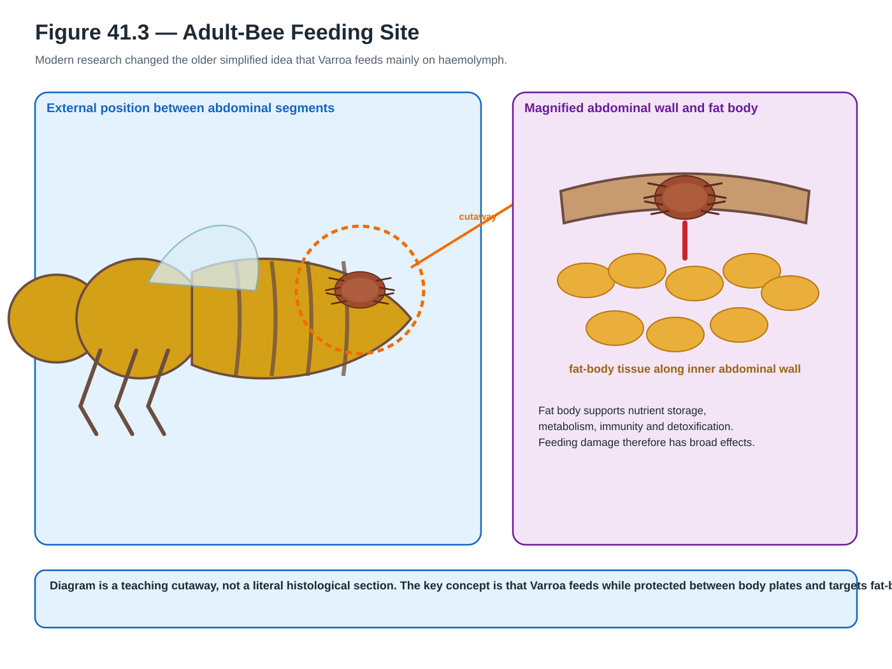</a>

**Figure 41.3** · NATIVE_HIGH_FIDELITY_COLOR · PENDING_FINAL_LAYOUT_PROOF · [Open SVG](../../assets/diagrams/wave-01/fig-41-3-adult-bee-feeding-site.svg)

Detailed adult-worker abdominal cutaway showing a Varroa mite protected between abdominal segments and feeding in association with underlying fat-body tissue.

### Figure 41.6 — Adult-Bee Wash Procedure

<a href="../../assets/diagrams/wave-01/fig-41-6-adult-bee-wash-procedure.svg">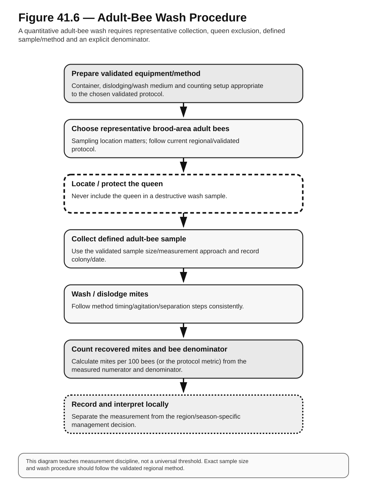</a>

**Figure 41.6** · SEMANTIC_COLOR_V1 · PENDING_FINAL_LAYOUT_PROOF · [Open SVG](../../assets/diagrams/wave-01/fig-41-6-adult-bee-wash-procedure.svg)

Numbered adult-bee Varroa wash procedure emphasising queen exclusion and distinction between measurement and intervention decision.

### Figure 41.7 — Monitoring Methods Compared

<a href="../../assets/diagrams/wave-01/fig-41-7-monitoring-methods-compared.svg">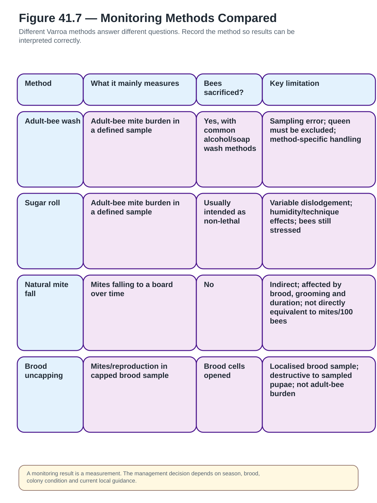</a>

**Figure 41.7** · SEMANTIC_COLOR_V1 · PENDING_FINAL_LAYOUT_PROOF · [Open SVG](../../assets/diagrams/wave-01/fig-41-7-monitoring-methods-compared.svg)

Comparison of adult-bee wash, sugar roll, natural mite fall and brood uncapping by what each measures, whether bees are sacrificed and major limitations.

### Figure 41.9 — Why Thresholds Are Contextual

<a href="../../assets/diagrams/wave-01/fig-41-9-thresholds-contextual.svg">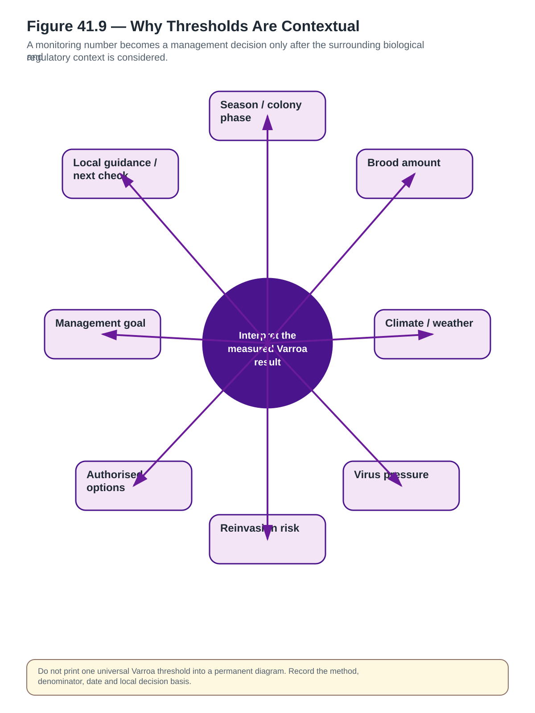</a>

**Figure 41.9** · SEMANTIC_COLOR_V1 · PENDING_FINAL_LAYOUT_PROOF · [Open SVG](../../assets/diagrams/wave-01/fig-41-9-thresholds-contextual.svg)

Decision wheel surrounding a measured Varroa result with season, brood, climate, virus pressure, reinvasion, authorised options, management goal and local guidance.

### Figure 41.10 — Varroa Control Categories

<a href="../../assets/diagrams/wave-01/fig-41-10-varroa-control-categories.svg">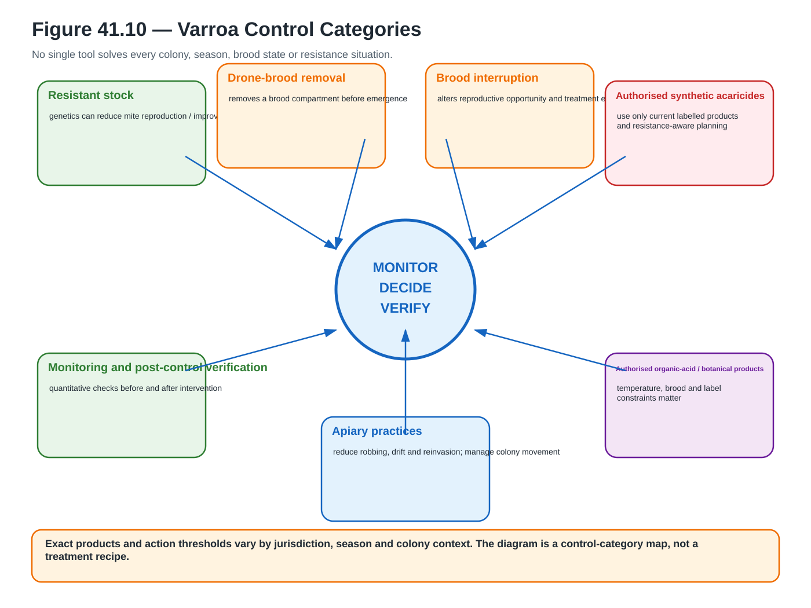</a>

**Figure 41.10** · NATIVE_HIGH_FIDELITY_COLOR · PENDING_FINAL_LAYOUT_PROOF · [Open SVG](../../assets/diagrams/wave-01/fig-41-10-varroa-control-categories.svg)

Integrated non-product-specific Varroa control categories organised around monitoring, biological timing, authorised controls and verification.

### Figure 41.11 — Treatment Failure Versus Reinvasion

<a href="../../assets/diagrams/wave-01/fig-41-11-treatment-failure-versus-reinvasion.svg">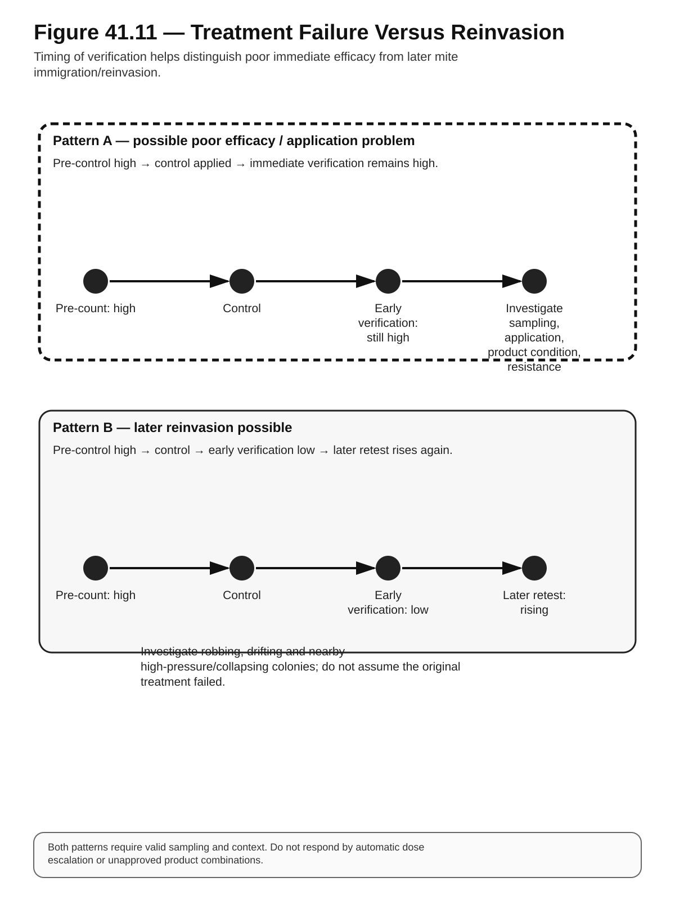</a>

**Figure 41.11** · SEMANTIC_COLOR_V1 · PENDING_FINAL_LAYOUT_PROOF · [Open SVG](../../assets/diagrams/wave-01/fig-41-11-treatment-failure-versus-reinvasion.svg)

Two timelines showing a high mite result immediately after control versus a later rise after an initially good verification result.

### Figure 41.13 — Honey-Super and Temperature Decision Check

<a href="../../assets/diagrams/wave-01/fig-41-13-pre-treatment-safety-check.svg">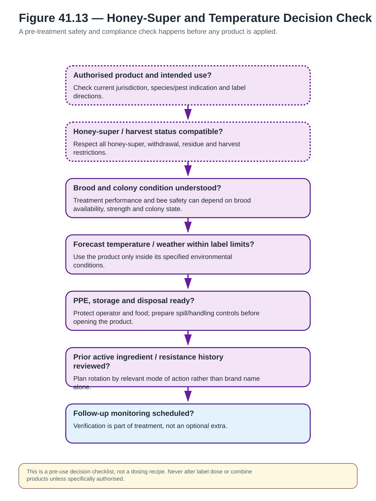</a>

**Figure 41.13** · SEMANTIC_COLOR_V1 · PENDING_FINAL_LAYOUT_PROOF · [Open SVG](../../assets/diagrams/wave-01/fig-41-13-pre-treatment-safety-check.svg)

Pre-treatment checklist covering authorisation, honey-super status, brood, weather, PPE, resistance history and follow-up monitoring.

## Chapter 42

### Figure 42.1 — Nosema Life Cycle in an Adult Bee

<a href="../../assets/diagrams/wave-01/fig-42-1-nosema-life-cycle.svg">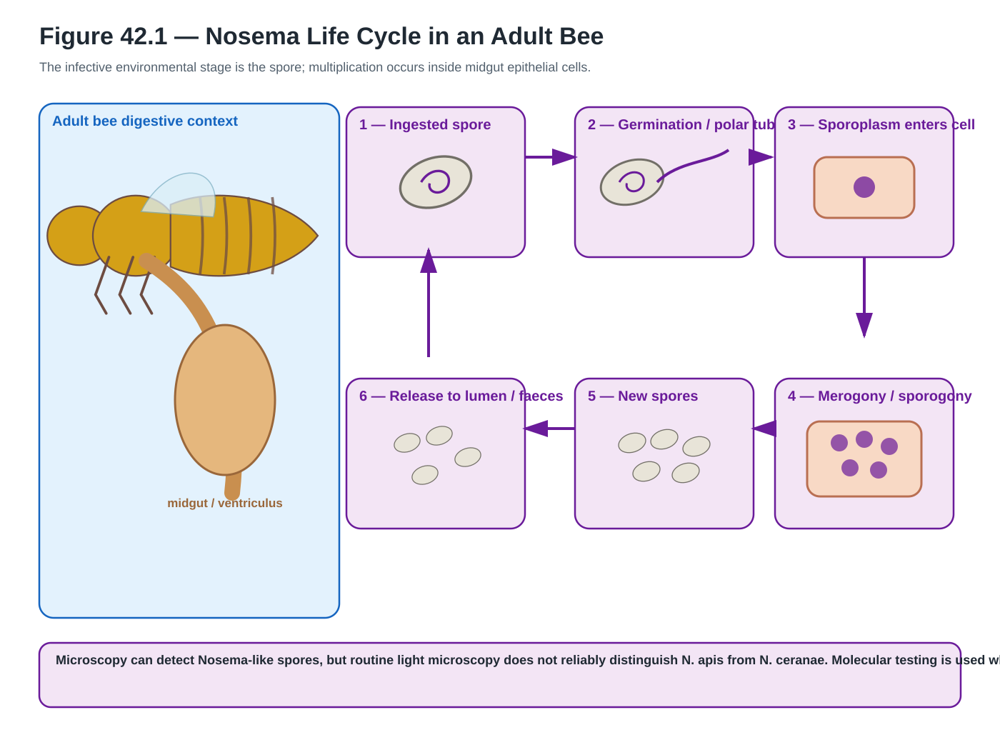</a>

**Figure 42.1** · NATIVE_HIGH_FIDELITY_COLOR · PENDING_FINAL_LAYOUT_PROOF · [Open SVG](../../assets/diagrams/wave-01/fig-42-1-nosema-life-cycle.svg)

Nosema microsporidian cycle: spore ingestion, germination and polar-tube extrusion, infection of a midgut epithelial cell, intracellular merogony/sporogony, new spores and faecal-oral transmission.

### Figure 42.3 — Healthy Versus Heavily Affected Midgut Concept

<a href="../../assets/diagrams/wave-01/fig-42-3-healthy-vs-affected-midgut.svg">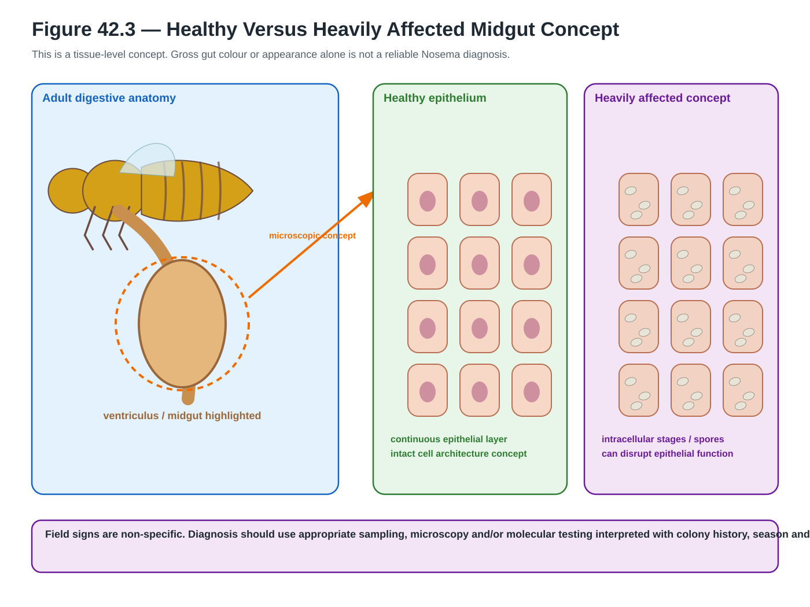</a>

**Figure 42.3** · NATIVE_HIGH_FIDELITY_COLOR · PENDING_FINAL_LAYOUT_PROOF · [Open SVG](../../assets/diagrams/wave-01/fig-42-3-healthy-vs-affected-midgut.svg)

Adult honey bee digestive anatomy highlighting the ventriculus and a microscopic concept comparison between healthy epithelium and heavily Nosema-affected epithelial cells.

### Figure 42.4 — Dysentery Is Not a Diagnosis

<a href="../../assets/diagrams/wave-01/fig-42-4-dysentery-not-diagnosis.svg">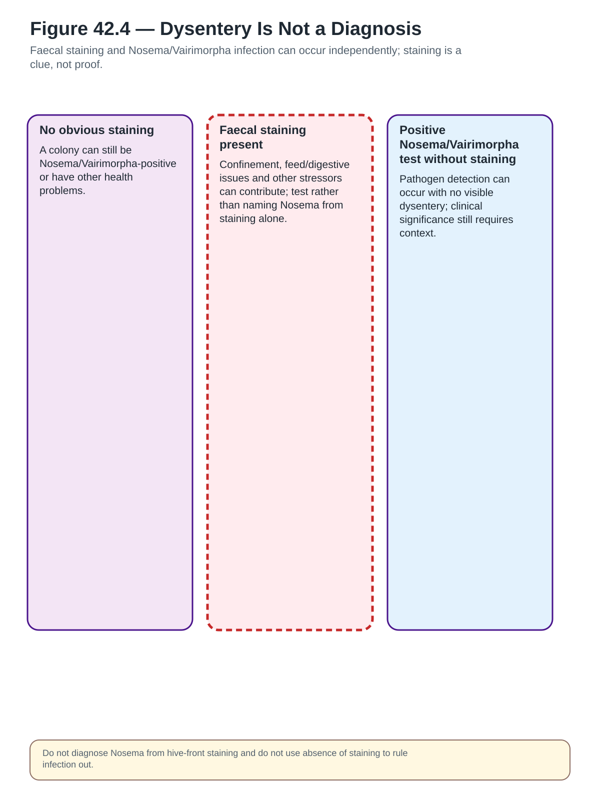</a>

**Figure 42.4** · SEMANTIC_COLOR_V1 · PENDING_FINAL_LAYOUT_PROOF · [Open SVG](../../assets/diagrams/wave-01/fig-42-4-dysentery-not-diagnosis.svg)

Three-panel concept separating faecal staining from Nosema/Vairimorpha detection and clinical significance.

### Figure 42.6 — Microscopy Workflow

<a href="../../assets/diagrams/wave-01/fig-42-6-nosema-microscopy-workflow.svg">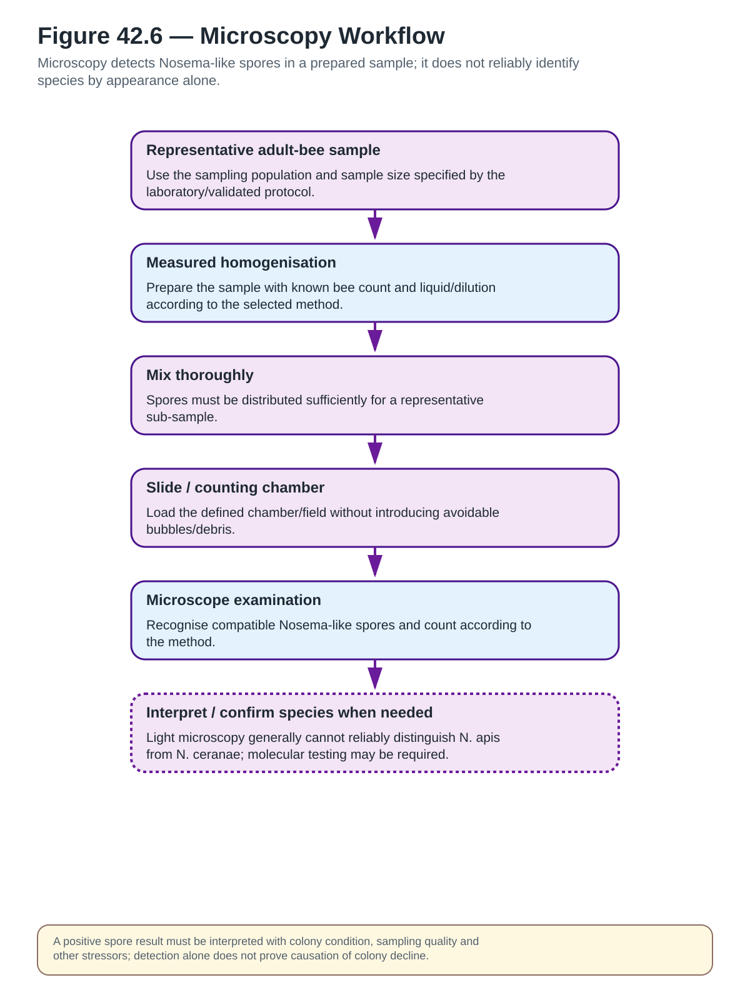</a>

**Figure 42.6** · SEMANTIC_COLOR_V1 · PENDING_FINAL_LAYOUT_PROOF · [Open SVG](../../assets/diagrams/wave-01/fig-42-6-nosema-microscopy-workflow.svg)

Microscopy workflow from representative adult-bee sample through homogenisation, counting chamber, microscope and interpretation.

### Figure 42.8 — Microscopy Versus PCR/qPCR

<a href="../../assets/diagrams/wave-01/fig-42-8-microscopy-vs-pcr.svg">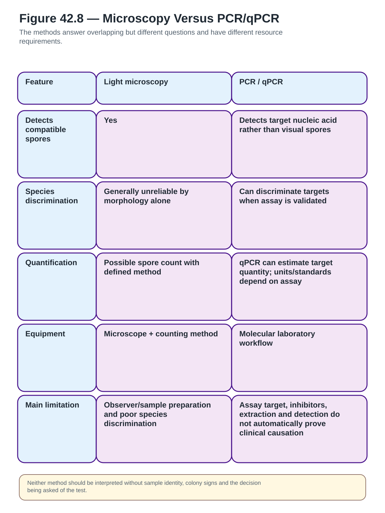</a>

**Figure 42.8** · SEMANTIC_COLOR_V1 · PENDING_FINAL_LAYOUT_PROOF · [Open SVG](../../assets/diagrams/wave-01/fig-42-8-microscopy-vs-pcr.svg)

Comparison table of light microscopy and PCR/qPCR for Nosema/Vairimorpha investigation.

### Figure 42.9 — A Positive Result Does Not Equal Cause

<a href="../../assets/diagrams/wave-01/fig-42-9-positive-result-not-equal-cause.svg">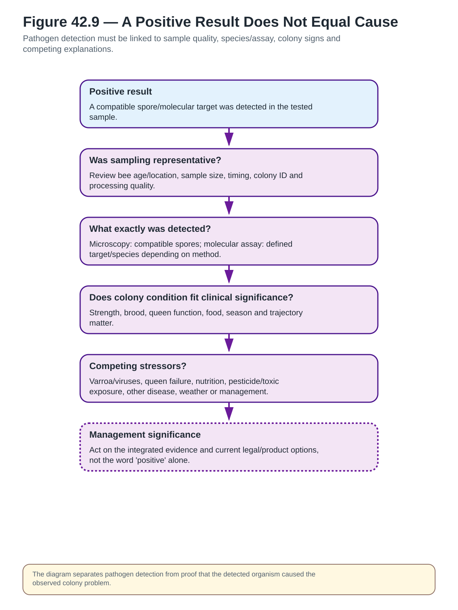</a>

**Figure 42.9** · SEMANTIC_COLOR_V1 · PENDING_FINAL_LAYOUT_PROOF · [Open SVG](../../assets/diagrams/wave-01/fig-42-9-positive-result-not-equal-cause.svg)

Decision flow interpreting a positive Nosema/Vairimorpha test without equating detection with cause.

### Figure 42.11 — Nosema Management Framework

<a href="../../assets/diagrams/wave-01/fig-42-11-nosema-management-framework.svg">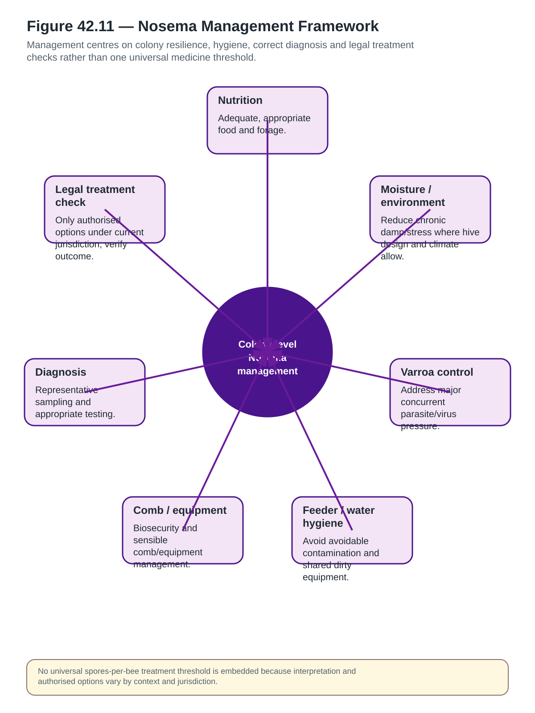</a>

**Figure 42.11** · SEMANTIC_COLOR_V1 · PENDING_FINAL_LAYOUT_PROOF · [Open SVG](../../assets/diagrams/wave-01/fig-42-11-nosema-management-framework.svg)

Hub-and-spoke Nosema management framework covering nutrition, moisture, Varroa, hygiene, comb management, diagnosis and legal treatment check.

## Chapter 43

### Figure 43.2 — Healthy Brood Versus Early AFB Suspicion

<a href="../../assets/diagrams/wave-01/fig-43-2-healthy-brood-vs-early-afb.svg">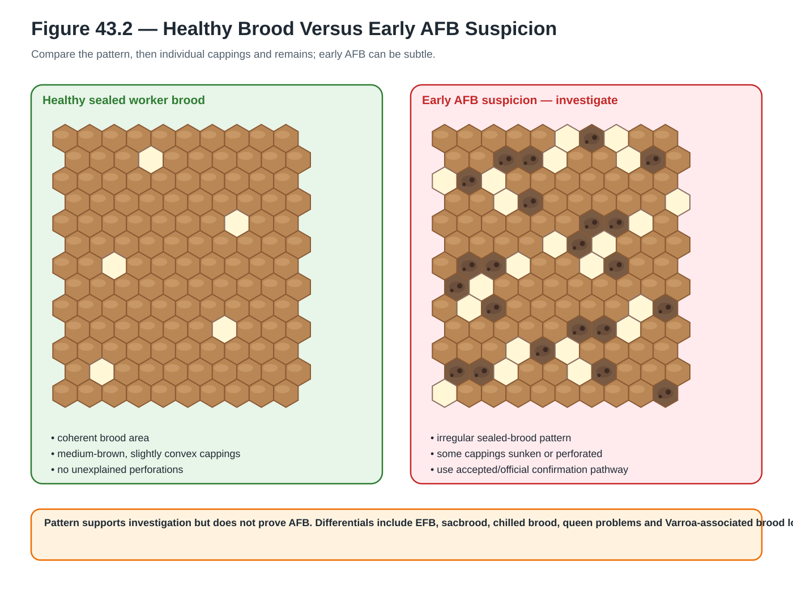</a>

**Figure 43.2** · NATIVE_HIGH_FIDELITY_COLOR · PENDING_FINAL_LAYOUT_PROOF · [Open SVG](../../assets/diagrams/wave-01/fig-43-2-healthy-brood-vs-early-afb.svg)

Comparison of coherent healthy sealed worker brood versus early AFB-suspicion pattern with irregular sealed brood and some sunken/perforated cappings.

### Figure 43.3 — American Foulbrood Disease-Stage Cell Series

<a href="../../assets/diagrams/wave-01/fig-43-3-disease-stage-cell-series.svg">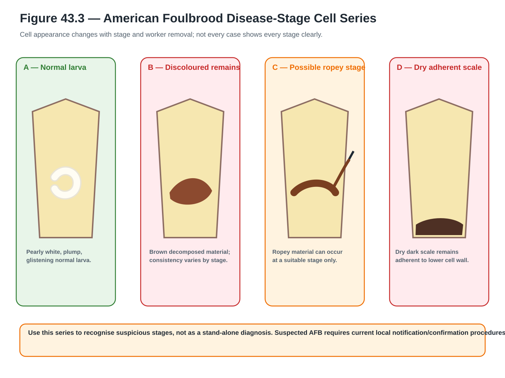</a>

**Figure 43.3** · NATIVE_HIGH_FIDELITY_COLOR · PENDING_FINAL_LAYOUT_PROOF · [Open SVG](../../assets/diagrams/wave-01/fig-43-3-disease-stage-cell-series.svg)

Cell cross-sections show a normal larva, discoloured decomposed remains, possible ropey stage and dry adherent scale; not every case shows every stage.

### Figure 43.6 — AFB Differential Diagnosis

<a href="../../assets/diagrams/wave-01/fig-43-6-afb-differential-diagnosis.svg">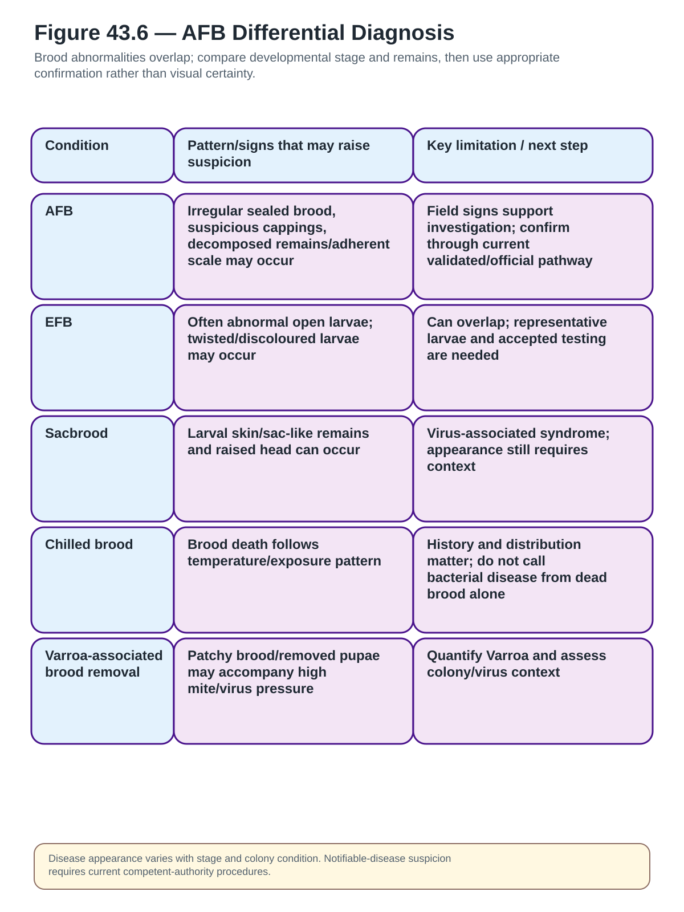</a>

**Figure 43.6** · SEMANTIC_COLOR_V1 · PENDING_FINAL_LAYOUT_PROOF · [Open SVG](../../assets/diagrams/wave-01/fig-43-6-afb-differential-diagnosis.svg)

Differential diagnosis matrix for AFB, EFB, sacbrood, chilled brood and Varroa-associated brood removal.

### Figure 43.9 — Laboratory Confirmation Pathways

<a href="../../assets/diagrams/wave-01/fig-43-9-afb-laboratory-confirmation-pathways.svg">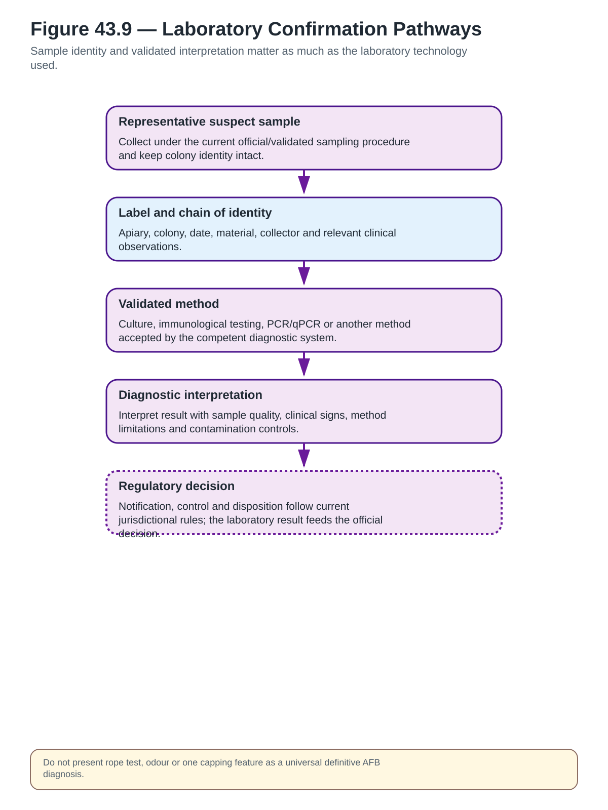</a>

**Figure 43.9** · SEMANTIC_COLOR_V1 · PENDING_FINAL_LAYOUT_PROOF · [Open SVG](../../assets/diagrams/wave-01/fig-43-9-afb-laboratory-confirmation-pathways.svg)

Laboratory pathway for AFB from representative sample and identity records through validated test, interpretation and regulatory decision.

### Figure 43.10 — Cleaning Versus Decontamination

<a href="../../assets/diagrams/wave-01/fig-43-10-cleaning-versus-decontamination.svg">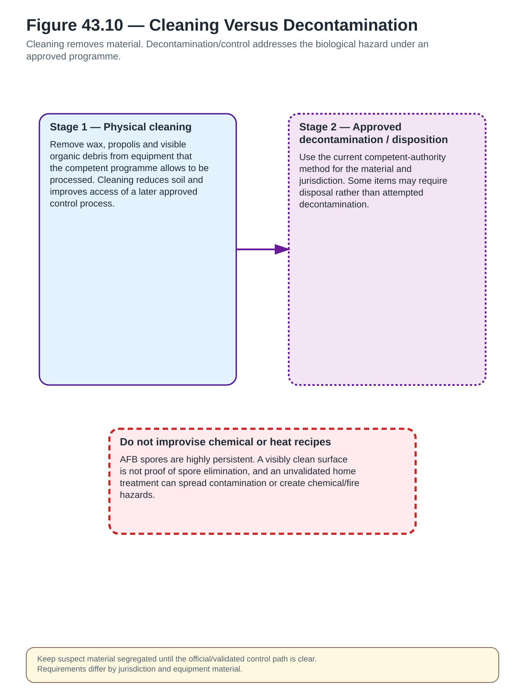</a>

**Figure 43.10** · SEMANTIC_COLOR_V1 · PENDING_FINAL_LAYOUT_PROOF · [Open SVG](../../assets/diagrams/wave-01/fig-43-10-cleaning-versus-decontamination.svg)

Two-stage concept showing physical removal of wax, propolis and debris before an approved AFB spore-targeting decontamination or disposition process.

### Figure 43.11 — Why Antibiotics Do Not Eradicate AFB

<a href="../../assets/diagrams/wave-01/fig-43-11-antibiotics-do-not-eradicate-afb.svg">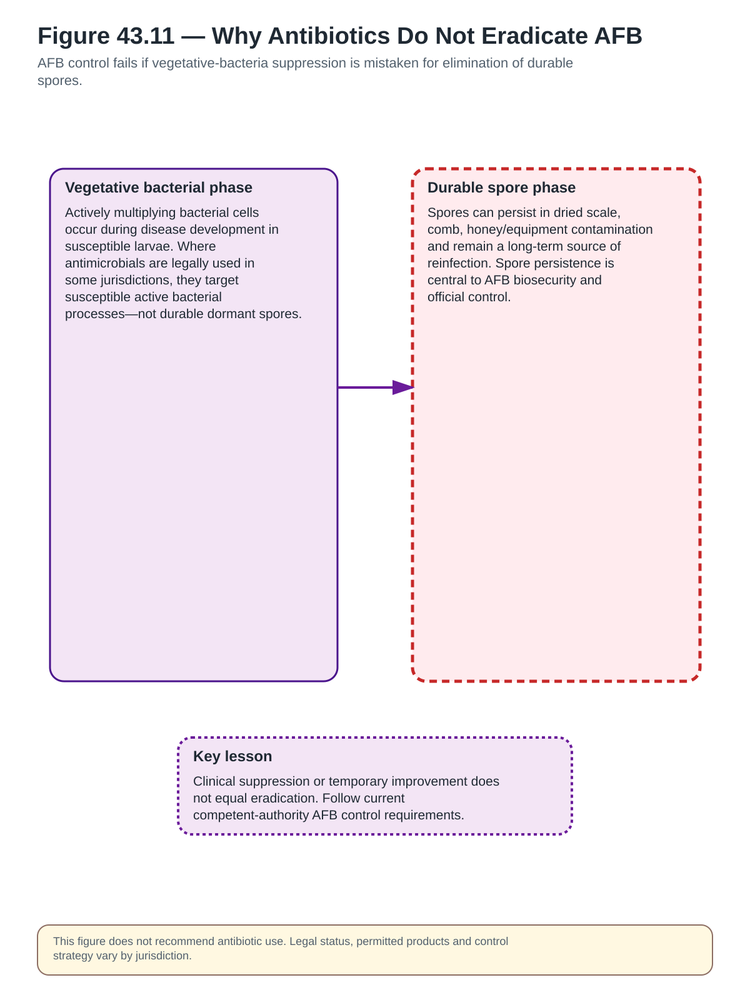</a>

**Figure 43.11** · SEMANTIC_COLOR_V1 · PENDING_FINAL_LAYOUT_PROOF · [Open SVG](../../assets/diagrams/wave-01/fig-43-11-antibiotics-do-not-eradicate-afb.svg)

Conceptual diagram separating vegetative bacterial growth from durable Paenibacillus larvae spores, showing that suppression of vegetative bacteria does not remove spores from comb or equipment.

### Figure 43.12 — Trace-Back and Trace-Forward Map

<a href="../../assets/diagrams/wave-01/fig-43-12-afb-trace-back-trace-forward.svg">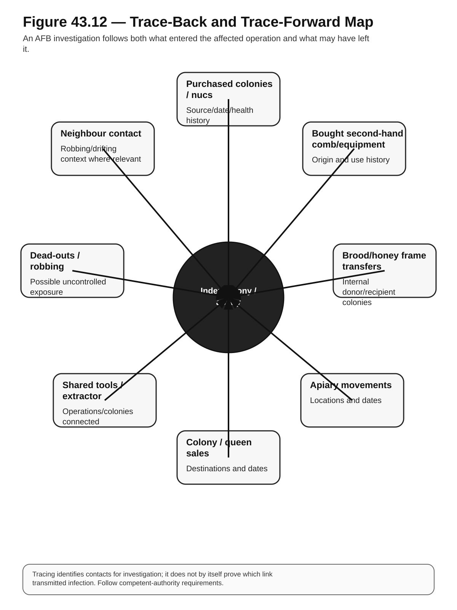</a>

**Figure 43.12** · SEMANTIC_COLOR_V1 · PENDING_FINAL_LAYOUT_PROOF · [Open SVG](../../assets/diagrams/wave-01/fig-43-12-afb-trace-back-trace-forward.svg)

Network map for AFB trace-back and trace-forward through purchases, transfers, movements, sales, equipment and robbing/drifting contacts.

### Figure 43.13 — AFB Response Decision Flow

<a href="../../assets/diagrams/wave-01/fig-43-13-afb-response-decision-flow.svg">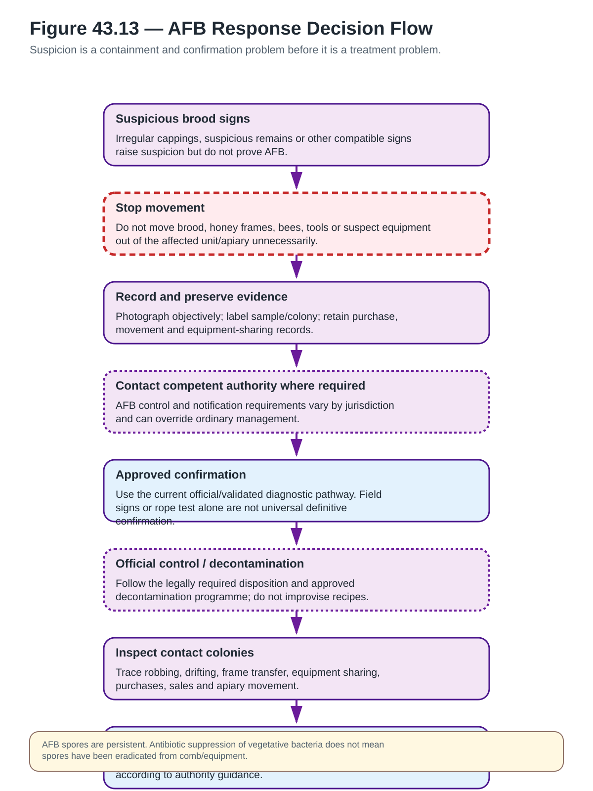</a>

**Figure 43.13** · SEMANTIC_COLOR_V1 · PENDING_FINAL_LAYOUT_PROOF · [Open SVG](../../assets/diagrams/wave-01/fig-43-13-afb-response-decision-flow.svg)

AFB decision flow from suspicious signs to movement stop, evidence preservation, authority contact, validated confirmation, official control, contact-colony inspection and follow-up.

## Chapter 44

### Figure 44.2 — Healthy Versus EFB-Affected Open Brood

<a href="../../assets/diagrams/wave-01/fig-44-2-healthy-vs-efb-open-brood.svg">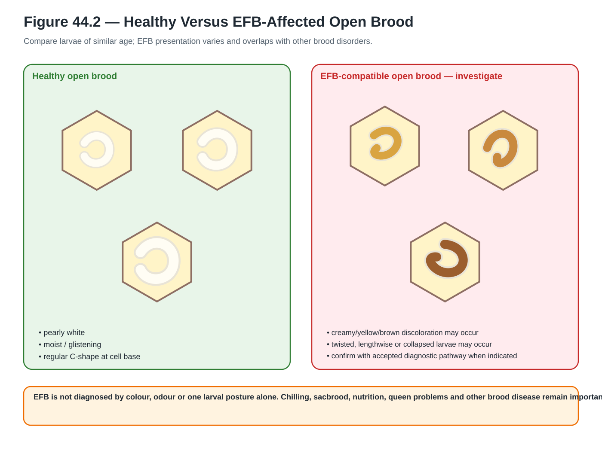</a>

**Figure 44.2** · NATIVE_HIGH_FIDELITY_COLOR · PENDING_FINAL_LAYOUT_PROOF · [Open SVG](../../assets/diagrams/wave-01/fig-44-2-healthy-vs-efb-open-brood.svg)

Comparison of pearly healthy C-shaped larvae with representative EFB-compatible larvae that are creamy, yellow-brown, twisted or collapsed.

### Figure 44.4 — EFB Versus AFB

<a href="../../assets/diagrams/wave-01/fig-44-4-efb-versus-afb.svg">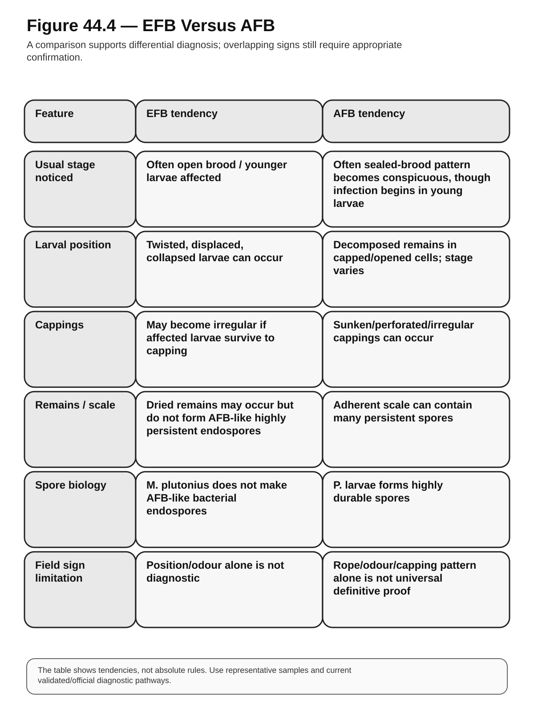</a>

**Figure 44.4** · SEMANTIC_COLOR_V1 · PENDING_FINAL_LAYOUT_PROOF · [Open SVG](../../assets/diagrams/wave-01/fig-44-4-efb-versus-afb.svg)

Comparison matrix of European foulbrood and American foulbrood by common stage, larval position, cappings, remains, spore biology and field-sign limitations.

### Figure 44.5 — EFB Differential Diagnosis

<a href="../../assets/diagrams/wave-01/fig-44-5-efb-differential-diagnosis.svg">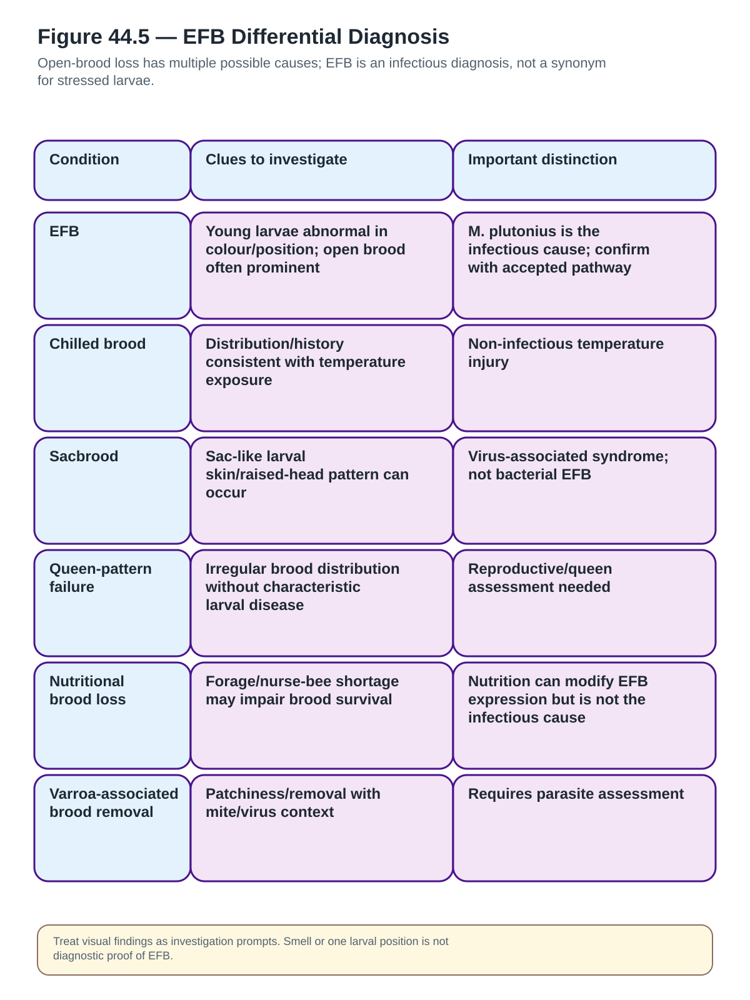</a>

**Figure 44.5** · SEMANTIC_COLOR_V1 · PENDING_FINAL_LAYOUT_PROOF · [Open SVG](../../assets/diagrams/wave-01/fig-44-5-efb-differential-diagnosis.svg)

Differential matrix comparing EFB with chilling, sacbrood, queen-pattern failure, nutritional brood loss and Varroa-associated brood removal.

### Figure 44.6 — Disease Expression and Colony Stress

<a href="../../assets/diagrams/wave-01/fig-44-6-efb-disease-expression-colony-stress.svg">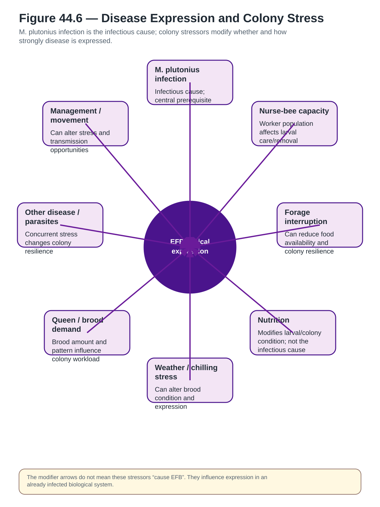</a>

**Figure 44.6** · SEMANTIC_COLOR_V1 · PENDING_FINAL_LAYOUT_PROOF · [Open SVG](../../assets/diagrams/wave-01/fig-44-6-efb-disease-expression-colony-stress.svg)

Conceptual network separating Melissococcus plutonius infection as the infectious cause from nutritional, weather, workforce and concurrent-stress modifiers.

### Figure 44.8 — EFB Sampling and Diagnostic Pathway

<a href="../../assets/diagrams/wave-01/fig-44-8-efb-sampling-diagnostic-pathway.svg">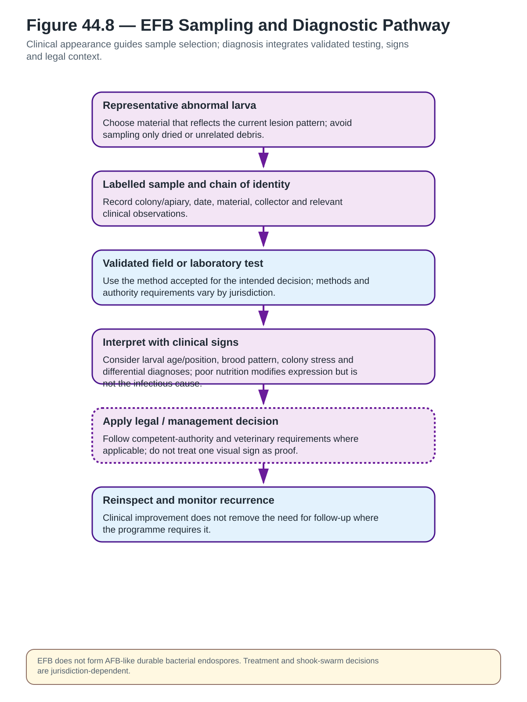</a>

**Figure 44.8** · SEMANTIC_COLOR_V1 · PENDING_FINAL_LAYOUT_PROOF · [Open SVG](../../assets/diagrams/wave-01/fig-44-8-efb-sampling-diagnostic-pathway.svg)

EFB diagnostic pathway from representative larva and labelled sample to validated test, integrated interpretation, legal management decision and follow-up.

### Figure 44.9 — Shook-Swarm Principle

<a href="../../assets/diagrams/wave-01/fig-44-9-shook-swarm-principle.svg">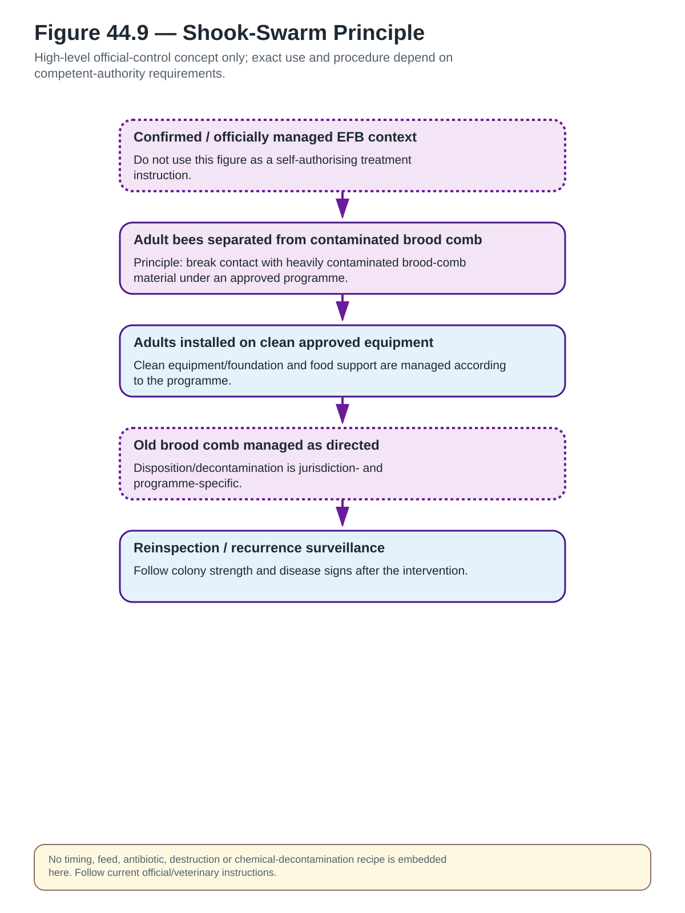</a>

**Figure 44.9** · SEMANTIC_COLOR_V1 · PENDING_FINAL_LAYOUT_PROOF · [Open SVG](../../assets/diagrams/wave-01/fig-44-9-shook-swarm-principle.svg)

High-level shook-swarm principle for EFB control, explicitly subject to competent-authority requirements.

### Figure 44.10 — Follow-Up After Apparent Recovery

<a href="../../assets/diagrams/wave-01/fig-44-10-efb-follow-up-after-recovery.svg">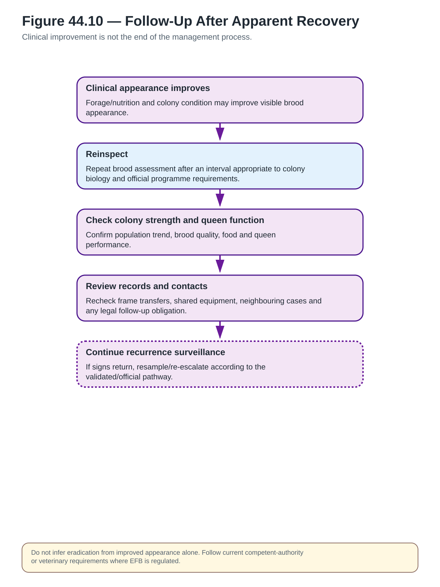</a>

**Figure 44.10** · SEMANTIC_COLOR_V1 · PENDING_FINAL_LAYOUT_PROOF · [Open SVG](../../assets/diagrams/wave-01/fig-44-10-efb-follow-up-after-recovery.svg)

Timeline for EFB follow-up after apparent clinical improvement, including reinspection, colony-strength check and recurrence surveillance.

### Figure 44.11 — Apiary Contact Map

<a href="../../assets/diagrams/wave-01/fig-44-11-efb-apiary-contact-map.svg">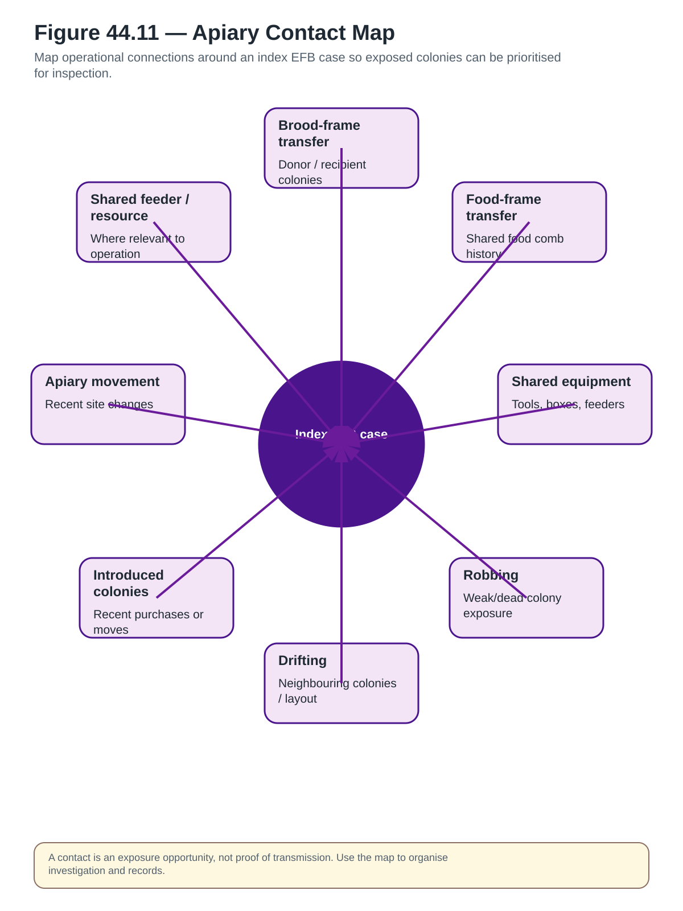</a>

**Figure 44.11** · SEMANTIC_COLOR_V1 · PENDING_FINAL_LAYOUT_PROOF · [Open SVG](../../assets/diagrams/wave-01/fig-44-11-efb-apiary-contact-map.svg)

Apiary contact map around an EFB index case including frame transfers, shared equipment, robbing, drifting, introductions and movements.

## Chapter 45

### Figure 45.1 — Infection Versus Clinical Disease

<a href="../../assets/diagrams/wave-01/fig-45-1-infection-versus-clinical-disease.svg">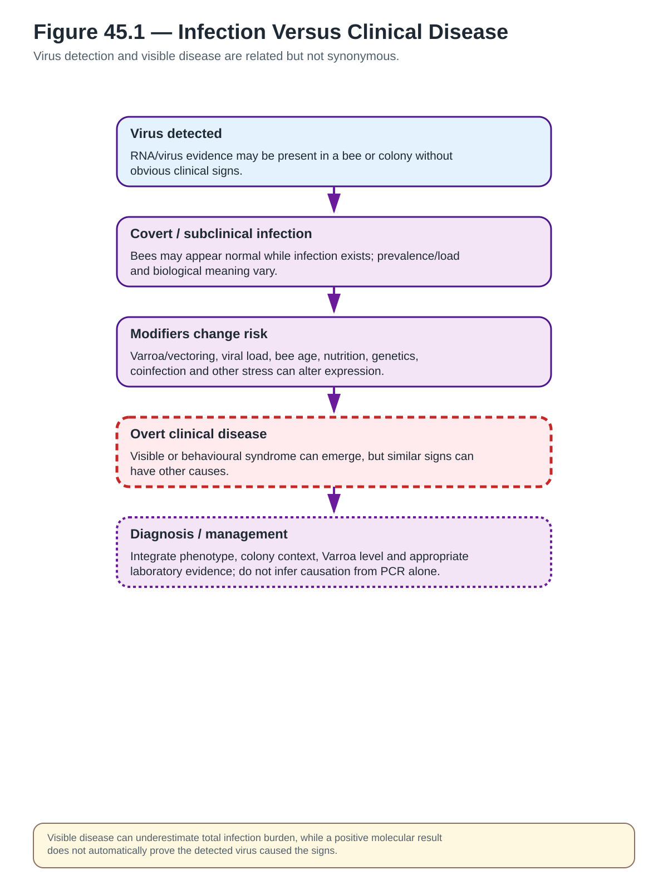</a>

**Figure 45.1** · SEMANTIC_COLOR_V1 · PENDING_FINAL_LAYOUT_PROOF · [Open SVG](../../assets/diagrams/wave-01/fig-45-1-infection-versus-clinical-disease.svg)

Layered pathway from virus detection through subclinical infection and modifiers to possible overt disease and integrated interpretation.

### Figure 45.2 — Viral Transmission Routes

<a href="../../assets/diagrams/wave-01/fig-45-2-viral-transmission-routes.svg">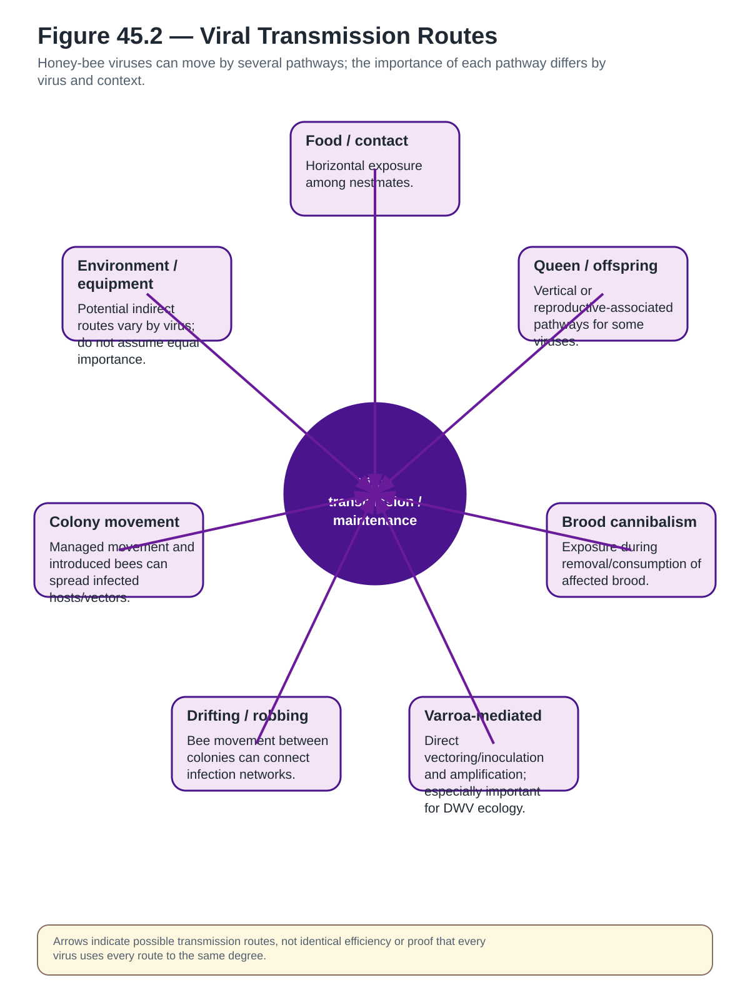</a>

**Figure 45.2** · SEMANTIC_COLOR_V1 · PENDING_FINAL_LAYOUT_PROOF · [Open SVG](../../assets/diagrams/wave-01/fig-45-2-viral-transmission-routes.svg)

Hub diagram of food/contact, queen/offspring, brood cannibalism, Varroa, drifting/robbing, colony movement and indirect routes in honey-bee virus ecology.

### Figure 45.3 — Varroa–DWV Interaction

<a href="../../assets/diagrams/wave-01/fig-45-3-varroa-dwv-interaction.svg">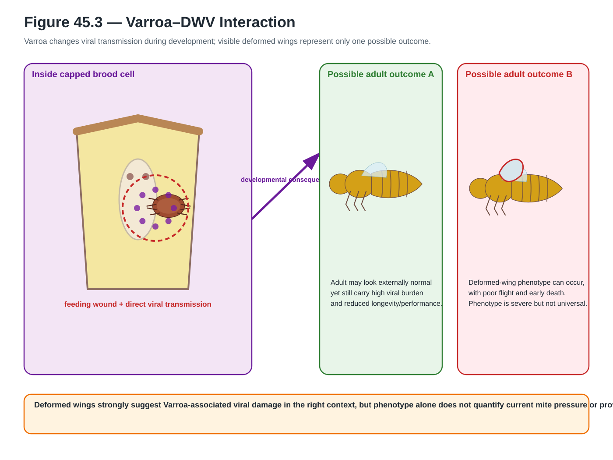</a>

**Figure 45.3** · NATIVE_HIGH_FIDELITY_COLOR · PENDING_FINAL_LAYOUT_PROOF · [Open SVG](../../assets/diagrams/wave-01/fig-45-3-varroa-dwv-interaction.svg)

Brood-cell cross-section showing Varroa feeding during pupal development and virus transmission, followed by possible normal-looking or visibly deformed adult outcomes.

### Figure 45.9 — RT-PCR Workflow

<a href="../../assets/diagrams/wave-01/fig-45-9-rt-pcr-workflow.svg">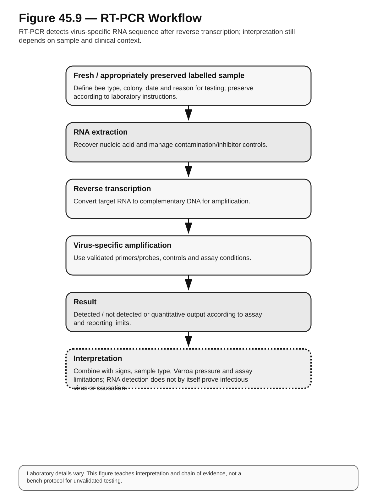</a>

**Figure 45.9** · SEMANTIC_COLOR_V1 · PENDING_FINAL_LAYOUT_PROOF · [Open SVG](../../assets/diagrams/wave-01/fig-45-9-rt-pcr-workflow.svg)

RT-PCR workflow from labelled sample through RNA extraction, reverse transcription, amplification, result and contextual interpretation.

### Figure 45.10 — Pooled Versus Individual Sampling

<a href="../../assets/diagrams/wave-01/fig-45-10-pooled-vs-individual-sampling.svg">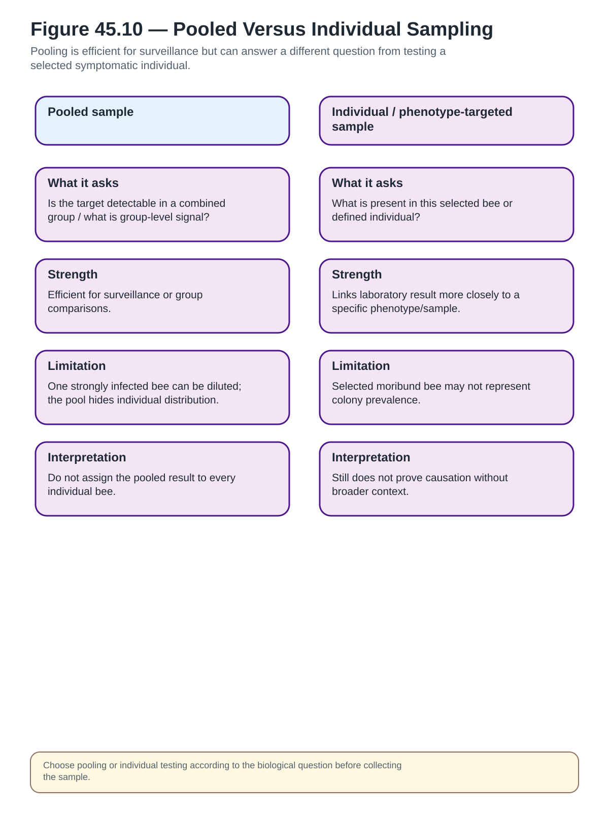</a>

**Figure 45.10** · SEMANTIC_COLOR_V1 · PENDING_FINAL_LAYOUT_PROOF · [Open SVG](../../assets/diagrams/wave-01/fig-45-10-pooled-vs-individual-sampling.svg)

Comparison of pooled virus surveillance samples with individual phenotype-targeted sampling.

### Figure 45.11 — Viral Differential Diagnosis

<a href="../../assets/diagrams/wave-01/fig-45-11-viral-differential-diagnosis.svg">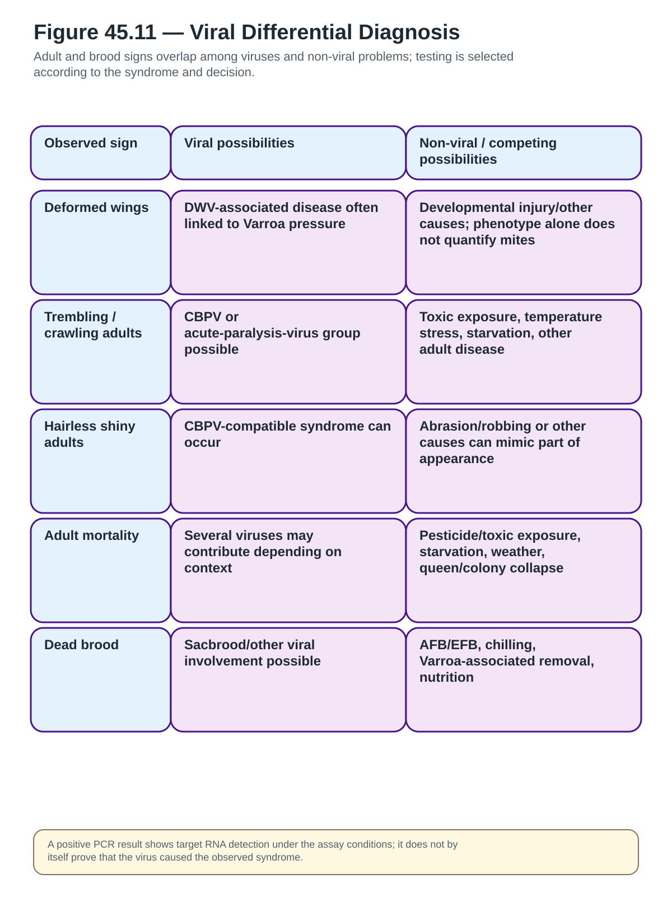</a>

**Figure 45.11** · SEMANTIC_COLOR_V1 · PENDING_FINAL_LAYOUT_PROOF · [Open SVG](../../assets/diagrams/wave-01/fig-45-11-viral-differential-diagnosis.svg)

Differential matrix for deformed wings, trembling/crawling adults, shiny adults, mortality and dead brood across viral and non-viral causes.

### Figure 45.12 — Practical Virus-Management Framework

<a href="../../assets/diagrams/wave-01/fig-45-12-virus-management-framework.svg">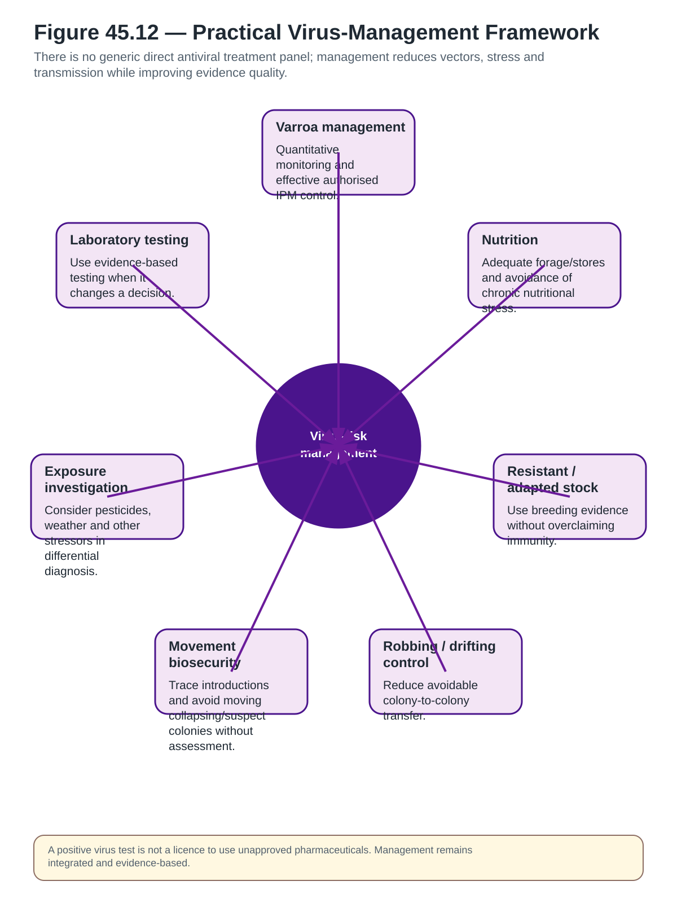</a>

**Figure 45.12** · SEMANTIC_COLOR_V1 · PENDING_FINAL_LAYOUT_PROOF · [Open SVG](../../assets/diagrams/wave-01/fig-45-12-virus-management-framework.svg)

Hub diagram of practical honey-bee virus risk management through Varroa control, nutrition, stock, robbing/drifting reduction, movement biosecurity, exposure investigation and testing.

## Chapter 46

### Figure 46.1 — The Honey Bee IPM Cycle

<a href="../../assets/diagrams/wave-01/fig-46-1-honey-bee-ipm-cycle.svg">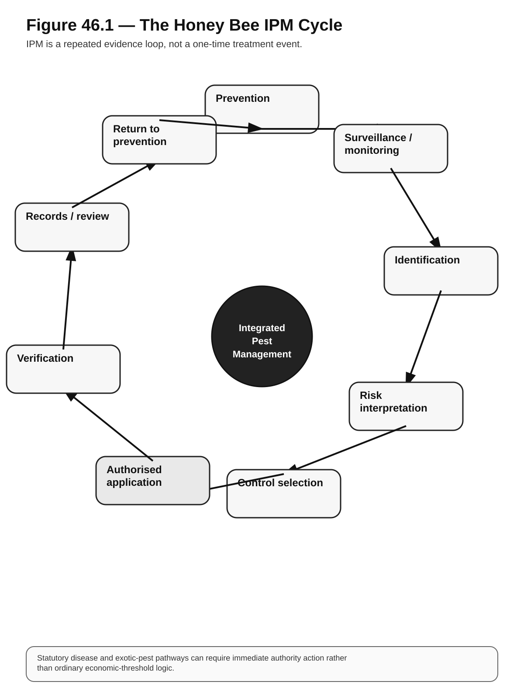</a>

**Figure 46.1** · SEMANTIC_COLOR_V1 · PENDING_FINAL_LAYOUT_PROOF · [Open SVG](../../assets/diagrams/wave-01/fig-46-1-honey-bee-ipm-cycle.svg)

Circular IPM cycle from prevention through monitoring, identification, risk interpretation, control selection, authorised application, verification and records/review back to prevention.

### Figure 46.3 — Surveillance Versus Monitoring

<a href="../../assets/diagrams/wave-01/fig-46-3-surveillance-versus-monitoring.svg">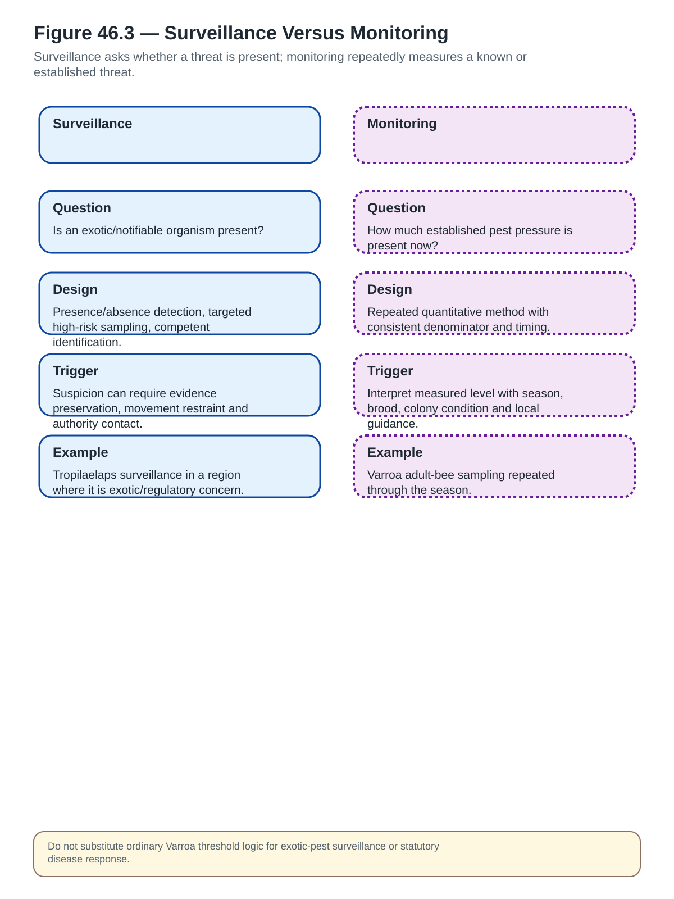</a>

**Figure 46.3** · SEMANTIC_COLOR_V1 · PENDING_FINAL_LAYOUT_PROOF · [Open SVG](../../assets/diagrams/wave-01/fig-46-3-surveillance-versus-monitoring.svg)

Two-column comparison of exotic-pest surveillance and repeated monitoring of an established threat such as Varroa.

### Figure 46.4 — Thresholds Are Contextual

<a href="../../assets/diagrams/wave-01/fig-46-4-ipm-thresholds-contextual.svg">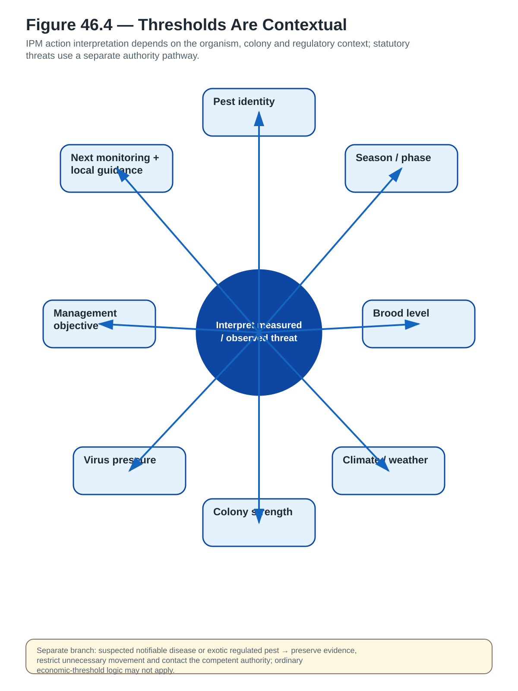</a>

**Figure 46.4** · SEMANTIC_COLOR_V1 · PENDING_FINAL_LAYOUT_PROOF · [Open SVG](../../assets/diagrams/wave-01/fig-46-4-ipm-thresholds-contextual.svg)

IPM threshold decision wheel with pest identity, season, brood, climate, colony strength, virus pressure, management objective, next monitoring/local guidance and a separate statutory-control note.

### Figure 46.6 — Drone-Brood Removal Sequence

<a href="../../assets/diagrams/wave-01/fig-46-6-drone-brood-removal-sequence.svg">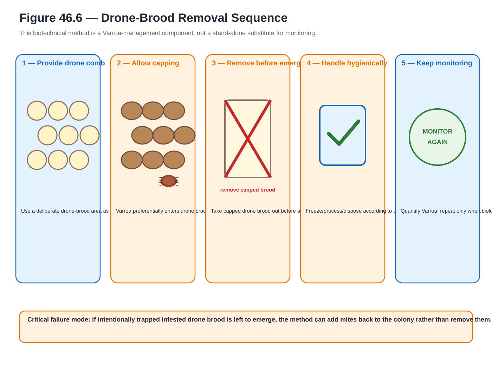</a>

**Figure 46.6** · NATIVE_HIGH_FIDELITY_COLOR · PENDING_FINAL_LAYOUT_PROOF · [Open SVG](../../assets/diagrams/wave-01/fig-46-6-drone-brood-removal-sequence.svg)

IPM sequence showing dedicated drone comb, capping and Varroa reproduction, timely removal before emergence, hygienic handling and continued monitoring; late removal can increase mite production.

### Figure 46.9 — Mode of Action and Resistance Selection

<a href="../../assets/diagrams/wave-01/fig-46-9-mode-of-action-resistance-selection.svg">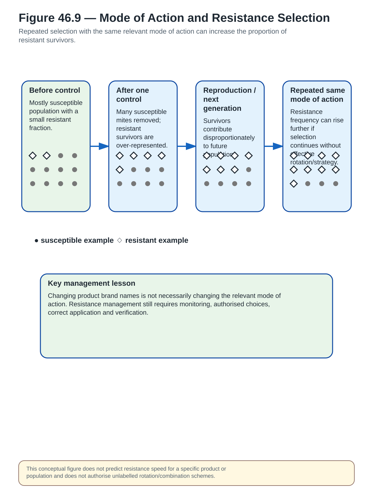</a>

**Figure 46.9** · SEMANTIC_COLOR_V1 · PENDING_FINAL_LAYOUT_PROOF · [Open SVG](../../assets/diagrams/wave-01/fig-46-9-mode-of-action-resistance-selection.svg)

Conceptual population sequence showing selective removal of susceptible mites and disproportionate survival/reproduction of resistant mites after repeated use of one mode of action.

### Figure 46.10 — Treatment Failure Investigation

<a href="../../assets/diagrams/wave-01/fig-46-10-treatment-failure-investigation.svg">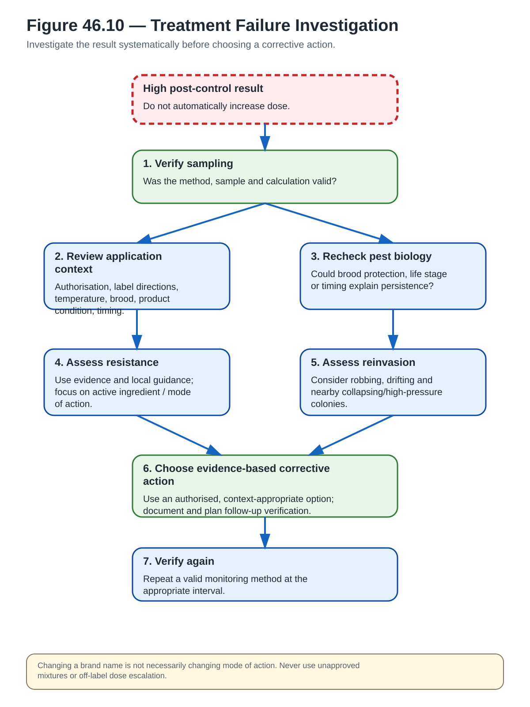</a>

**Figure 46.10** · SEMANTIC_COLOR_V1 · PENDING_FINAL_LAYOUT_PROOF · [Open SVG](../../assets/diagrams/wave-01/fig-46-10-treatment-failure-investigation.svg)

Decision tree for investigating a high post-control pest result without automatic dose escalation.

### Figure 46.12 — Established Pest Versus Exotic Regulated Pest

<a href="../../assets/diagrams/wave-01/fig-46-12-established-vs-exotic-regulated-pest.svg">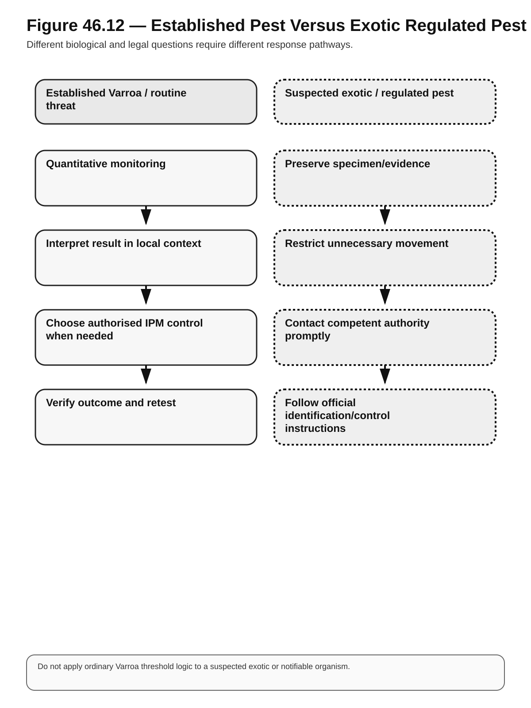</a>

**Figure 46.12** · SEMANTIC_COLOR_V1 · PENDING_FINAL_LAYOUT_PROOF · [Open SVG](../../assets/diagrams/wave-01/fig-46-12-established-vs-exotic-regulated-pest.svg)

Two-column pathway comparing routine Varroa monitoring and IPM management with evidence preservation, movement restraint and authority notification for suspected exotic regulated pests.

