# Wave 02 Visual Gallery

**A_CORE assets:** 60 / 60  
**Coverage:** Chapters 1–20  
**Status:** production complete; final greyscale, final-size, accessibility and layout proof pending.

Tap any thumbnail or **Open SVG** to inspect the vector at full resolution.

## Chapter 1 — Introduction to Beekeeping

### Figure 1.2 — What A Colony Contains

<a href="../../assets/diagrams/wave-02/fig-01-2-what-a-colony-contains.svg">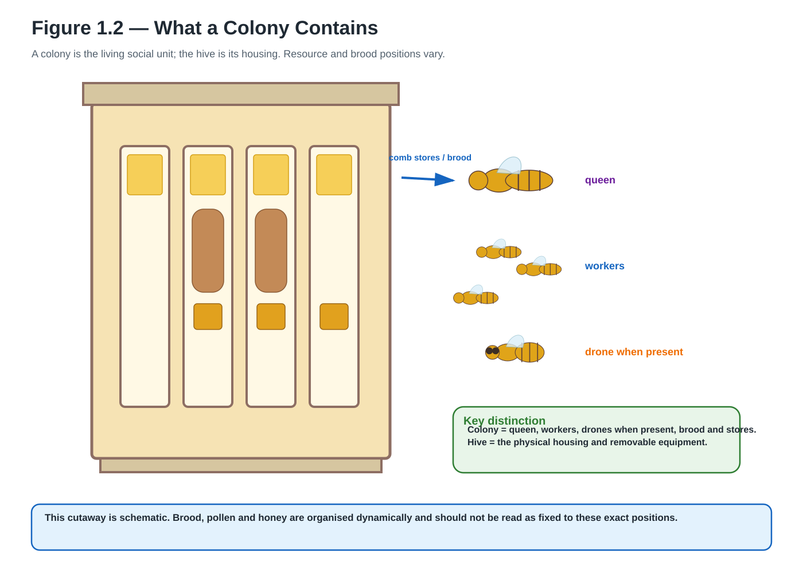</a>

**A_CORE** · `ACTUAL_VECTOR_CREATED` · `PENDING_FINAL_LAYOUT_PROOF` · [Open SVG](../../assets/diagrams/wave-02/fig-01-2-what-a-colony-contains.svg)

### Figure 1.3 — Beekeeping Year At A Glance

<a href="../../assets/diagrams/wave-02/fig-01-3-beekeeping-year-at-a-glance.svg">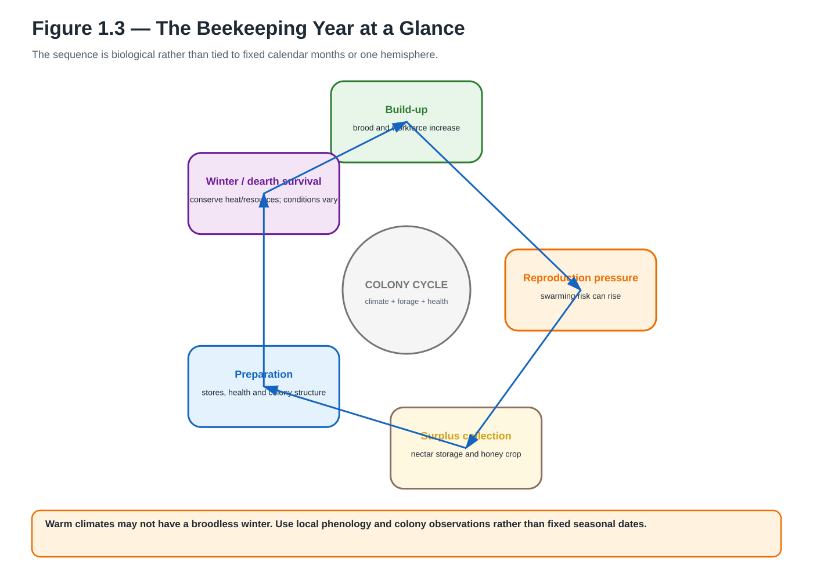</a>

**A_CORE** · `ACTUAL_VECTOR_CREATED` · `PENDING_FINAL_LAYOUT_PROOF` · [Open SVG](../../assets/diagrams/wave-02/fig-01-3-beekeeping-year-at-a-glance.svg)

### Figure 1.4 — Beginner Decision Path

<a href="../../assets/diagrams/wave-02/fig-01-4-beginner-decision-path.svg">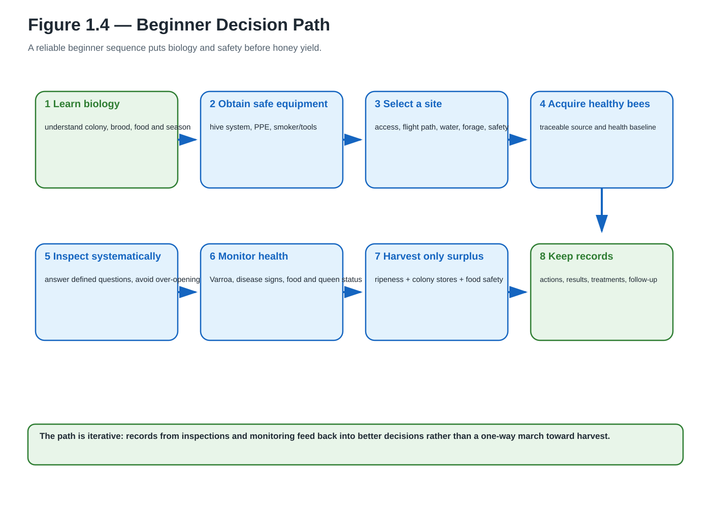</a>

**A_CORE** · `ACTUAL_VECTOR_CREATED` · `PENDING_FINAL_LAYOUT_PROOF` · [Open SVG](../../assets/diagrams/wave-02/fig-01-4-beginner-decision-path.svg)

## Chapter 2 — History of Beekeeping

### Figure 2.1 — Beekeeping Development Timeline

<a href="../../assets/diagrams/wave-02/fig-02-1-beekeeping-development-timeline.svg">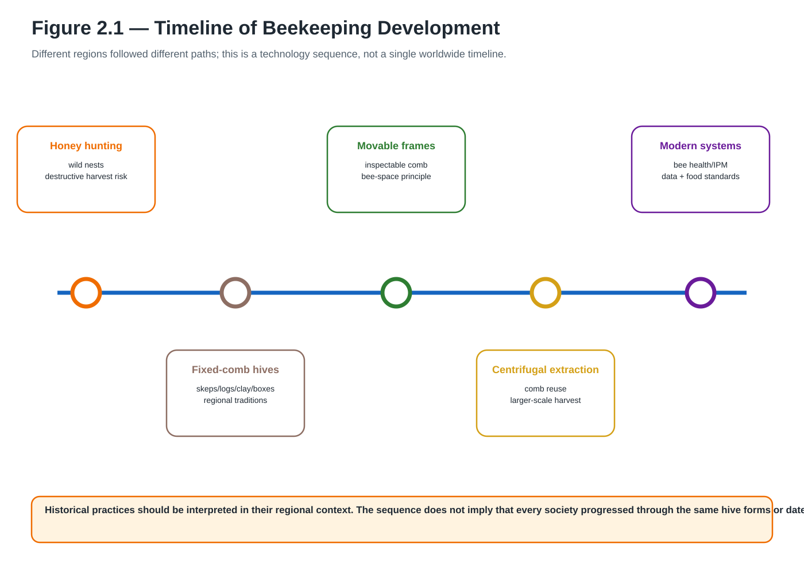</a>

**A_CORE** · `ACTUAL_VECTOR_CREATED` · `PENDING_FINAL_LAYOUT_PROOF` · [Open SVG](../../assets/diagrams/wave-02/fig-02-1-beekeeping-development-timeline.svg)

### Figure 2.3 — Movable Frame Breakthrough

<a href="../../assets/diagrams/wave-02/fig-02-3-movable-frame-breakthrough.svg">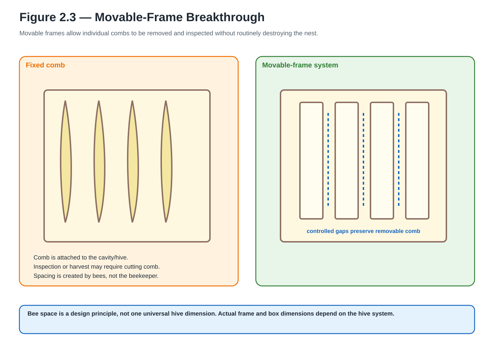</a>

**A_CORE** · `ACTUAL_VECTOR_CREATED` · `PENDING_FINAL_LAYOUT_PROOF` · [Open SVG](../../assets/diagrams/wave-02/fig-02-3-movable-frame-breakthrough.svg)

### Figure 2.4 — Global Traditions

<a href="../../assets/diagrams/wave-02/fig-02-4-global-traditions.svg">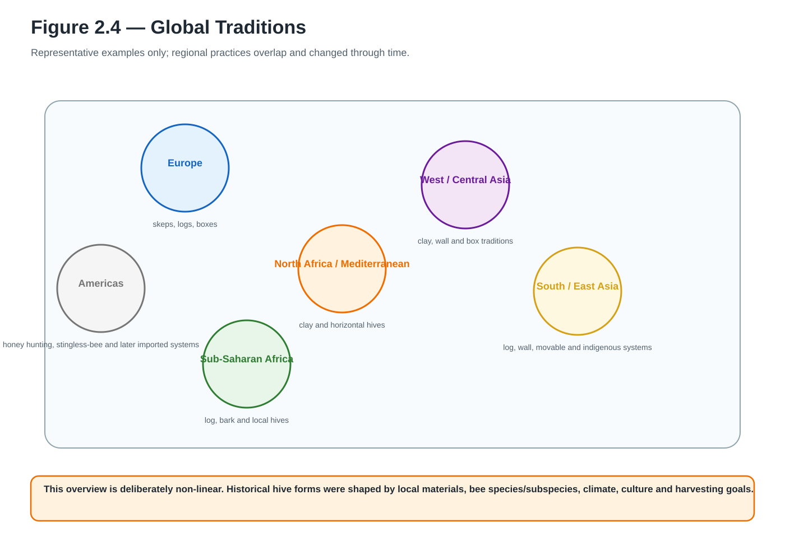</a>

**A_CORE** · `ACTUAL_VECTOR_CREATED` · `PENDING_FINAL_LAYOUT_PROOF` · [Open SVG](../../assets/diagrams/wave-02/fig-02-4-global-traditions.svg)

## Chapter 3 — Importance of Honey Bees

### Figure 3.2 — Pollination Network

<a href="../../assets/diagrams/wave-02/fig-03-2-pollination-network.svg">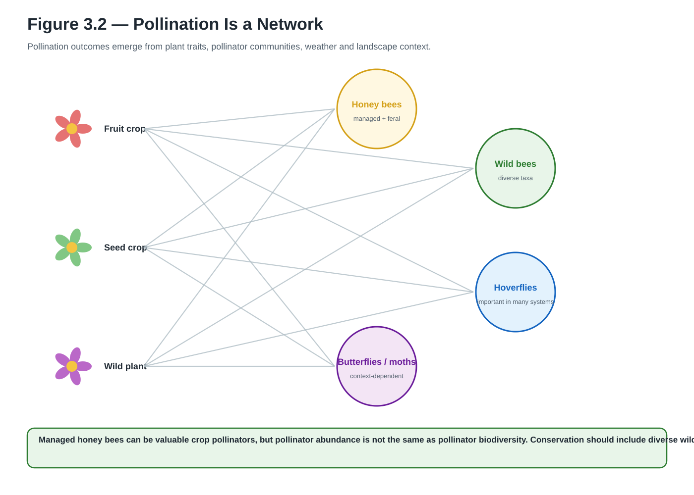</a>

**A_CORE** · `ACTUAL_VECTOR_CREATED` · `PENDING_FINAL_LAYOUT_PROOF` · [Open SVG](../../assets/diagrams/wave-02/fig-03-2-pollination-network.svg)

### Figure 3.3 — Managed vs Wild Pollinators

<a href="../../assets/diagrams/wave-02/fig-03-3-managed-vs-wild-pollinators.svg">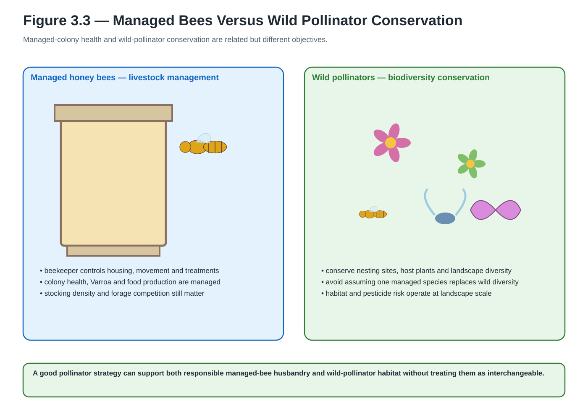</a>

**A_CORE** · `ACTUAL_VECTOR_CREATED` · `PENDING_FINAL_LAYOUT_PROOF` · [Open SVG](../../assets/diagrams/wave-02/fig-03-3-managed-vs-wild-pollinators.svg)

### Figure 3.4 — Ecosystem Service Pathway

<a href="../../assets/diagrams/wave-02/fig-03-4-ecosystem-service-pathway.svg">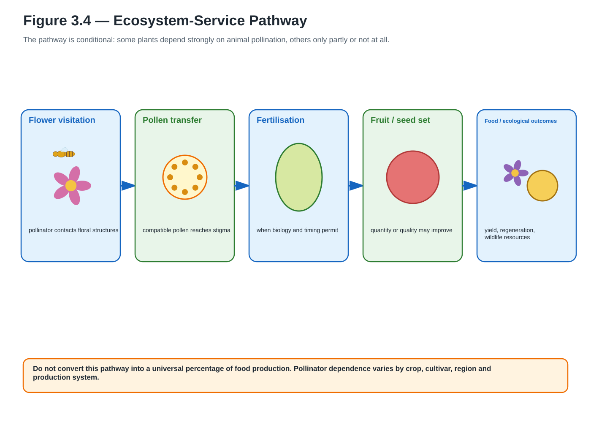</a>

**A_CORE** · `ACTUAL_VECTOR_CREATED` · `PENDING_FINAL_LAYOUT_PROOF` · [Open SVG](../../assets/diagrams/wave-02/fig-03-4-ecosystem-service-pathway.svg)

## Chapter 4 — Products of the Hive

### Figure 4.1 — Hive Product Overview

<a href="../../assets/diagrams/wave-02/fig-04-1-hive-product-overview.svg">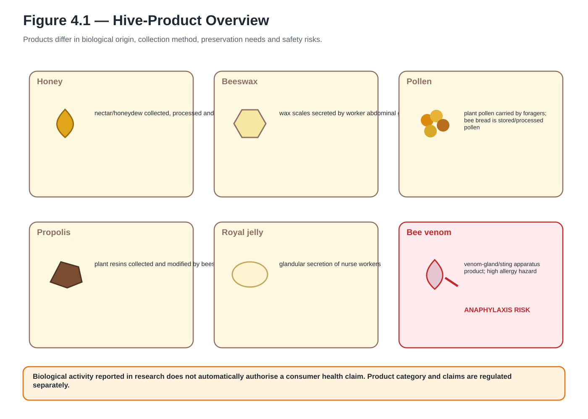</a>

**A_CORE** · `ACTUAL_VECTOR_CREATED` · `PENDING_FINAL_LAYOUT_PROOF` · [Open SVG](../../assets/diagrams/wave-02/fig-04-1-hive-product-overview.svg)

### Figure 4.2 — Product Origin Map

<a href="../../assets/diagrams/wave-02/fig-04-2-product-origin-map.svg">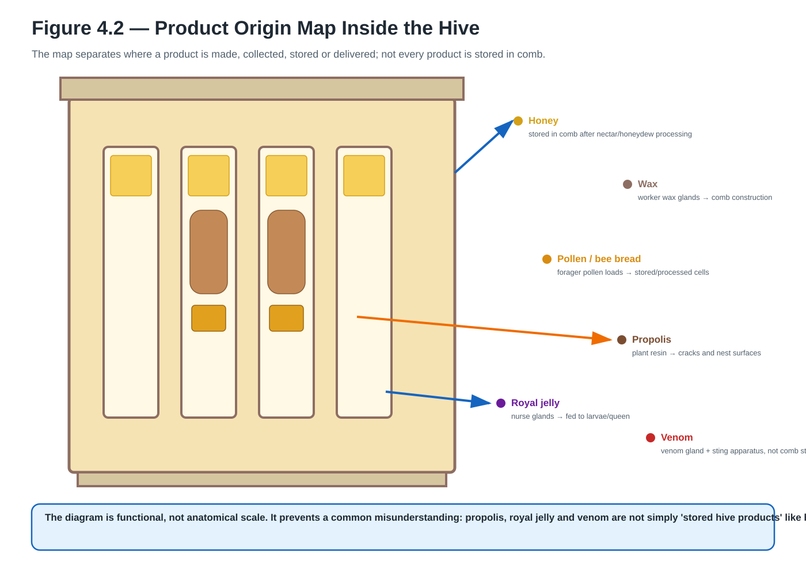</a>

**A_CORE** · `ACTUAL_VECTOR_CREATED` · `PENDING_FINAL_LAYOUT_PROOF` · [Open SVG](../../assets/diagrams/wave-02/fig-04-2-product-origin-map.svg)

### Figure 4.4 — From Colony To Market

<a href="../../assets/diagrams/wave-02/fig-04-4-from-colony-to-market.svg">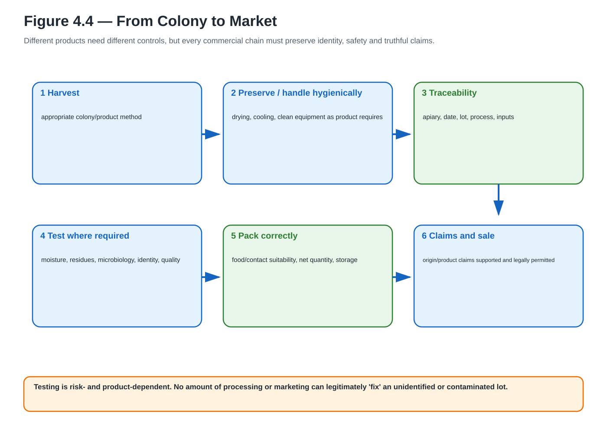</a>

**A_CORE** · `ACTUAL_VECTOR_CREATED` · `PENDING_FINAL_LAYOUT_PROOF` · [Open SVG](../../assets/diagrams/wave-02/fig-04-4-from-colony-to-market.svg)

## Chapter 5 — Modern Beekeeping

### Figure 5.2 — Evidence Based Decision Loop

<a href="../../assets/diagrams/wave-02/fig-05-2-evidence-based-decision-loop.svg">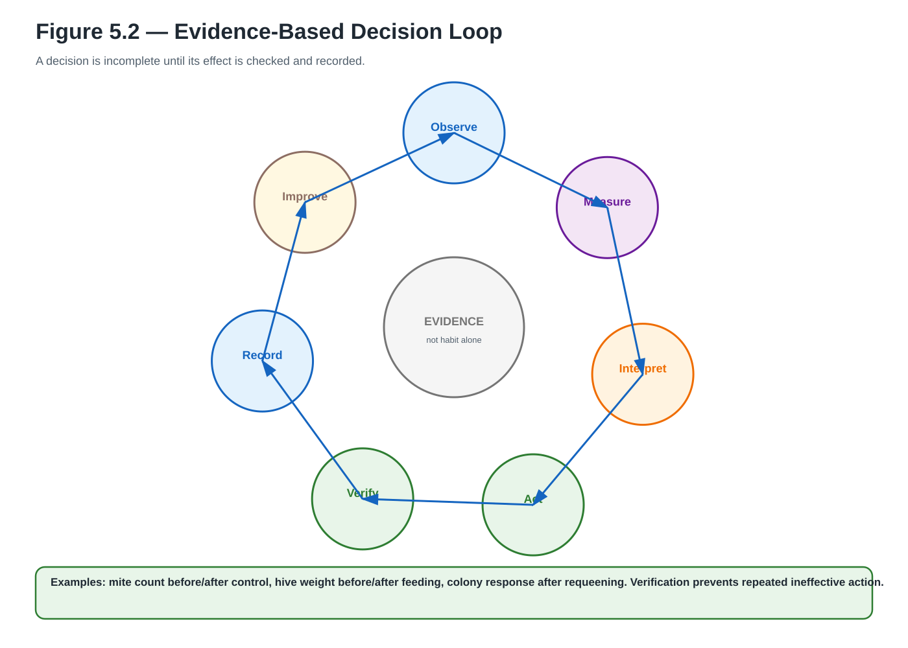</a>

**A_CORE** · `ACTUAL_VECTOR_CREATED` · `PENDING_FINAL_LAYOUT_PROOF` · [Open SVG](../../assets/diagrams/wave-02/fig-05-2-evidence-based-decision-loop.svg)

### Figure 5.3 — Traditional vs Precision Tools

<a href="../../assets/diagrams/wave-02/fig-05-3-traditional-vs-precision-tools.svg">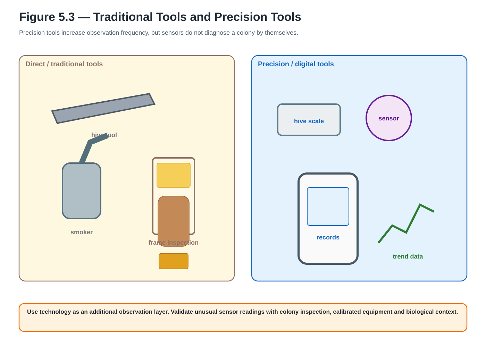</a>

**A_CORE** · `ACTUAL_VECTOR_CREATED` · `PENDING_FINAL_LAYOUT_PROOF` · [Open SVG](../../assets/diagrams/wave-02/fig-05-3-traditional-vs-precision-tools.svg)

### Figure 5.4 — Modern Risk Landscape

<a href="../../assets/diagrams/wave-02/fig-05-4-modern-risk-landscape.svg">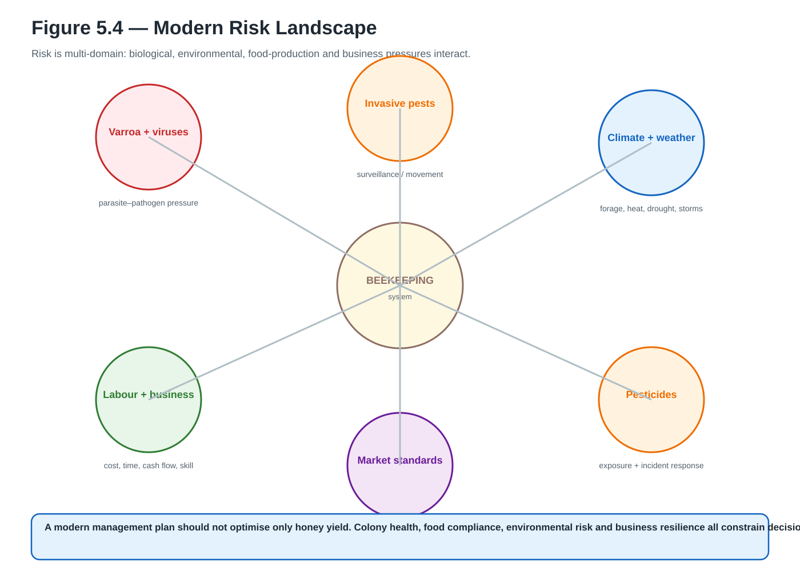</a>

**A_CORE** · `ACTUAL_VECTOR_CREATED` · `PENDING_FINAL_LAYOUT_PROOF` · [Open SVG](../../assets/diagrams/wave-02/fig-05-4-modern-risk-landscape.svg)

## Chapter 6 — Bee Anatomy

### Figure 6.1 — External Worker Anatomy

<a href="../../assets/diagrams/wave-02/fig-06-1-external-worker-anatomy.svg">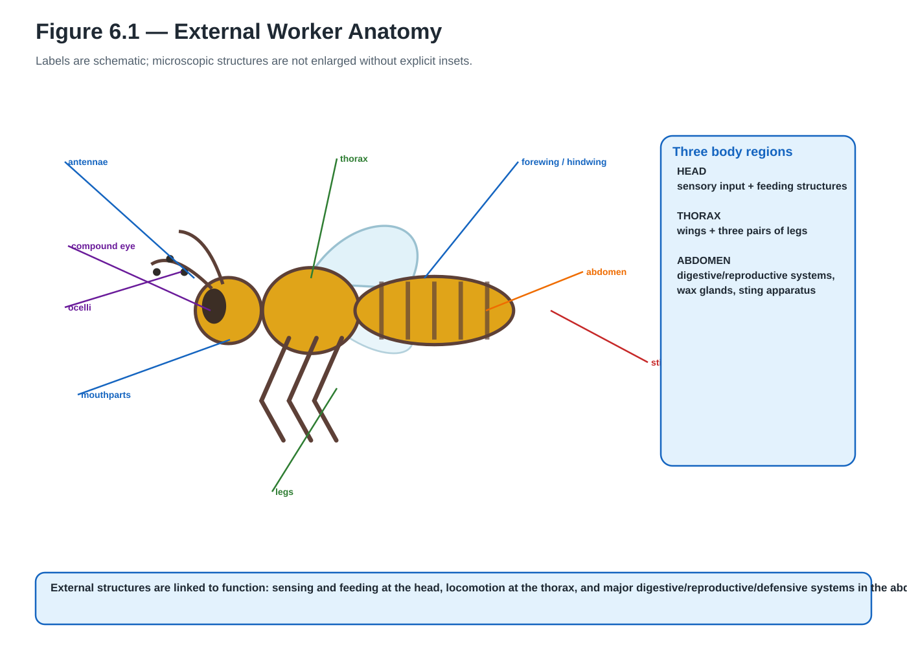</a>

**A_CORE** · `ACTUAL_VECTOR_CREATED` · `PENDING_FINAL_LAYOUT_PROOF` · [Open SVG](../../assets/diagrams/wave-02/fig-06-1-external-worker-anatomy.svg)

### Figure 6.4 — Internal Systems

<a href="../../assets/diagrams/wave-02/fig-06-4-internal-systems.svg">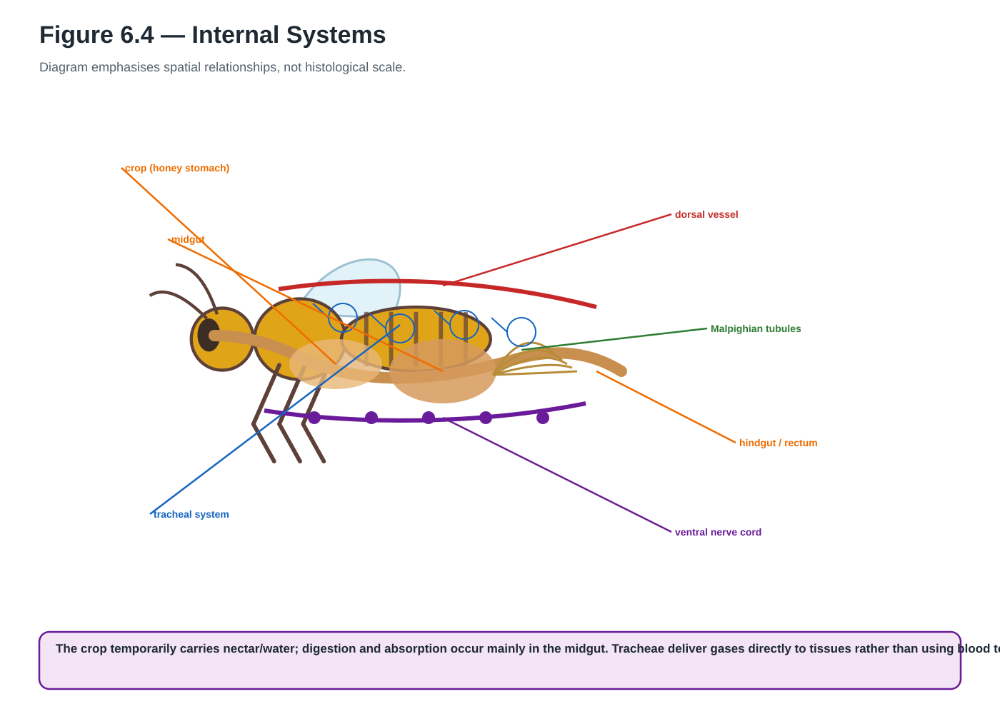</a>

**A_CORE** · `ACTUAL_VECTOR_CREATED` · `PENDING_FINAL_LAYOUT_PROOF` · [Open SVG](../../assets/diagrams/wave-02/fig-06-4-internal-systems.svg)

### Figure 6.5 — Caste Anatomy Comparison

<a href="../../assets/diagrams/wave-02/fig-06-5-caste-anatomy-comparison.svg">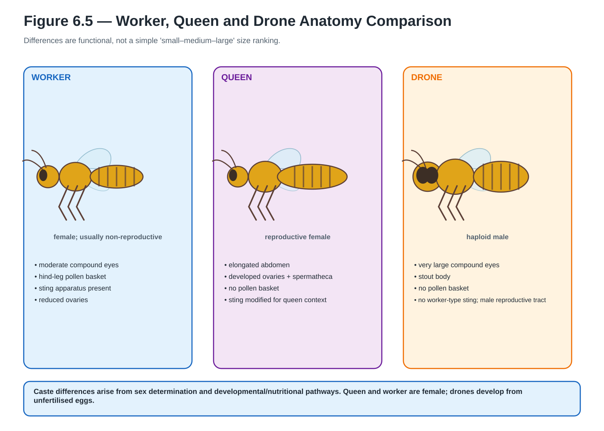</a>

**A_CORE** · `ACTUAL_VECTOR_CREATED` · `PENDING_FINAL_LAYOUT_PROOF` · [Open SVG](../../assets/diagrams/wave-02/fig-06-5-caste-anatomy-comparison.svg)

## Chapter 7 — Honey Bee Life Cycle

### Figure 7.1 — Complete Development Cycle

<a href="../../assets/diagrams/wave-02/fig-07-1-complete-development-cycle.svg">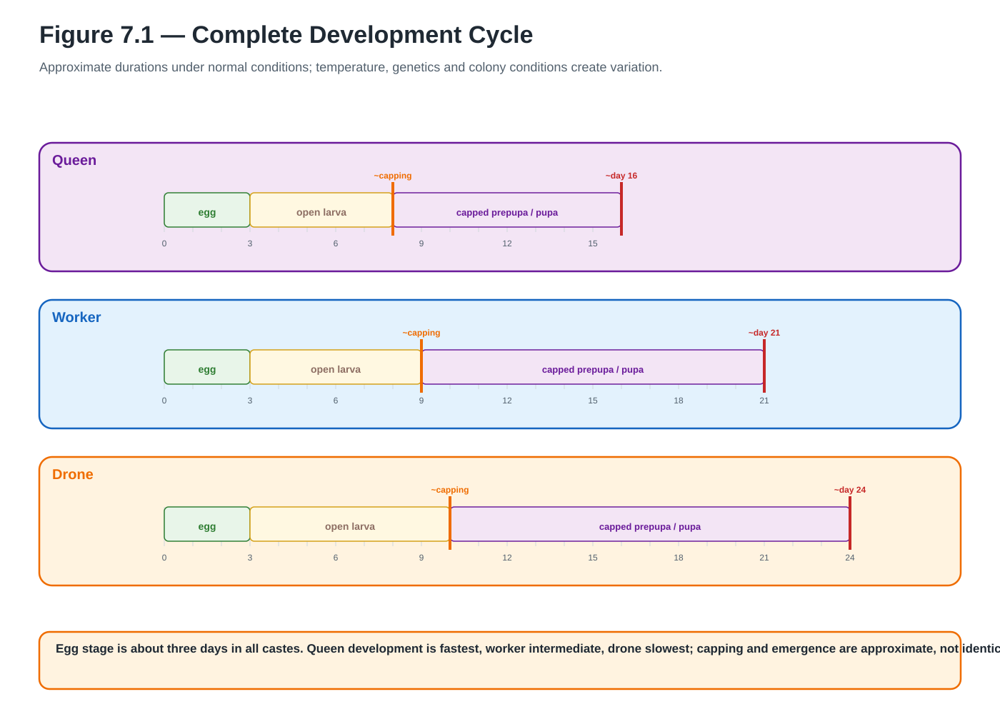</a>

**A_CORE** · `ACTUAL_VECTOR_CREATED` · `PENDING_FINAL_LAYOUT_PROOF` · [Open SVG](../../assets/diagrams/wave-02/fig-07-1-complete-development-cycle.svg)

### Figure 7.2 — Larval Growth Feeding

<a href="../../assets/diagrams/wave-02/fig-07-2-larval-growth-feeding.svg">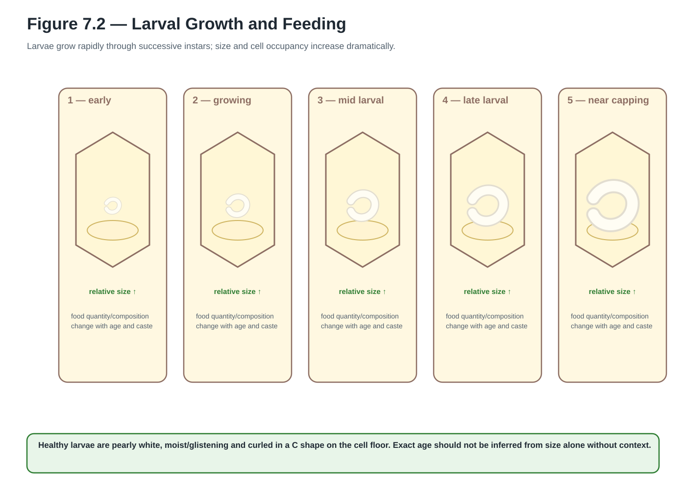</a>

**A_CORE** · `ACTUAL_VECTOR_CREATED` · `PENDING_FINAL_LAYOUT_PROOF` · [Open SVG](../../assets/diagrams/wave-02/fig-07-2-larval-growth-feeding.svg)

### Figure 7.4 — Caste Development Comparison

<a href="../../assets/diagrams/wave-02/fig-07-4-caste-development-comparison.svg">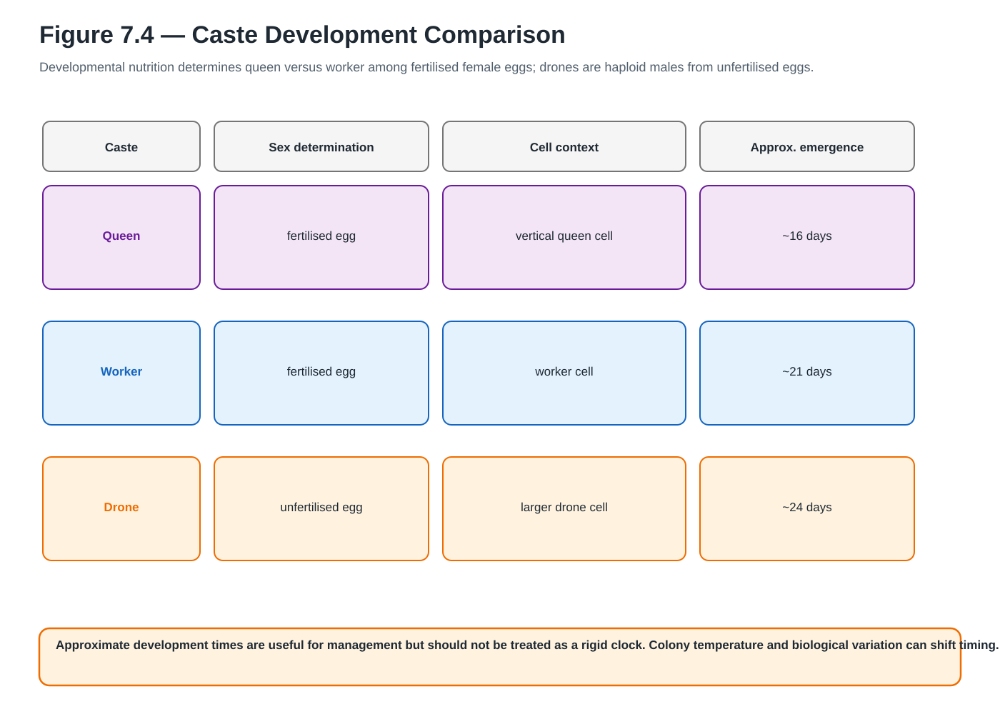</a>

**A_CORE** · `ACTUAL_VECTOR_CREATED` · `PENDING_FINAL_LAYOUT_PROOF` · [Open SVG](../../assets/diagrams/wave-02/fig-07-4-caste-development-comparison.svg)

## Chapter 8 — The Queen

### Figure 8.1 — Queen Anatomy Identification

<a href="../../assets/diagrams/wave-02/fig-08-1-queen-anatomy-identification.svg">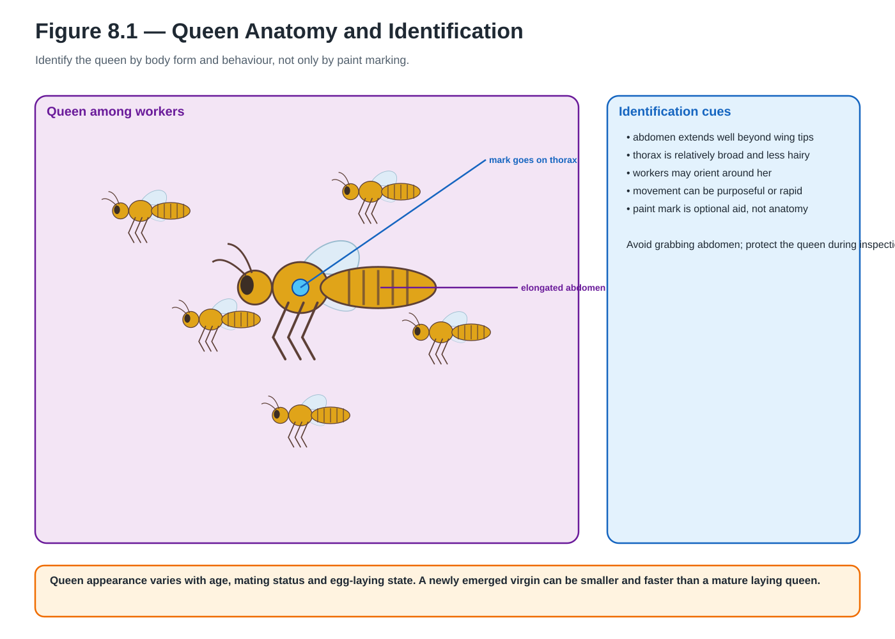</a>

**A_CORE** · `ACTUAL_VECTOR_CREATED` · `PENDING_FINAL_LAYOUT_PROOF` · [Open SVG](../../assets/diagrams/wave-02/fig-08-1-queen-anatomy-identification.svg)

### Figure 8.2 — Queen Reproductive System

<a href="../../assets/diagrams/wave-02/fig-08-2-queen-reproductive-system.svg">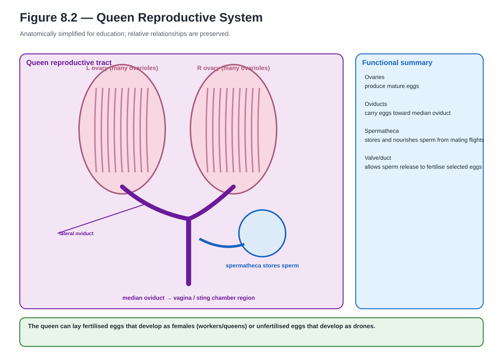</a>

**A_CORE** · `ACTUAL_VECTOR_CREATED` · `PENDING_FINAL_LAYOUT_PROOF` · [Open SVG](../../assets/diagrams/wave-02/fig-08-2-queen-reproductive-system.svg)

### Figure 8.3 — Mating Sperm Storage

<a href="../../assets/diagrams/wave-02/fig-08-3-mating-sperm-storage.svg">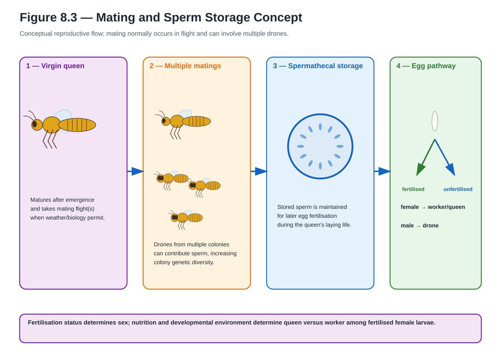</a>

**A_CORE** · `ACTUAL_VECTOR_CREATED` · `PENDING_FINAL_LAYOUT_PROOF` · [Open SVG](../../assets/diagrams/wave-02/fig-08-3-mating-sperm-storage.svg)

## Chapter 9 — Worker Bees

### Figure 9.1 — Worker Task Progression

<a href="../../assets/diagrams/wave-02/fig-09-1-worker-task-progression.svg">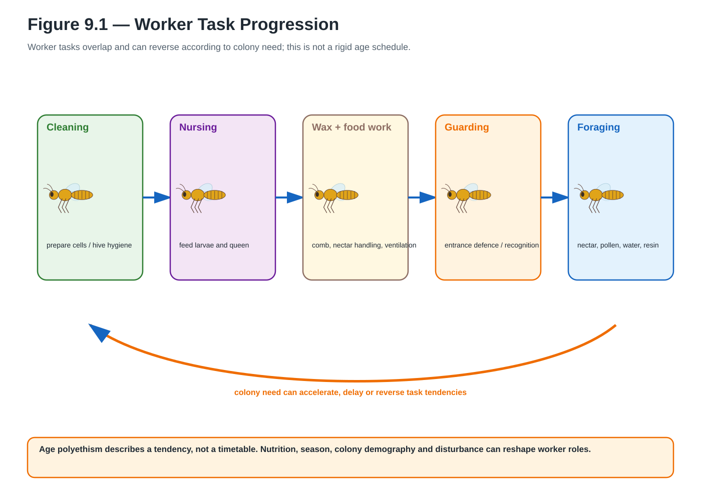</a>

**A_CORE** · `ACTUAL_VECTOR_CREATED` · `PENDING_FINAL_LAYOUT_PROOF` · [Open SVG](../../assets/diagrams/wave-02/fig-09-1-worker-task-progression.svg)

### Figure 9.2 — Worker Specialised Structures

<a href="../../assets/diagrams/wave-02/fig-09-2-worker-specialised-structures.svg">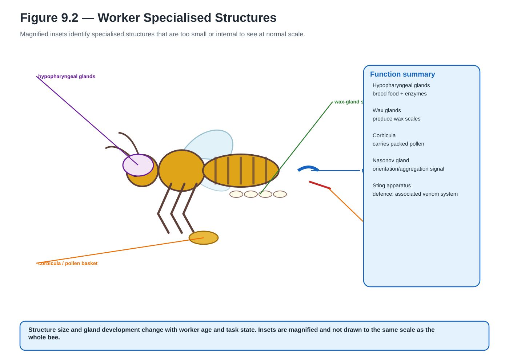</a>

**A_CORE** · `ACTUAL_VECTOR_CREATED` · `PENDING_FINAL_LAYOUT_PROOF` · [Open SVG](../../assets/diagrams/wave-02/fig-09-2-worker-specialised-structures.svg)

### Figure 9.3 — Forager Resource Types

<a href="../../assets/diagrams/wave-02/fig-09-3-forager-resource-types.svg">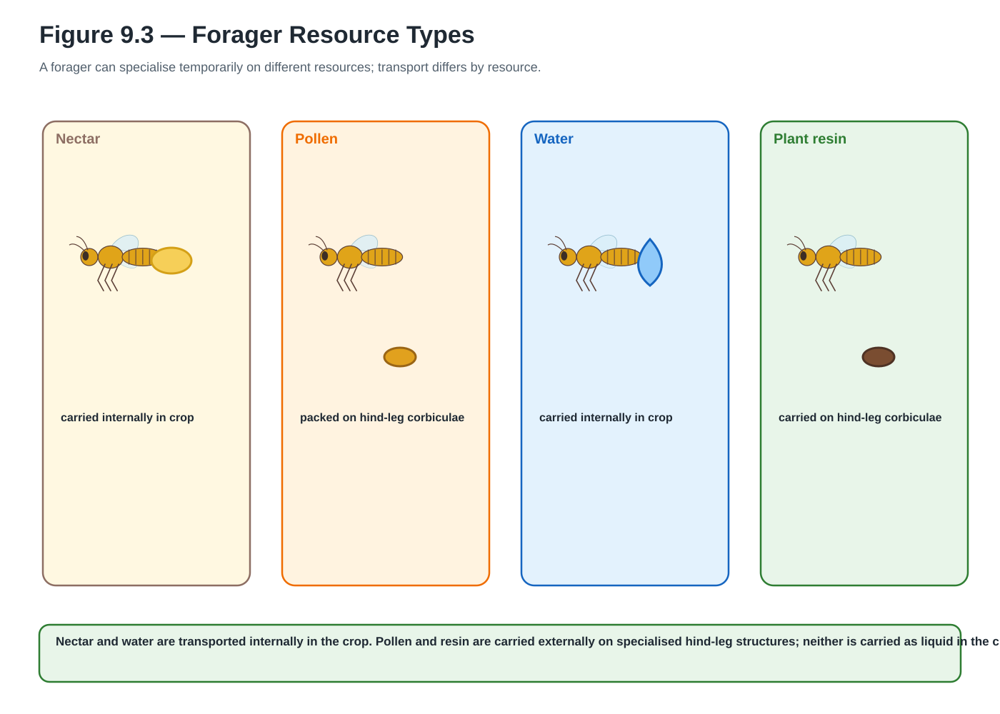</a>

**A_CORE** · `ACTUAL_VECTOR_CREATED` · `PENDING_FINAL_LAYOUT_PROOF` · [Open SVG](../../assets/diagrams/wave-02/fig-09-3-forager-resource-types.svg)

## Chapter 10 — Drones

### Figure 10.1 — Drone Identification

<a href="../../assets/diagrams/wave-02/fig-10-1-drone-identification.svg">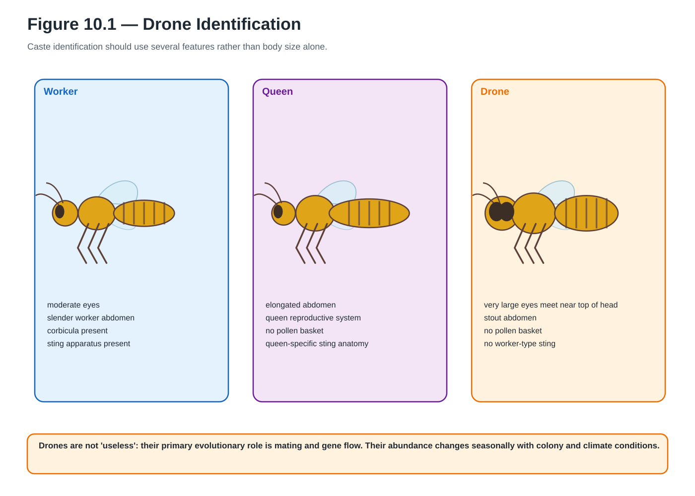</a>

**A_CORE** · `ACTUAL_VECTOR_CREATED` · `PENDING_FINAL_LAYOUT_PROOF` · [Open SVG](../../assets/diagrams/wave-02/fig-10-1-drone-identification.svg)

### Figure 10.2 — Drone Development

<a href="../../assets/diagrams/wave-02/fig-10-2-drone-development.svg">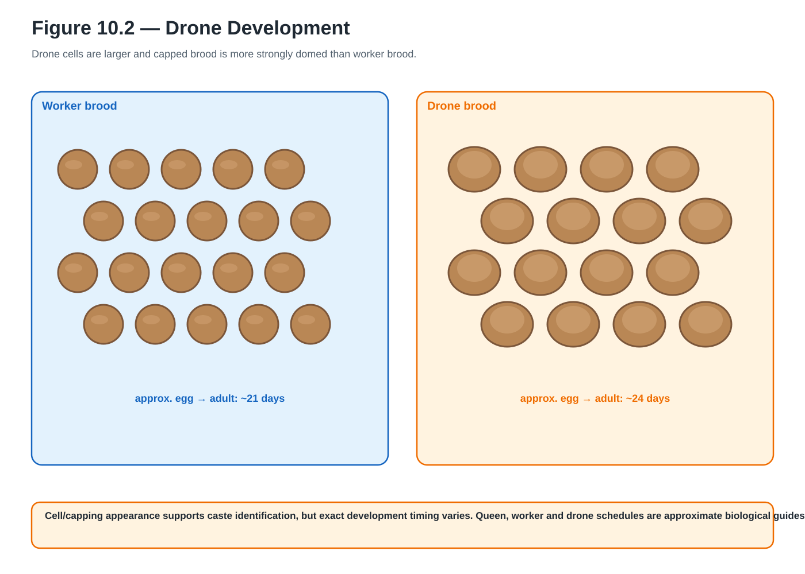</a>

**A_CORE** · `ACTUAL_VECTOR_CREATED` · `PENDING_FINAL_LAYOUT_PROOF` · [Open SVG](../../assets/diagrams/wave-02/fig-10-2-drone-development.svg)

### Figure 10.3 — Drone Reproductive Anatomy

<a href="../../assets/diagrams/wave-02/fig-10-3-drone-reproductive-anatomy.svg">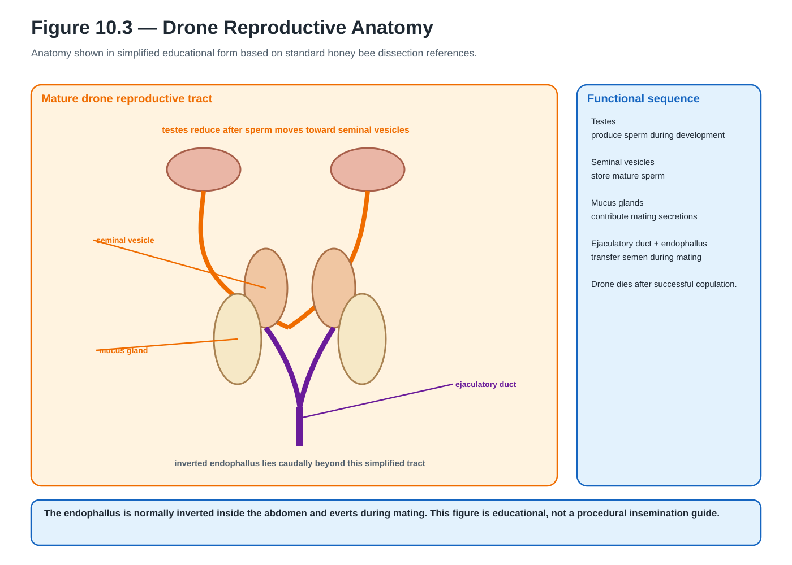</a>

**A_CORE** · `ACTUAL_VECTOR_CREATED` · `PENDING_FINAL_LAYOUT_PROOF` · [Open SVG](../../assets/diagrams/wave-02/fig-10-3-drone-reproductive-anatomy.svg)

## Chapter 11 — Communication Inside the Colony

### Figure 11.2 — Distance Dance Tempo

<a href="../../assets/diagrams/wave-02/fig-11-2-distance-dance-tempo.svg">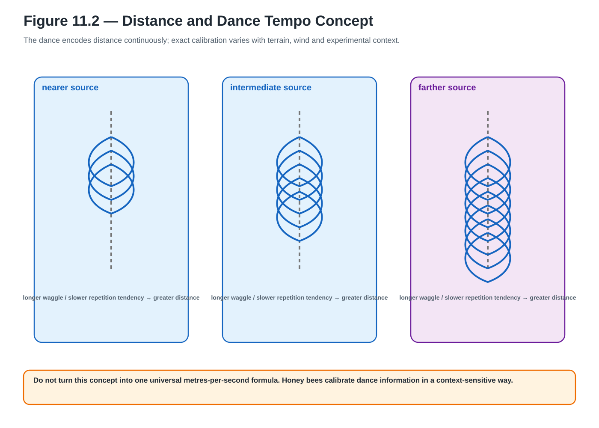</a>

**A_CORE** · `ACTUAL_VECTOR_CREATED` · `PENDING_FINAL_LAYOUT_PROOF` · [Open SVG](../../assets/diagrams/wave-02/fig-11-2-distance-dance-tempo.svg)

### Figure 11.4 — Alarm Recruitment Signals

<a href="../../assets/diagrams/wave-02/fig-11-4-alarm-recruitment-signals.svg">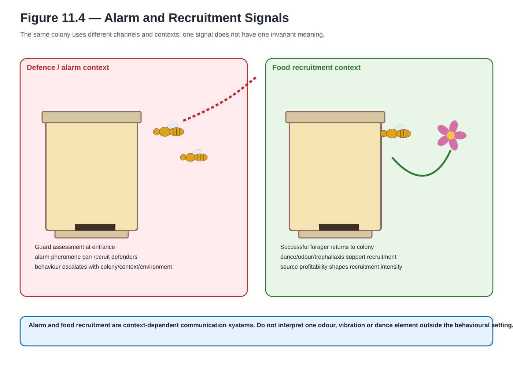</a>

**A_CORE** · `ACTUAL_VECTOR_CREATED` · `PENDING_FINAL_LAYOUT_PROOF` · [Open SVG](../../assets/diagrams/wave-02/fig-11-4-alarm-recruitment-signals.svg)

### Figure 11.5 — Swarm Nest Site Communication

<a href="../../assets/diagrams/wave-02/fig-11-5-swarm-nest-site-communication.svg">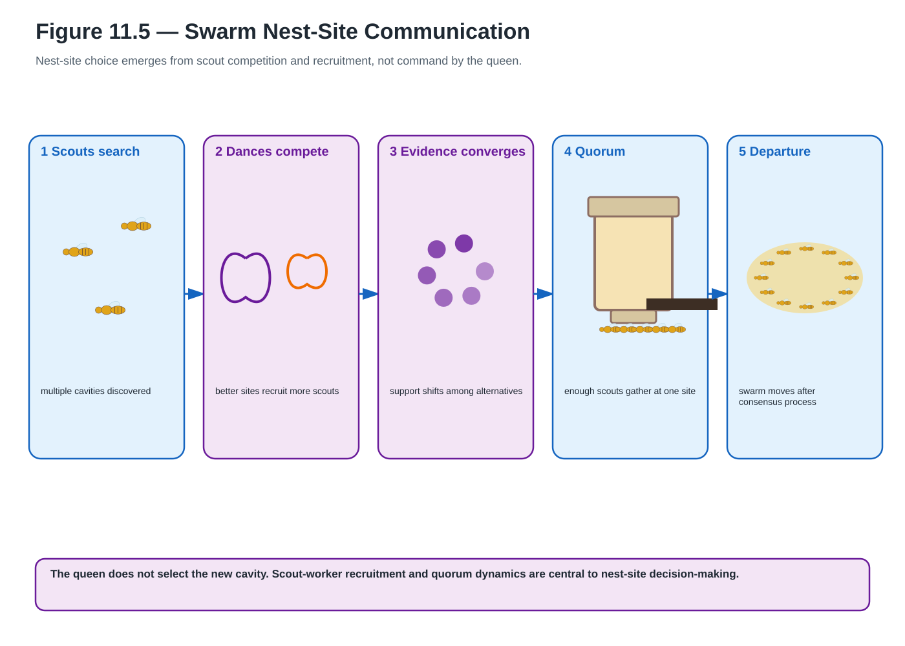</a>

**A_CORE** · `ACTUAL_VECTOR_CREATED` · `PENDING_FINAL_LAYOUT_PROOF` · [Open SVG](../../assets/diagrams/wave-02/fig-11-5-swarm-nest-site-communication.svg)

## Chapter 12 — Bee Behaviour

### Figure 12.2 — Orientation vs Robbing

<a href="../../assets/diagrams/wave-02/fig-12-2-orientation-vs-robbing.svg">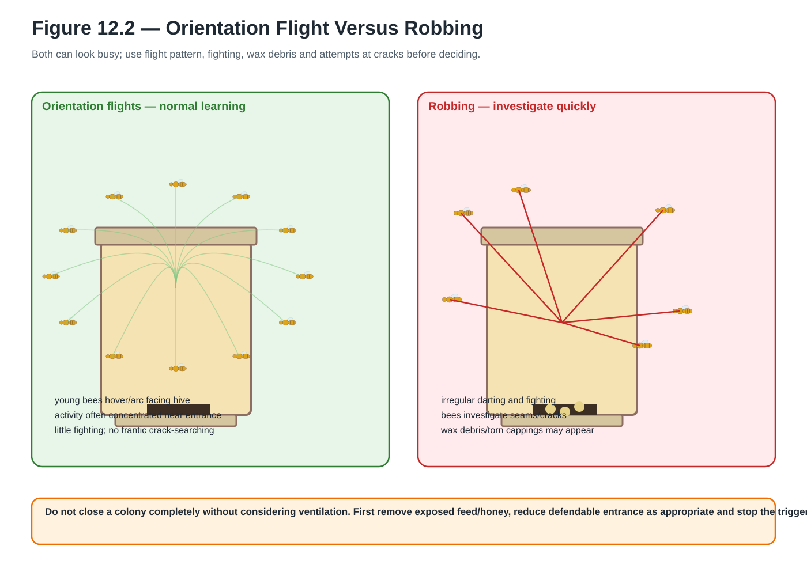</a>

**A_CORE** · `ACTUAL_VECTOR_CREATED` · `PENDING_FINAL_LAYOUT_PROOF` · [Open SVG](../../assets/diagrams/wave-02/fig-12-2-orientation-vs-robbing.svg)

### Figure 12.4 — Grooming Hygienic Behaviour

<a href="../../assets/diagrams/wave-02/fig-12-4-grooming-hygienic-behaviour.svg">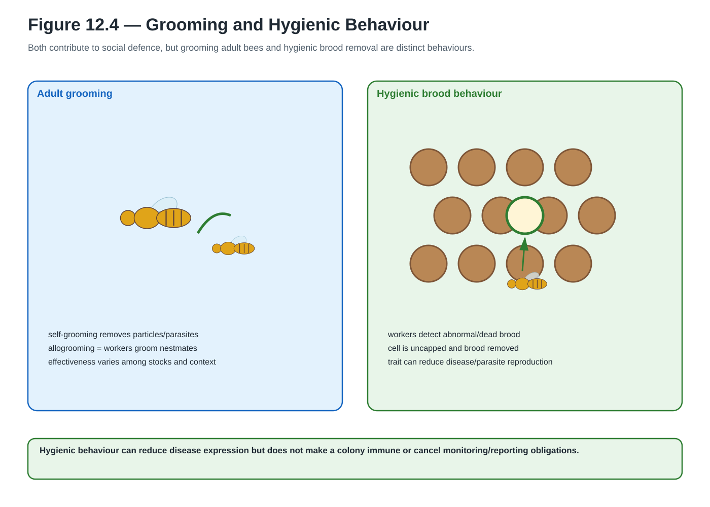</a>

**A_CORE** · `ACTUAL_VECTOR_CREATED` · `PENDING_FINAL_LAYOUT_PROOF` · [Open SVG](../../assets/diagrams/wave-02/fig-12-4-grooming-hygienic-behaviour.svg)

### Figure 12.5 — Clustering Thermoregulation

<a href="../../assets/diagrams/wave-02/fig-12-5-clustering-thermoregulation.svg">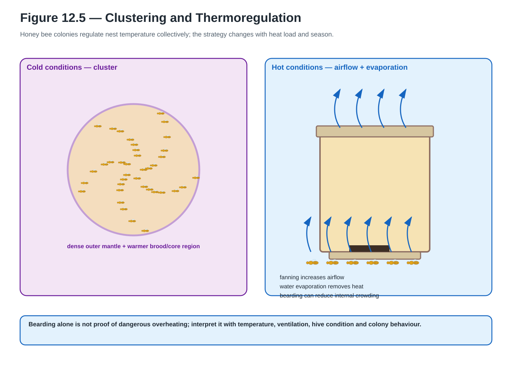</a>

**A_CORE** · `ACTUAL_VECTOR_CREATED` · `PENDING_FINAL_LAYOUT_PROOF` · [Open SVG](../../assets/diagrams/wave-02/fig-12-5-clustering-thermoregulation.svg)

## Chapter 13 — Colony Structure

### Figure 13.1 — Brood Nest Organisation

<a href="../../assets/diagrams/wave-02/fig-13-1-brood-nest-organisation.svg">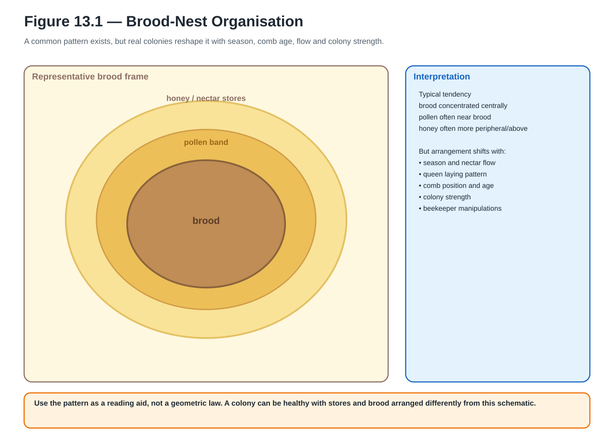</a>

**A_CORE** · `ACTUAL_VECTOR_CREATED` · `PENDING_FINAL_LAYOUT_PROOF` · [Open SVG](../../assets/diagrams/wave-02/fig-13-1-brood-nest-organisation.svg)

### Figure 13.2 — Colony Superorganism

<a href="../../assets/diagrams/wave-02/fig-13-2-colony-superorganism.svg">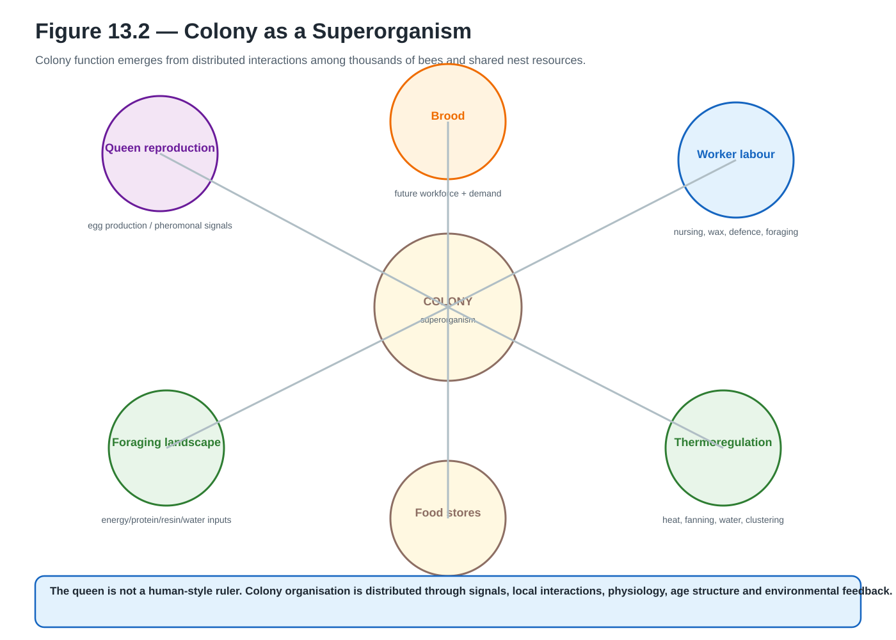</a>

**A_CORE** · `ACTUAL_VECTOR_CREATED` · `PENDING_FINAL_LAYOUT_PROOF` · [Open SVG](../../assets/diagrams/wave-02/fig-13-2-colony-superorganism.svg)

### Figure 13.4 — Resource Flow Colony

<a href="../../assets/diagrams/wave-02/fig-13-4-resource-flow-colony.svg">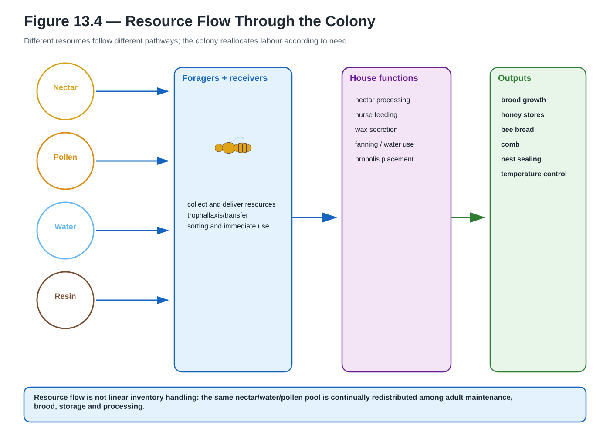</a>

**A_CORE** · `ACTUAL_VECTOR_CREATED` · `PENDING_FINAL_LAYOUT_PROOF` · [Open SVG](../../assets/diagrams/wave-02/fig-13-4-resource-flow-colony.svg)

## Chapter 14 — Seasonal Colony Development

### Figure 14.1 — Annual Colony Population Cycle

<a href="../../assets/diagrams/wave-02/fig-14-1-annual-colony-population-cycle.svg">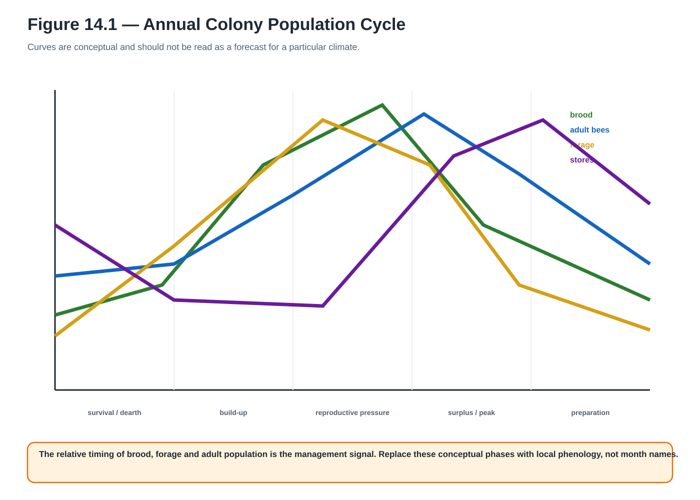</a>

**A_CORE** · `ACTUAL_VECTOR_CREATED` · `PENDING_FINAL_LAYOUT_PROOF` · [Open SVG](../../assets/diagrams/wave-02/fig-14-1-annual-colony-population-cycle.svg)

### Figure 14.2 — Temperate Warm Climate Patterns

<a href="../../assets/diagrams/wave-02/fig-14-2-temperate-warm-climate-patterns.svg">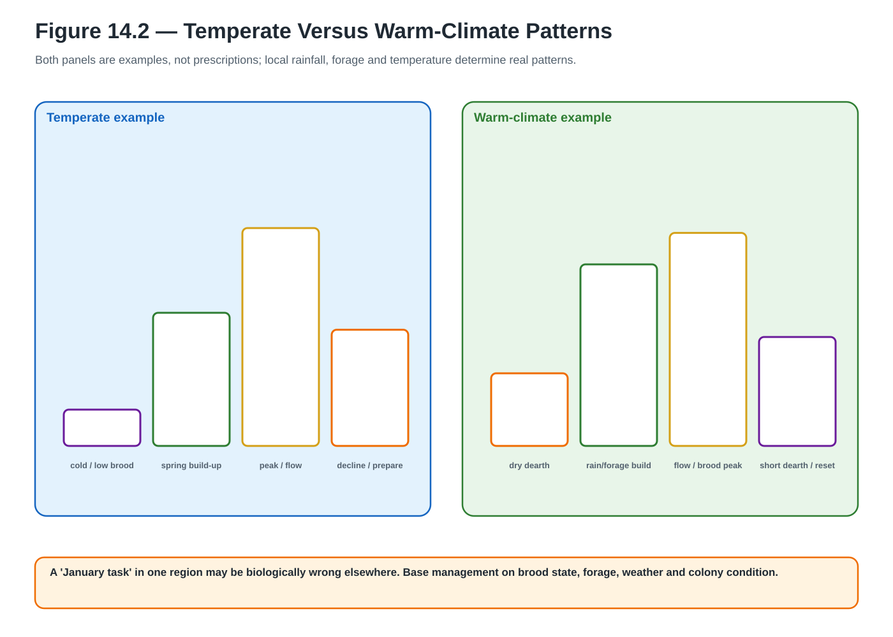</a>

**A_CORE** · `ACTUAL_VECTOR_CREATED` · `PENDING_FINAL_LAYOUT_PROOF` · [Open SVG](../../assets/diagrams/wave-02/fig-14-2-temperate-warm-climate-patterns.svg)

### Figure 14.4 — Forage Brood Feedback

<a href="../../assets/diagrams/wave-02/fig-14-4-forage-brood-feedback.svg">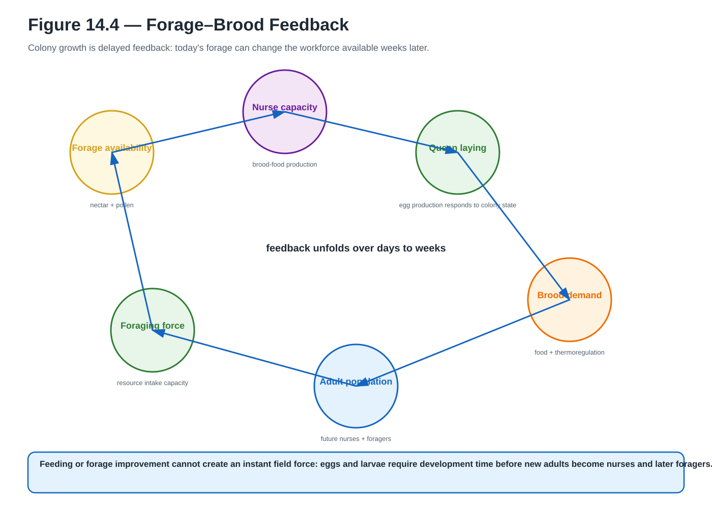</a>

**A_CORE** · `ACTUAL_VECTOR_CREATED` · `PENDING_FINAL_LAYOUT_PROOF` · [Open SVG](../../assets/diagrams/wave-02/fig-14-4-forage-brood-feedback.svg)

## Chapter 15 — Choosing an Apiary Location

### Figure 15.2 — Good Poor Flight Paths

<a href="../../assets/diagrams/wave-02/fig-15-2-good-poor-flight-paths.svg">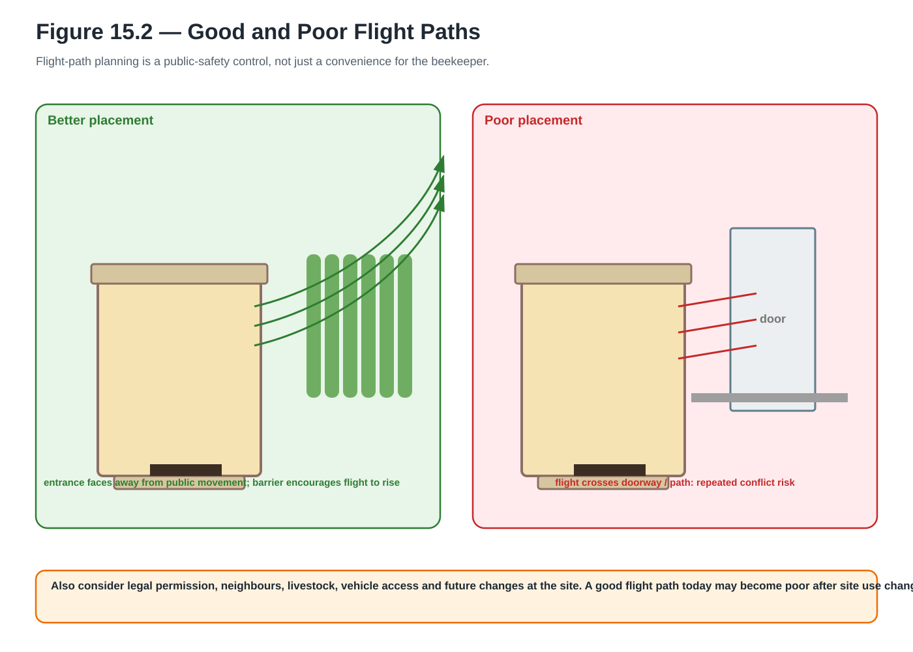</a>

**A_CORE** · `ACTUAL_VECTOR_CREATED` · `PENDING_FINAL_LAYOUT_PROOF` · [Open SVG](../../assets/diagrams/wave-02/fig-15-2-good-poor-flight-paths.svg)

### Figure 15.3 — Drainage Stand Placement

<a href="../../assets/diagrams/wave-02/fig-15-3-drainage-stand-placement.svg">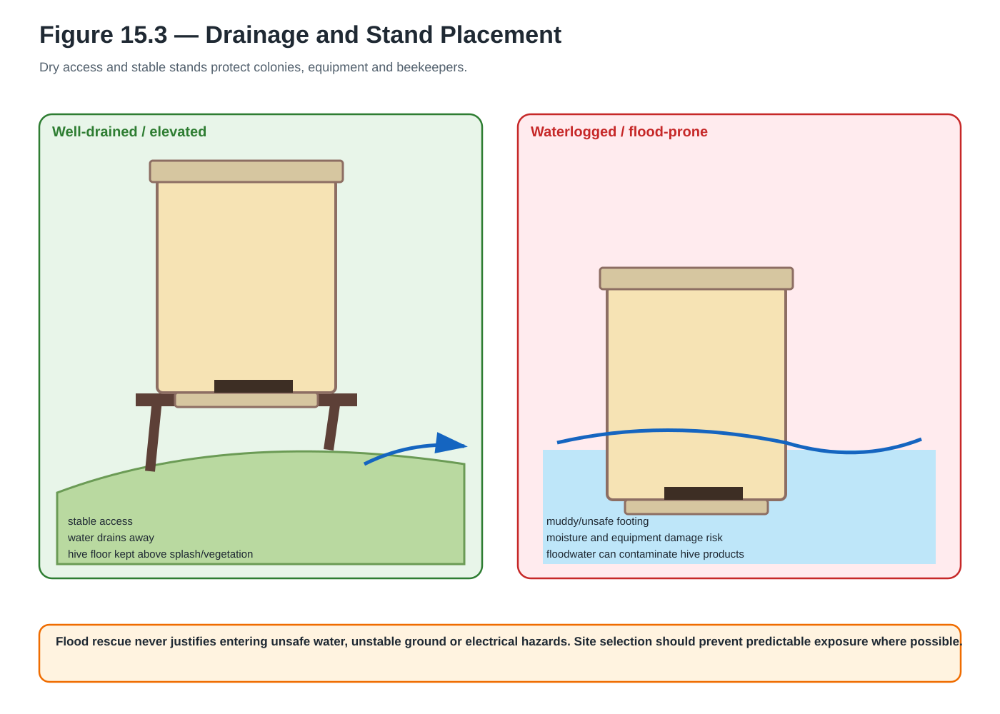</a>

**A_CORE** · `ACTUAL_VECTOR_CREATED` · `PENDING_FINAL_LAYOUT_PROOF` · [Open SVG](../../assets/diagrams/wave-02/fig-15-3-drainage-stand-placement.svg)

### Figure 15.4 — Landscape Forage Mosaic

<a href="../../assets/diagrams/wave-02/fig-15-4-landscape-forage-mosaic.svg">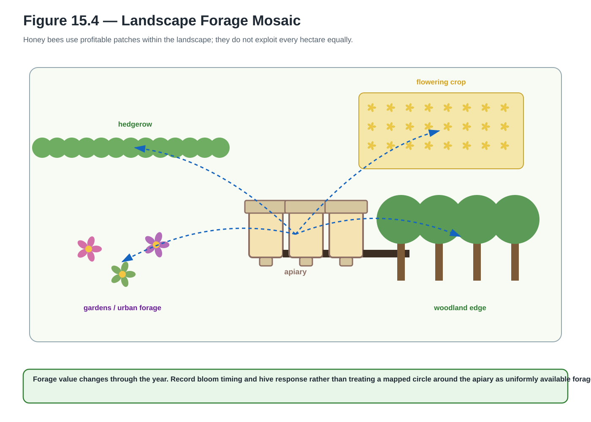</a>

**A_CORE** · `ACTUAL_VECTOR_CREATED` · `PENDING_FINAL_LAYOUT_PROOF` · [Open SVG](../../assets/diagrams/wave-02/fig-15-4-landscape-forage-mosaic.svg)

## Chapter 16 — Planning the Apiary

### Figure 16.1 — Small Apiary Layout

<a href="../../assets/diagrams/wave-02/fig-16-1-small-apiary-layout.svg">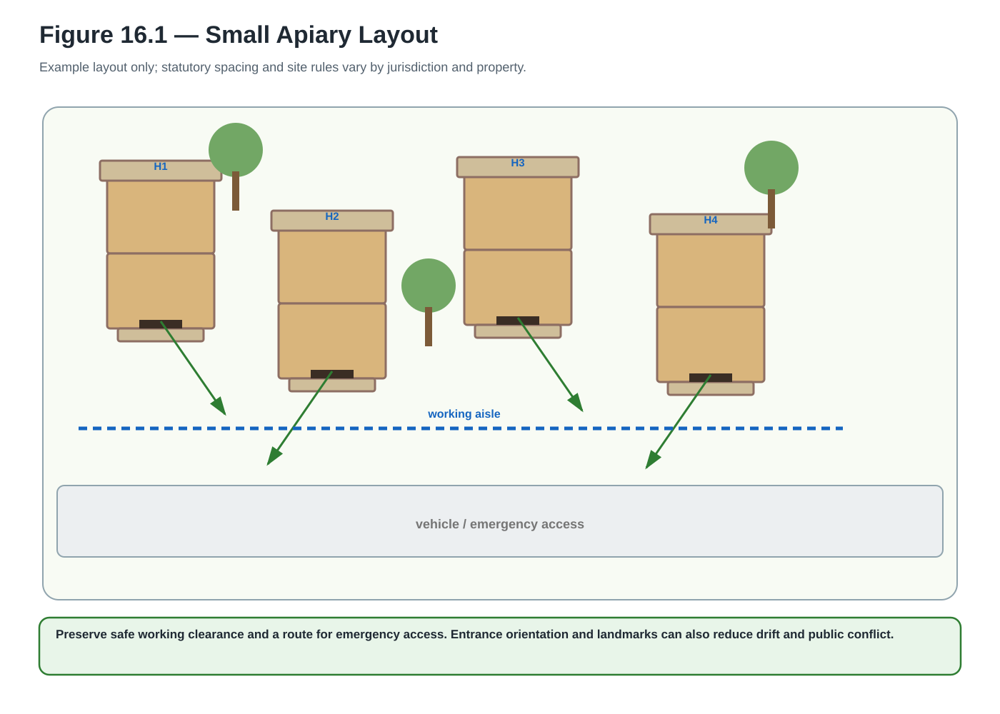</a>

**A_CORE** · `ACTUAL_VECTOR_CREATED` · `PENDING_FINAL_LAYOUT_PROOF` · [Open SVG](../../assets/diagrams/wave-02/fig-16-1-small-apiary-layout.svg)

### Figure 16.2 — Growth Plan

<a href="../../assets/diagrams/wave-02/fig-16-2-growth-plan.svg">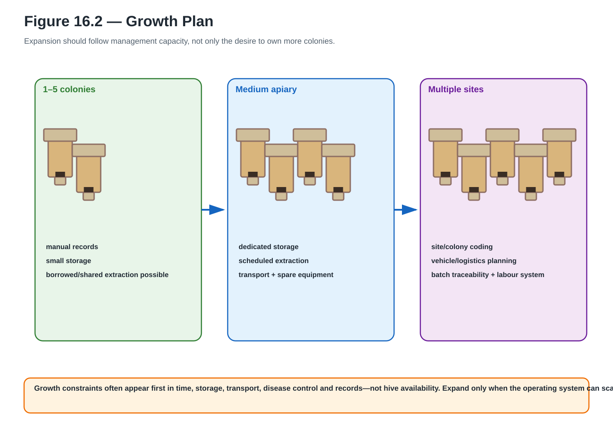</a>

**A_CORE** · `ACTUAL_VECTOR_CREATED` · `PENDING_FINAL_LAYOUT_PROOF` · [Open SVG](../../assets/diagrams/wave-02/fig-16-2-growth-plan.svg)

### Figure 16.5 — Apiary Identification System

<a href="../../assets/diagrams/wave-02/fig-16-5-apiary-identification-system.svg">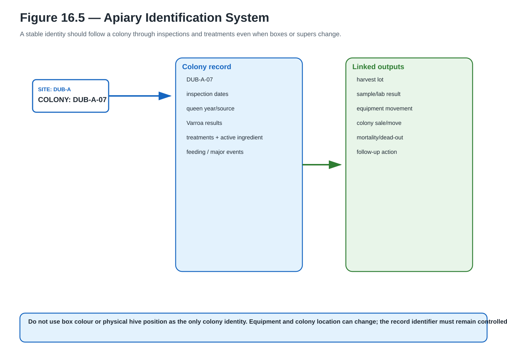</a>

**A_CORE** · `ACTUAL_VECTOR_CREATED` · `PENDING_FINAL_LAYOUT_PROOF` · [Open SVG](../../assets/diagrams/wave-02/fig-16-5-apiary-identification-system.svg)

## Chapter 17 — Hive Types

### Figure 17.1 — Common Movable Frame Hives

<a href="../../assets/diagrams/wave-02/fig-17-1-common-movable-frame-hives.svg">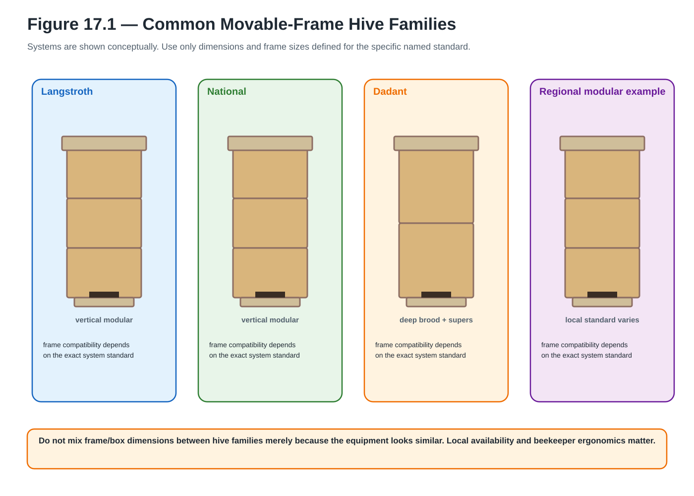</a>

**A_CORE** · `ACTUAL_VECTOR_CREATED` · `PENDING_FINAL_LAYOUT_PROOF` · [Open SVG](../../assets/diagrams/wave-02/fig-17-1-common-movable-frame-hives.svg)

### Figure 17.2 — Horizontal vs Vertical Expansion

<a href="../../assets/diagrams/wave-02/fig-17-2-horizontal-vs-vertical-expansion.svg">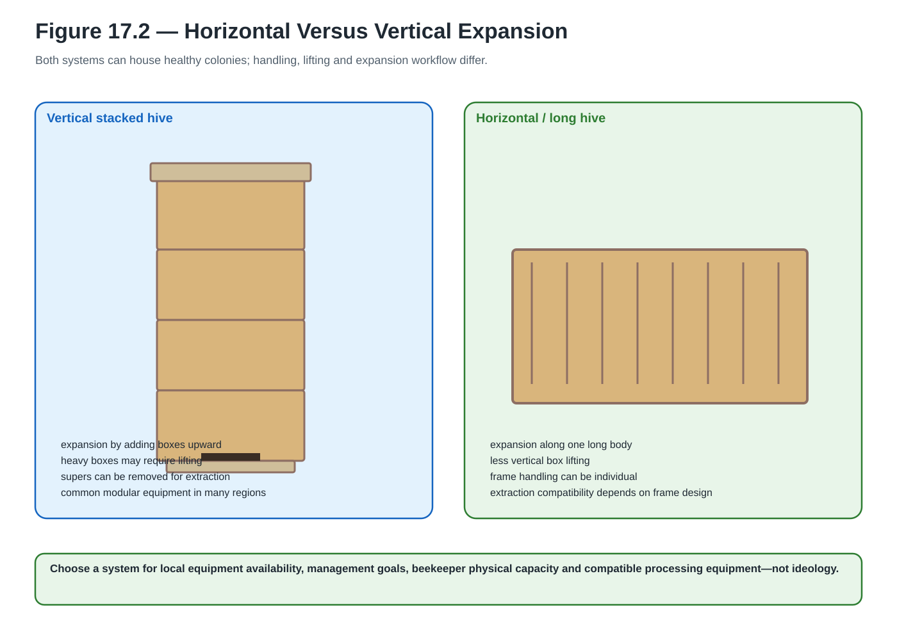</a>

**A_CORE** · `ACTUAL_VECTOR_CREATED` · `PENDING_FINAL_LAYOUT_PROOF` · [Open SVG](../../assets/diagrams/wave-02/fig-17-2-horizontal-vs-vertical-expansion.svg)

### Figure 17.4 — Hive System Comparison Matrix

<a href="../../assets/diagrams/wave-02/fig-17-4-hive-system-comparison-matrix.svg">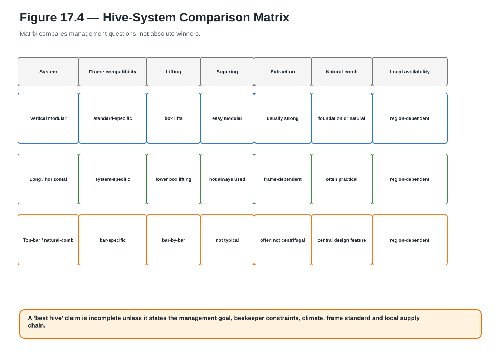</a>

**A_CORE** · `ACTUAL_VECTOR_CREATED` · `PENDING_FINAL_LAYOUT_PROOF` · [Open SVG](../../assets/diagrams/wave-02/fig-17-4-hive-system-comparison-matrix.svg)

## Chapter 18 — Hive Components

### Figure 18.1 — Exploded Modular Hive

<a href="../../assets/diagrams/wave-02/fig-18-1-exploded-modular-hive.svg">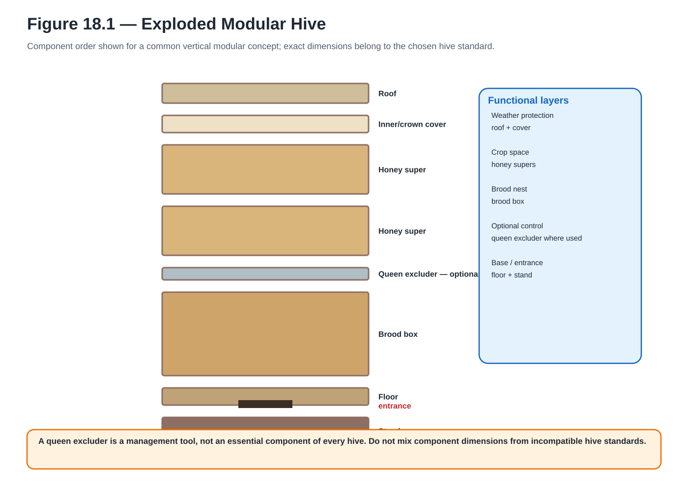</a>

**A_CORE** · `ACTUAL_VECTOR_CREATED` · `PENDING_FINAL_LAYOUT_PROOF` · [Open SVG](../../assets/diagrams/wave-02/fig-18-1-exploded-modular-hive.svg)

### Figure 18.2 — Frame Spacing Bee Space

<a href="../../assets/diagrams/wave-02/fig-18-2-frame-spacing-bee-space.svg">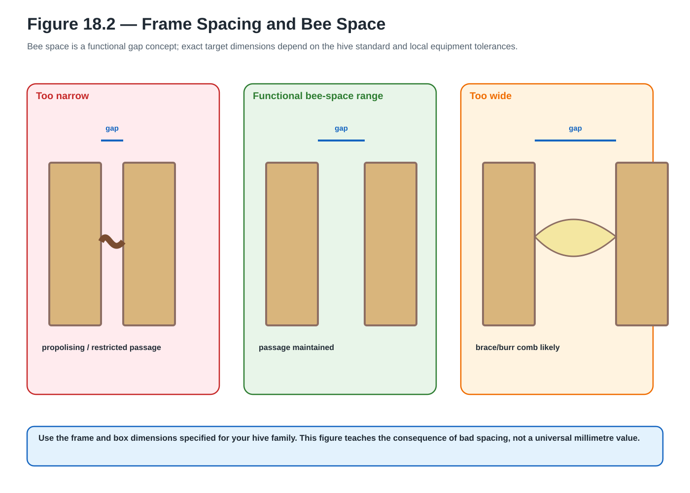</a>

**A_CORE** · `ACTUAL_VECTOR_CREATED` · `PENDING_FINAL_LAYOUT_PROOF` · [Open SVG](../../assets/diagrams/wave-02/fig-18-2-frame-spacing-bee-space.svg)

### Figure 18.3 — Floor Types

<a href="../../assets/diagrams/wave-02/fig-18-3-floor-types.svg">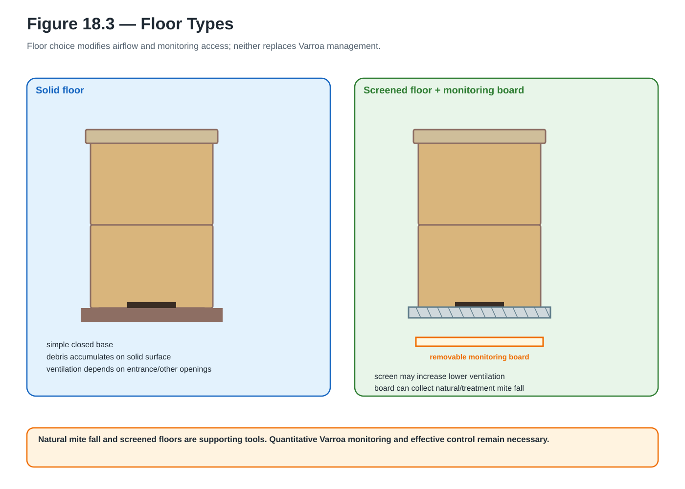</a>

**A_CORE** · `ACTUAL_VECTOR_CREATED` · `PENDING_FINAL_LAYOUT_PROOF` · [Open SVG](../../assets/diagrams/wave-02/fig-18-3-floor-types.svg)

## Chapter 19 — Frames and Foundation

### Figure 19.1 — Frame Anatomy

<a href="../../assets/diagrams/wave-02/fig-19-1-frame-anatomy.svg">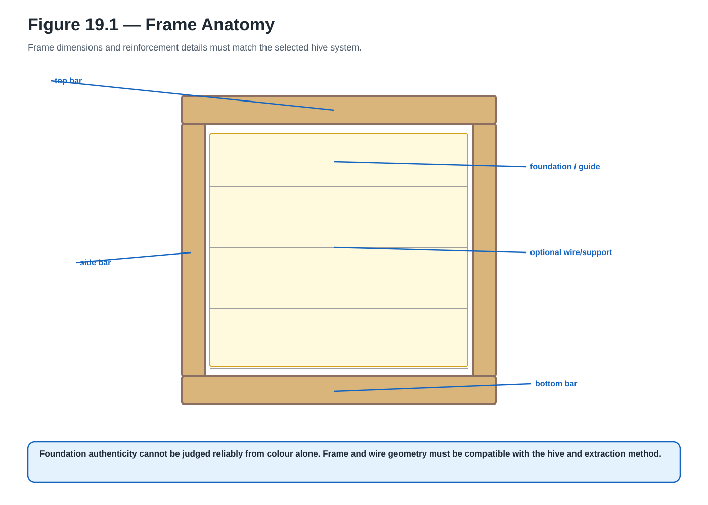</a>

**A_CORE** · `ACTUAL_VECTOR_CREATED` · `PENDING_FINAL_LAYOUT_PROOF` · [Open SVG](../../assets/diagrams/wave-02/fig-19-1-frame-anatomy.svg)

### Figure 19.4 — Straight Natural Comb

<a href="../../assets/diagrams/wave-02/fig-19-4-straight-natural-comb.svg">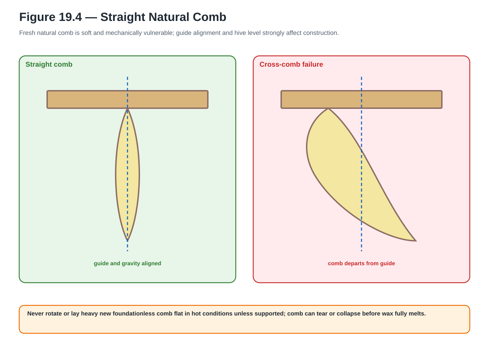</a>

**A_CORE** · `ACTUAL_VECTOR_CREATED` · `PENDING_FINAL_LAYOUT_PROOF` · [Open SVG](../../assets/diagrams/wave-02/fig-19-4-straight-natural-comb.svg)

### Figure 19.5 — Comb Age Sequence

<a href="../../assets/diagrams/wave-02/fig-19-5-comb-age-sequence.svg">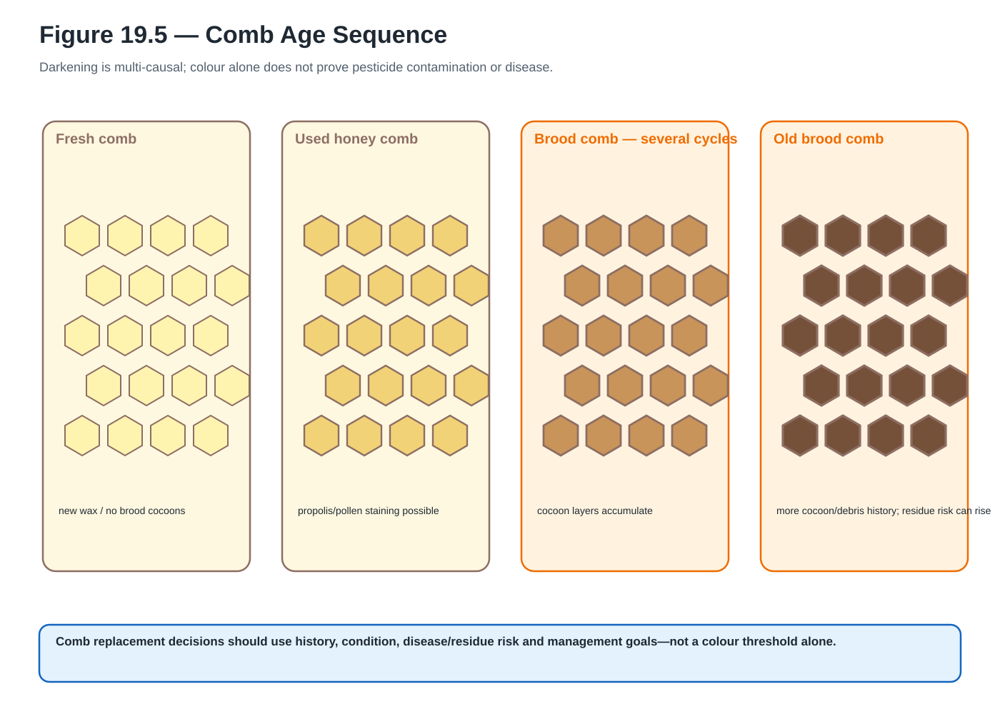</a>

**A_CORE** · `ACTUAL_VECTOR_CREATED` · `PENDING_FINAL_LAYOUT_PROOF` · [Open SVG](../../assets/diagrams/wave-02/fig-19-5-comb-age-sequence.svg)

## Chapter 20 — Essential Equipment

### Figure 20.1 — Beginner Equipment Set

<a href="../../assets/diagrams/wave-02/fig-20-1-beginner-equipment-set.svg">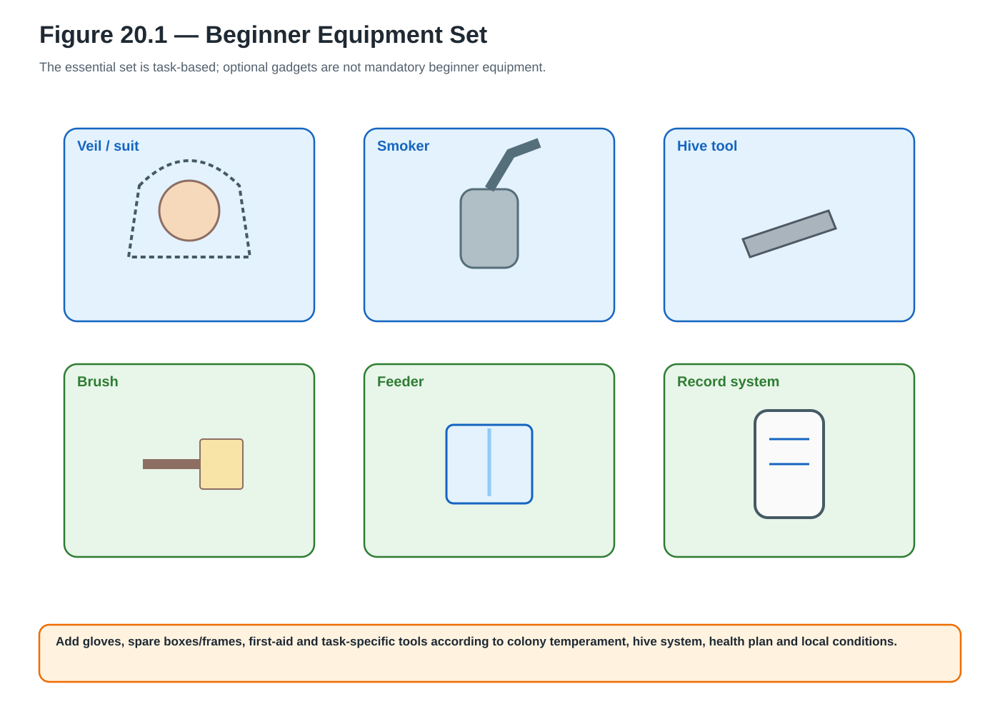</a>

**A_CORE** · `ACTUAL_VECTOR_CREATED` · `PENDING_FINAL_LAYOUT_PROOF` · [Open SVG](../../assets/diagrams/wave-02/fig-20-1-beginner-equipment-set.svg)

### Figure 20.2 — Equipment By Task

<a href="../../assets/diagrams/wave-02/fig-20-2-equipment-by-task.svg">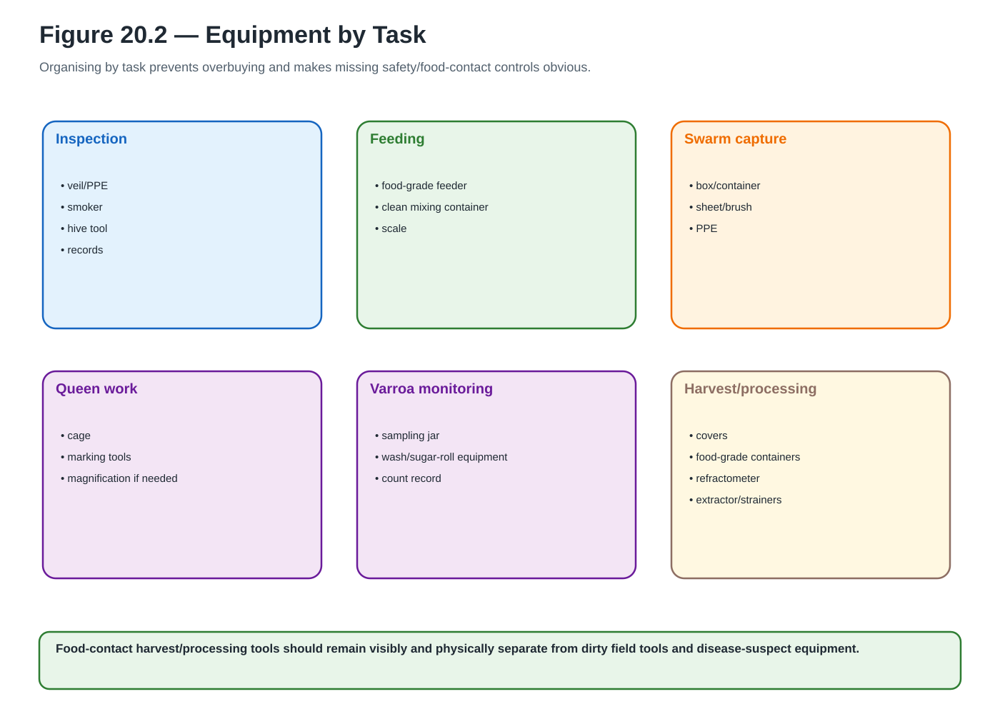</a>

**A_CORE** · `ACTUAL_VECTOR_CREATED` · `PENDING_FINAL_LAYOUT_PROOF` · [Open SVG](../../assets/diagrams/wave-02/fig-20-2-equipment-by-task.svg)

### Figure 20.4 — Clean Equipment Workflow

<a href="../../assets/diagrams/wave-02/fig-20-4-clean-equipment-workflow.svg">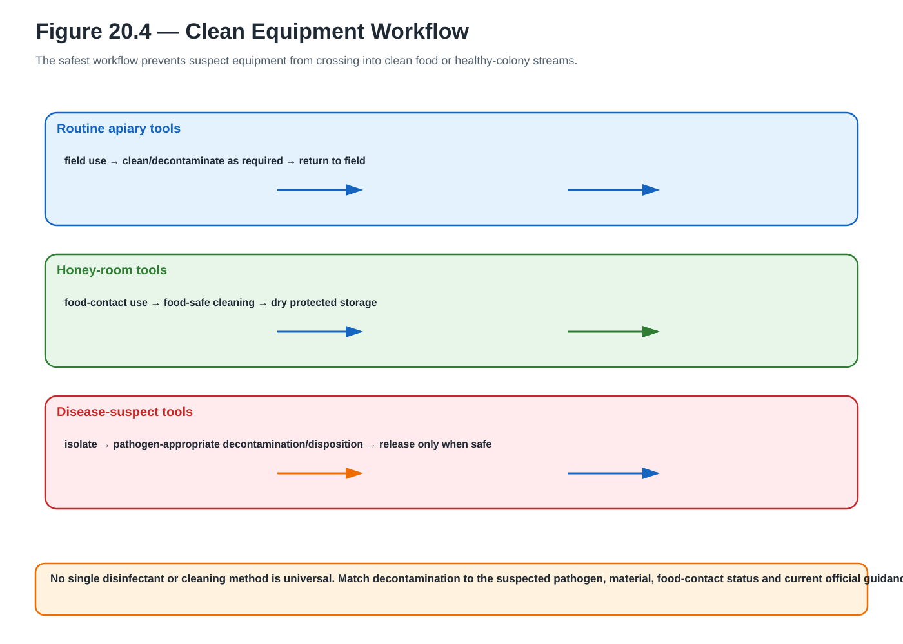</a>

**A_CORE** · `ACTUAL_VECTOR_CREATED` · `PENDING_FINAL_LAYOUT_PROOF` · [Open SVG](../../assets/diagrams/wave-02/fig-20-4-clean-equipment-workflow.svg)

