# Wave 03 Visual Gallery

**A_CORE assets:** 21 / 21  
**Coverage:** Chapters 26–32 — feeding, winter feeding, swarm prevention/capture, splitting, requeening and queen rearing  
**Status:** production complete; final greyscale, final-size, accessibility and layout proof pending.

Tap any thumbnail or **Open SVG** to inspect the vector at full resolution.

## Chapter 26

### Figure 26.1 — Natural and Supplemental Nutrition

<a href="../../assets/diagrams/wave-03/fig-26-1-natural-and-supplemental-nutrition.svg">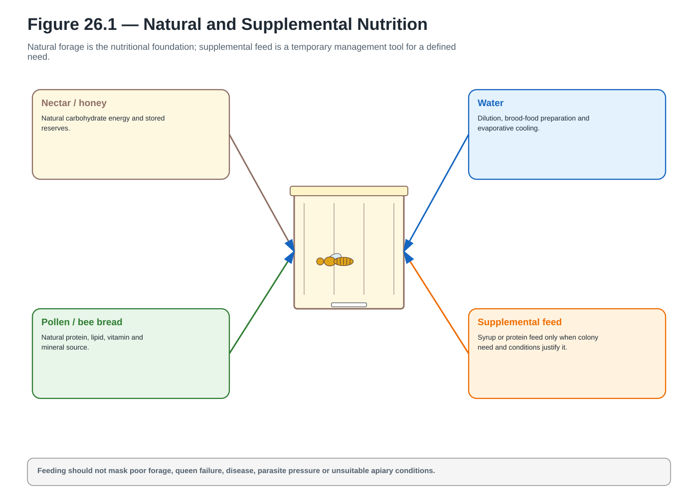</a>

**A_CORE** · `ACTUAL_VECTOR_CREATED` · `PENDING_FINAL_LAYOUT_PROOF` · [Open SVG](../../assets/diagrams/wave-03/fig-26-1-natural-and-supplemental-nutrition.svg)

### Figure 26.6 — Brood Nest Before and After Overfeeding

<a href="../../assets/diagrams/wave-03/fig-26-6-brood-nest-before-after-overfeeding.svg">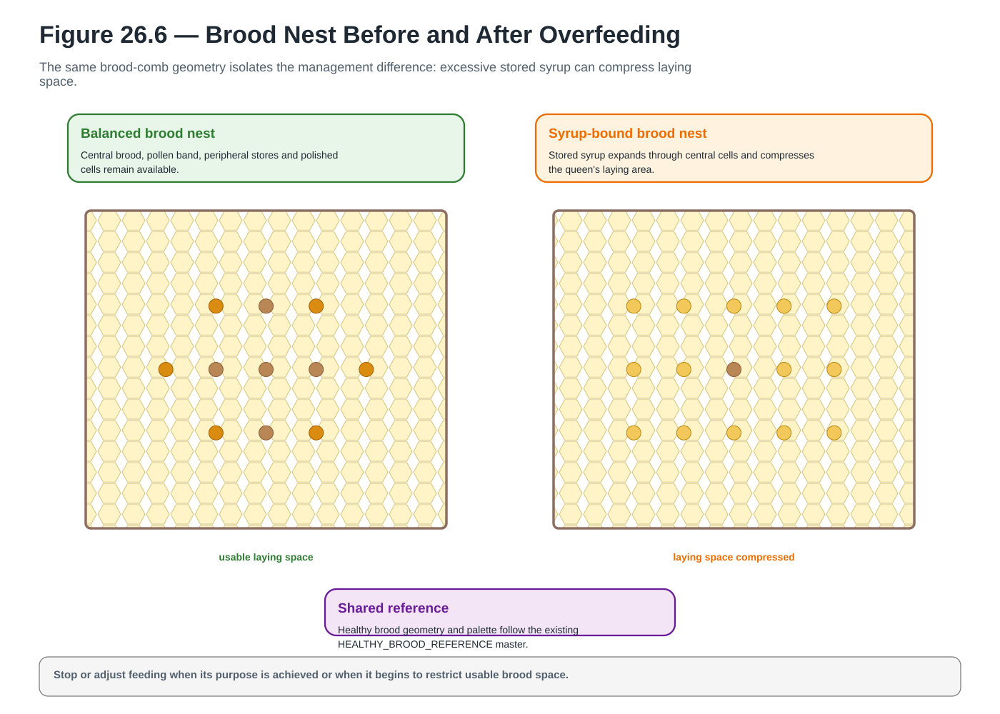</a>

**A_CORE** · `ACTUAL_VECTOR_CREATED` · `PENDING_FINAL_LAYOUT_PROOF` · [Open SVG](../../assets/diagrams/wave-03/fig-26-6-brood-nest-before-after-overfeeding.svg)

### Figure 26.7 — Feeding Decision Flow

<a href="../../assets/diagrams/wave-03/fig-26-7-feeding-decision-flow.svg">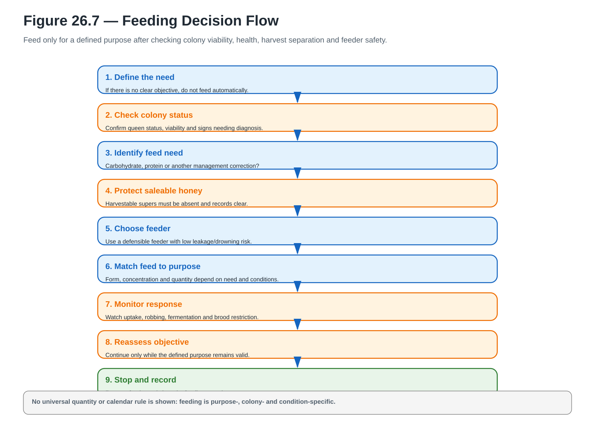</a>

**A_CORE** · `ACTUAL_VECTOR_CREATED` · `PENDING_FINAL_LAYOUT_PROOF` · [Open SVG](../../assets/diagrams/wave-03/fig-26-7-feeding-decision-flow.svg)

## Chapter 27

### Figure 27.7 — Condensation and Moisture

<a href="../../assets/diagrams/wave-03/fig-27-7-condensation-and-moisture.svg">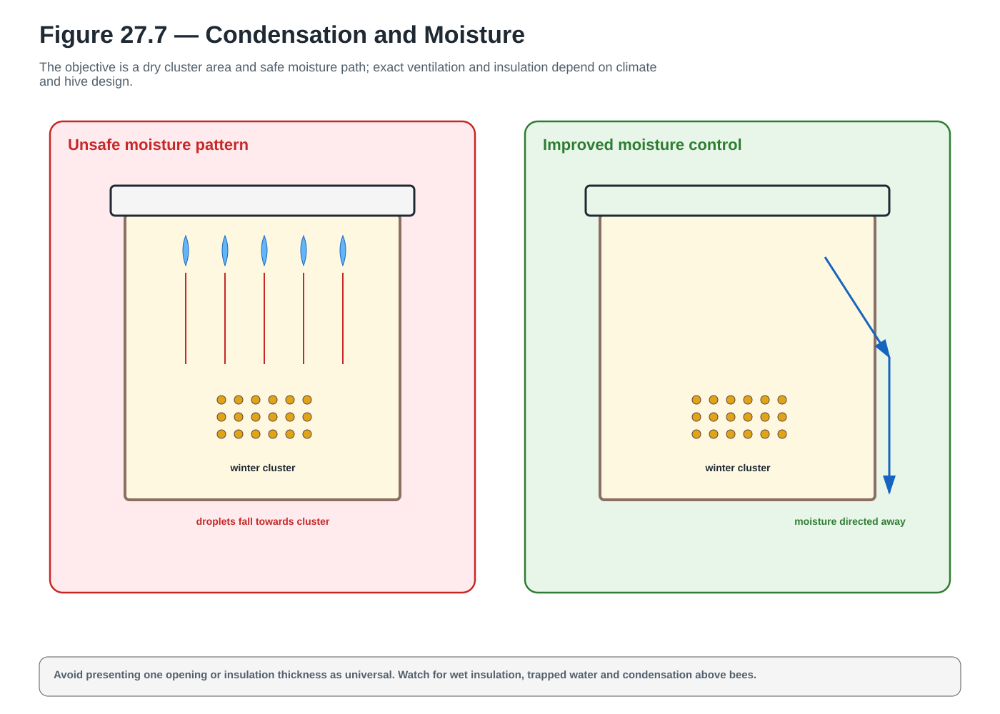</a>

**A_CORE** · `ACTUAL_VECTOR_CREATED` · `PENDING_FINAL_LAYOUT_PROOF` · [Open SVG](../../assets/diagrams/wave-03/fig-27-7-condensation-and-moisture.svg)

### Figure 27.10 — Autumn Preparation Timeline

<a href="../../assets/diagrams/wave-03/fig-27-10-autumn-preparation-timeline.svg">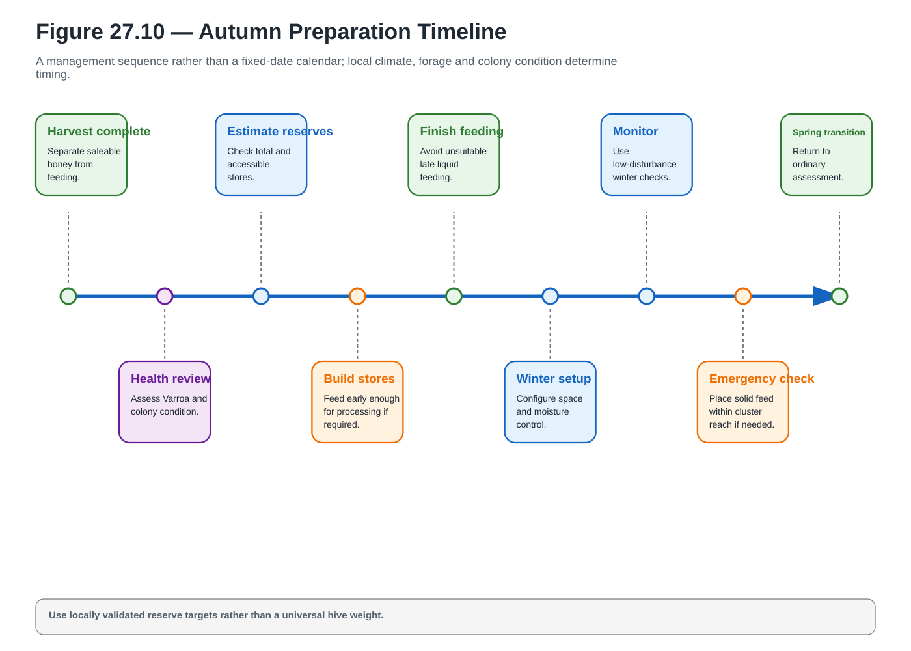</a>

**A_CORE** · `ACTUAL_VECTOR_CREATED` · `PENDING_FINAL_LAYOUT_PROOF` · [Open SVG](../../assets/diagrams/wave-03/fig-27-10-autumn-preparation-timeline.svg)

### Figure 27.12 — Winter Feeding Decision Chart

<a href="../../assets/diagrams/wave-03/fig-27-12-winter-feeding-decision-chart.svg">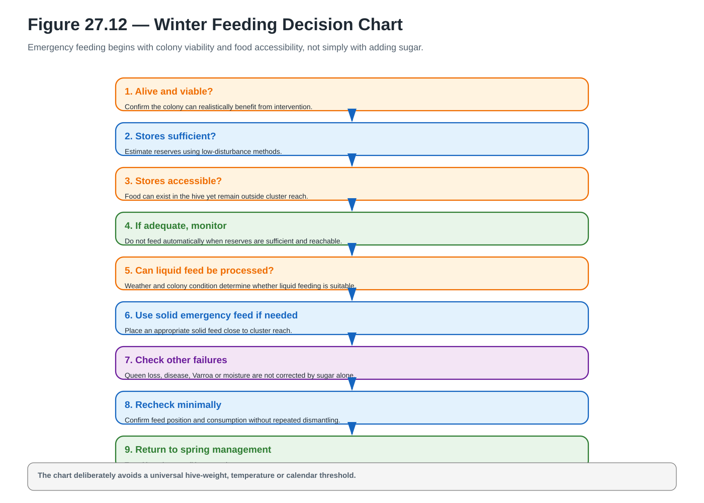</a>

**A_CORE** · `ACTUAL_VECTOR_CREATED` · `PENDING_FINAL_LAYOUT_PROOF` · [Open SVG](../../assets/diagrams/wave-03/fig-27-12-winter-feeding-decision-chart.svg)

## Chapter 28

### Figure 28.1 — Natural Swarm Cycle

<a href="../../assets/diagrams/wave-03/fig-28-1-natural-swarm-cycle.svg">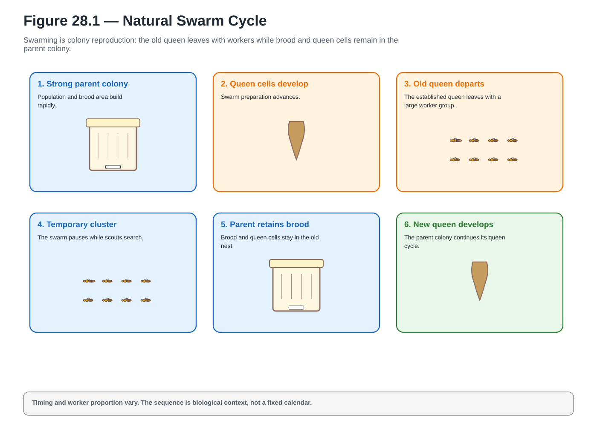</a>

**A_CORE** · `ACTUAL_VECTOR_CREATED` · `PENDING_FINAL_LAYOUT_PROOF` · [Open SVG](../../assets/diagrams/wave-03/fig-28-1-natural-swarm-cycle.svg)

### Figure 28.3 — Brood-Nest Restriction

<a href="../../assets/diagrams/wave-03/fig-28-3-brood-nest-restriction.svg">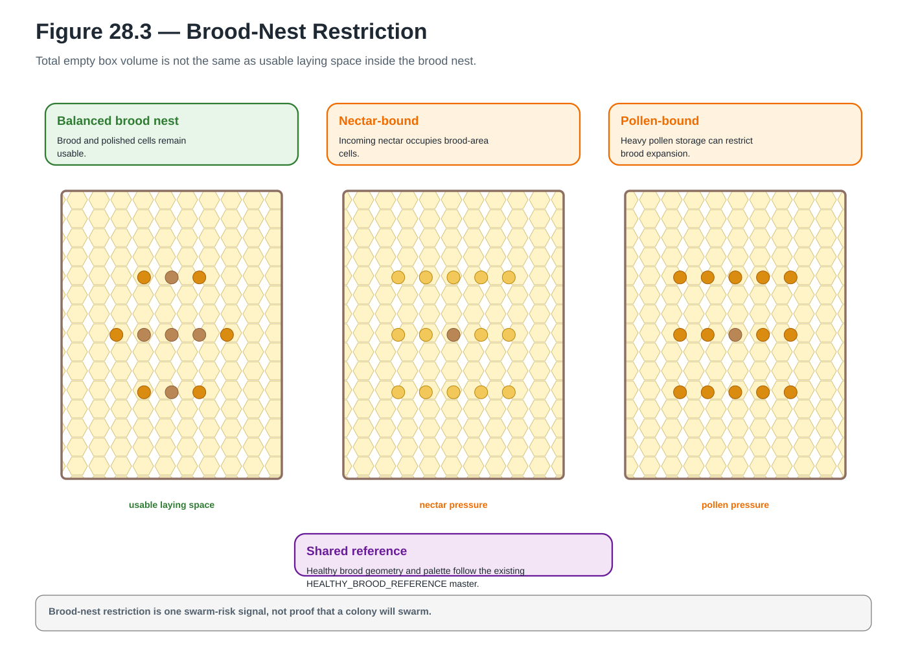</a>

**A_CORE** · `ACTUAL_VECTOR_CREATED` · `PENDING_FINAL_LAYOUT_PROOF` · [Open SVG](../../assets/diagrams/wave-03/fig-28-3-brood-nest-restriction.svg)

### Figure 28.5 — Queen-Cell Types

<a href="../../assets/diagrams/wave-03/fig-28-5-queen-cell-types.svg">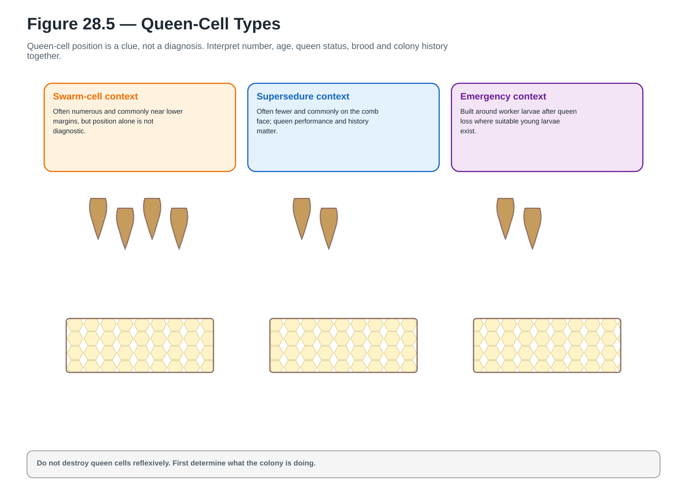</a>

**A_CORE** · `ACTUAL_VECTOR_CREATED` · `PENDING_FINAL_LAYOUT_PROOF` · [Open SVG](../../assets/diagrams/wave-03/fig-28-5-queen-cell-types.svg)

## Chapter 29

### Figure 29.1 — Swarm Reproductive Sequence

<a href="../../assets/diagrams/wave-03/fig-29-1-swarm-reproductive-sequence.svg">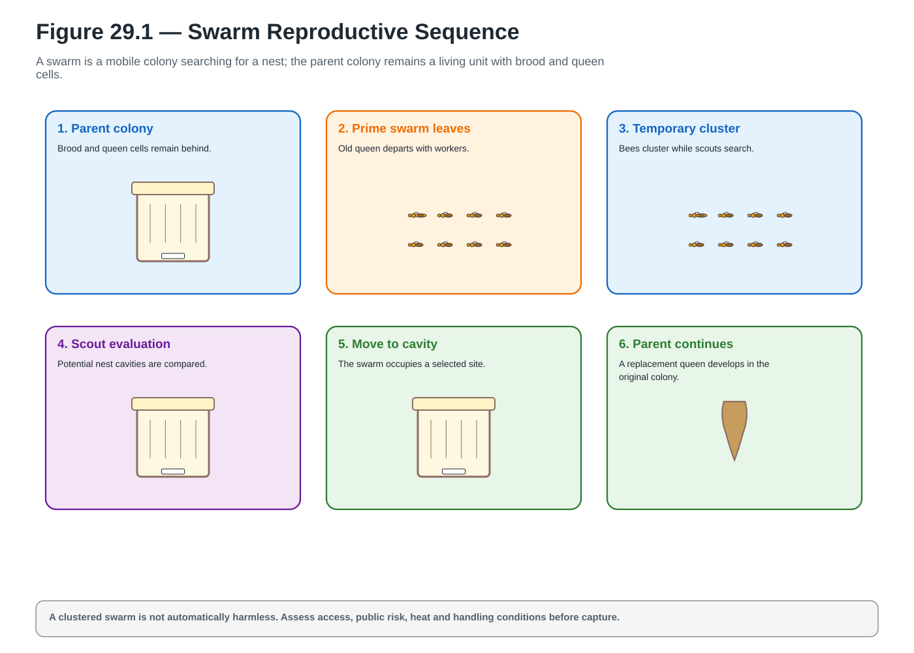</a>

**A_CORE** · `ACTUAL_VECTOR_CREATED` · `PENDING_FINAL_LAYOUT_PROOF` · [Open SVG](../../assets/diagrams/wave-03/fig-29-1-swarm-reproductive-sequence.svg)

### Figure 29.10 — Installing the Swarm

<a href="../../assets/diagrams/wave-03/fig-29-10-installing-the-swarm.svg">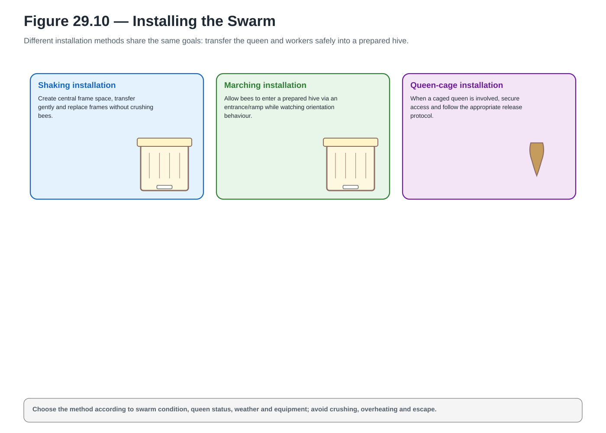</a>

**A_CORE** · `ACTUAL_VECTOR_CREATED` · `PENDING_FINAL_LAYOUT_PROOF` · [Open SVG](../../assets/diagrams/wave-03/fig-29-10-installing-the-swarm.svg)

### Figure 29.15 — First Inspection

<a href="../../assets/diagrams/wave-03/fig-29-15-first-inspection.svg">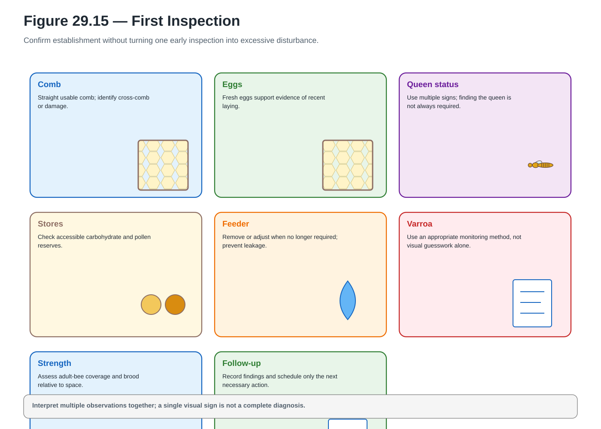</a>

**A_CORE** · `ACTUAL_VECTOR_CREATED` · `PENDING_FINAL_LAYOUT_PROOF` · [Open SVG](../../assets/diagrams/wave-03/fig-29-15-first-inspection.svg)

## Chapter 30

### Figure 30.1 — Resources Required for a Split

<a href="../../assets/diagrams/wave-03/fig-30-1-resources-required-for-a-split.svg">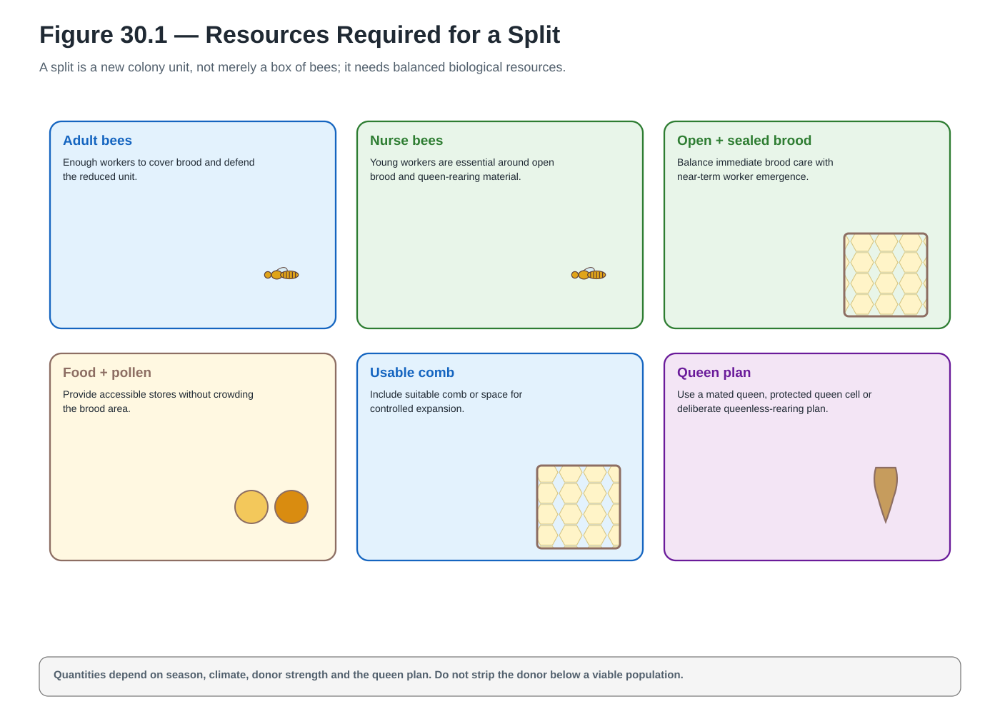</a>

**A_CORE** · `ACTUAL_VECTOR_CREATED` · `PENDING_FINAL_LAYOUT_PROOF` · [Open SVG](../../assets/diagrams/wave-03/fig-30-1-resources-required-for-a-split.svg)

### Figure 30.2 — Donor Colony Assessment

<a href="../../assets/diagrams/wave-03/fig-30-2-donor-colony-assessment.svg">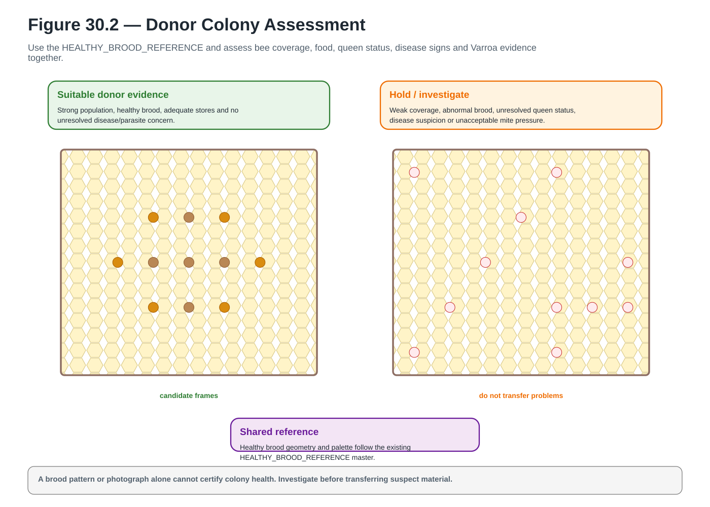</a>

**A_CORE** · `ACTUAL_VECTOR_CREATED` · `PENDING_FINAL_LAYOUT_PROOF` · [Open SVG](../../assets/diagrams/wave-03/fig-30-2-donor-colony-assessment.svg)

### Figure 30.14 — Failed Split Decision

<a href="../../assets/diagrams/wave-03/fig-30-14-failed-split-decision.svg">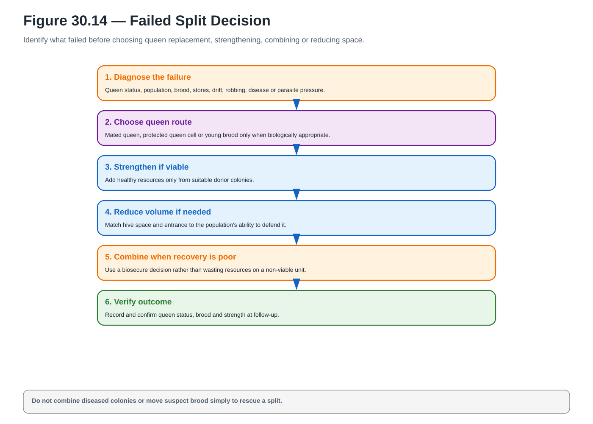</a>

**A_CORE** · `ACTUAL_VECTOR_CREATED` · `PENDING_FINAL_LAYOUT_PROOF` · [Open SVG](../../assets/diagrams/wave-03/fig-30-14-failed-split-decision.svg)

## Chapter 31

### Figure 31.2 — Queen Failure Versus Other Problems

<a href="../../assets/diagrams/wave-03/fig-31-2-queen-failure-vs-other-problems.svg">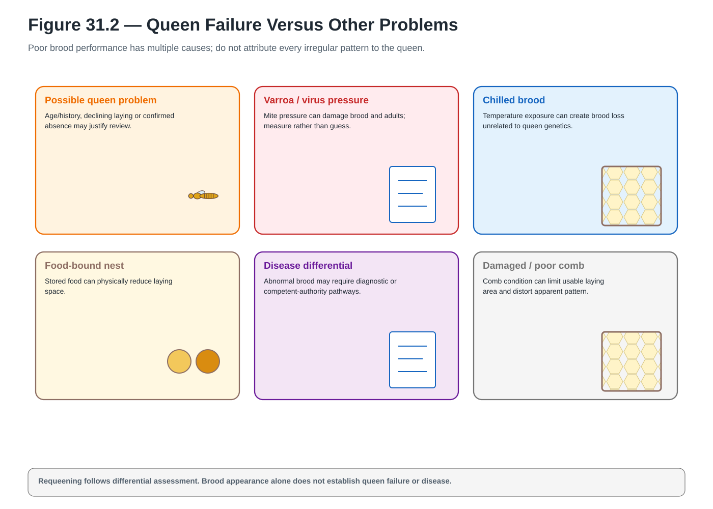</a>

**A_CORE** · `ACTUAL_VECTOR_CREATED` · `PENDING_FINAL_LAYOUT_PROOF` · [Open SVG](../../assets/diagrams/wave-03/fig-31-2-queen-failure-vs-other-problems.svg)

### Figure 31.5 — Finding and Removing the Old Queen

<a href="../../assets/diagrams/wave-03/fig-31-5-finding-removing-old-queen.svg">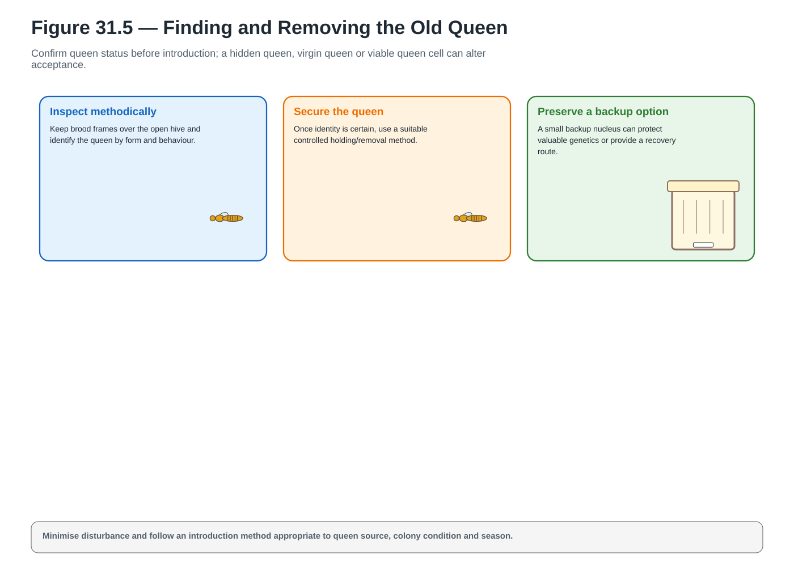</a>

**A_CORE** · `ACTUAL_VECTOR_CREATED` · `PENDING_FINAL_LAYOUT_PROOF` · [Open SVG](../../assets/diagrams/wave-03/fig-31-5-finding-removing-old-queen.svg)

### Figure 31.11 — Queen Development and Status Decision

<a href="../../assets/diagrams/wave-03/fig-31-11-queen-development-status-decision.svg">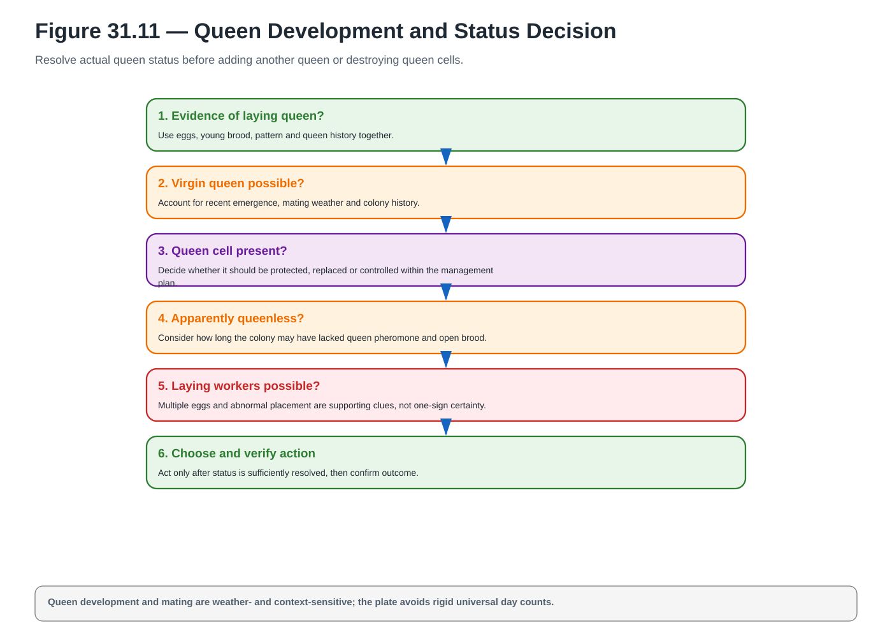</a>

**A_CORE** · `ACTUAL_VECTOR_CREATED` · `PENDING_FINAL_LAYOUT_PROOF` · [Open SVG](../../assets/diagrams/wave-03/fig-31-11-queen-development-status-decision.svg)

## Chapter 32

### Figure 32.3 — Breeder-Colony Selection

<a href="../../assets/diagrams/wave-03/fig-32-3-breeder-colony-selection.svg">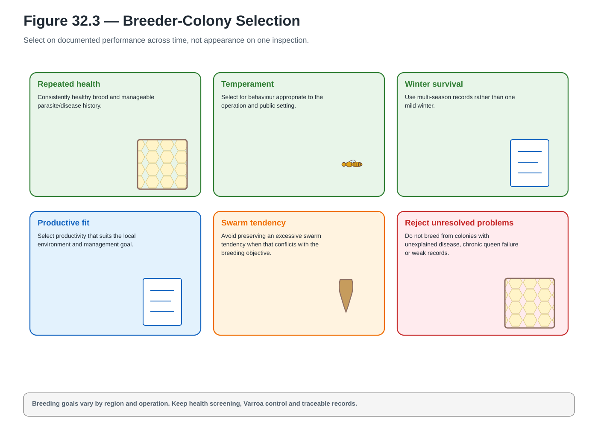</a>

**A_CORE** · `ACTUAL_VECTOR_CREATED` · `PENDING_FINAL_LAYOUT_PROOF` · [Open SVG](../../assets/diagrams/wave-03/fig-32-3-breeder-colony-selection.svg)

### Figure 32.10 — Queen-Cell Protection

<a href="../../assets/diagrams/wave-03/fig-32-10-queen-cell-protection.svg">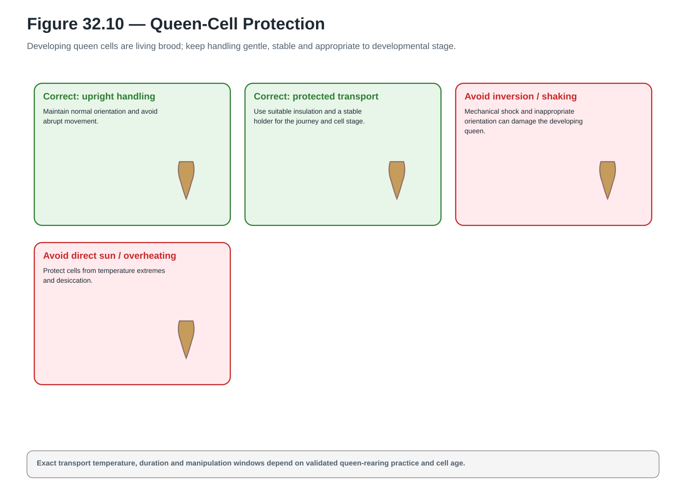</a>

**A_CORE** · `ACTUAL_VECTOR_CREATED` · `PENDING_FINAL_LAYOUT_PROOF` · [Open SVG](../../assets/diagrams/wave-03/fig-32-10-queen-cell-protection.svg)

### Figure 32.11 — Mating Nucleus

<a href="../../assets/diagrams/wave-03/fig-32-11-mating-nucleus.svg">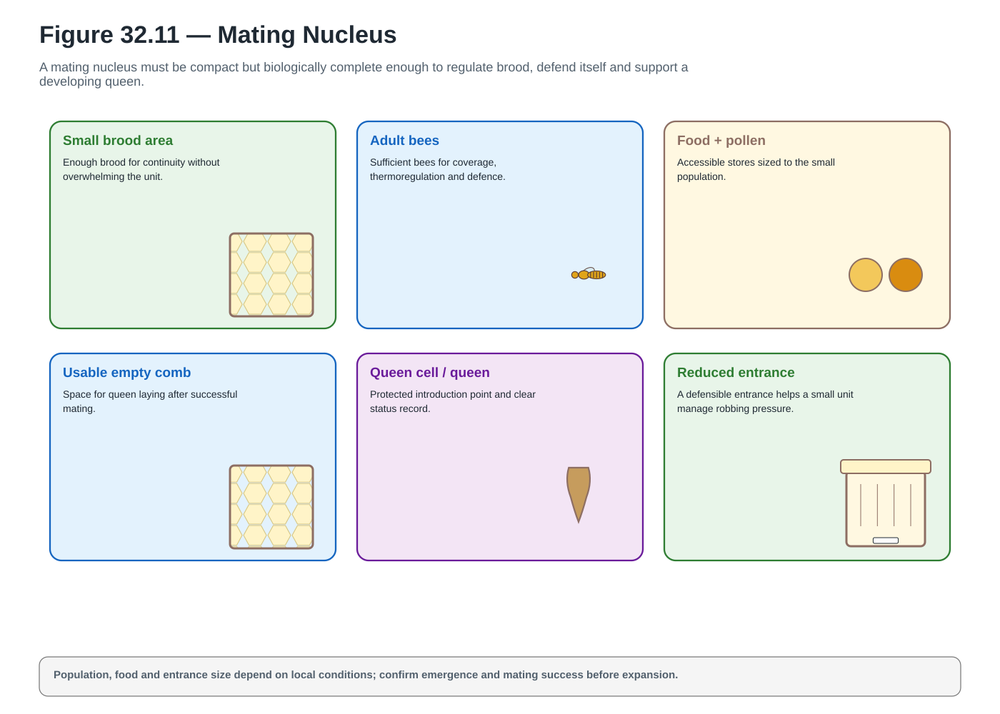</a>

**A_CORE** · `ACTUAL_VECTOR_CREATED` · `PENDING_FINAL_LAYOUT_PROOF` · [Open SVG](../../assets/diagrams/wave-03/fig-32-11-mating-nucleus.svg)

