# Wave 04 Visual Gallery

**A_CORE assets:** 12 / 12  
**Coverage:** Chapters 34–37 — seasonal planning, monthly management, record keeping and beginner mistake prevention  
**Status:** production complete; final greyscale, final-size, accessibility and layout proof pending.

Tap any thumbnail or **Open SVG** to inspect the vector at full resolution.

## Chapter 34

### Figure 34.1 — The Biological Colony Year

<a href="../../assets/diagrams/wave-04/fig-34-1-biological-colony-year.svg">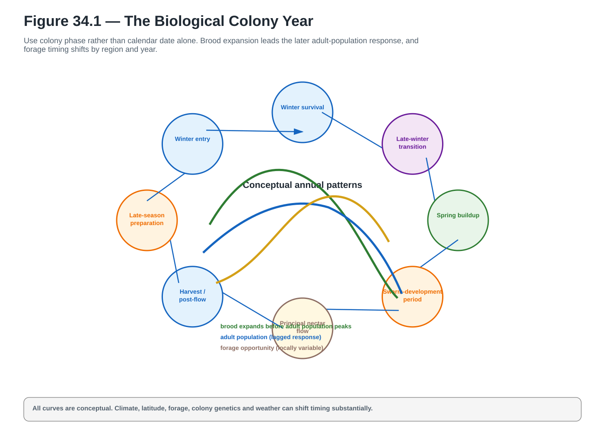</a>

**A_CORE** · `ACTUAL_VECTOR_CREATED` · `PENDING_FINAL_LAYOUT_PROOF` · [Open SVG](../../assets/diagrams/wave-04/fig-34-1-biological-colony-year.svg)

### Figure 34.2 — Seasonal Decision Framework

<a href="../../assets/diagrams/wave-04/fig-34-2-seasonal-decision-framework.svg">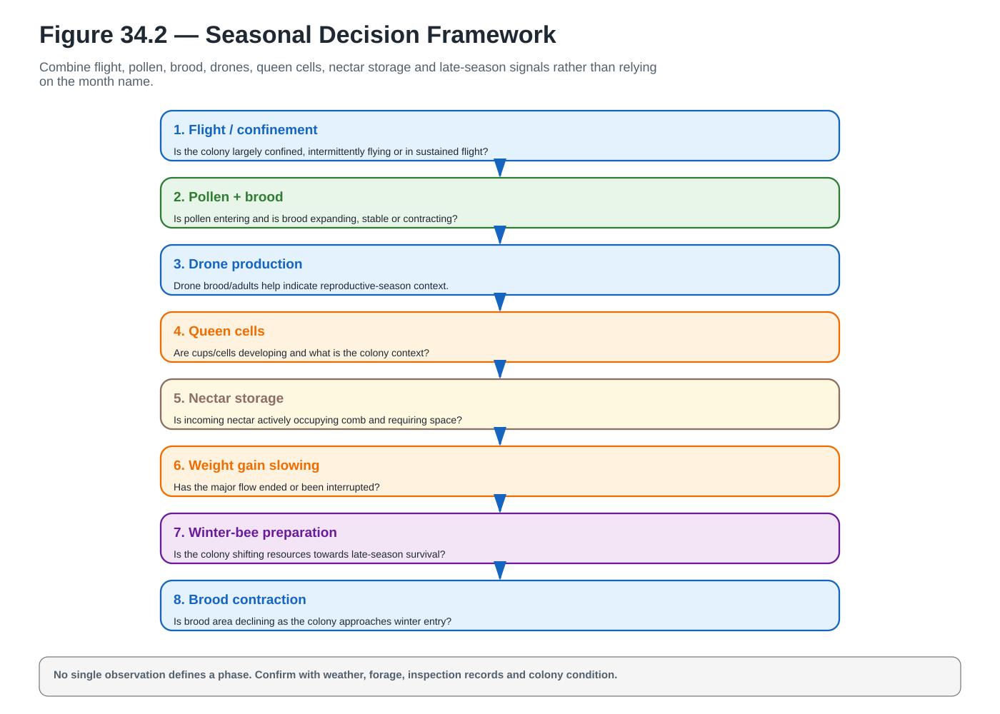</a>

**A_CORE** · `ACTUAL_VECTOR_CREATED` · `PENDING_FINAL_LAYOUT_PROOF` · [Open SVG](../../assets/diagrams/wave-04/fig-34-2-seasonal-decision-framework.svg)

### Figure 34.4 — Seasonal Inspection Objectives

<a href="../../assets/diagrams/wave-04/fig-34-4-seasonal-inspection-objectives.svg">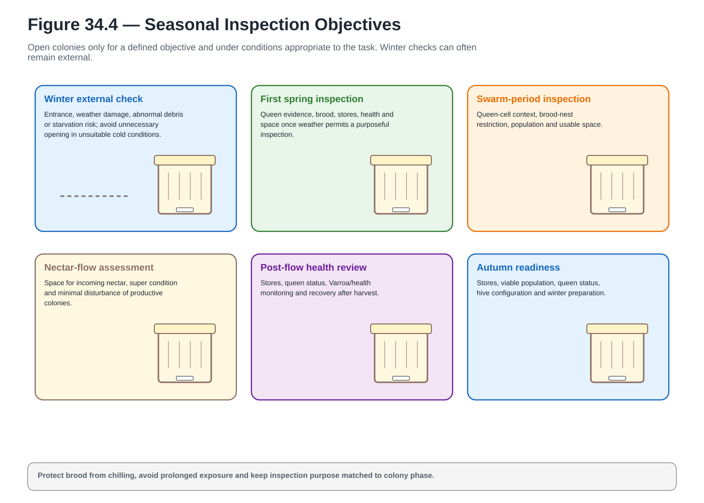</a>

**A_CORE** · `ACTUAL_VECTOR_CREATED` · `PENDING_FINAL_LAYOUT_PROOF` · [Open SVG](../../assets/diagrams/wave-04/fig-34-4-seasonal-inspection-objectives.svg)

## Chapter 35

### Figure 35.2 — Monthly Priority Matrix

<a href="../../assets/diagrams/wave-04/fig-35-2-monthly-priority-matrix.svg">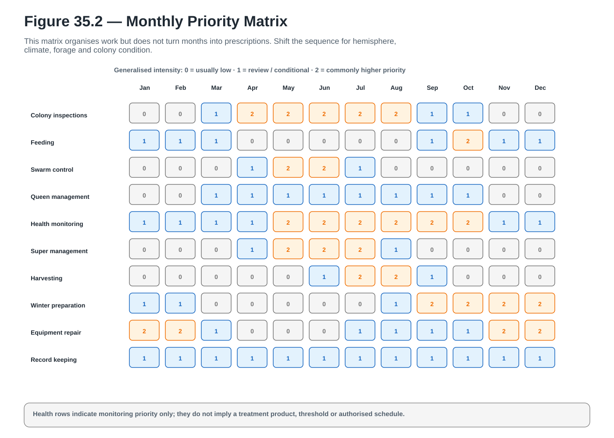</a>

**A_CORE** · `ACTUAL_VECTOR_CREATED` · `PENDING_FINAL_LAYOUT_PROOF` · [Open SVG](../../assets/diagrams/wave-04/fig-35-2-monthly-priority-matrix.svg)

### Figure 35.3 — One-Month-Ahead Equipment Planning

<a href="../../assets/diagrams/wave-04/fig-35-3-one-month-ahead-equipment-planning.svg">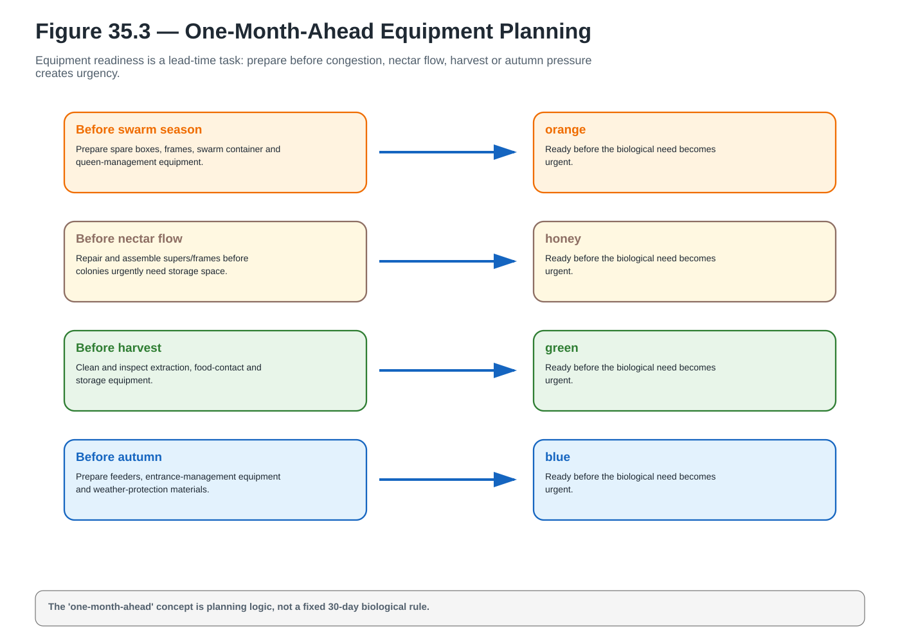</a>

**A_CORE** · `ACTUAL_VECTOR_CREATED` · `PENDING_FINAL_LAYOUT_PROOF` · [Open SVG](../../assets/diagrams/wave-04/fig-35-3-one-month-ahead-equipment-planning.svg)

### Figure 35.4 — Monthly Inspection Record

<a href="../../assets/diagrams/wave-04/fig-35-4-monthly-inspection-record.svg">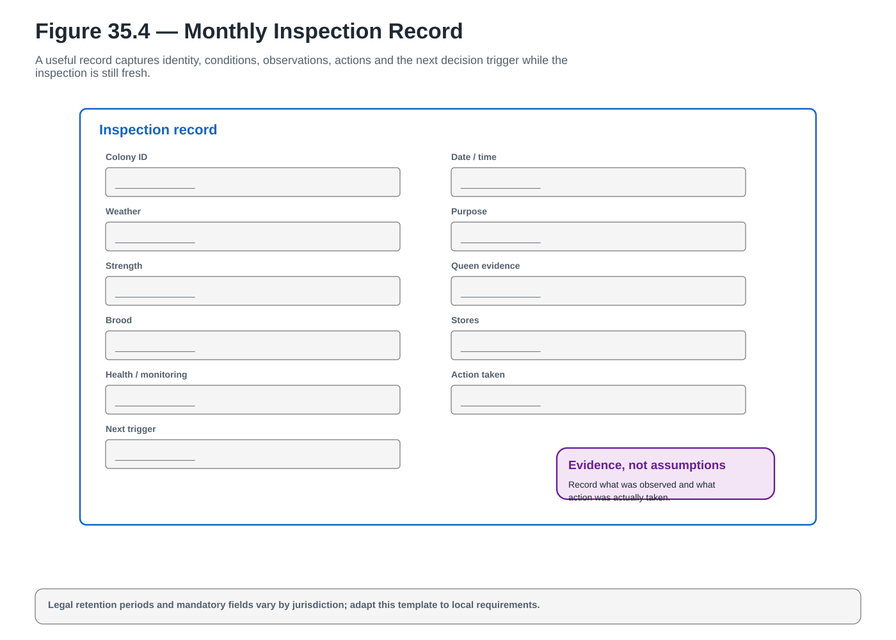</a>

**A_CORE** · `ACTUAL_VECTOR_CREATED` · `PENDING_FINAL_LAYOUT_PROOF` · [Open SVG](../../assets/diagrams/wave-04/fig-35-4-monthly-inspection-record.svg)

## Chapter 36

### Figure 36.2 — Colony Inspection Record Sheet

<a href="../../assets/diagrams/wave-04/fig-36-2-colony-inspection-record-sheet.svg">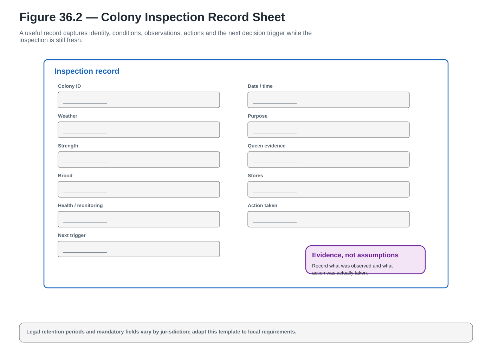</a>

**A_CORE** · `ACTUAL_VECTOR_CREATED` · `PENDING_FINAL_LAYOUT_PROOF` · [Open SVG](../../assets/diagrams/wave-04/fig-36-2-colony-inspection-record-sheet.svg)

### Figure 36.6 — Honey Batch Traceability

<a href="../../assets/diagrams/wave-04/fig-36-6-honey-batch-traceability.svg">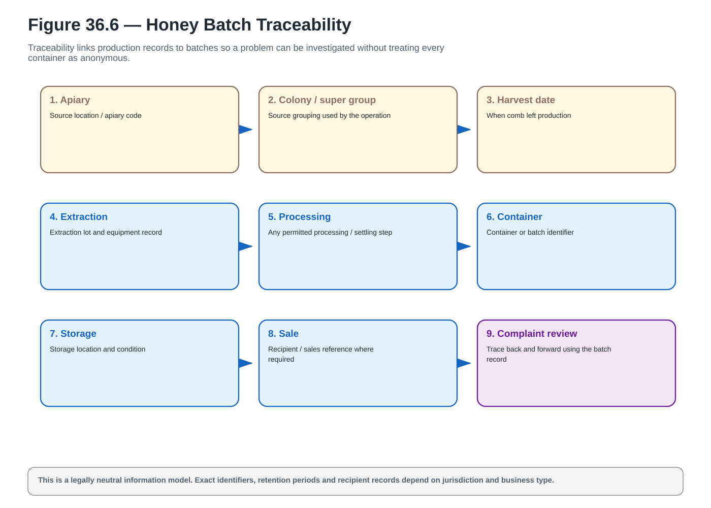</a>

**A_CORE** · `ACTUAL_VECTOR_CREATED` · `PENDING_FINAL_LAYOUT_PROOF` · [Open SVG](../../assets/diagrams/wave-04/fig-36-6-honey-batch-traceability.svg)

### Figure 36.7 — Record Review Cycle

<a href="../../assets/diagrams/wave-04/fig-36-7-record-review-cycle.svg">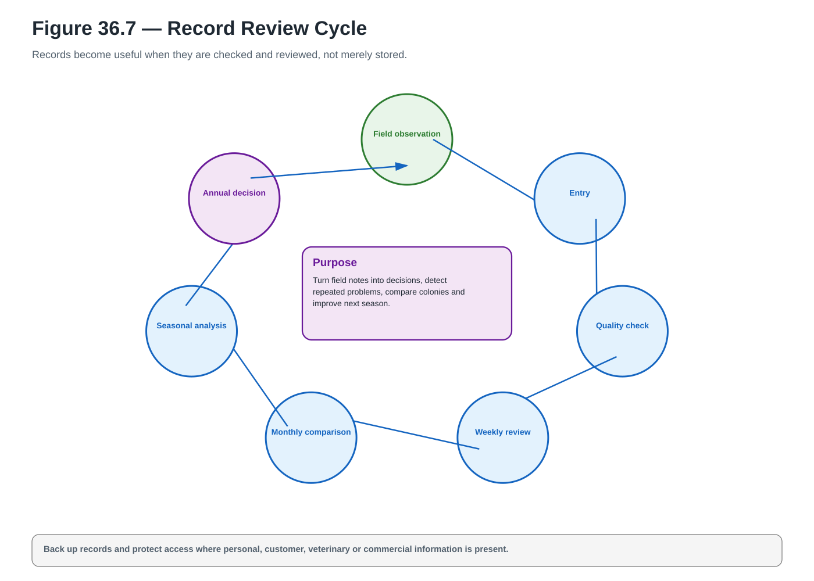</a>

**A_CORE** · `ACTUAL_VECTOR_CREATED` · `PENDING_FINAL_LAYOUT_PROOF` · [Open SVG](../../assets/diagrams/wave-04/fig-36-7-record-review-cycle.svg)

## Chapter 37

### Figure 37.1 — Inspection Mistakes

<a href="../../assets/diagrams/wave-04/fig-37-1-inspection-mistakes.svg">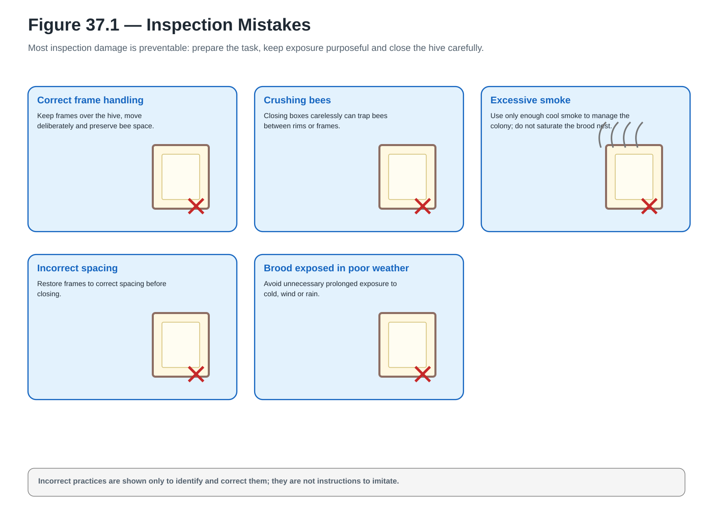</a>

**A_CORE** · `ACTUAL_VECTOR_CREATED` · `PENDING_FINAL_LAYOUT_PROOF` · [Open SVG](../../assets/diagrams/wave-04/fig-37-1-inspection-mistakes.svg)

### Figure 37.3 — Queen-Cell Decision Guide

<a href="../../assets/diagrams/wave-04/fig-37-3-queen-cell-decision-guide.svg">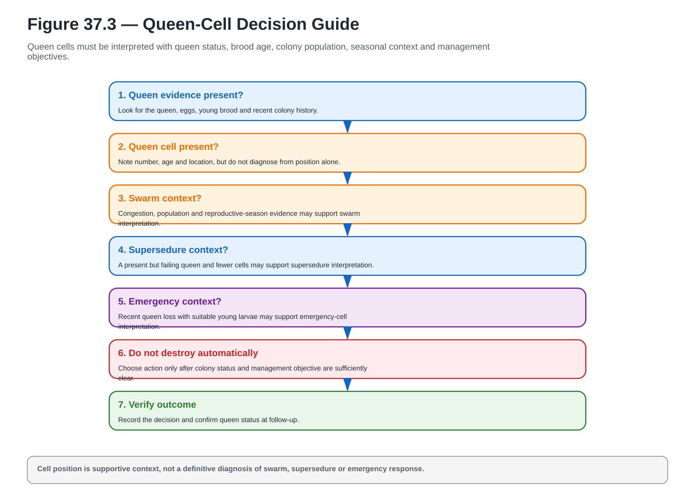</a>

**A_CORE** · `ACTUAL_VECTOR_CREATED` · `PENDING_FINAL_LAYOUT_PROOF` · [Open SVG](../../assets/diagrams/wave-04/fig-37-3-queen-cell-decision-guide.svg)

### Figure 37.6 — Harvest Mistakes

<a href="../../assets/diagrams/wave-04/fig-37-6-harvest-mistakes.svg">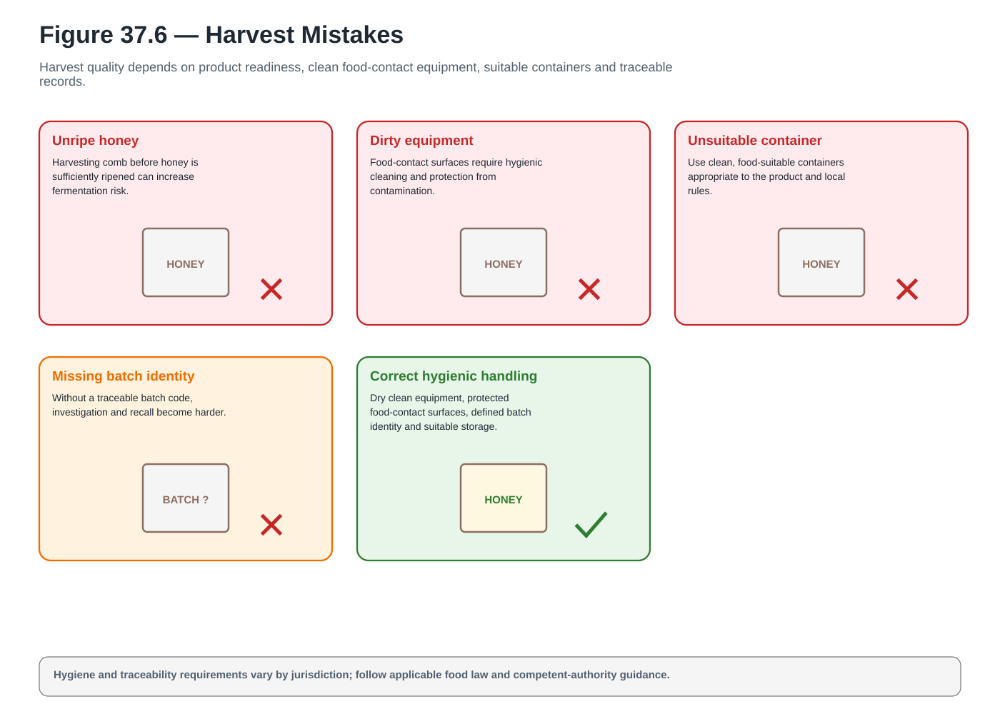</a>

**A_CORE** · `ACTUAL_VECTOR_CREATED` · `PENDING_FINAL_LAYOUT_PROOF` · [Open SVG](../../assets/diagrams/wave-04/fig-37-6-harvest-mistakes.svg)

