# Wave 05 Visual Gallery

**A_CORE assets:** 18 / 18  
**Coverage:** Chapters 47–52 — nectar flow, harvest readiness, extraction, processing, storage and comb honey  
**Status:** production complete; final greyscale, final-size, accessibility and layout proof pending.

Tap any thumbnail or **Open SVG** to inspect the vector at full resolution.

## Chapter 47

### Figure 47.3 — Environmental Controls on Nectar Secretion

<a href="../../assets/diagrams/wave-05/fig-47-3-environmental-controls-nectar-secretion.svg">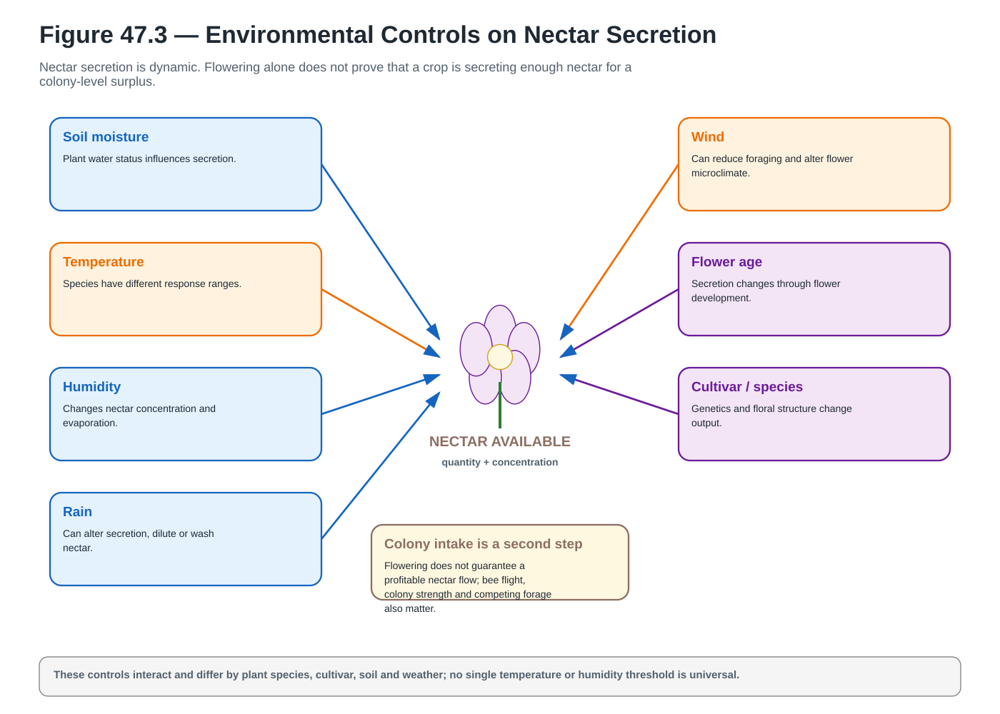</a>

**A_CORE** · `ACTUAL_VECTOR_CREATED` · `PENDING_FINAL_LAYOUT_PROOF` · [Open SVG](../../assets/diagrams/wave-05/fig-47-3-environmental-controls-nectar-secretion.svg)

### Figure 47.9 — Colony Population Timing Before a Flow

<a href="../../assets/diagrams/wave-05/fig-47-9-colony-population-timing-before-flow.svg">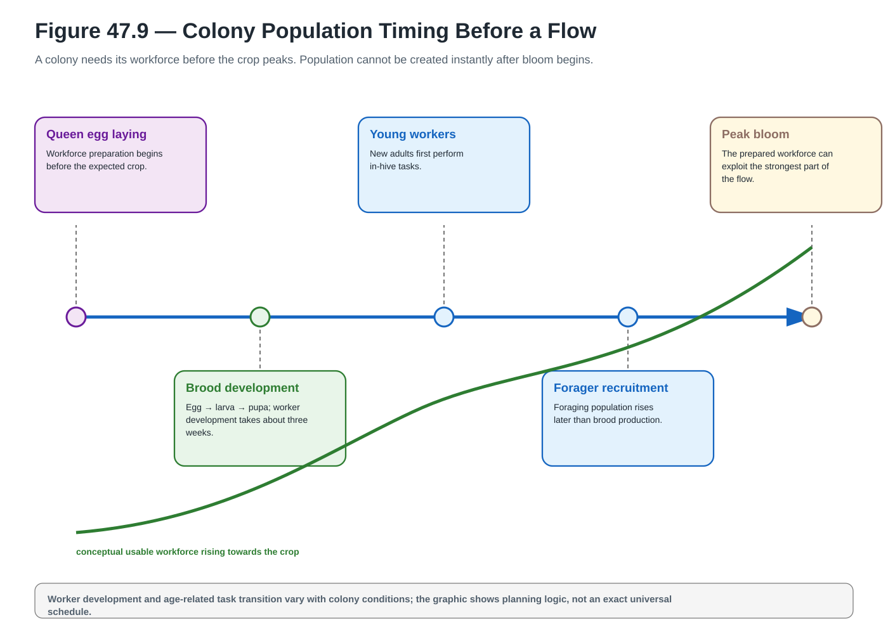</a>

**A_CORE** · `ACTUAL_VECTOR_CREATED` · `PENDING_FINAL_LAYOUT_PROOF` · [Open SVG](../../assets/diagrams/wave-05/fig-47-9-colony-population-timing-before-flow.svg)

### Figure 47.10 — Storage-Space Decision

<a href="../../assets/diagrams/wave-05/fig-47-10-storage-space-decision.svg">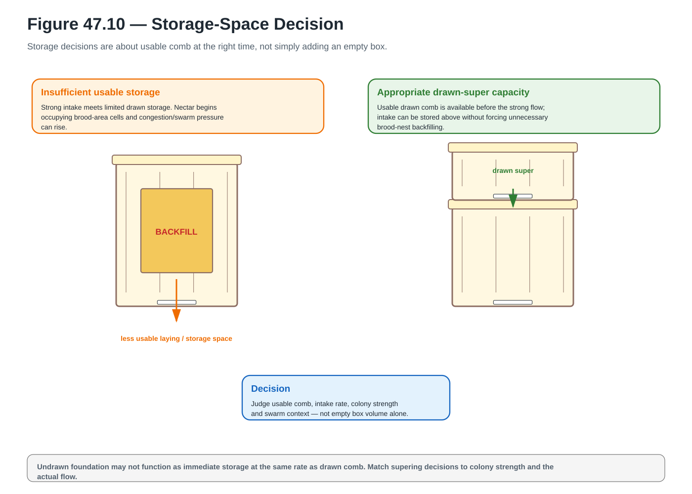</a>

**A_CORE** · `ACTUAL_VECTOR_CREATED` · `PENDING_FINAL_LAYOUT_PROOF` · [Open SVG](../../assets/diagrams/wave-05/fig-47-10-storage-space-decision.svg)

## Chapter 48

### Figure 48.1 — Harvest Readiness Decision Flow

<a href="../../assets/diagrams/wave-05/fig-48-1-harvest-readiness-decision-flow.svg">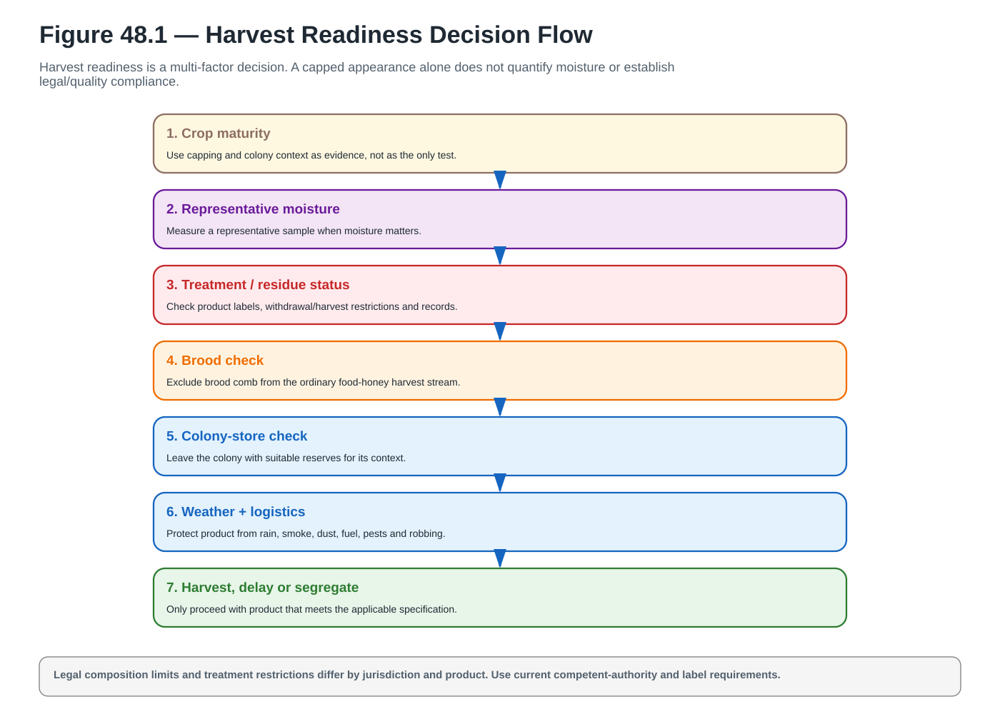</a>

**A_CORE** · `ACTUAL_VECTOR_CREATED` · `PENDING_FINAL_LAYOUT_PROOF` · [Open SVG](../../assets/diagrams/wave-05/fig-48-1-harvest-readiness-decision-flow.svg)

### Figure 48.3 — Honey Refractometer Use

<a href="../../assets/diagrams/wave-05/fig-48-3-honey-refractometer-use.svg">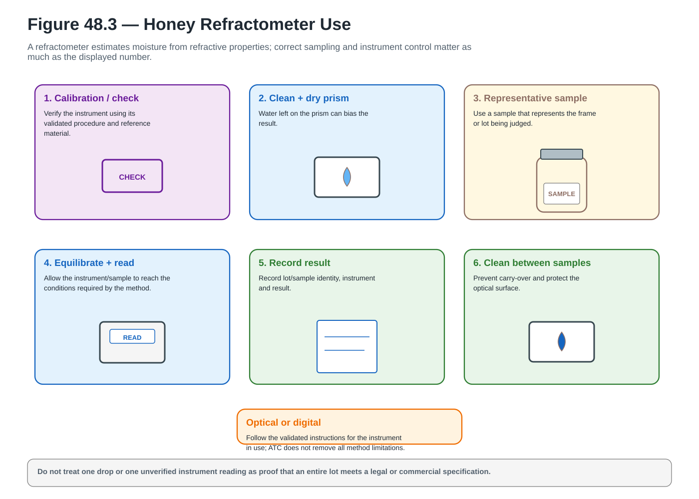</a>

**A_CORE** · `ACTUAL_VECTOR_CREATED` · `PENDING_FINAL_LAYOUT_PROOF` · [Open SVG](../../assets/diagrams/wave-05/fig-48-3-honey-refractometer-use.svg)

### Figure 48.4 — Representative Moisture Sampling

<a href="../../assets/diagrams/wave-05/fig-48-4-representative-moisture-sampling.svg">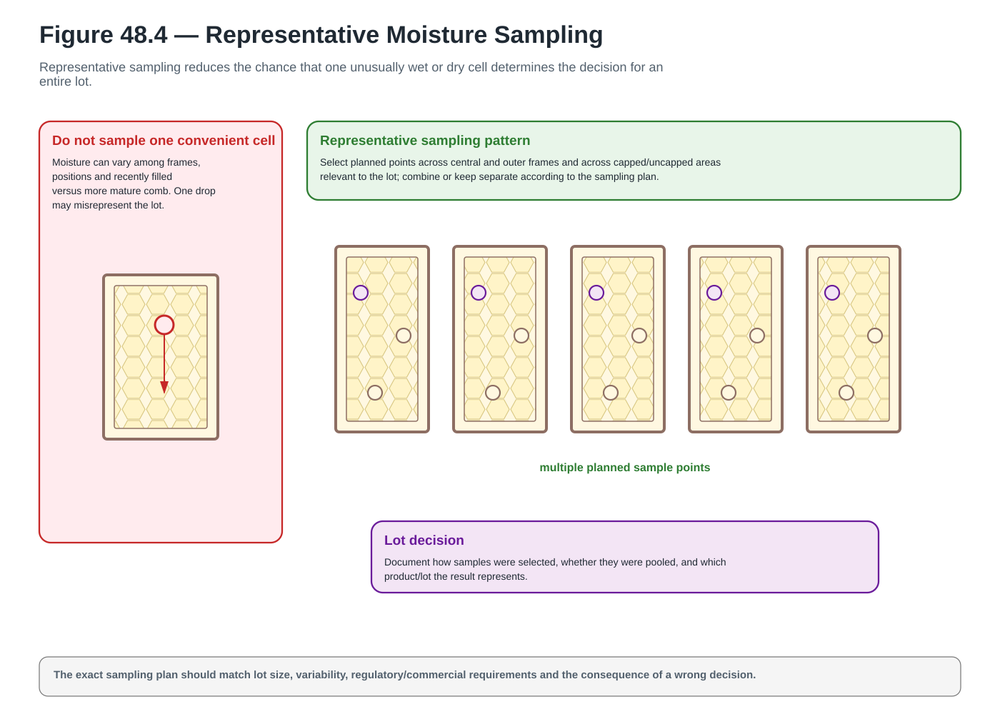</a>

**A_CORE** · `ACTUAL_VECTOR_CREATED` · `PENDING_FINAL_LAYOUT_PROOF` · [Open SVG](../../assets/diagrams/wave-05/fig-48-4-representative-moisture-sampling.svg)

## Chapter 49

### Figure 49.1 — One-Way Honey-Room Workflow

<a href="../../assets/diagrams/wave-05/fig-49-1-one-way-honey-room-workflow.svg">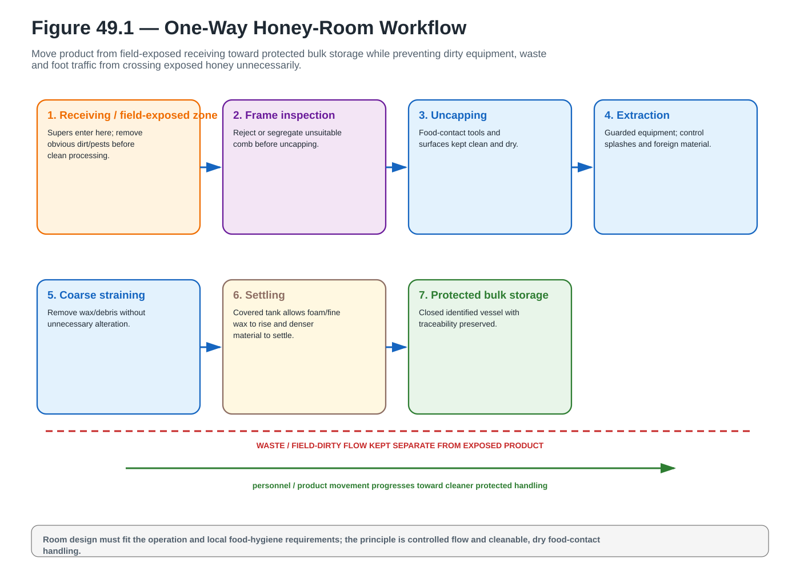</a>

**A_CORE** · `ACTUAL_VECTOR_CREATED` · `PENDING_FINAL_LAYOUT_PROOF` · [Open SVG](../../assets/diagrams/wave-05/fig-49-1-one-way-honey-room-workflow.svg)

### Figure 49.4 — Tangential Versus Radial Extraction

<a href="../../assets/diagrams/wave-05/fig-49-4-tangential-vs-radial-extraction.svg">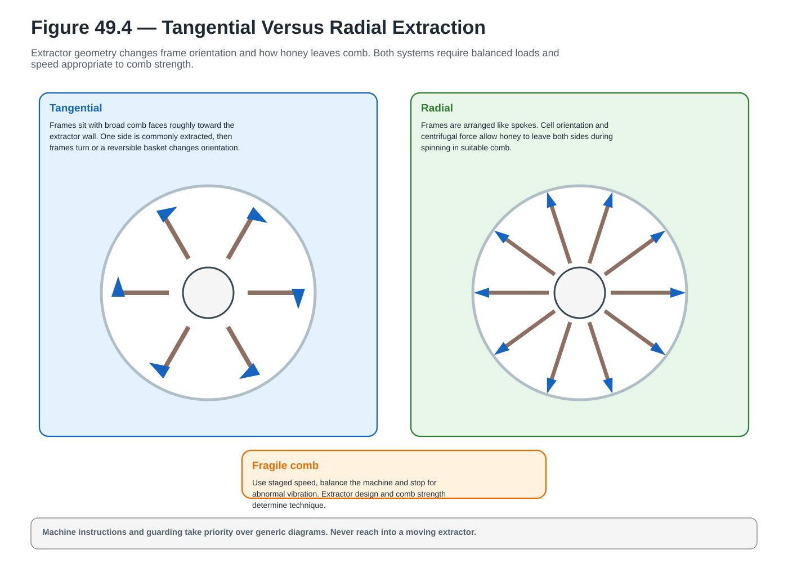</a>

**A_CORE** · `ACTUAL_VECTOR_CREATED` · `PENDING_FINAL_LAYOUT_PROOF` · [Open SVG](../../assets/diagrams/wave-05/fig-49-4-tangential-vs-radial-extraction.svg)

### Figure 49.13 — Extraction Safety Hazards

<a href="../../assets/diagrams/wave-05/fig-49-13-extraction-safety-hazards.svg">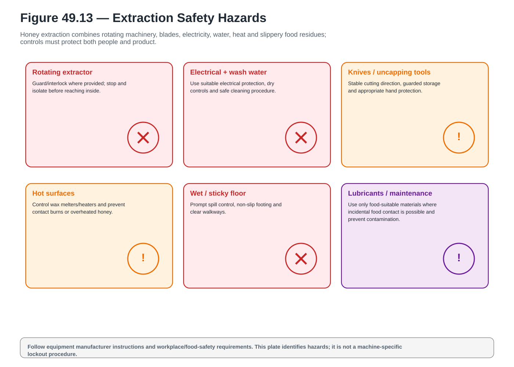</a>

**A_CORE** · `ACTUAL_VECTOR_CREATED` · `PENDING_FINAL_LAYOUT_PROOF` · [Open SVG](../../assets/diagrams/wave-05/fig-49-13-extraction-safety-hazards.svg)

## Chapter 50

### Figure 50.1 — Minimal-Processing Flow

<a href="../../assets/diagrams/wave-05/fig-50-1-minimal-processing-flow.svg">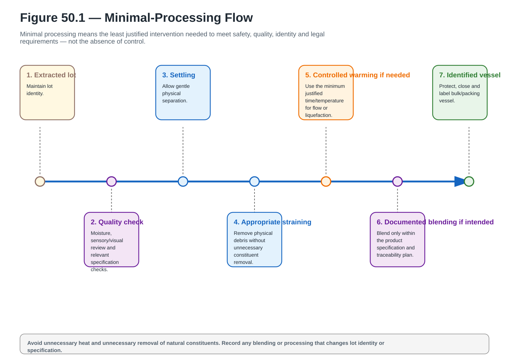</a>

**A_CORE** · `ACTUAL_VECTOR_CREATED` · `PENDING_FINAL_LAYOUT_PROOF` · [Open SVG](../../assets/diagrams/wave-05/fig-50-1-minimal-processing-flow.svg)

### Figure 50.2 — Settling Tank Separation

<a href="../../assets/diagrams/wave-05/fig-50-2-settling-tank-separation.svg">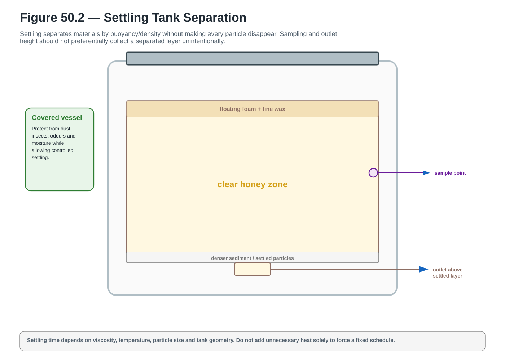</a>

**A_CORE** · `ACTUAL_VECTOR_CREATED` · `PENDING_FINAL_LAYOUT_PROOF` · [Open SVG](../../assets/diagrams/wave-05/fig-50-2-settling-tank-separation.svg)

### Figure 50.3 — Straining Versus Legal “Filtered Honey”

<a href="../../assets/diagrams/wave-05/fig-50-3-straining-vs-filtered-honey.svg">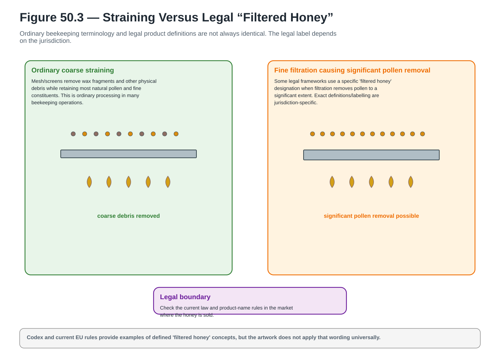</a>

**A_CORE** · `ACTUAL_VECTOR_CREATED` · `PENDING_FINAL_LAYOUT_PROOF` · [Open SVG](../../assets/diagrams/wave-05/fig-50-3-straining-vs-filtered-honey.svg)

## Chapter 51

### Figure 51.2 — Food Safety, Quality, and Shelf Life

<a href="../../assets/diagrams/wave-05/fig-51-2-food-safety-quality-shelf-life.svg">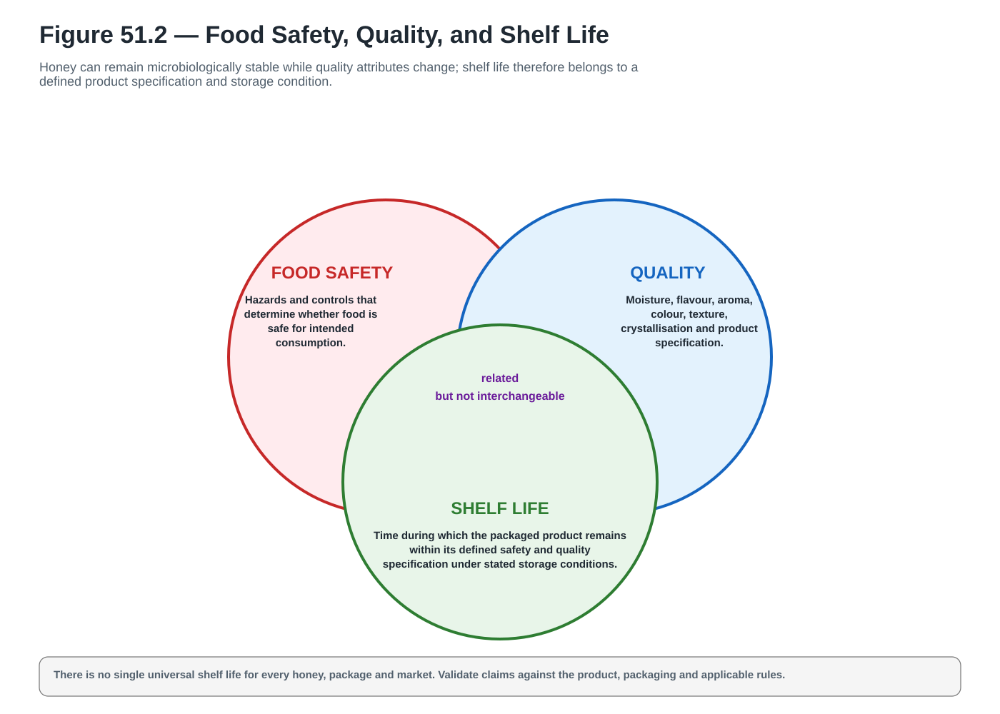</a>

**A_CORE** · `ACTUAL_VECTOR_CREATED` · `PENDING_FINAL_LAYOUT_PROOF` · [Open SVG](../../assets/diagrams/wave-05/fig-51-2-food-safety-quality-shelf-life.svg)

### Figure 51.3 — Hygroscopicity and Sealing

<a href="../../assets/diagrams/wave-05/fig-51-3-hygroscopicity-and-sealing.svg">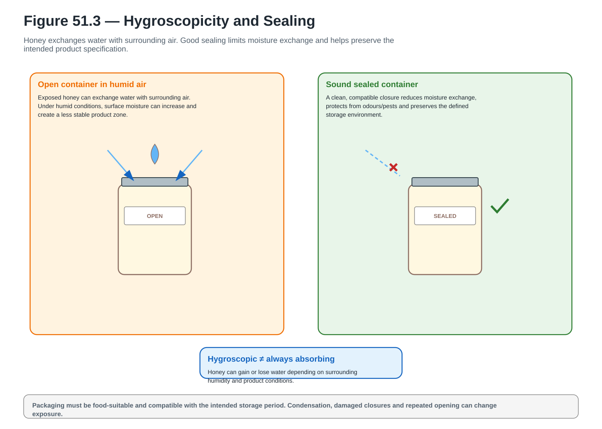</a>

**A_CORE** · `ACTUAL_VECTOR_CREATED` · `PENDING_FINAL_LAYOUT_PROOF` · [Open SVG](../../assets/diagrams/wave-05/fig-51-3-hygroscopicity-and-sealing.svg)

### Figure 51.12 — Storage Sampling

<a href="../../assets/diagrams/wave-05/fig-51-12-storage-sampling.svg">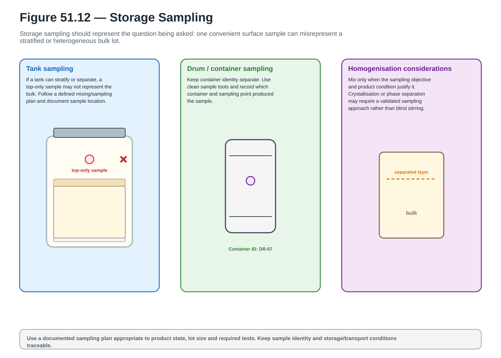</a>

**A_CORE** · `ACTUAL_VECTOR_CREATED` · `PENDING_FINAL_LAYOUT_PROOF` · [Open SVG](../../assets/diagrams/wave-05/fig-51-12-storage-sampling.svg)

## Chapter 52

### Figure 52.2 — Fresh Broodless Comb Versus Used Brood Comb

<a href="../../assets/diagrams/wave-05/fig-52-2-fresh-broodless-vs-used-brood-comb.svg">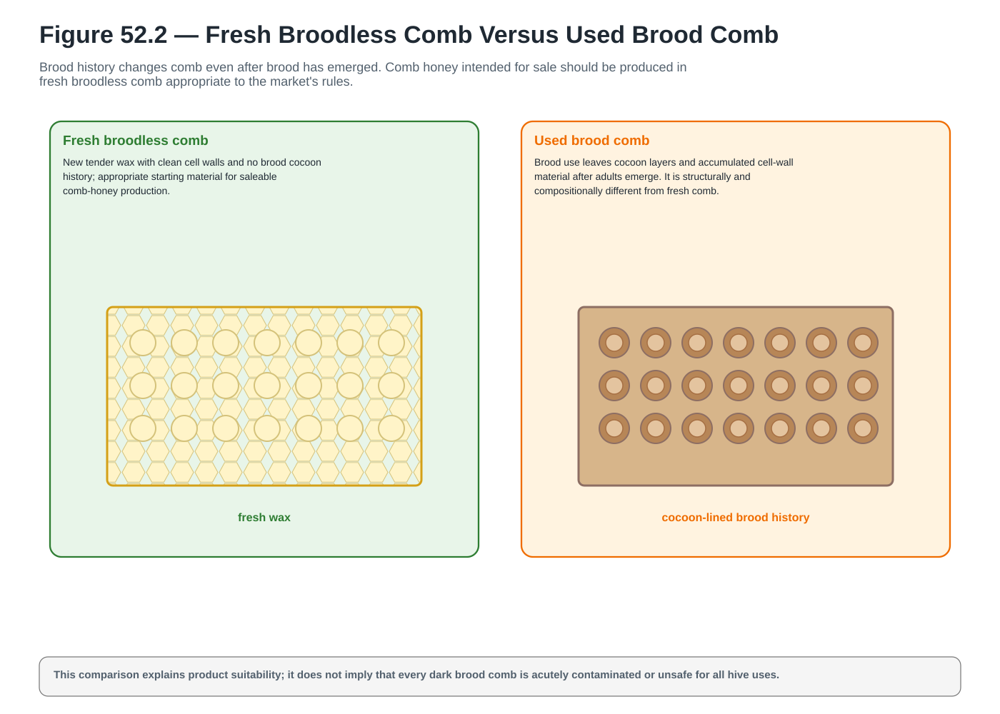</a>

**A_CORE** · `ACTUAL_VECTOR_CREATED` · `PENDING_FINAL_LAYOUT_PROOF` · [Open SVG](../../assets/diagrams/wave-05/fig-52-2-fresh-broodless-vs-used-brood-comb.svg)

### Figure 52.3 — Colony Preparation Timeline

<a href="../../assets/diagrams/wave-05/fig-52-3-colony-preparation-timeline.svg">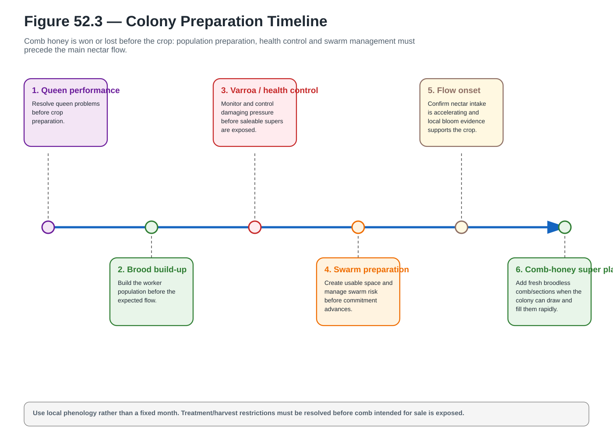</a>

**A_CORE** · `ACTUAL_VECTOR_CREATED` · `PENDING_FINAL_LAYOUT_PROOF` · [Open SVG](../../assets/diagrams/wave-05/fig-52-3-colony-preparation-timeline.svg)

### Figure 52.9 — Comb Honey Defect Atlas

<a href="../../assets/diagrams/wave-05/fig-52-9-comb-honey-defect-atlas.svg">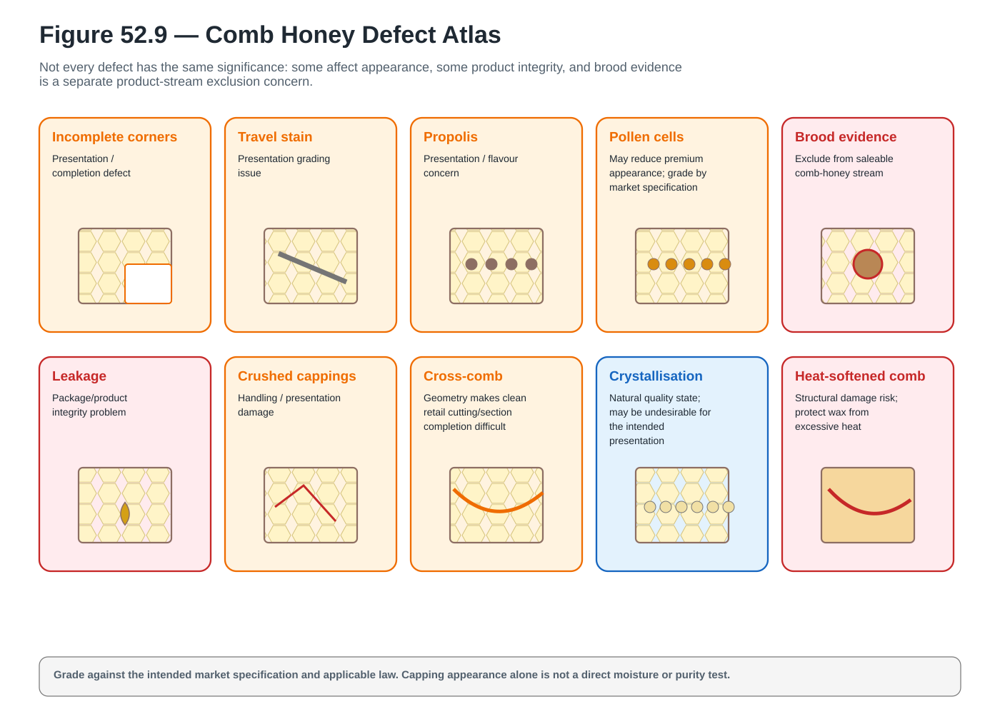</a>

**A_CORE** · `ACTUAL_VECTOR_CREATED` · `PENDING_FINAL_LAYOUT_PROOF` · [Open SVG](../../assets/diagrams/wave-05/fig-52-9-comb-honey-defect-atlas.svg)

