# Wave 06a Visual Gallery

**A_CORE assets:** 15 / 15  
**Coverage:** Chapters 53–57 — creamed honey, wax processing, beeswax biology, pollen and propolis  
**Status:** production complete; final greyscale, final-size, accessibility and layout proof pending.

Tap any thumbnail or **Open SVG** to inspect the vector at full resolution.

## Chapter 53

### Figure 53.1 — Controlled Versus Uncontrolled Crystallisation

<a href="../../assets/diagrams/wave-06a/fig-53-1-controlled-vs-uncontrolled-crystallisation.svg">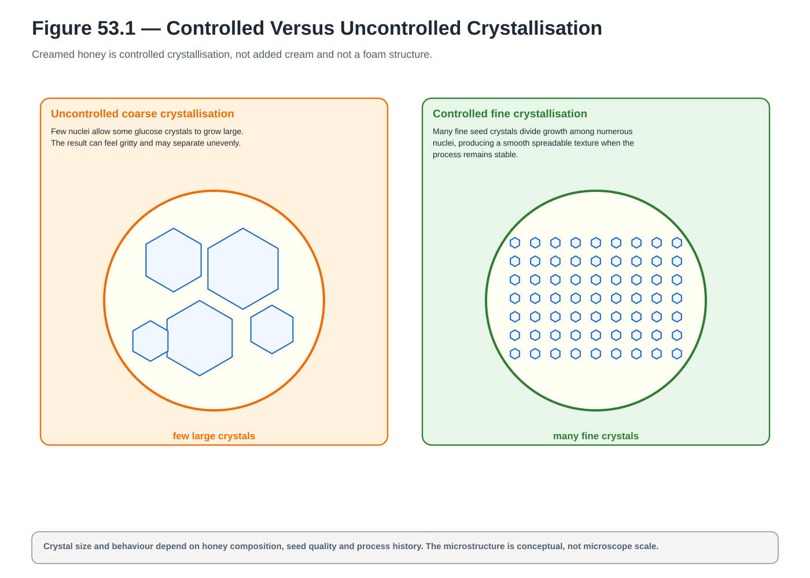</a>

**A_CORE** · `ACTUAL_VECTOR_CREATED` · `PENDING_FINAL_LAYOUT_PROOF` · [Open SVG](../../assets/diagrams/wave-06a/fig-53-1-controlled-vs-uncontrolled-crystallisation.svg)

### Figure 53.10 — Rework Decision

<a href="../../assets/diagrams/wave-06a/fig-53-10-rework-decision.svg">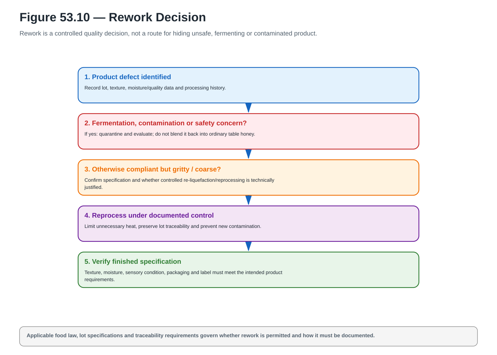</a>

**A_CORE** · `ACTUAL_VECTOR_CREATED` · `PENDING_FINAL_LAYOUT_PROOF` · [Open SVG](../../assets/diagrams/wave-06a/fig-53-10-rework-decision.svg)

### Figure 53.11 — Plain Versus Flavoured Product Controls

<a href="../../assets/diagrams/wave-06a/fig-53-11-plain-vs-flavoured-controls.svg">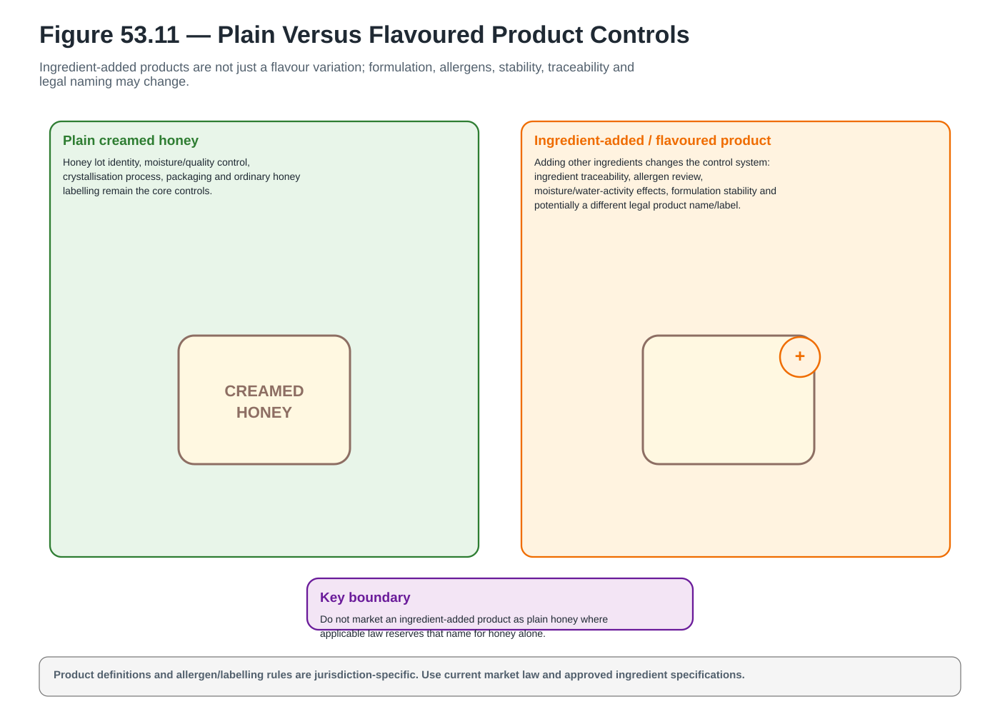</a>

**A_CORE** · `ACTUAL_VECTOR_CREATED` · `PENDING_FINAL_LAYOUT_PROOF` · [Open SVG](../../assets/diagrams/wave-06a/fig-53-11-plain-vs-flavoured-controls.svg)

## Chapter 54

### Figure 54.1 — Wax Source Streams

**A_CORE** · `ACTUAL_VECTOR_CREATED` · `PENDING_FINAL_LAYOUT_PROOF` · [Open SVG](../../assets/diagrams/wave-06a/fig-54-1-wax-source-streams.svg)

### Figure 54.2 — New Comb Versus Old Brood Comb

<a href="../../assets/diagrams/wave-06a/fig-54-2-new-vs-old-brood-comb.svg">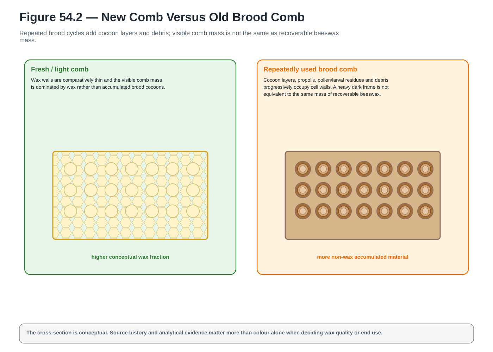</a>

**A_CORE** · `ACTUAL_VECTOR_CREATED` · `PENDING_FINAL_LAYOUT_PROOF` · [Open SVG](../../assets/diagrams/wave-06a/fig-54-2-new-vs-old-brood-comb.svg)

### Figure 54.12 — End-Use Decision

<a href="../../assets/diagrams/wave-06a/fig-54-12-end-use-decision.svg">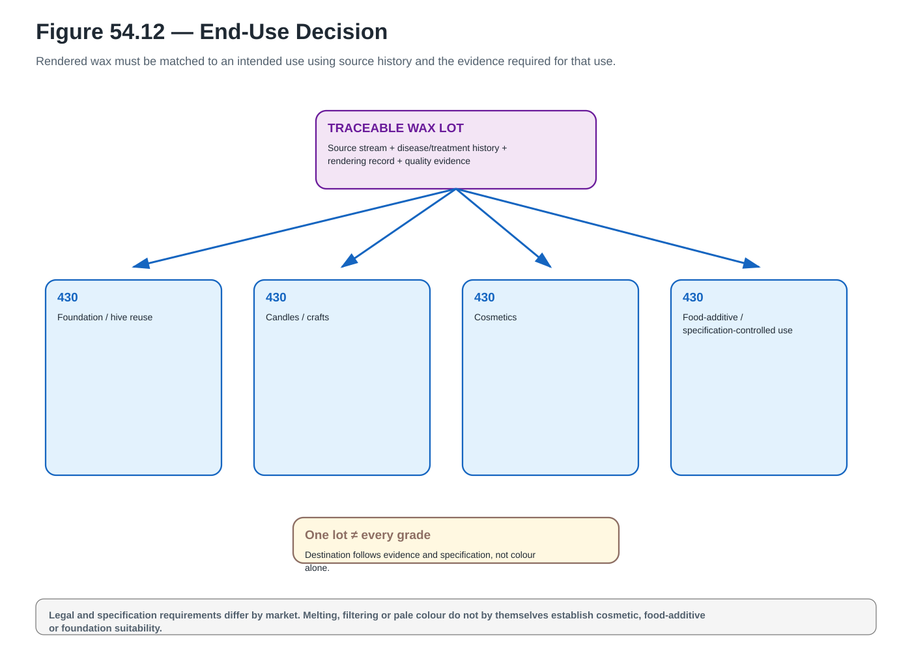</a>

**A_CORE** · `ACTUAL_VECTOR_CREATED` · `PENDING_FINAL_LAYOUT_PROOF` · [Open SVG](../../assets/diagrams/wave-06a/fig-54-12-end-use-decision.svg)

## Chapter 55

### Figure 55.1 — Wax Production by a Worker Bee

<a href="../../assets/diagrams/wave-06a/fig-55-1-wax-production-worker-bee.svg">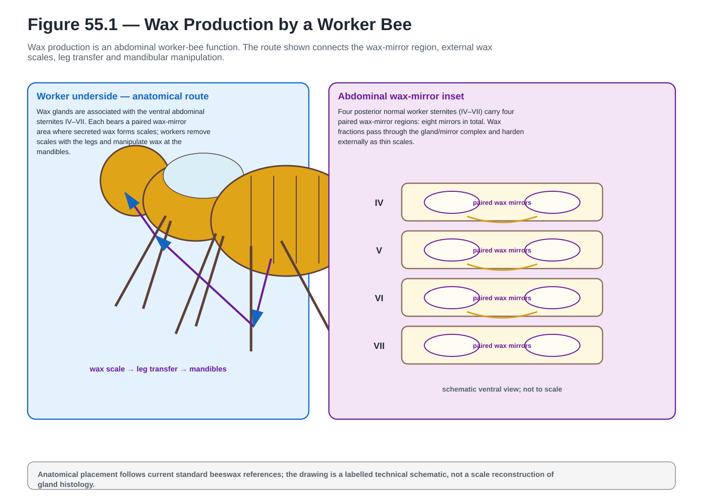</a>

**A_CORE** · `ACTUAL_VECTOR_CREATED` · `PENDING_FINAL_LAYOUT_PROOF` · [Open SVG](../../assets/diagrams/wave-06a/fig-55-1-wax-production-worker-bee.svg)

### Figure 55.2 — Wax Source Streams

<a href="../../assets/diagrams/wave-06a/fig-55-2-wax-source-streams.svg">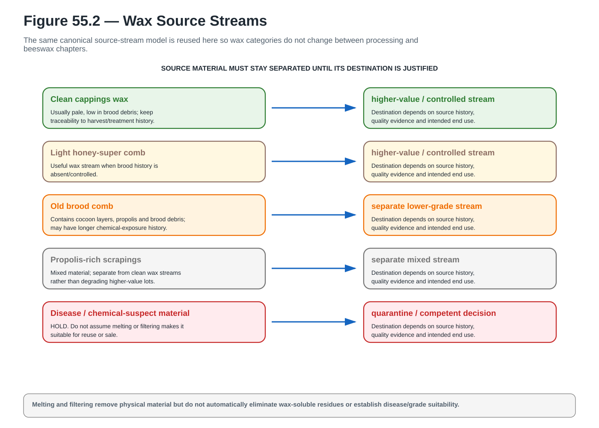</a>

**A_CORE** · `ACTUAL_VECTOR_CREATED` · `PENDING_FINAL_LAYOUT_PROOF` · [Open SVG](../../assets/diagrams/wave-06a/fig-55-2-wax-source-streams.svg)

### Figure 55.3 — New Comb Versus Old Brood Comb

<a href="../../assets/diagrams/wave-06a/fig-55-3-new-vs-old-brood-comb.svg">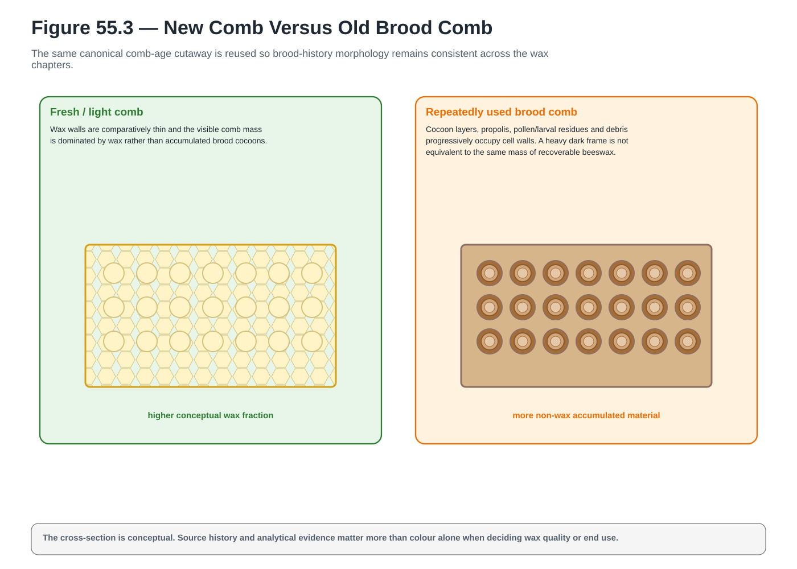</a>

**A_CORE** · `ACTUAL_VECTOR_CREATED` · `PENDING_FINAL_LAYOUT_PROOF` · [Open SVG](../../assets/diagrams/wave-06a/fig-55-3-new-vs-old-brood-comb.svg)

## Chapter 56

### Figure 56.2 — Pollen in Colony Nutrition

<a href="../../assets/diagrams/wave-06a/fig-56-2-pollen-in-colony-nutrition.svg">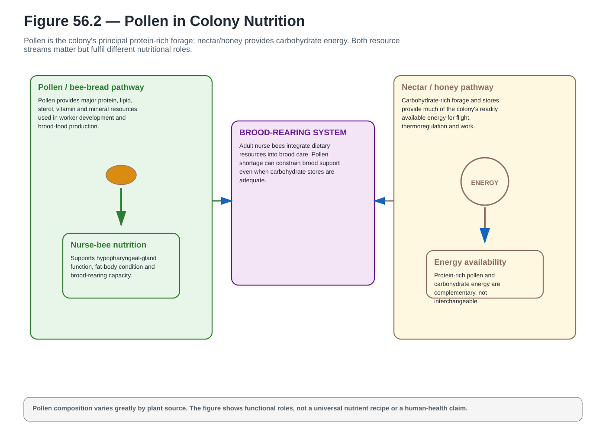</a>

**A_CORE** · `ACTUAL_VECTOR_CREATED` · `PENDING_FINAL_LAYOUT_PROOF` · [Open SVG](../../assets/diagrams/wave-06a/fig-56-2-pollen-in-colony-nutrition.svg)

### Figure 56.3 — Bee Pollen Versus Bee Bread

<a href="../../assets/diagrams/wave-06a/fig-56-3-bee-pollen-vs-bee-bread.svg">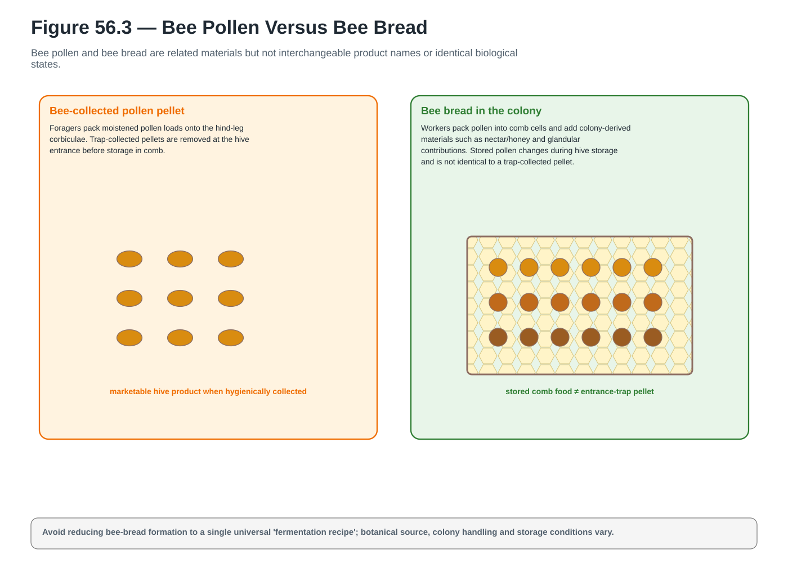</a>

**A_CORE** · `ACTUAL_VECTOR_CREATED` · `PENDING_FINAL_LAYOUT_PROOF` · [Open SVG](../../assets/diagrams/wave-06a/fig-56-3-bee-pollen-vs-bee-bread.svg)

### Figure 56.5 — Colony Cost of Over-Trapping

<a href="../../assets/diagrams/wave-06a/fig-56-5-colony-cost-over-trapping.svg">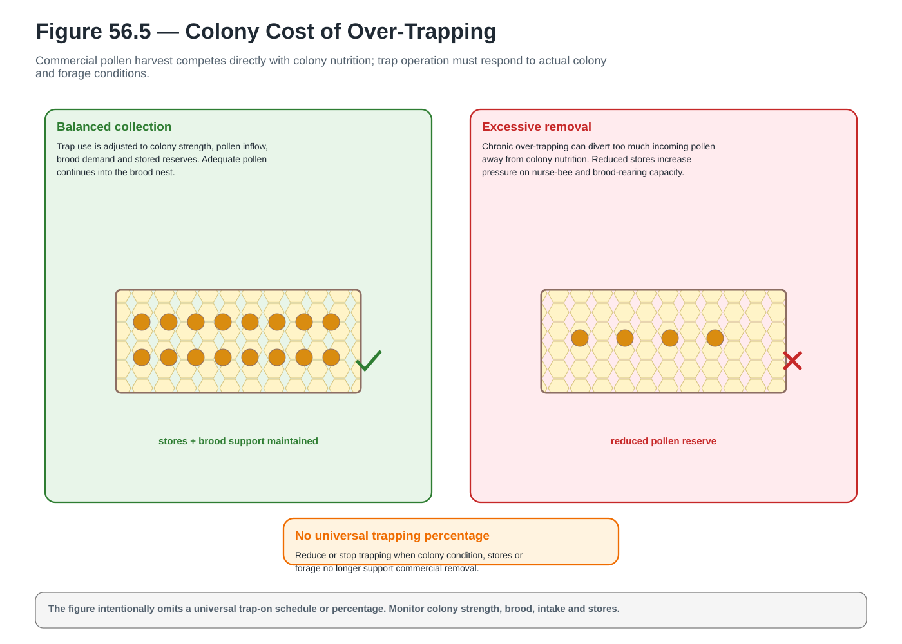</a>

**A_CORE** · `ACTUAL_VECTOR_CREATED` · `PENDING_FINAL_LAYOUT_PROOF` · [Open SVG](../../assets/diagrams/wave-06a/fig-56-5-colony-cost-over-trapping.svg)

## Chapter 57

### Figure 57.2 — Propolis Envelope

<a href="../../assets/diagrams/wave-06a/fig-57-2-propolis-envelope.svg">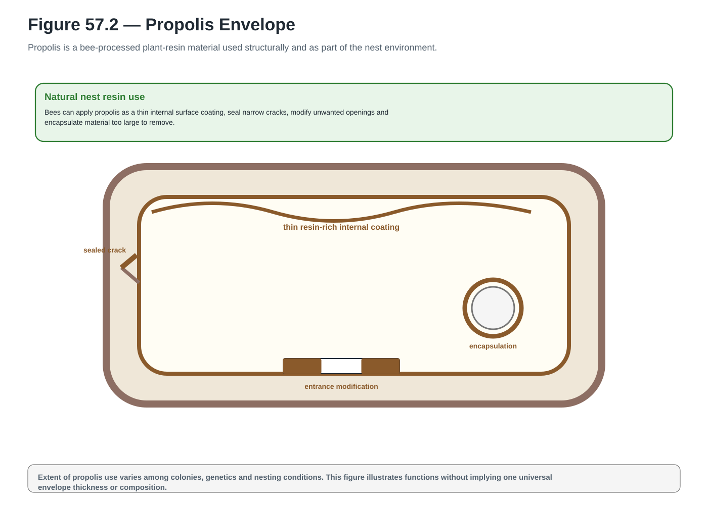</a>

**A_CORE** · `ACTUAL_VECTOR_CREATED` · `PENDING_FINAL_LAYOUT_PROOF` · [Open SVG](../../assets/diagrams/wave-06a/fig-57-2-propolis-envelope.svg)

### Figure 57.4 — Trap Collection Versus Random Scraping

<a href="../../assets/diagrams/wave-06a/fig-57-4-trap-vs-random-scraping.svg">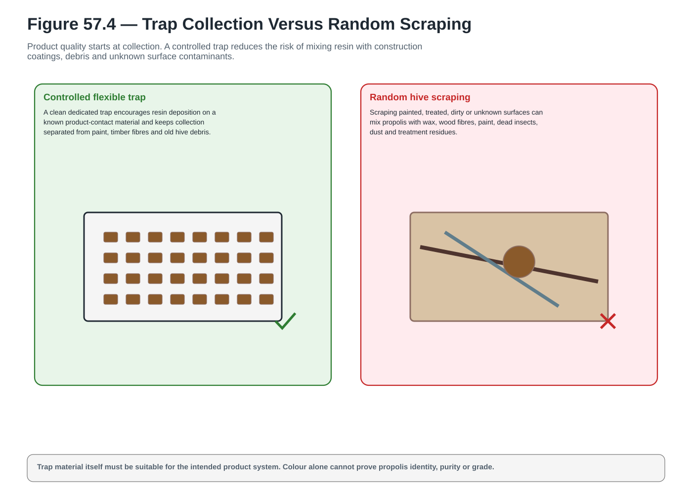</a>

**A_CORE** · `ACTUAL_VECTOR_CREATED` · `PENDING_FINAL_LAYOUT_PROOF` · [Open SVG](../../assets/diagrams/wave-06a/fig-57-4-trap-vs-random-scraping.svg)

### Figure 57.5 — Cold Harvest Workflow

<a href="../../assets/diagrams/wave-06a/fig-57-5-cold-harvest-workflow.svg">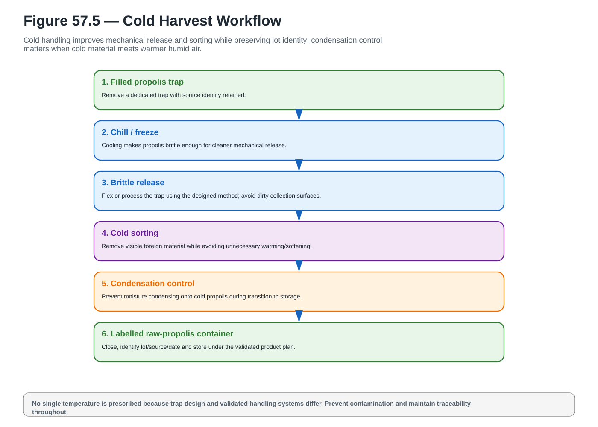</a>

**A_CORE** · `ACTUAL_VECTOR_CREATED` · `PENDING_FINAL_LAYOUT_PROOF` · [Open SVG](../../assets/diagrams/wave-06a/fig-57-5-cold-harvest-workflow.svg)

