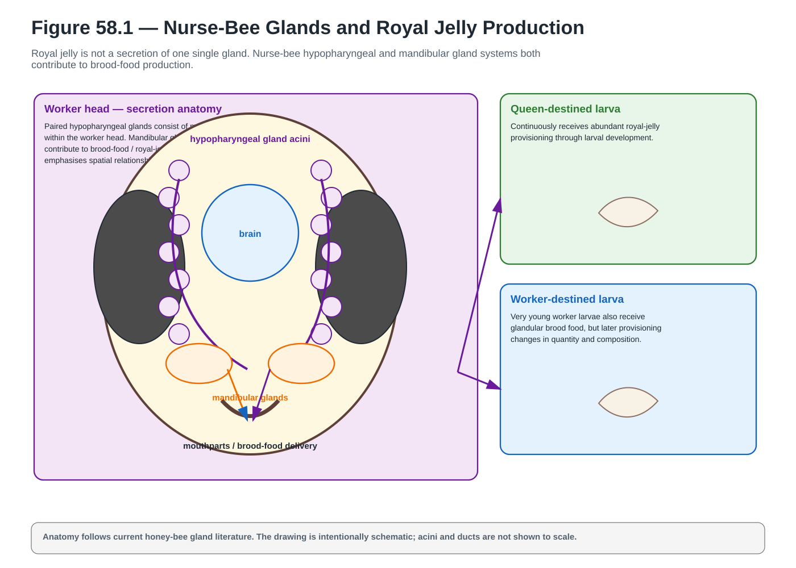
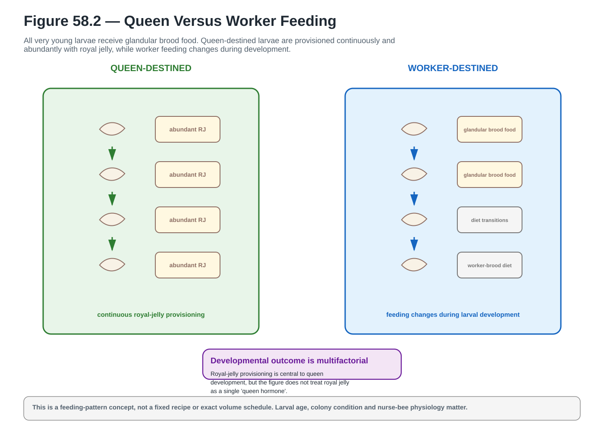
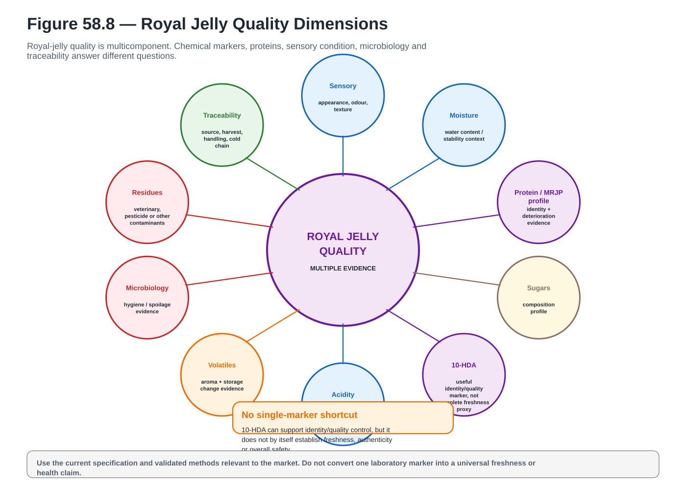
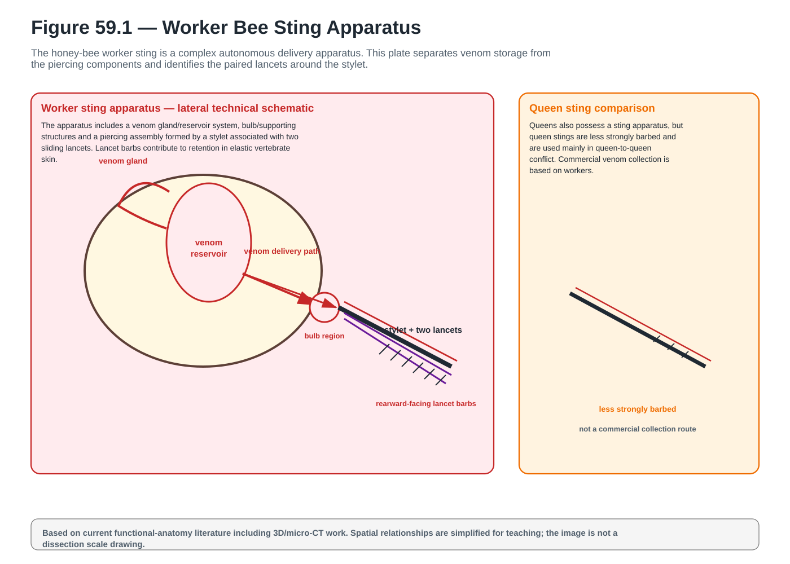
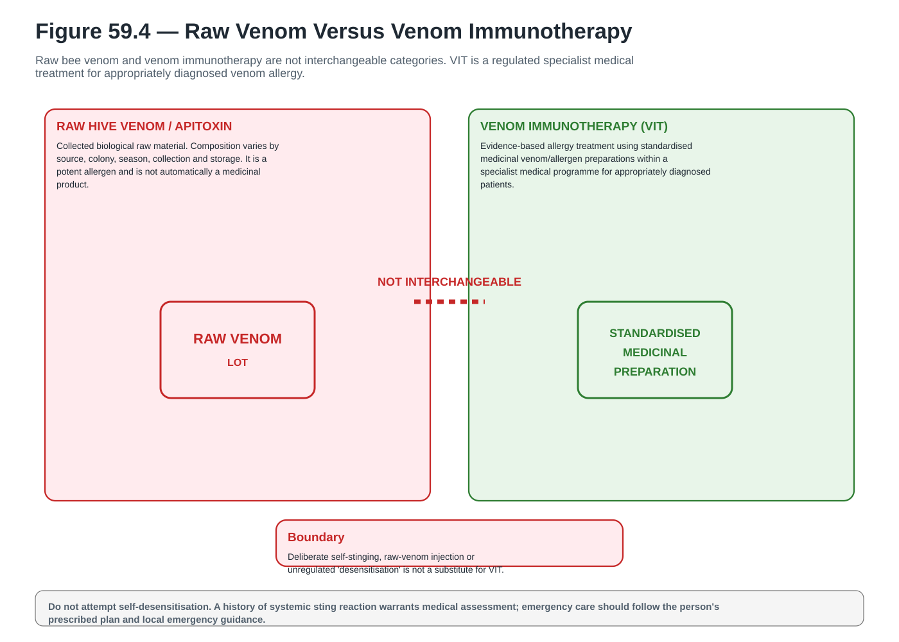
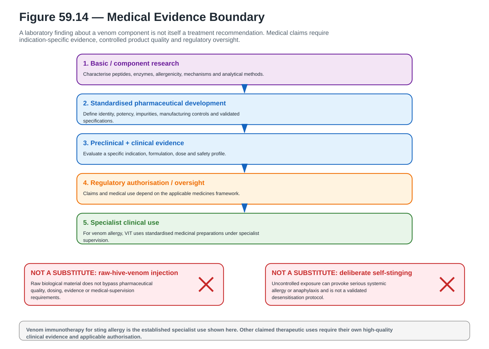

# Wave 06b Visual Gallery

**A_CORE assets:** 6 / 6  
**Coverage:** Chapters 58–59 — royal jelly biology/quality and bee-venom anatomy/medical boundaries  
**Status:** high-fidelity production complete; final greyscale, final-size, accessibility and layout proof pending.

Tap any thumbnail or **Open SVG** to inspect the vector at full resolution.

## Chapter 58

### Figure 58.1 — Nurse-Bee Glands and Royal Jelly Production

**A_CORE** · `ACTUAL_HIGH_FIDELITY_VECTOR_CREATED` · `PENDING_FINAL_LAYOUT_PROOF` · [Open SVG](../../assets/diagrams/wave-06b/fig-58-1-nurse-bee-glands-royal-jelly.svg)

### Figure 58.2 — Queen Versus Worker Feeding

**A_CORE** · `ACTUAL_HIGH_FIDELITY_VECTOR_CREATED` · `PENDING_FINAL_LAYOUT_PROOF` · [Open SVG](../../assets/diagrams/wave-06b/fig-58-2-queen-vs-worker-feeding.svg)

### Figure 58.8 — Royal Jelly Quality Dimensions

**A_CORE** · `ACTUAL_HIGH_FIDELITY_VECTOR_CREATED` · `PENDING_FINAL_LAYOUT_PROOF` · [Open SVG](../../assets/diagrams/wave-06b/fig-58-8-royal-jelly-quality-dimensions.svg)

## Chapter 59

### Figure 59.1 — Worker Bee Sting Apparatus

**A_CORE** · `ACTUAL_HIGH_FIDELITY_VECTOR_CREATED` · `PENDING_FINAL_LAYOUT_PROOF` · [Open SVG](../../assets/diagrams/wave-06b/fig-59-1-worker-bee-sting-apparatus.svg)

### Figure 59.4 — Raw Venom Versus Venom Immunotherapy

**A_CORE** · `ACTUAL_HIGH_FIDELITY_VECTOR_CREATED` · `PENDING_FINAL_LAYOUT_PROOF` · [Open SVG](../../assets/diagrams/wave-06b/fig-59-4-raw-venom-vs-vit.svg)

### Figure 59.14 — Medical Evidence Boundary

**A_CORE** · `ACTUAL_HIGH_FIDELITY_VECTOR_CREATED` · `PENDING_FINAL_LAYOUT_PROOF` · [Open SVG](../../assets/diagrams/wave-06b/fig-59-14-medical-evidence-boundary.svg)

