# Wave 07 Visual Gallery

**A_CORE assets:** 12 / 12  
**Coverage:** Chapters 60–65 — business model, equipment economics, marketing, branding, online sales and farmers markets  
**Status:** production complete; final reconciliation / greyscale / final-size / page-layout proof pending.

## Chapter 60

### Figure 60.2 — Revenue Streams and Biological Inputs

<a href="../../assets/diagrams/wave-07/fig-60-2-revenue-streams-biological-inputs.svg">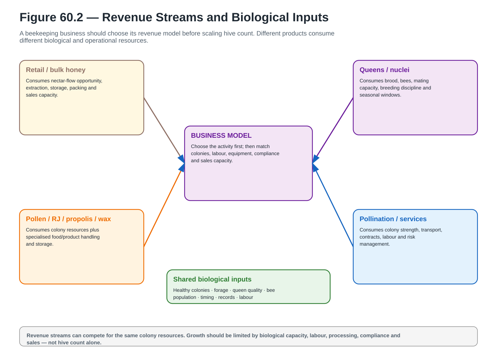</a>

**A_CORE** · `ACTUAL_VECTOR_CREATED` · `PENDING_FINAL_RECONCILIATION` · [Open SVG](../../assets/diagrams/wave-07/fig-60-2-revenue-streams-biological-inputs.svg)

### Figure 60.9 — Compliance Map

<a href="../../assets/diagrams/wave-07/fig-60-9-compliance-map.svg">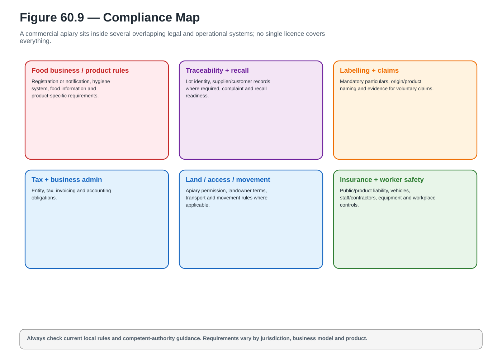</a>

**A_CORE** · `ACTUAL_VECTOR_CREATED` · `PENDING_FINAL_RECONCILIATION` · [Open SVG](../../assets/diagrams/wave-07/fig-60-9-compliance-map.svg)

## Chapter 61

### Figure 61.5 — Manual Versus Mechanised Cost Trade-Off

<a href="../../assets/diagrams/wave-07/fig-61-5-manual-vs-mechanised-cost-tradeoff.svg">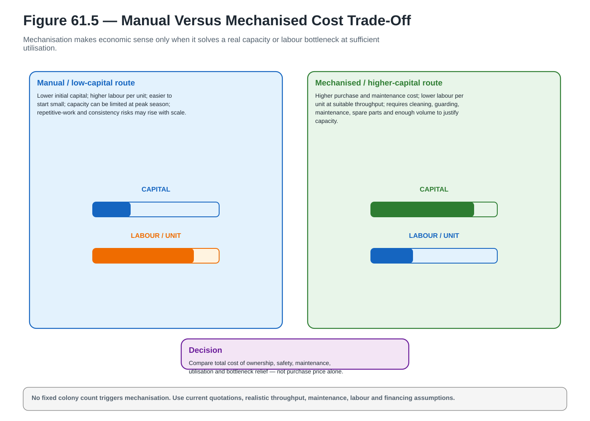</a>

**A_CORE** · `ACTUAL_VECTOR_CREATED` · `PENDING_FINAL_RECONCILIATION` · [Open SVG](../../assets/diagrams/wave-07/fig-61-5-manual-vs-mechanised-cost-tradeoff.svg)

### Figure 61.7 — Buy / Rent / Share / Outsource Decision

<a href="../../assets/diagrams/wave-07/fig-61-7-buy-rent-share-outsource-decision.svg">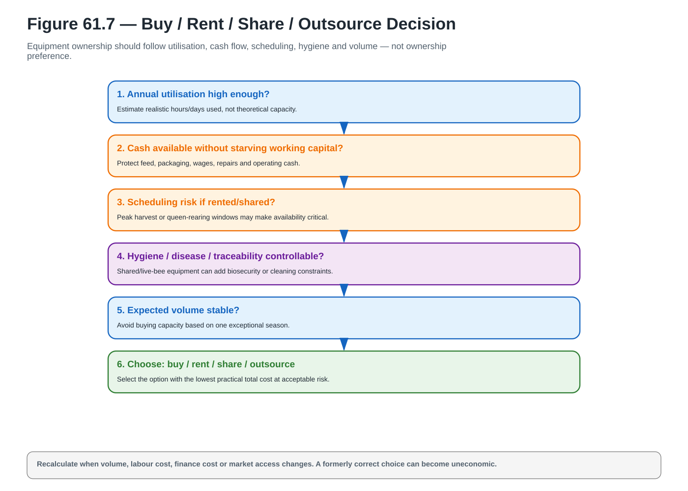</a>

**A_CORE** · `ACTUAL_VECTOR_CREATED` · `PENDING_FINAL_RECONCILIATION` · [Open SVG](../../assets/diagrams/wave-07/fig-61-7-buy-rent-share-outsource-decision.svg)

## Chapter 62

### Figure 62.3 — Value Proposition

<a href="../../assets/diagrams/wave-07/fig-62-3-value-proposition.svg">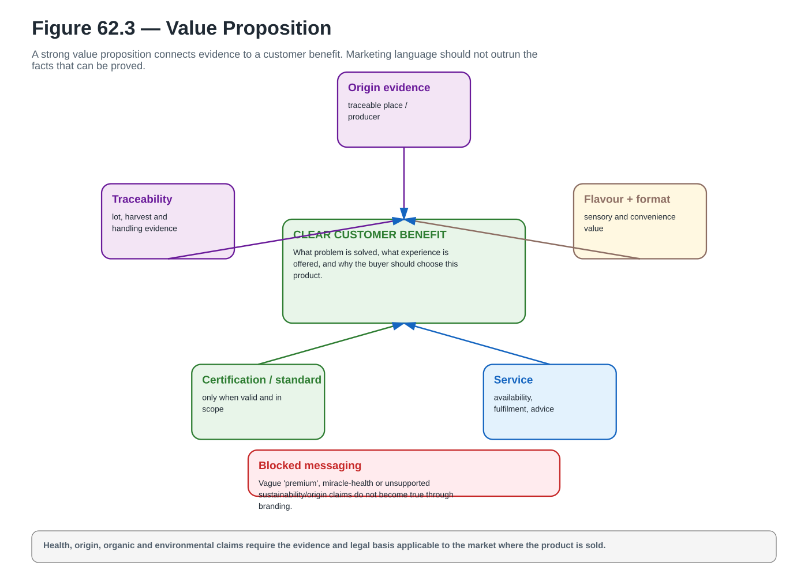</a>

**A_CORE** · `ACTUAL_VECTOR_CREATED` · `PENDING_FINAL_RECONCILIATION` · [Open SVG](../../assets/diagrams/wave-07/fig-62-3-value-proposition.svg)

### Figure 62.7 — Floral Claim Evidence

<a href="../../assets/diagrams/wave-07/fig-62-7-floral-claim-evidence.svg">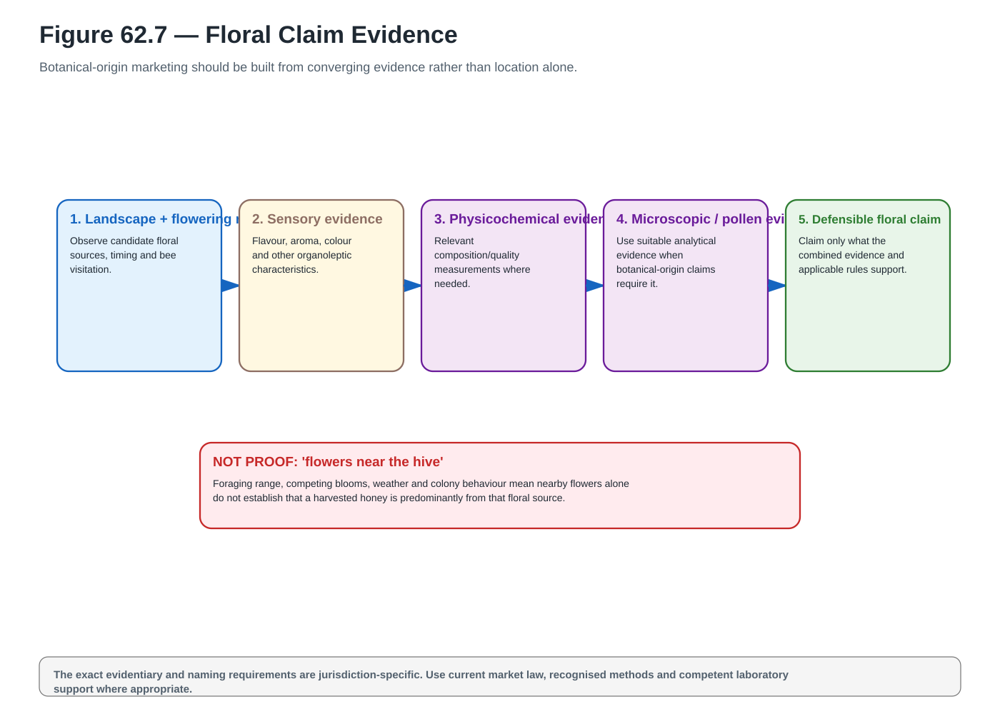</a>

**A_CORE** · `ACTUAL_VECTOR_CREATED` · `PENDING_FINAL_RECONCILIATION` · [Open SVG](../../assets/diagrams/wave-07/fig-62-7-floral-claim-evidence.svg)

## Chapter 63

### Figure 63.5 — Brand Proof Pyramid

<a href="../../assets/diagrams/wave-07/fig-63-5-brand-proof-pyramid.svg">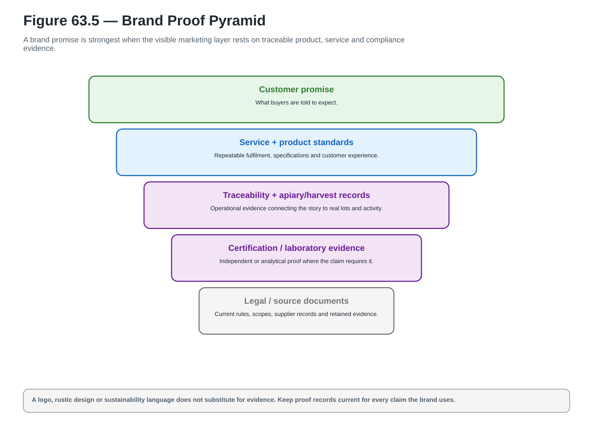</a>

**A_CORE** · `ACTUAL_VECTOR_CREATED` · `PENDING_FINAL_RECONCILIATION` · [Open SVG](../../assets/diagrams/wave-07/fig-63-5-brand-proof-pyramid.svg)

### Figure 63.10 — Claim Library

<a href="../../assets/diagrams/wave-07/fig-63-10-claim-library.svg">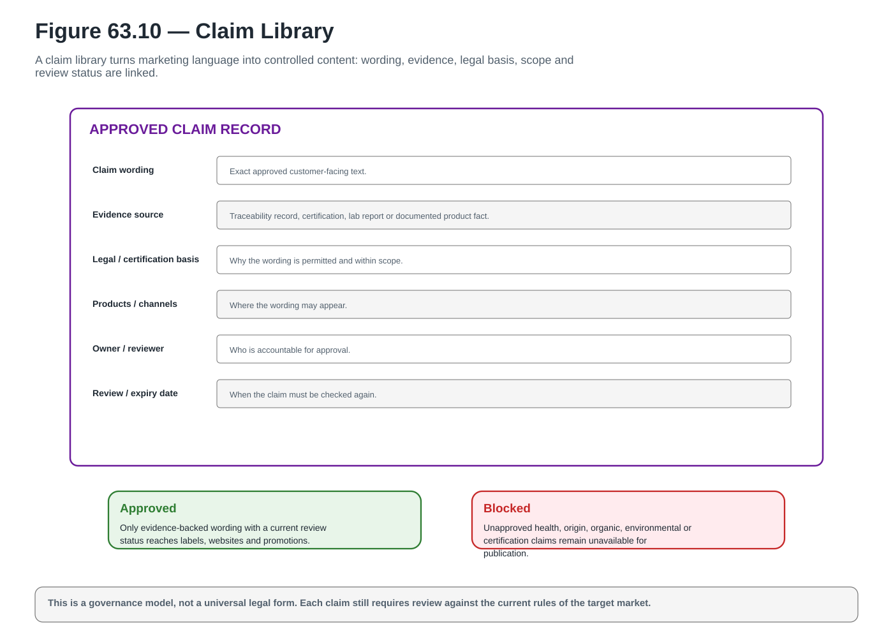</a>

**A_CORE** · `ACTUAL_VECTOR_CREATED` · `PENDING_FINAL_RECONCILIATION` · [Open SVG](../../assets/diagrams/wave-07/fig-63-10-claim-library.svg)

## Chapter 64

### Figure 64.4 — Online Product Page Anatomy

<a href="../../assets/diagrams/wave-07/fig-64-4-online-product-page-anatomy.svg">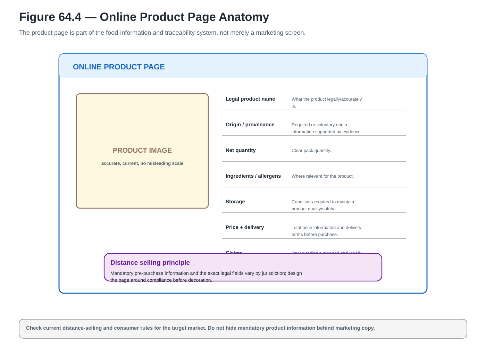</a>

**A_CORE** · `ACTUAL_VECTOR_CREATED` · `PENDING_FINAL_RECONCILIATION` · [Open SVG](../../assets/diagrams/wave-07/fig-64-4-online-product-page-anatomy.svg)

### Figure 64.9 — Product-Specific Shipping

<a href="../../assets/diagrams/wave-07/fig-64-9-product-specific-shipping.svg">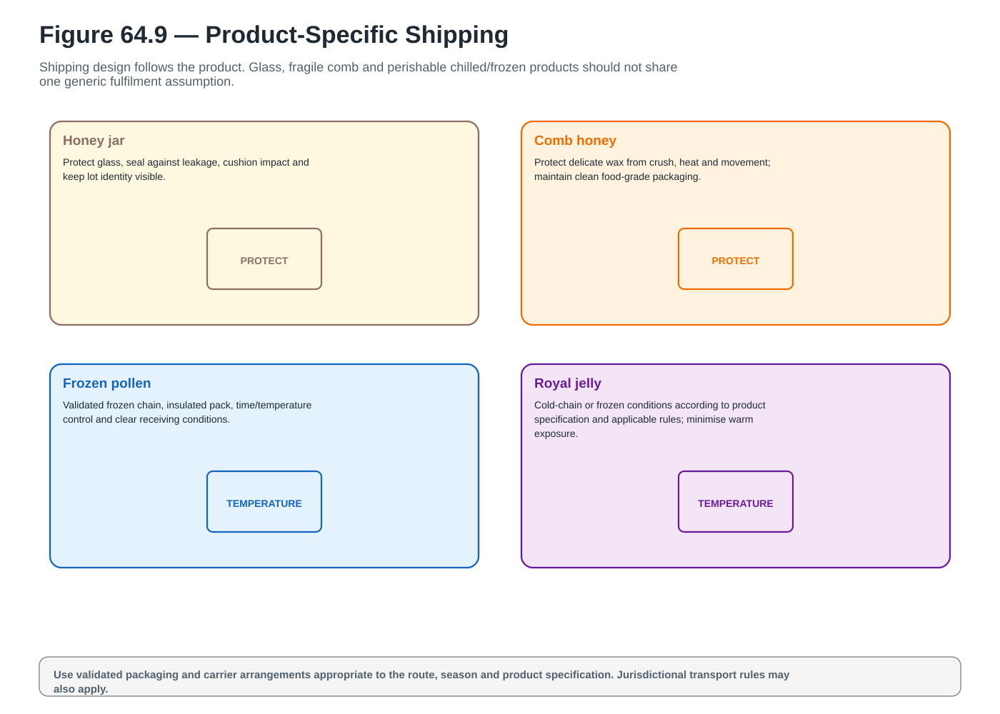</a>

**A_CORE** · `ACTUAL_VECTOR_CREATED` · `PENDING_FINAL_RECONCILIATION` · [Open SVG](../../assets/diagrams/wave-07/fig-64-9-product-specific-shipping.svg)

## Chapter 65

### Figure 65.1 — Farmers-Market Business Model

<a href="../../assets/diagrams/wave-07/fig-65-1-farmers-market-business-model.svg">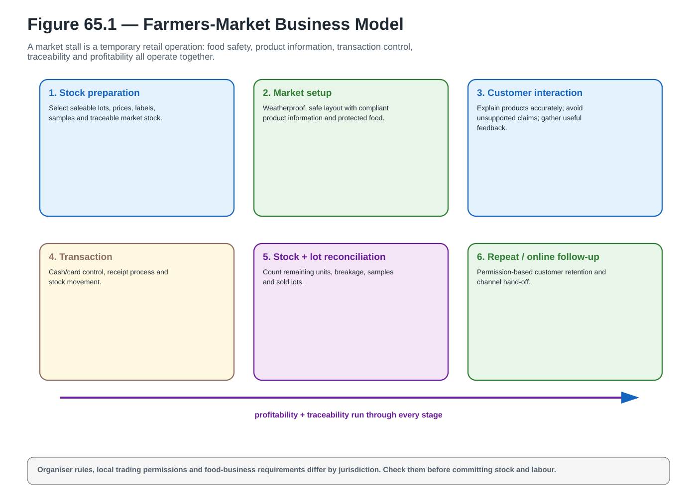</a>

**A_CORE** · `ACTUAL_VECTOR_CREATED` · `PENDING_FINAL_RECONCILIATION` · [Open SVG](../../assets/diagrams/wave-07/fig-65-1-farmers-market-business-model.svg)

### Figure 65.2 — Market-Day Contribution

<a href="../../assets/diagrams/wave-07/fig-65-2-market-day-contribution.svg">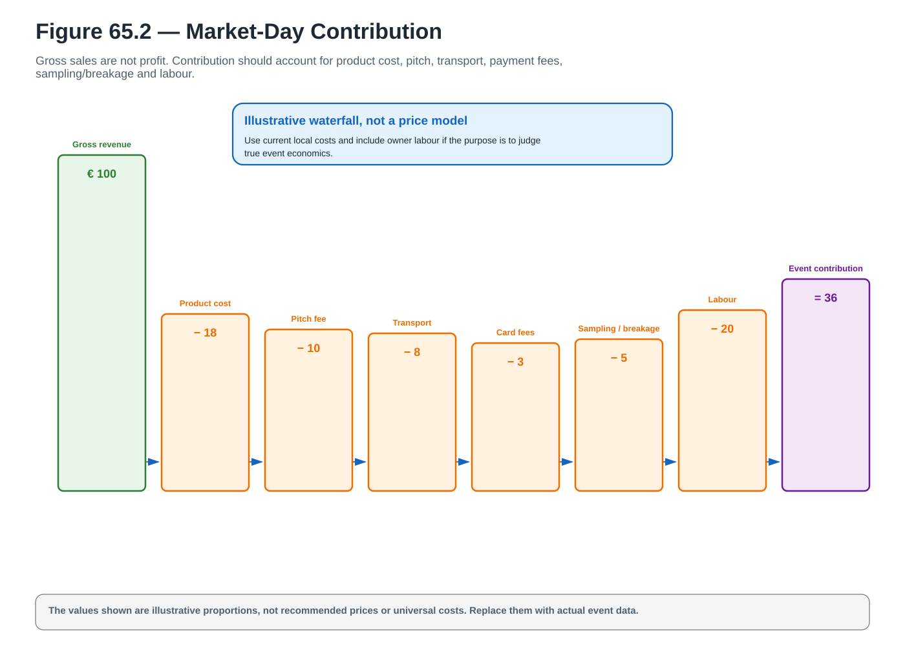</a>

**A_CORE** · `ACTUAL_VECTOR_CREATED` · `PENDING_FINAL_RECONCILIATION` · [Open SVG](../../assets/diagrams/wave-07/fig-65-2-market-day-contribution.svg)

