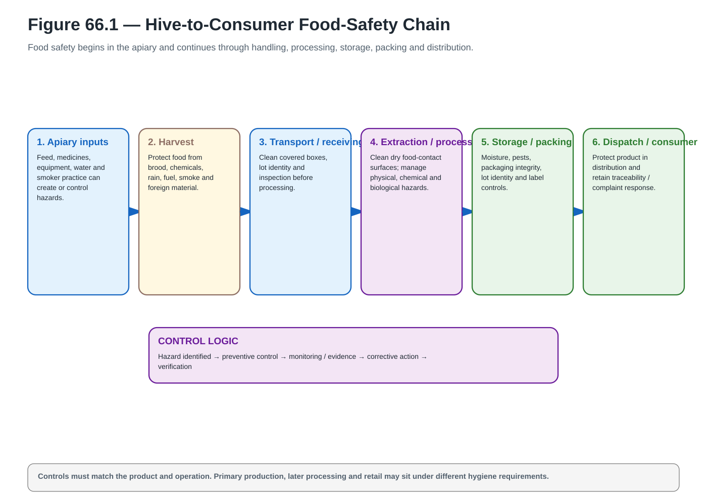
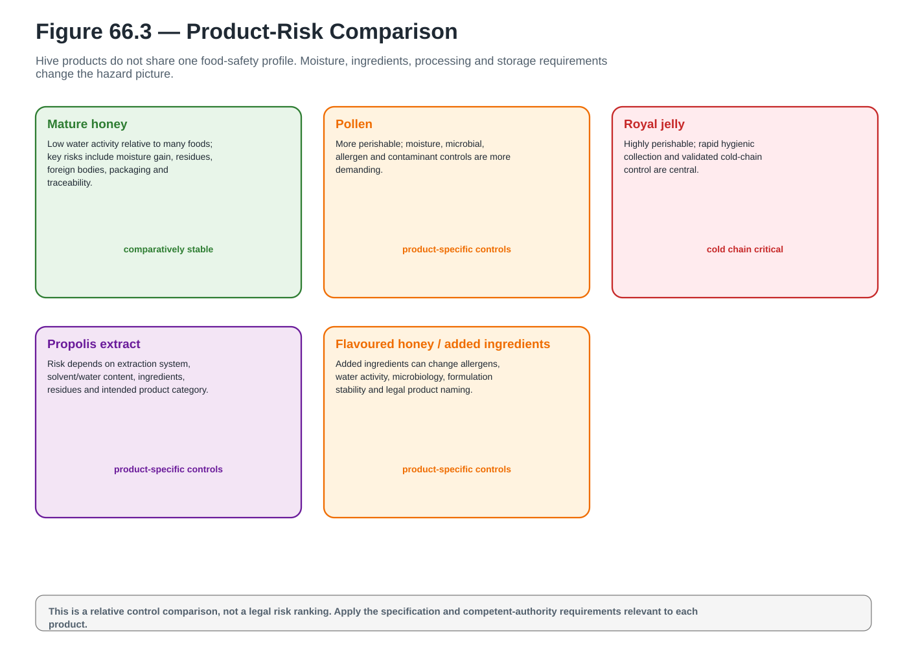
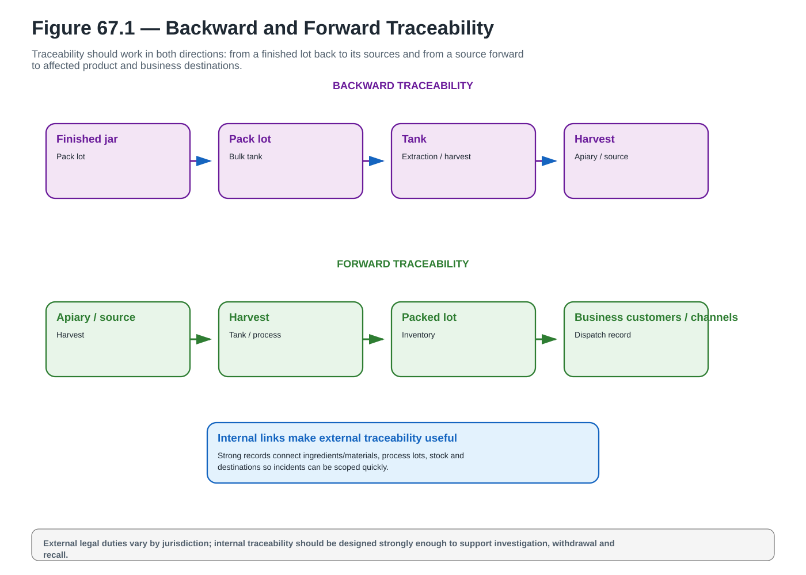
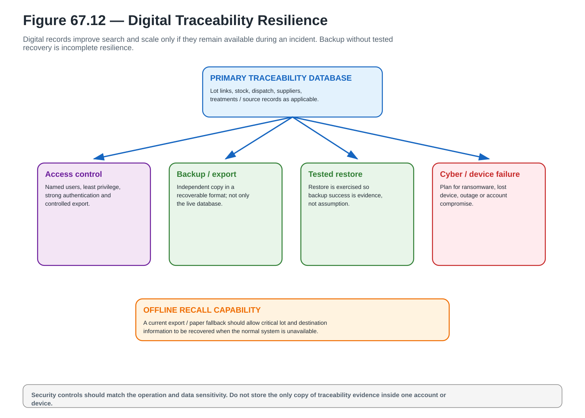
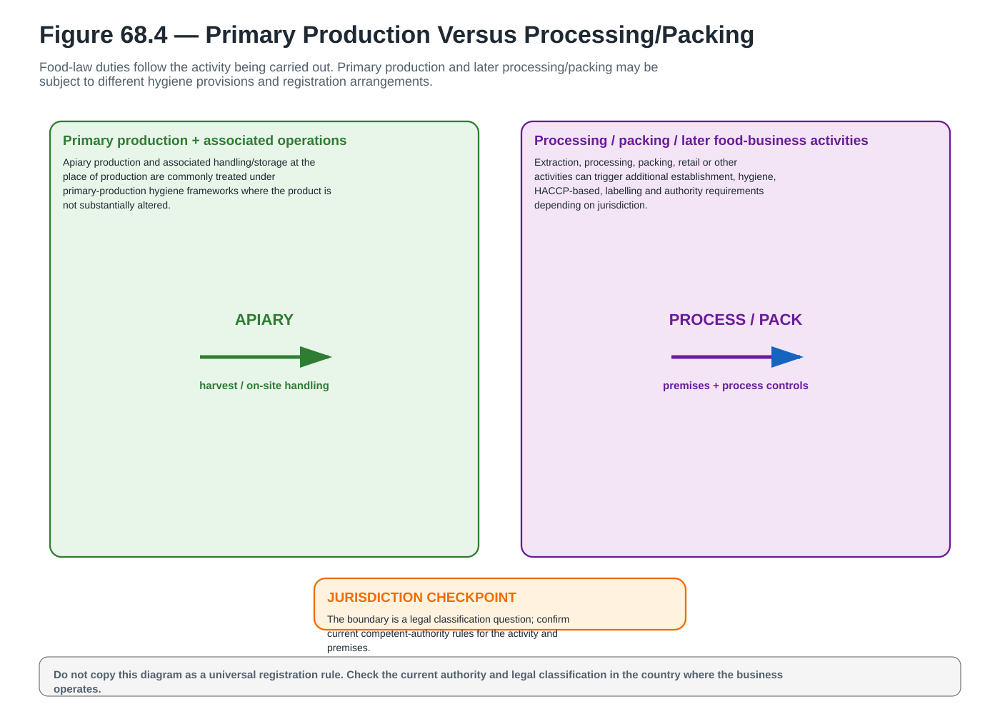
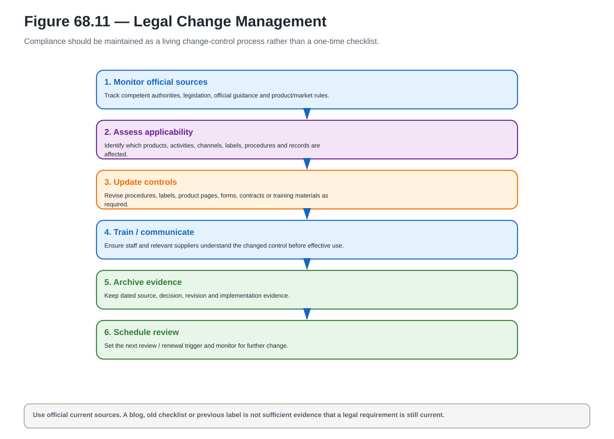
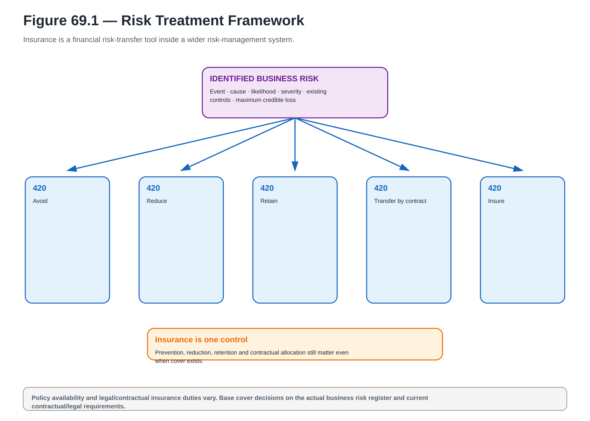
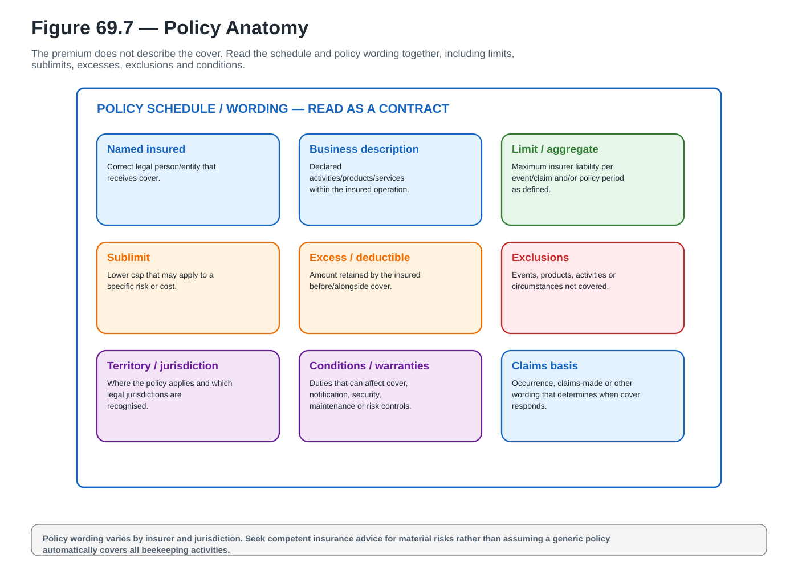

# Wave 08 Visual Gallery

**A_CORE assets:** 8 / 8  
**Coverage:** Chapters 66–69 — food safety, traceability, legal requirements and insurance  
**Status:** production complete; final reconciliation / greyscale / final-size / page-layout proof pending.

## Chapter 66

### Figure 66.1 — Hive-to-Consumer Food-Safety Chain

**A_CORE** · `ACTUAL_VECTOR_CREATED` · `PENDING_FINAL_RECONCILIATION` · [Open SVG](../../assets/diagrams/wave-08/fig-66-1-hive-to-consumer-food-safety-chain.svg)

### Figure 66.3 — Product-Risk Comparison

**A_CORE** · `ACTUAL_VECTOR_CREATED` · `PENDING_FINAL_RECONCILIATION` · [Open SVG](../../assets/diagrams/wave-08/fig-66-3-product-risk-comparison.svg)

## Chapter 67

### Figure 67.1 — Backward and Forward Traceability

**A_CORE** · `ACTUAL_VECTOR_CREATED` · `PENDING_FINAL_RECONCILIATION` · [Open SVG](../../assets/diagrams/wave-08/fig-67-1-backward-forward-traceability.svg)

### Figure 67.12 — Digital Traceability Resilience

**A_CORE** · `ACTUAL_VECTOR_CREATED` · `PENDING_FINAL_RECONCILIATION` · [Open SVG](../../assets/diagrams/wave-08/fig-67-12-digital-traceability-resilience.svg)

## Chapter 68

### Figure 68.4 — Primary Production Versus Processing/Packing

**A_CORE** · `ACTUAL_VECTOR_CREATED` · `PENDING_FINAL_RECONCILIATION` · [Open SVG](../../assets/diagrams/wave-08/fig-68-4-primary-production-vs-processing-packing.svg)

### Figure 68.11 — Legal Change Management

**A_CORE** · `ACTUAL_VECTOR_CREATED` · `PENDING_FINAL_RECONCILIATION` · [Open SVG](../../assets/diagrams/wave-08/fig-68-11-legal-change-management.svg)

## Chapter 69

### Figure 69.1 — Risk Treatment Framework

**A_CORE** · `ACTUAL_VECTOR_CREATED` · `PENDING_FINAL_RECONCILIATION` · [Open SVG](../../assets/diagrams/wave-08/fig-69-1-risk-treatment-framework.svg)

### Figure 69.7 — Policy Anatomy

**A_CORE** · `ACTUAL_VECTOR_CREATED` · `PENDING_FINAL_RECONCILIATION` · [Open SVG](../../assets/diagrams/wave-08/fig-69-7-policy-anatomy.svg)

