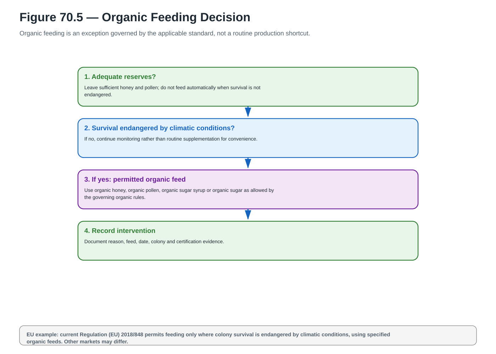
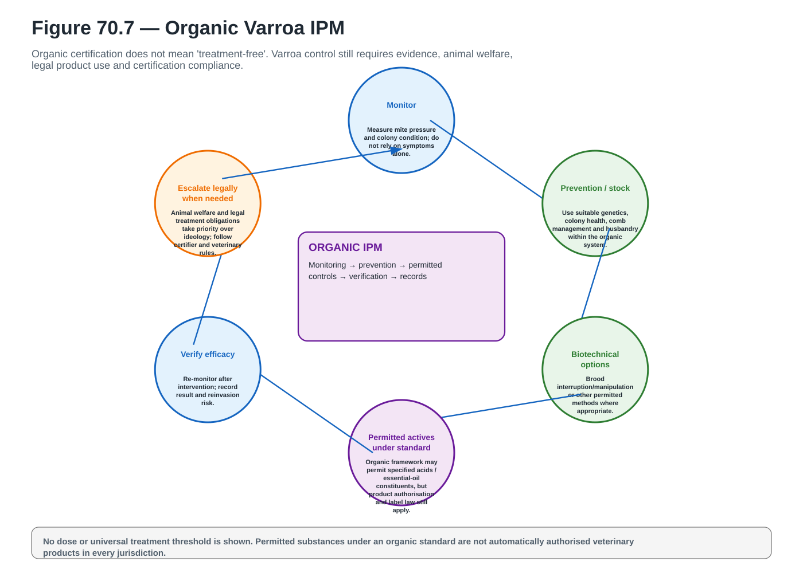
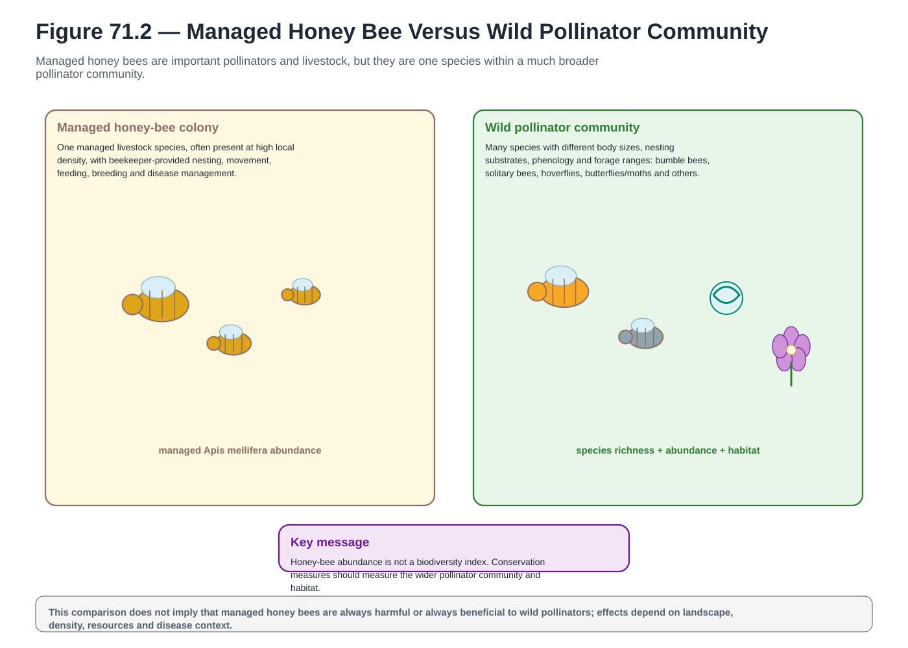
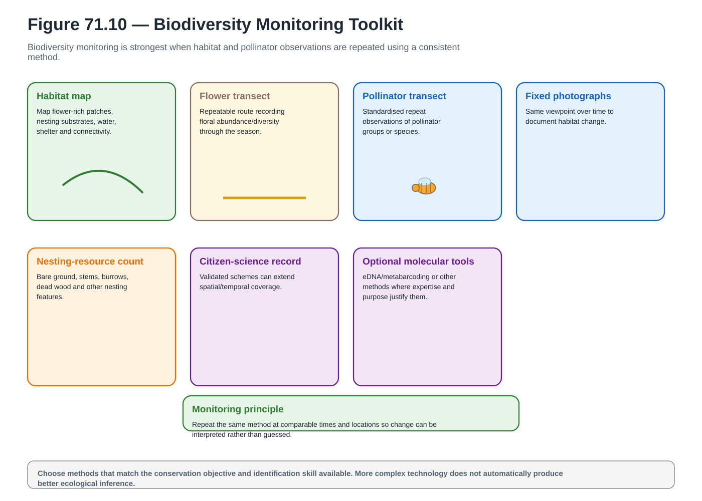
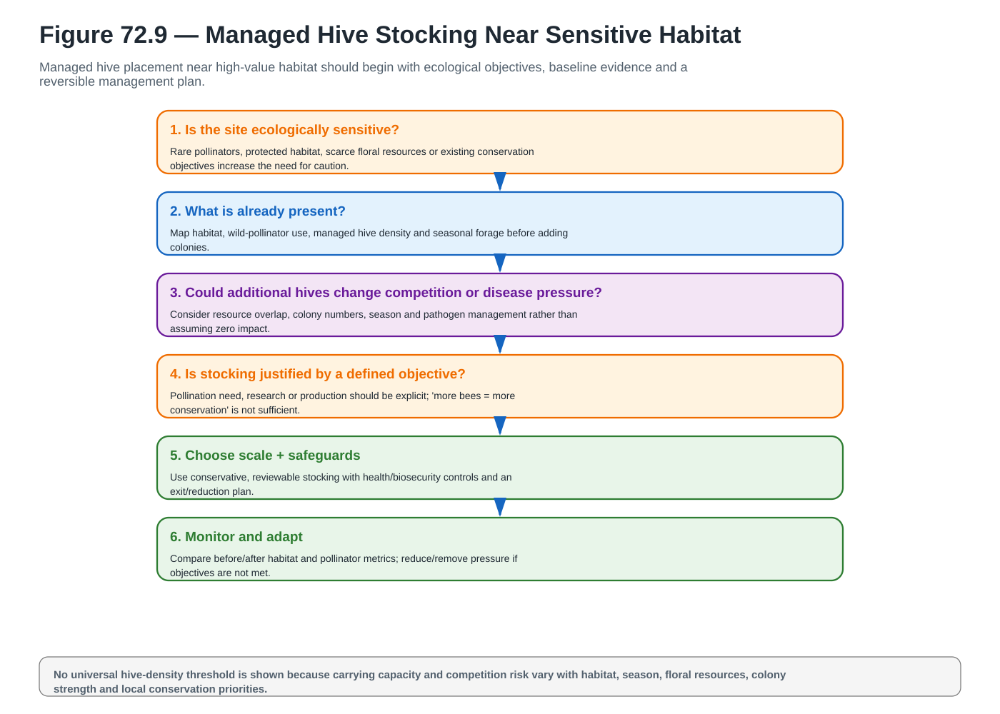
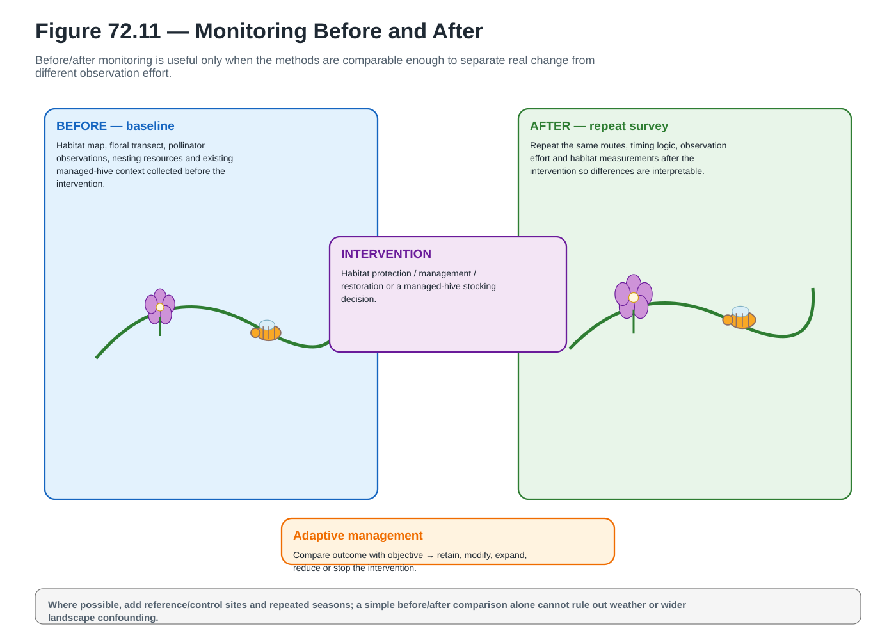
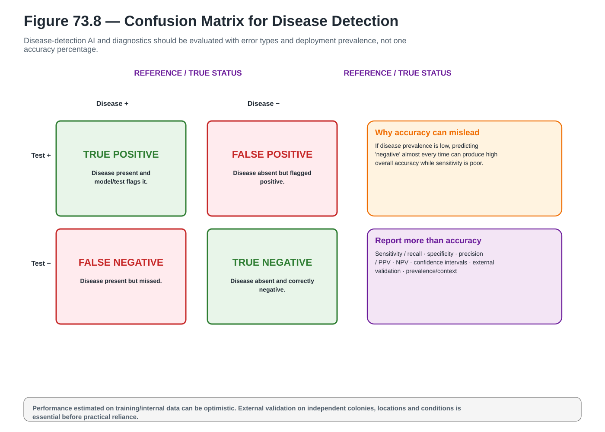
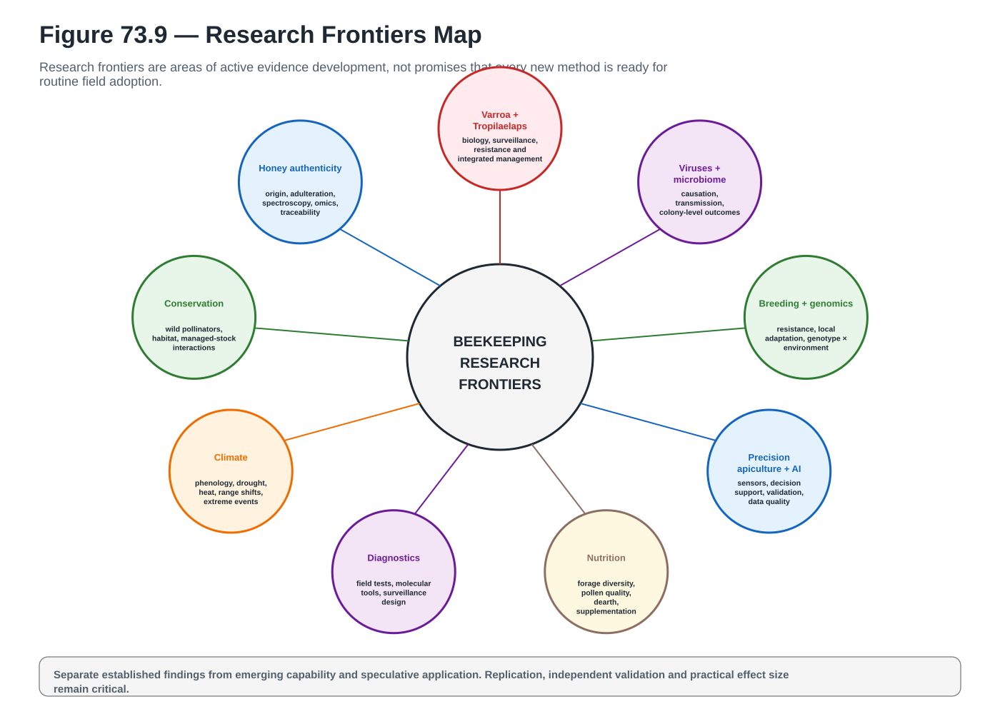
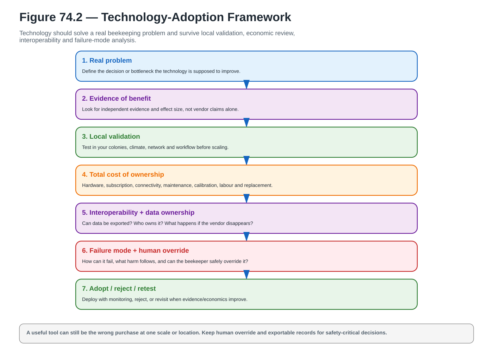
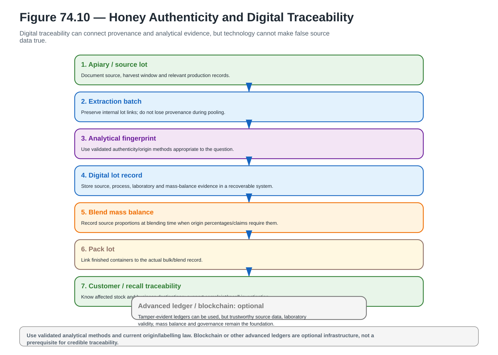

# Wave 09 Visual Gallery

**A_CORE assets:** 10 / 10  
**Coverage:** Chapters 70–74 — organic beekeeping, biodiversity, pollinator conservation, scientific research and future technologies  
**Status:** production complete; final reconciliation / greyscale / final-size / page-layout proof pending.

## Chapter 70

### Figure 70.5 — Organic Feeding Decision

**A_CORE** · `ACTUAL_VECTOR_CREATED` · `PENDING_FINAL_RECONCILIATION` · [Open SVG](../../assets/diagrams/wave-09/fig-70-5-organic-feeding-decision.svg)

### Figure 70.7 — Organic Varroa IPM

**A_CORE** · `ACTUAL_VECTOR_CREATED` · `PENDING_FINAL_RECONCILIATION` · [Open SVG](../../assets/diagrams/wave-09/fig-70-7-organic-varroa-ipm.svg)

## Chapter 71

### Figure 71.2 — Managed Honey Bee Versus Wild Pollinator Community

**A_CORE** · `ACTUAL_VECTOR_CREATED` · `PENDING_FINAL_RECONCILIATION` · [Open SVG](../../assets/diagrams/wave-09/fig-71-2-managed-vs-wild-pollinator-community.svg)

### Figure 71.10 — Biodiversity Monitoring Toolkit

**A_CORE** · `ACTUAL_VECTOR_CREATED` · `PENDING_FINAL_RECONCILIATION` · [Open SVG](../../assets/diagrams/wave-09/fig-71-10-biodiversity-monitoring-toolkit.svg)

## Chapter 72

### Figure 72.9 — Managed Hive Stocking Near Sensitive Habitat

**A_CORE** · `ACTUAL_VECTOR_CREATED` · `PENDING_FINAL_RECONCILIATION` · [Open SVG](../../assets/diagrams/wave-09/fig-72-9-managed-hive-stocking-sensitive-habitat.svg)

### Figure 72.11 — Monitoring Before and After

**A_CORE** · `ACTUAL_VECTOR_CREATED` · `PENDING_FINAL_RECONCILIATION` · [Open SVG](../../assets/diagrams/wave-09/fig-72-11-monitoring-before-after.svg)

## Chapter 73

### Figure 73.8 — Confusion Matrix for Disease Detection

**A_CORE** · `ACTUAL_VECTOR_CREATED` · `PENDING_FINAL_RECONCILIATION` · [Open SVG](../../assets/diagrams/wave-09/fig-73-8-confusion-matrix-disease-detection.svg)

### Figure 73.9 — Research Frontiers Map

**A_CORE** · `ACTUAL_VECTOR_CREATED` · `PENDING_FINAL_RECONCILIATION` · [Open SVG](../../assets/diagrams/wave-09/fig-73-9-research-frontiers-map.svg)

## Chapter 74

### Figure 74.2 — Technology-Adoption Framework

**A_CORE** · `ACTUAL_VECTOR_CREATED` · `PENDING_FINAL_RECONCILIATION` · [Open SVG](../../assets/diagrams/wave-09/fig-74-2-technology-adoption-framework.svg)

### Figure 74.10 — Honey Authenticity and Digital Traceability

**A_CORE** · `ACTUAL_VECTOR_CREATED` · `PENDING_FINAL_RECONCILIATION` · [Open SVG](../../assets/diagrams/wave-09/fig-74-10-honey-authenticity-digital-traceability.svg)

